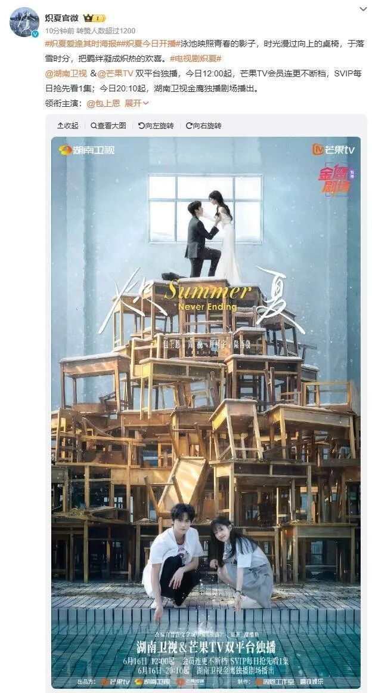
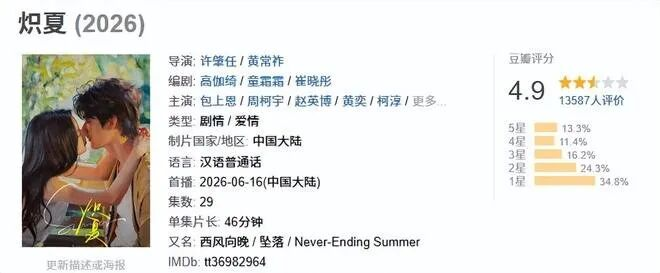
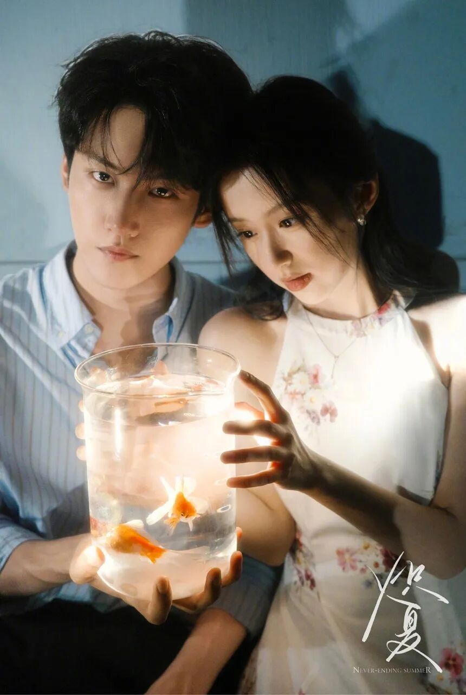
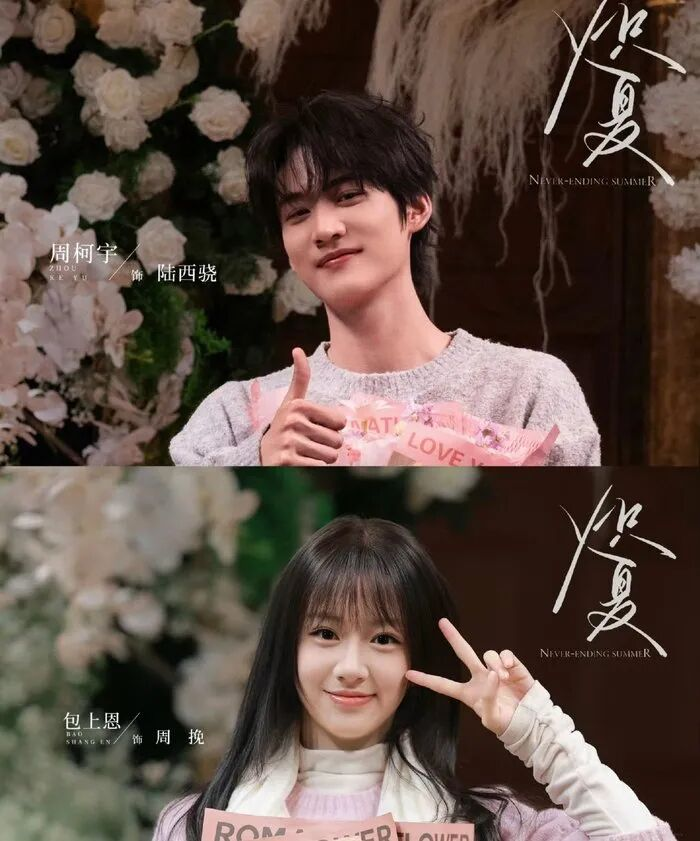
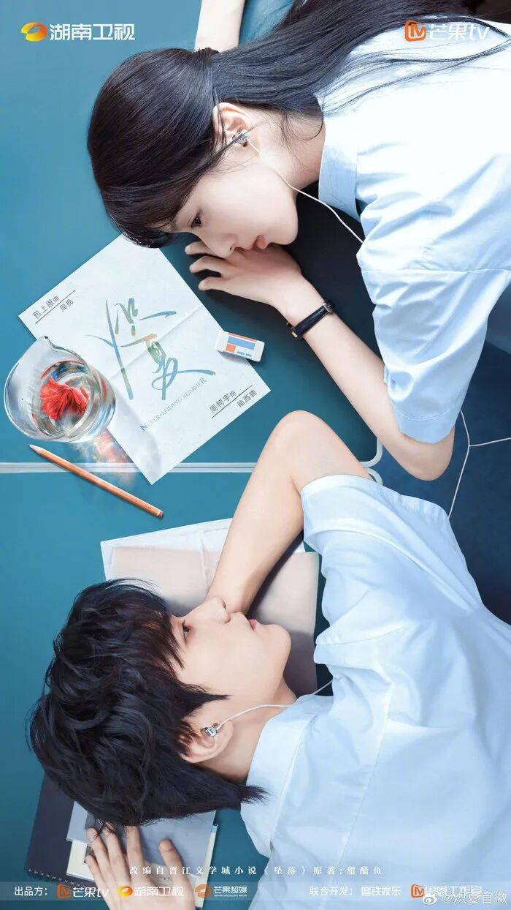
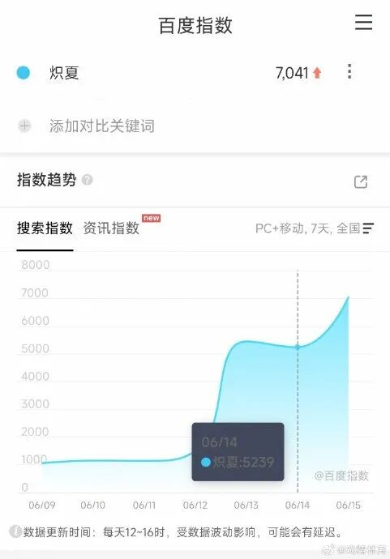
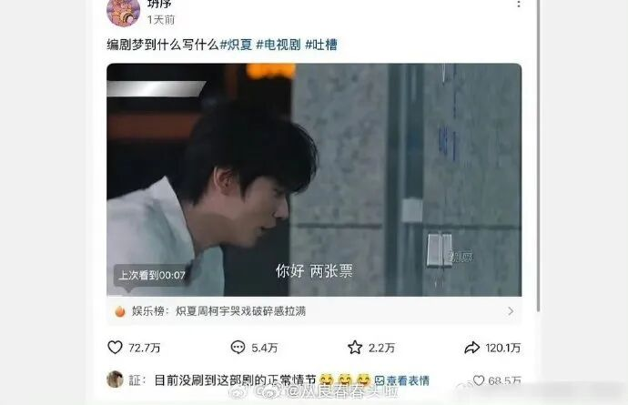
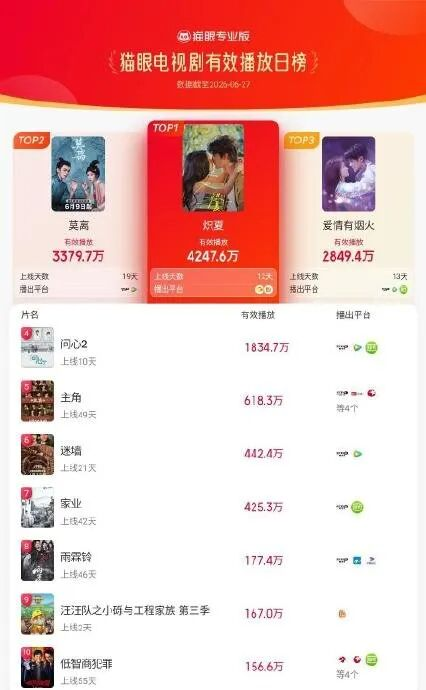

# 《炽夏》网文IP改编竟是亲妈不认的诈骗癫剧

## 核心判断💢

《炽夏》是2026年度校园IP圈唯一“挂羊头卖狗肉”到亲妈不认的顶级诈骗癫剧，魔改程度连原作者甜醋鱼本人点开都得愣三秒，以为自己刷到了哪来的陌生同人。

被IP诈骗的各位，千万别把这部剧的离谱操作当什么无心之失——这从头到尾都是剧方掐着原著粉命门的流量收割阳谋，连原作者都被蒙在鼓里当了免费宣发工具人。

所有当初冲着《坠落》**“伪骨科双向救赎”**标签蹲开播的观众，全是宣发精准定位投喂的韭菜，从你点进播放页的那一刻起，就已经掉进了这个精心布置的IP杀猪盘，没有一个人能逃得过看完心梗的下场。

## 魔改锤💥：原著内核被撕碎成工业糖精

原著《坠落》最打动人的，是两个带着原生家庭创伤的人在高三泥泞里互相拉扯、彼此救赎的纯粹感，全程没有第三者插足，没有狗血误会，只有两个聪明人之间的极限心动。可到了《炽夏》里，这份内核被撕得粉碎，直接换成了工业糖精+狗血三角恋的烂俗流水线配方，连原著最核心的**“伪骨科”**设定都被删得一干二净，变成了最普通的校霸追妻戏码。

核心人设更是崩到亲妈不认。原著里的陆西骁是内敛克制、自带破碎感的TOP级竞赛生——表面桀骜，内里敏感到连跟女主搭话都要装出满不在乎的样子；到了剧里直接退化成油到能煎蛋的校霸混子，一出场就对着女主吹口哨撩骚，半分学霸的影子都找不到。原著里的周挽是清醒坚韧、咬着牙在游戏厅打工赚奶奶手术费、靠自己拼保送的狠人；到了剧里直接变成了没了男人就活不了的恋爱脑，为了约会缺考模考，最后还要靠男主家走后门拿保送名额，把原著女主那股不服输的劲儿碾得连渣都不剩。

更离谱的是编剧硬加的三大原创癫疯桥段——百日誓师踢水管淋雨、废弃泳池捞金鱼、小电驴飞冲救人，不仅原著里半毛钱影子都没有，还完全脱离高三现实，纯纯是编剧喝了二斤白的之后拍脑袋想出来的自嗨产物。

## 智商侮辱锤💣：把观众智商按在地上摩擦

先拿最出圈的百日誓师踢水管说事，但凡读过高中的人都懂：百日誓师是什么级别的修罗场？校领导、教育局嘉宾、全体家长全员在场，管控严到递个小纸条都要被班主任盯出洞，你一个号称冲清北的学霸男主，当着全校的面一脚踢爆会场边的水管，淋得所有人像落汤鸡，不仅不被记大过、取消保送资格，还能对着女主邪魅一笑？别说高三学霸了，就是普通高二混子都干不出这种嫌自己高考命太长的蠢事。

再看废弃泳池捞金鱼的戏码，且不说废弃泳池常年没人打理，满是青苔湿滑得要命，跳进去摔破头都是轻的；单说男主的富二代人设，什么品种的金鱼他买不到，非要跑到荒郊野外的废弃泳池跳下去捞？这不是深情，是智商没超过三岁的巨婴表演。

最让人恶心的是男二姜彦的强行加戏：原著里他就是个连名字都没几个人记得的纯反派，到了剧里愣是被加了十集的戏份，一会儿给女主送早餐，一会儿为了女主跟男主打架，连家世都改成了和男主旗鼓相当的富二代，感情线半毛钱铺垫都没有，纯纯是为了凑集数注水，把观众当傻子骗时长。

## IP诈骗锤🔨：从宣发到内容的全链路杀猪盘

这部剧的诈骗属性，从宣发阶段就已经写在了脸上。开播前所有通稿全蹭原著《坠落》的热度，把**“伪骨科”“双向救赎”**两个标签焊死在宣传位上，预告剪的全是擦边的拉扯镜头，把原著粉的期待值拉到最高，完全隐瞒了魔改的事实，就是为了把原著粉骗进来贡献第一波播放量。

原著作者甜醋鱼的反应更是锤死了魔改的未经授权。开播前她还帮着转了剧集的宣发微博，结果开播没三天就默默取关所有剧集相关账号，连半句开播祝福都没发。别扯什么“手滑”——原著粉说得对，沉默就是原作者最狠的抗议，这说明剧方的魔改根本没跟原作者沟通，连亲妈都被蒙在鼓里薅羊毛，吃相难看至极。

更绝的是剧方的反向营销骚操作：原著粉去官微底下抗议魔改，他们不仅不回应整改，反而把“《炽夏》魔改”的话题买上热搜，发通稿炒“剧红是非多”，把观众的抵制当成免费的流量密码，完全不在乎IP的口碑，也不在乎观众的感受，眼里只有变现的流量。

## 共鸣升华✨：这届观众不再当IP韭菜

《炽夏》的口碑崩盘根本不是什么偶然，更不是什么“原著粉玻璃心”，是校园IP改编常年“重流量轻内容”的必然结果，更是观众审美觉醒的信号。过去大家忍了一次又一次，IP改编改得面目全非要被按头夸“还原”，这一次大家终于不想再忍了。

原著粉的集体抵制，根本不是因为改了某一个情节，是他们不愿意再当被随便收割的韭菜。我为原著的心动买了单，为你的宣发买了账，你给我看的却是货不对板的垃圾，那我就敢打一星、敢抵制、敢告诉所有朋友这是烂片——这不是玻璃心，是对**“IP诈骗”**的零容忍，是对流水线圈钱操作的正面反抗。

校园IP想要长久生存，从来不是靠蹭热度、割韭菜就能做到的，必须尊重原著的内核，尊重观众的智商，把粉丝当平等的消费者，而不是待割的韭菜。要是还想着靠IP的名气赚快钱，随便改改就拿出来卖，最后只会像《炽夏》一样，赚了一波快钱，却永远失去了观众的信任，最终被市场彻底抛弃。

## 互动站队🤔：你被《炽夏》诈骗过吗？

你被《炽夏》的IP宣发诈骗过吗？

A. 看1集就弃的清醒人

B. 硬撑完的勇士
