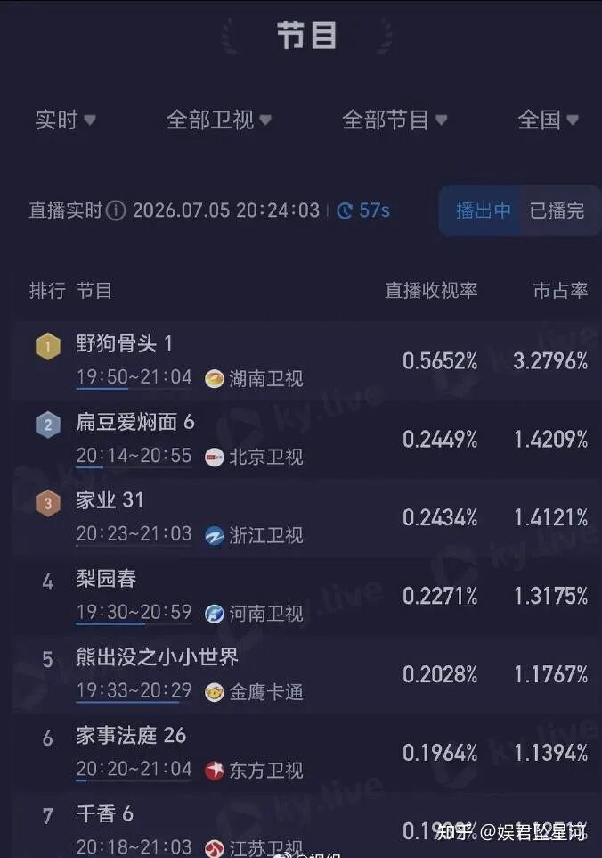
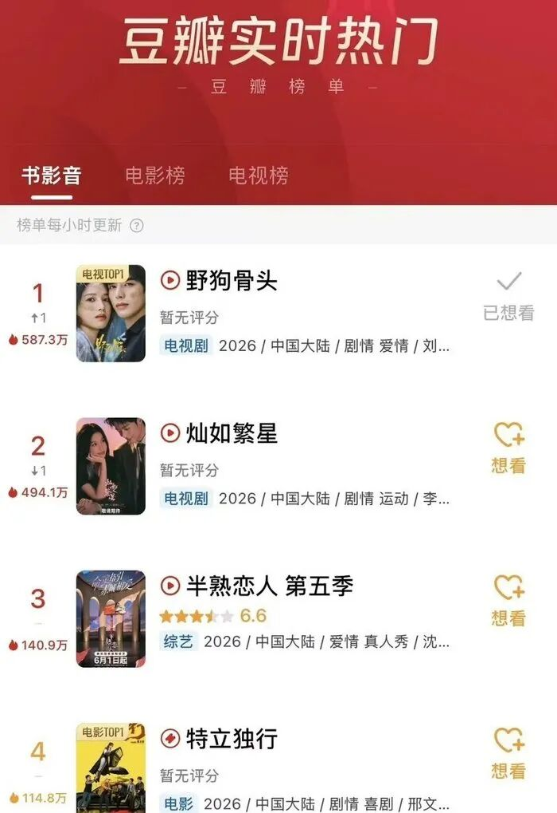
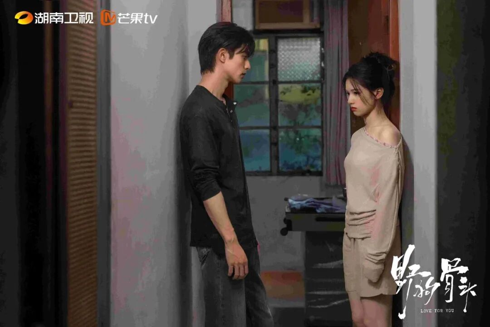
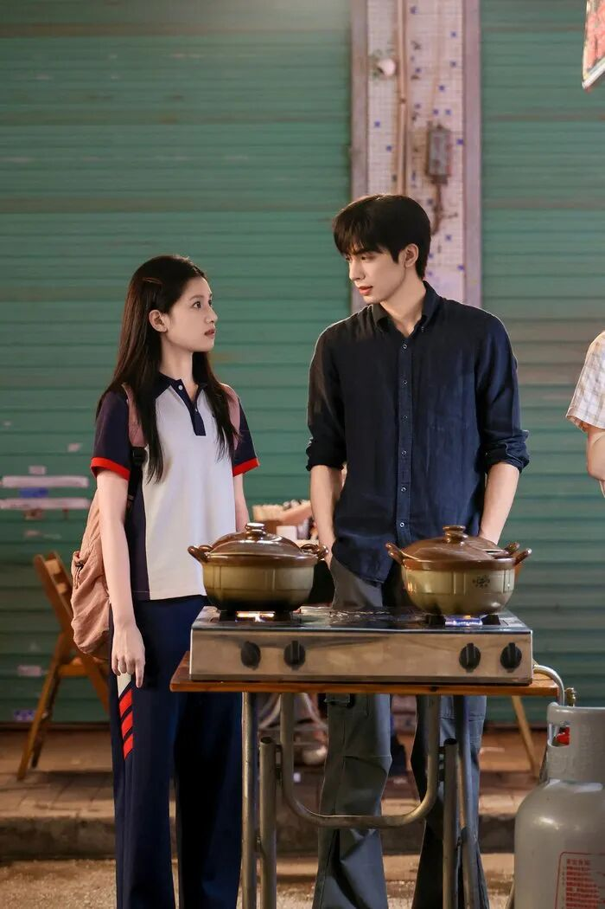
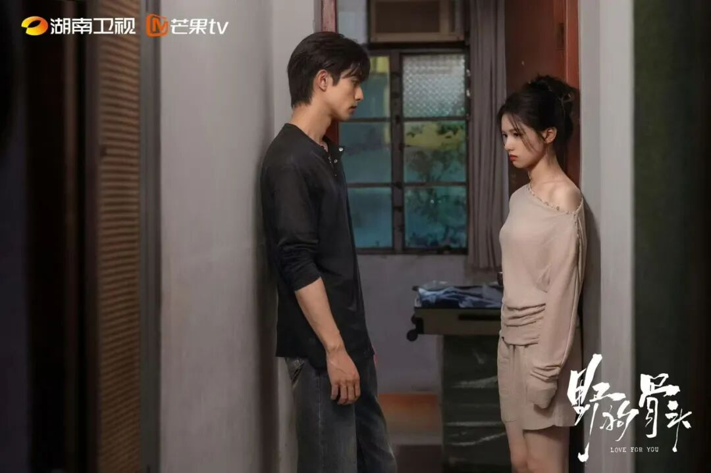
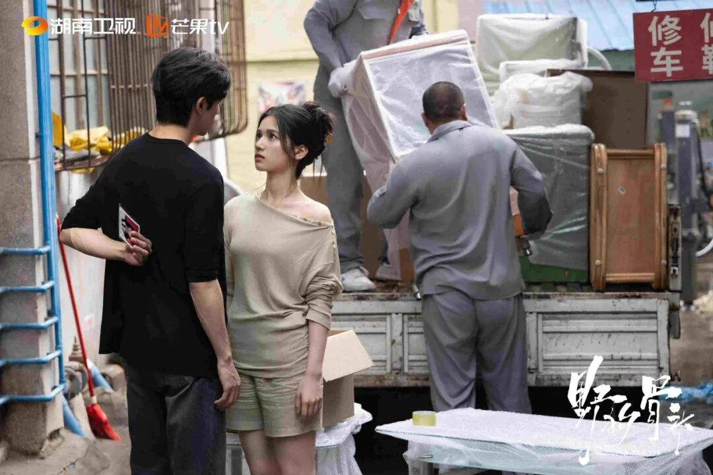
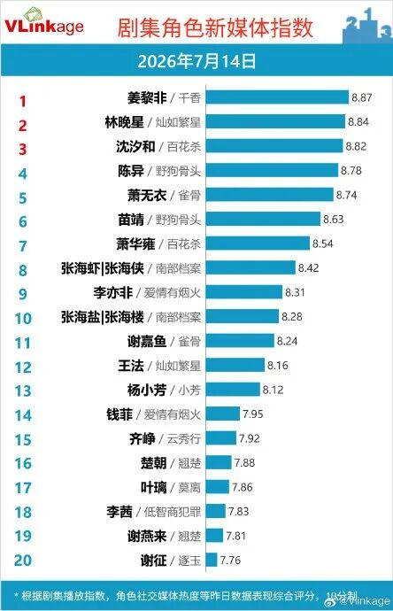

# 《野狗骨头》8.5分：撕开国产现偶的遮羞布

**《野狗骨头》是近3年唯一将伪骨科拍得无油腻擦边、双向救赎拍得落地共情的国产现偶，所有悬浮工业糖精现偶必须抄作业**

宝子们别杠，杠就是你没被现偶工业糖精喂到吐过。**豆瓣8.5分+省级卫视收视六连冠**的成绩，跟流量注水半毛钱关系都没有——开播首日酷云峰值破0.66%创2026年首播纪录，连续6天霸榜黄金档，这是“现偶难民”用遥控器投出的集体选票。它直接打碎了“伪骨科必狗血”“现偶必悬浮”的行业惯性，是2026年现偶赛道唯一能打出手的破局之作，没有之一。

## 国产现偶的遮羞布：工业糖精喂到吐

2026暑期档现偶的病灶已经到了肿瘤晚期：悬浮人设、工业糖精、脱离现实三大硬伤焊死了观众的共情开关。

现偶难民们应该都懂：霸总住200平大平层却不知道外卖多少钱，女主穿高定挤地铁还能偶遇青梅竹马的豪门哥哥，就连伪骨科都要拍得满屏擦边——不是男主故意摸女主的腰，就是女主凑到男主耳边说“哥哥好棒”，连基本的人物逻辑都不管，只管把糖精往观众嘴里硬塞。这种放弃生活逻辑的创作，本质就是把观众当没有智商的糖精接收器。

更讽刺的是数据：2026暑期档已播现偶豆瓣评分**普遍低于6分**，同档期某顶流主演的豪门伪骨科剧，收视破0.2都难，豆瓣开分直接跌到4.2。这不是观众审美降级，是观众审美觉醒了——资本靠流量堆出来的假糖，我们已经忍到了临界点。

## 《野狗骨头》破局1：伪骨科拍得像真人真事

这部剧最狠的地方，是把“伪骨科”从“暧昧工具”拉回了“身份枷锁”的本质。

设定直接踩碎了豪门悬浮滤镜：90年代南方小城藤城，墙皮脱落的老房子、掉漆的永久自行车、酱油瓶上的油渍，连光影都是低饱和颗粒感，像从旧相簿里抠出来的真实场景。

陈异和苗靖的兄妹身份，是父母搭伙过日子的无奈——陈异是被父亲家暴的叛逆少年，苗靖是跟着母亲寄人篱下的“小拖油瓶”，后来陈父去世、苗母卷款跑路，两个半大孩子被丢在世界上相依为命。

没有刻意擦边，连碰个胳膊都要屏住呼吸。对比同档某伪骨科剧男主故意蹭女主肩膀说“妹妹的味道真好闻”的油腻操作，《野狗骨头》的拉扯全是细节：陈异给苗靖盖被子时刻意背过身，苗靖帮陈异擦伤口时会手抖，连对视都要先躲闪三下。

这不是编剧硬塞的爱情，是两个在绝境里抱团取暖的人，慢慢长出的依赖——它像一块棱角硌手却内含温度的原石，没有工业糖精的甜腻，只有真实生活的粗粝与温柔。

## 《野狗骨头》破局2：双向救赎不是喊口号

很多现偶的“双向救赎”都是喊口号：霸总给女主买包就是救赎，女主给霸总煮碗面就是治愈，本质还是单向施舍的工业糖精。

但《野狗骨头》的救赎，是两个被原生家庭抛弃的人，互相舔伤口的本能。第17集的破防戏直接封神：苗靖被同学欺负后哭着说“真没用”，宋威龙演的陈异突然蹲在地上崩溃大哭——这不是演出来的歇斯底里，是他藏了十几年的自卑被戳破：他拼尽全力想保护苗靖，却连自己的情绪都控制不住。

第20集的海边吻更绝：是苗靖主动凑上去的，没有慢动作、没有BGM炸场，只有海浪声和两个人的呼吸声——这是她攒了20集的勇气，终于敢直面自己的依赖。

演员的适配度更是精准到毛孔：宋威龙的隐忍是咬着牙哭的狠劲，没有多余的表情；张婧仪的怯生生是看人的时候眼睛会闪躲，连说话都要压低声音。**豆瓣62%的七日留评用户提及自身成长伤痛**，这绝不是粉丝刷分——能让观众主动把自己的伤疤掏出来和角色共情，这才是现偶最稀缺的能力。

## 给国产现偶的最后通牒：这才是该有的标准

现偶的核心从来不是“偶”，而是“现”——先有真实的生活，才有自然的爱情。

资本的懒惰才是工业糖精泛滥的根源：找个顶流、租个样板间、写几段擦边台词，就敢自称“S级现偶”，连出租屋有没有蟑螂药、外卖盒有没有油渍这种细节都懒得磨。资本总想用最少的成本赚最多的快钱，却忘了观众早就不是能被随便糊弄的傻子。

但《野狗骨头》告诉我们：普通人的爱情不需要游艇、不需要霸总，只需要有个能一起蹲在路边吃泡面、一起攒钱修自行车的人。

给制作方的硬核建议：别再搞流量堆砌那套了，先把生活细节磨好——拍刚毕业的情侣挤10平出租屋，拍送外卖的男生给女朋友攒钱买口红，拍被原生家庭伤害的人互相取暖，而不是拍霸总给女主买私人飞机。

给现偶难民们的喊话：我们要的不是齁到吐的工业糖精，是能看见自己的爱情。别再被资本PUA了，好剧值得我们用遥控器投票。

## 最后聊聊：你被哪段戳中了？

《野狗骨头》绝非完美，但绝对是现偶圈的良心炸场之作——它撕开了国产现偶的遮羞布，告诉所有人：好的现偶不需要流量、不需要擦边，只需要真实。

**你觉得《野狗骨头》最戳你的是伪骨科的克制拉扯，还是双向救赎的真实治愈？**评论区留下你的答案，聊聊你被哪段戏戳中了。
