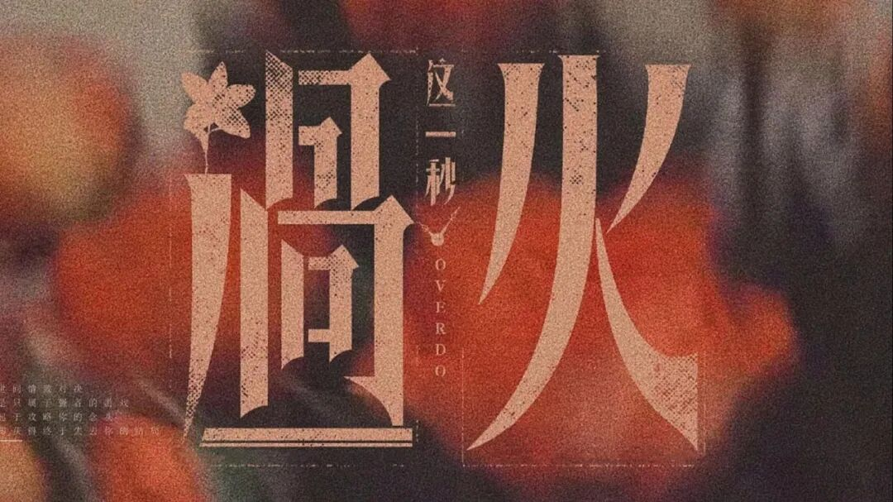
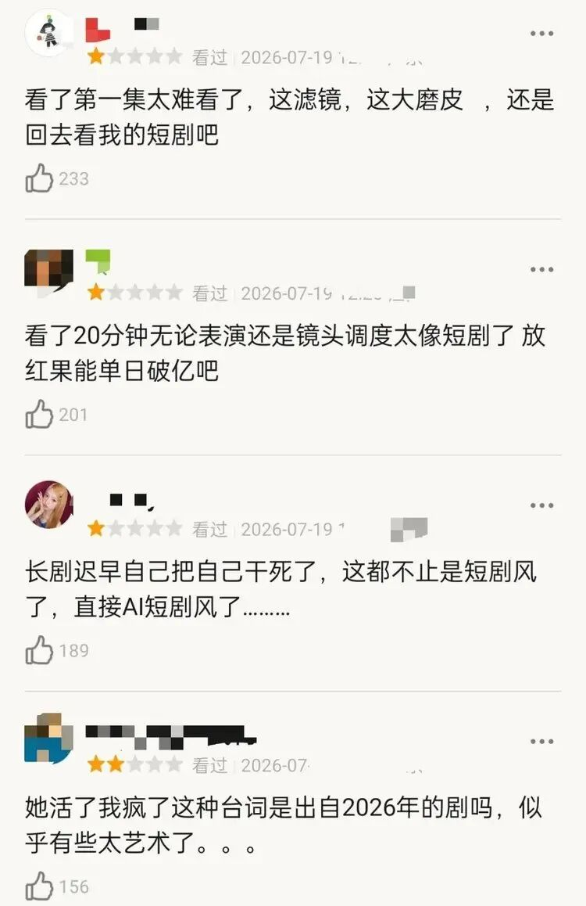
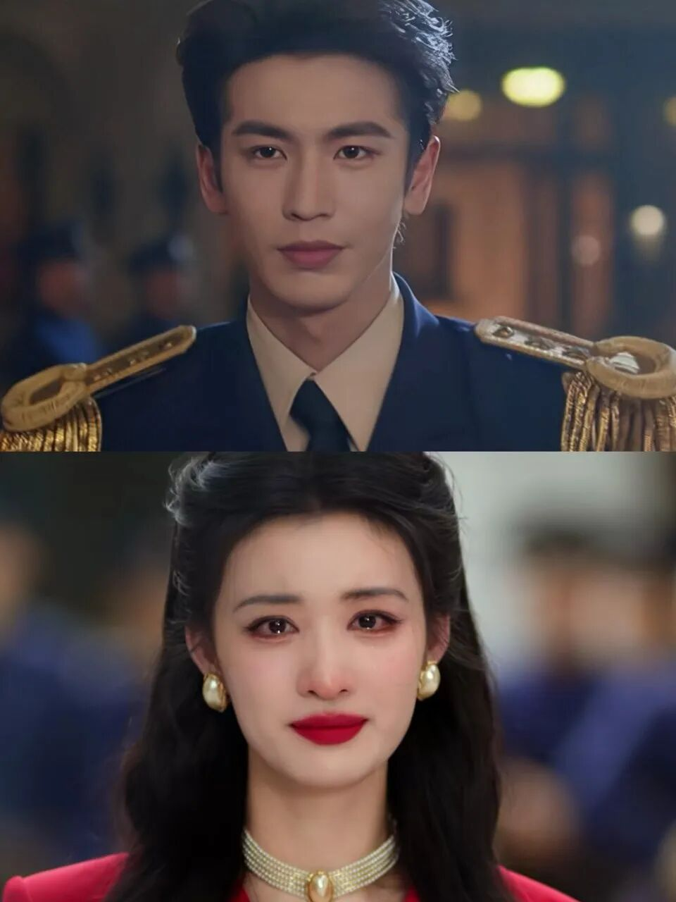
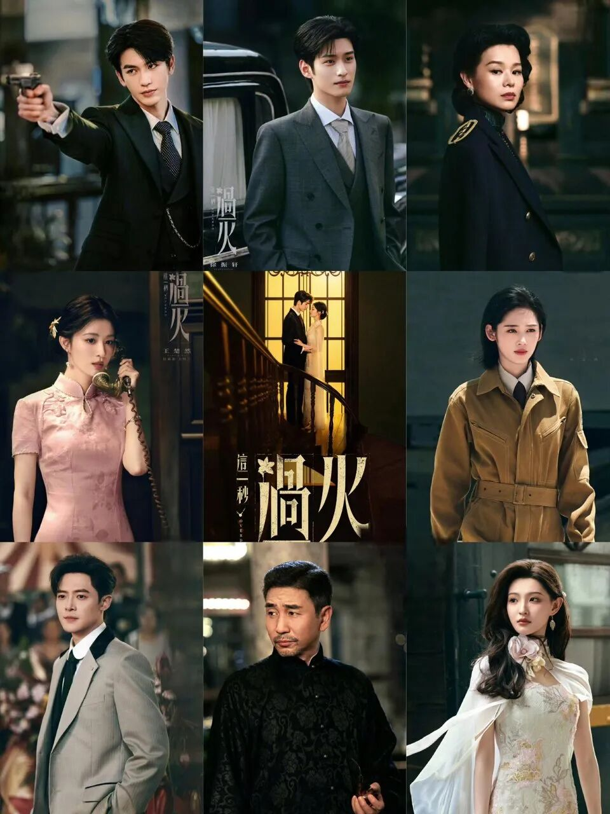

# 《这一秒过火》1.2亿招商就这？AI诈骗局

这不是一次技术尝试的失误，而是一场用AI包装的S+级招商诈骗。

《这一秒过火》拿着**1.2亿**的顶配招商金额，却交出了一份**5.1分**垫底的口碑答卷。这种极端撕裂的魔幻现实，彻底撕下了影视圈流水线作业的遮羞布。顶流阵容、匪我思存大IP和过亿招商，原本是一把王炸，却硬生生被打成了一手烂牌。

观众抵制的从来不是AI技术本身，而是资方拿着顶配预算却肆意糊弄观众的傲慢态度。当S+级大剧的片头沦为廉价的PPT动画，这已经不是审美降级的问题，而是赤裸裸的欺诈。

## 1.2亿招商与PPT质感的魔幻碰撞

拆解这场诈骗局的第一大案发现场，就是开播即被全网群嘲的AI片头。

短短十几秒的片头里，画面抠图生硬粗糙，光影质感廉价感十足，人物细节扭曲生硬，被大量观众一眼识破并怒斥为“掉价”、“像PPT”。这可是双平台预约破千万、招商收入**1.2亿**刷新民国剧纪录的S+级大剧，连个实拍片头都做不出来？

对比同级别S+项目的精良服化道，本剧的雷霆特效与短剧质感，凸显出制作经费与成片质量之间巨大的黑洞。张凌赫加王楚然的顶流阵容，配上匪我思存的大IP，这本该是暑期档的爆款底牌，却被这种敷衍的制作态度彻底拖垮。

## 顶配阵容与廉价特效的黑洞

当1.2亿的招商盘子摆在面前，观众不禁要问：钱到底花哪儿了？

在这部号称S+级别的民国大剧里，我们看不到与之匹配的制作诚意，只看到演员片酬与制作成本比例严重失衡的行业潜规则。剧中的塑料质感与AI生成的粗糙背景毫无诚意，服化道仿佛是从批发市场租来的影楼风。

这种“挂羊头卖狗肉”的操作，本质上是对观众智商和审美的双重侮辱。资方算盘打得很精：只要请来流量明星，拿下大IP，随便糊弄一下也能靠粉丝效应把招商的钱赚回来。但他们低估了当下观众的审美底线。

## 连夜整改的公关秀：保招商的遮羞布

舆论发酵后，剧方上演了一出“48小时连夜重制真人片头”的戏码，看似从善如流，实则是一场保住招商盘子的公关止损手段。

剧方声称最初使用AI是为了“快速转场帮助理解情感前史”，这种说辞简直是把观众的智商按在地上摩擦。如果AI真的能提质增效，为什么不在开播前就做好？非要等全网痛骂才连夜赶工？

这种紧急补救，并非出于对作品的敬畏，而是对资本问责的恐惧。一旦口碑彻底崩盘，后续的广告植入和播放数据将惨不忍睹。头痛医头、脚痛医脚的公关操作，反而坐实了前期制作敷衍的既定事实。换掉一个片头，就能洗白整部剧的粗制滥造吗？绝不可能。

## 正片全面崩塌：短剧质感与雷人台词

拆解诈骗点二，换掉片头也掩盖不了正片的全面崩塌。

打开正片，怼脸特写运镜泛滥成灾，滤镜磨皮重到连演员的五官轮廓都快看不清了，演技更是全面拉胯。这种质感全面向劣质短剧看齐的制作底线，本质是口碑的彻底反噬与制作底线的失守。

更可笑的是，剧中台词“她活了，我疯了”登顶热搜，阅读量破20亿。但这并非因为剧作精良，而是年度雷人梗的狂欢。观众是在看剧吗？不，观众是在看猴戏。当一部民国虐恋剧的台词沦为全网鬼畜素材，主创团队的叙事逻辑显然已经碎了一地。

## 资本裹挟：S+剧集沦为流水线产品

深挖这出闹剧的深层归因，S+剧集早已沦为保底招商的工具和资本裹挟下的流水线产品。

现在的民国偶像剧通病就在于此：只顾颜值特写与流量变现，完全放弃了基本的叙事逻辑与制作匠心。在资本唯利是图的导向下，主创团队丧失了对内容的基本敬畏感。他们不在乎故事讲得圆不圆，只在乎热搜买了多少。

只要招商到手，剧集口碑再烂也不影响资方数钱。但这种短视行为，正在加速摧毁国产剧的生态。观众不是韭菜，不会永远为烂剧买单。当所有的S+都变成流水线塑料，谁还愿意为国产剧贡献真金白银？

## 行业警示：AI降本增效背后的信任透支

当AI和短剧质感成为S+大剧的降本增效工具，最终被透支的是观众对整个行业的信任。

AI技术本身无罪，它应当是赋能创作的工具，帮助创作者实现更宏大的想象，而不是资方偷工减料、欺诈观众的遮羞布。用AI生成粗糙画面来糊弄观众，本质上就是挂羊头卖狗肉的诈骗行为。

行业必须回归内容本位，警惕这种劣币驱逐良币的恶性循环。如果S+大剧都开始用AI糊弄，那我们还要影视工业做什么？观众的耐心是有限的，信任一旦透支，再想挽回就难如登天了。

## 互动留白：AI背锅还是导演摆烂？

总结下来，《这一秒过火》的翻车，是一场早有预谋的敷衍。1.2亿的招商盘子，换来5.1分的口碑垫底，这不仅是剧方的耻辱，更是对整个S+级剧集市场的警示。

好IP和好演员不该是招商的韭菜，敷衍观众必将遭到流量反噬。当资本把观众当傻子，观众也会用脚投票。这场闹剧该收场了，但留给行业的反思才刚刚开始。

你觉得这剧烂到底是AI技术的锅，还是导演和资方摆烂的结果？
