# 《莫得闲》不拍英雄，只拍凡人乱世求生

《莫得闲》跳出了传统抗战剧宏大叙事的窠臼，用近乎粗粝的写实影像与克制的黑色幽默，完成了对战时底层生态的精准切片。

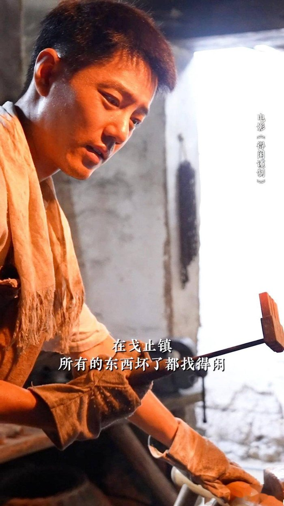

这部剧没有大开大合的热血厮杀，也没有开局即无敌的爽文光环。孔笙与兰晓龙联手，将镜头对准了乱世中如蝼蚁般求生的小人物。相比院线版，剧版通过约50分钟的叙事扩容，补全了主角从避世到反抗的心理动机。这种扩容绝非简单的素材堆砌，而是让人物的转变逻辑自洽，使其具有了独立观赏价值，堪称近期抗战题材中难得的佳作。

## 粗粝与深情：非典型抗战剧的情感肌理

战争题材最怕的不是残酷，而是虚假。在《莫得闲》中，战火的残酷是被一层粗粝的市井外壳包裹着的。剧中莫得闲与耳背弟弟之间用“小王八”涂鸦交流的细节，堪称神来之笔。弟弟听不清，哥哥在耳边骂小王八，弟弟误以为这是我爱你的意思，便到处涂鸦。

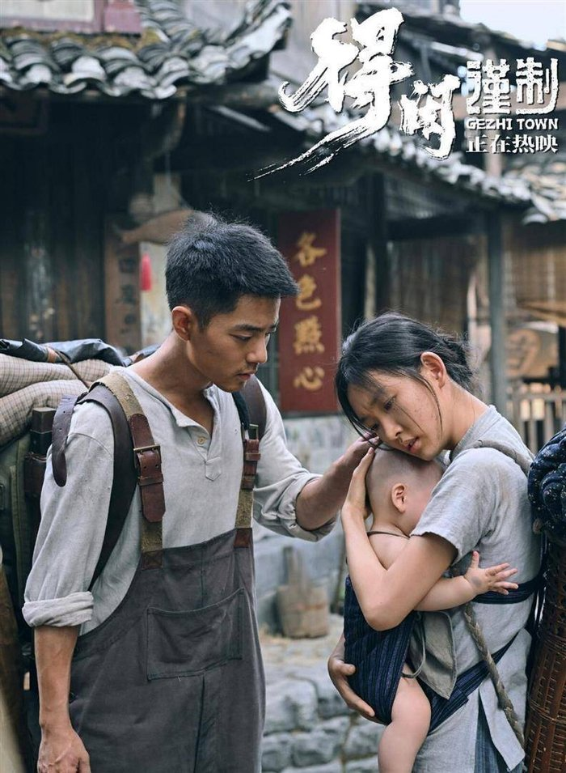

这种设计极狠，它剥离了传统年代剧里直白的煽情，把底层人那种粗糙又滚烫的情感砸在观众面前。它不是高雅的互诉衷肠，而是用近乎粗鄙的方式，包裹着绝境中最深的牵挂。

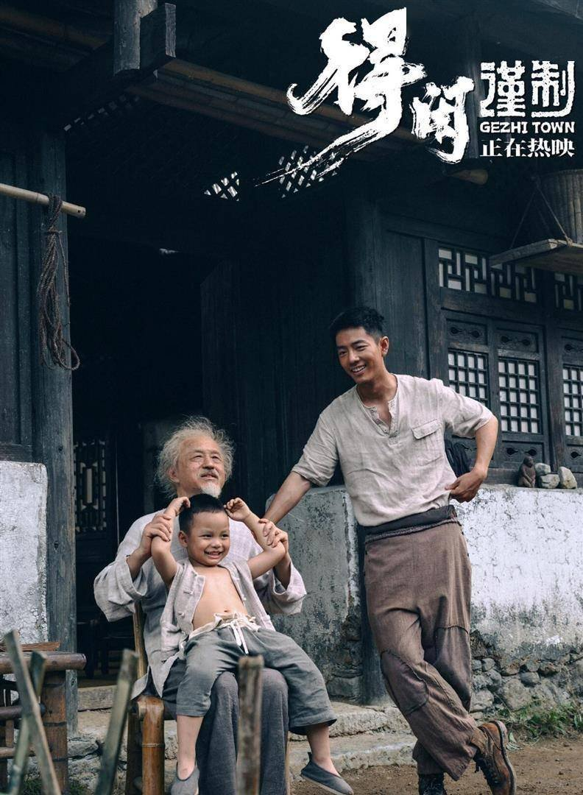

日常戏份同样如此，莫得闲与太爷的斗嘴、与村民的唠嗑，充满了生活化的烟火气。这些看似闲笔的黑色幽默，不仅消解了战争题材的沉重感，更凸显了底层人物在绝境中的生命韧性与真实质感。越生活，越反衬出和平被撕裂时的痛感。

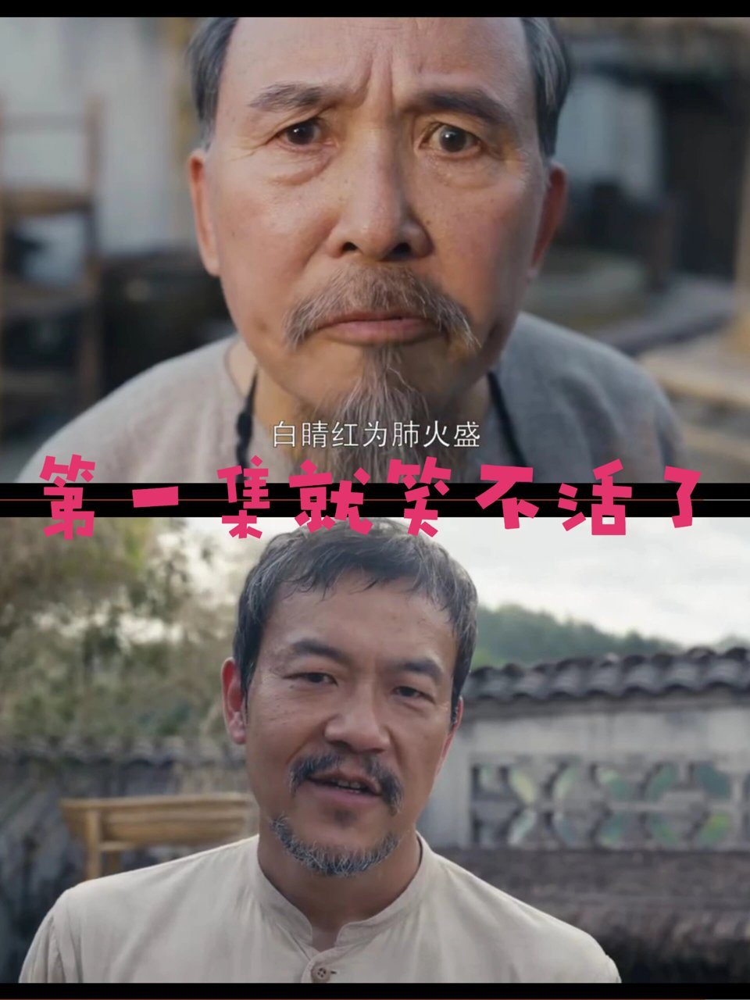

<!-- AD_ANCHOR:slot_1 -->

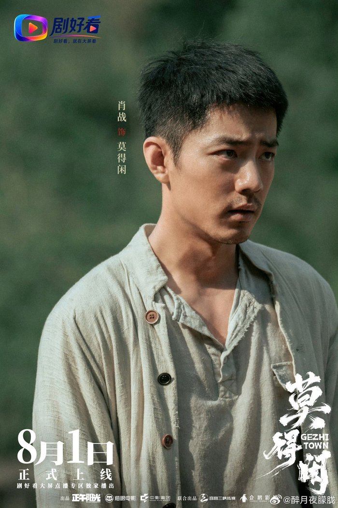

## 扩容与反转：从“保小家”到“卫小镇”的觉醒弧光

剧版相比电影版，最核心的进化在于叙事顺序的重排与心理动机的补全。院线版受限于时长，往往只能展现结果；而剧版通过新增的素材，填补了莫得闲从一个只想保全家人的普通钳工，到挺身而出守卫戈止镇的心理空白。

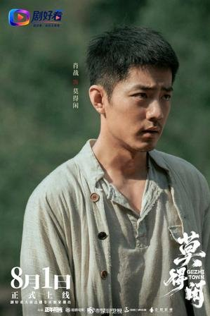

这种从“保小家”到“卫小镇”的转变，不是口号式的觉醒，而是退无可退后的绝地反弹。苏罗通炮这一核心物件的命运轨迹，正是这种隐喻的具象化。一门残缺的旧炮，一群被打散的残兵，加上手无寸铁的百姓，依靠简陋工具修炮反抗。

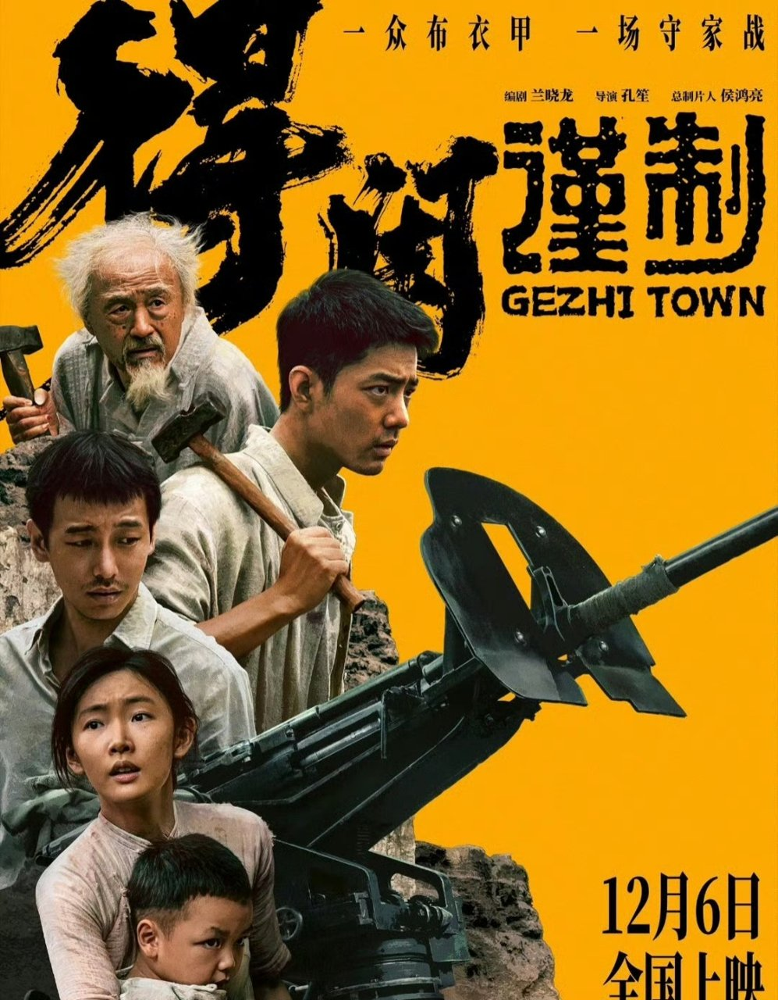

修炮的过程，实质上是民间自救意识的重塑。残缺的器物映射了被战火撕裂的家园，残兵与百姓的合力，折射出的是磅礴的民间力量。

**金句：真正的反抗从来不是振臂一呼，而是被绝境逼到退无可退时的本能反扑。**

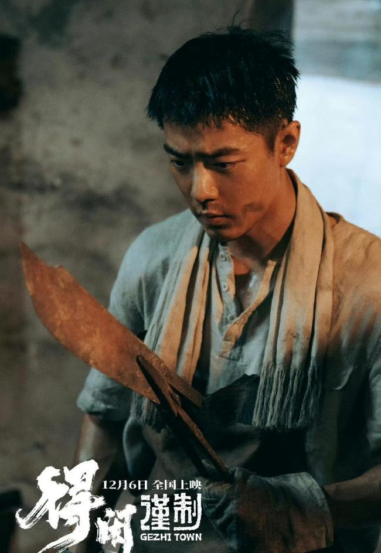

剧集没有把莫得闲塑造成救世主，他只是被时代洪流裹挟的修理工。当他发现自己修好的机床被轰炸掀翻，当家人的避难所再度受到威胁，他的反抗便有了坚实的逻辑支撑。

## 去光环叙事：主创语境下的凡人群像

孔笙与兰晓龙在人物塑造上的“去光环化”处理，是这部剧成功的基石。莫得闲身上没有天生的英雄主义，他心思细腻、手艺过硬，但在乱世中首先想到的是逃跑。这种真实感，让观众能够轻易代入那个灰暗的年代。

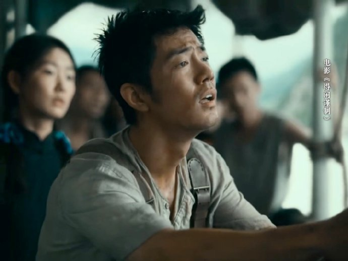

**金句：英雄主义的底色，往往是凡人对活下去的本能渴望。**

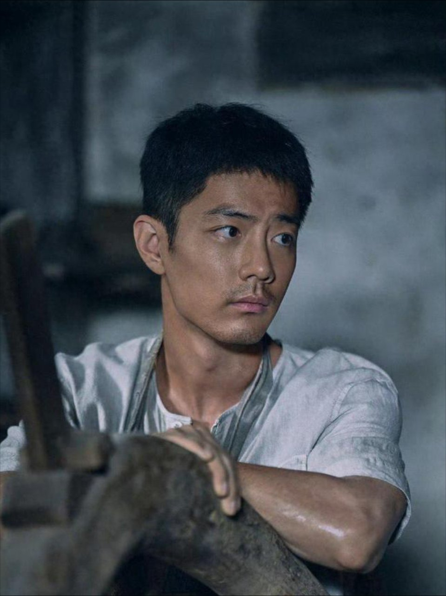

客观审视剧版在单集时长结构上的微小争议，部分观众反馈单集掐头去尾后实质内容缩水，存在注水嫌疑。这种批评有其合理性，长篇幅确实对剪辑节奏提出了更高要求。但结合叙事密度和人物立体度的显著提升来看，这些新增的日常支线让群像不再单薄。

整体艺术表达瑕不掩瑜，其正向口碑实至名归。剧集没有为了迎合快节奏市场而砍掉生活气息，反而坚持用慢节奏铺垫情感，这种创作定力值得肯定。

## 结论与互动：乱世图鉴的文本价值

总结而言，《莫得闲》剧版不是一部依靠感官刺激取胜的爽剧。它是一幅需要耐心品味的乱世求生图鉴，为战争题材提供了更为厚重的人文解法。它记录了凡人在历史车轮下的挣扎，也留存了微小但坚韧的人性微光。

<!-- AD_ANCHOR:slot_2 -->

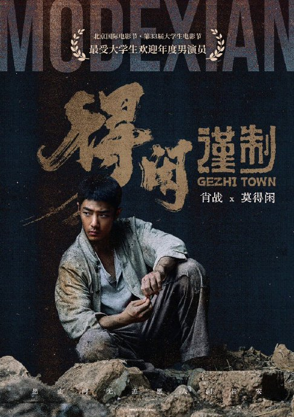

剧中莫得闲最终选择留下守卫戈止镇，你觉得这是对乱世命运的妥协，还是对生而为人尊严的清醒捍卫？
