# 《冰湖重生》特效：S+投资为何做出页游质感？

## 《冰湖重生》特效核心判断：S+投资与页游质感的错位

《冰湖重生》的视觉特效不仅未能托底S+级投资标准，反而呈现出一种极其廉价的页游质感，是典型的工业流水线残次品。在长达九年的IP情怀加持下，观众等来的却是满屏塑料感的视觉灾难。从资产精度到合成抠像，该剧视效暴露出的系统性崩坏贯穿始终，完全脱离了S+古装剧的及格线。

这种落差绝非苛求，而是基于基本工业标准的底线审视。剧集在视觉呈现上的粗糙，说明制作方在视效统筹环节存在巨大的管理漏洞。当特效无法建立起码的沉浸感时，再宏大的叙事框架也会沦为空中楼阁。

**金句：特效的廉价感从来不是单一技术环节的失误，而是整个视效工业链条的全面失守。**

那些号称耗资巨大的S+级资产，在镜头前全变成了违背物理常识的贴图素材，直接拉低了整部剧的观感下限。

## 《冰湖重生》冰湖场景拆解：流体解算失效与材质塑料感

以剧集核心场景“冰湖融化”为例，其水体流体解算完全缺乏真实的物理动态。画面中的湖水在运动时呈现出一种诡异的果冻状粘滞感，严重违背重力与流体力学常识。这种早期三维软件预设般的动态效果，直接摧毁了冰湖一役本该有的悲壮氛围。

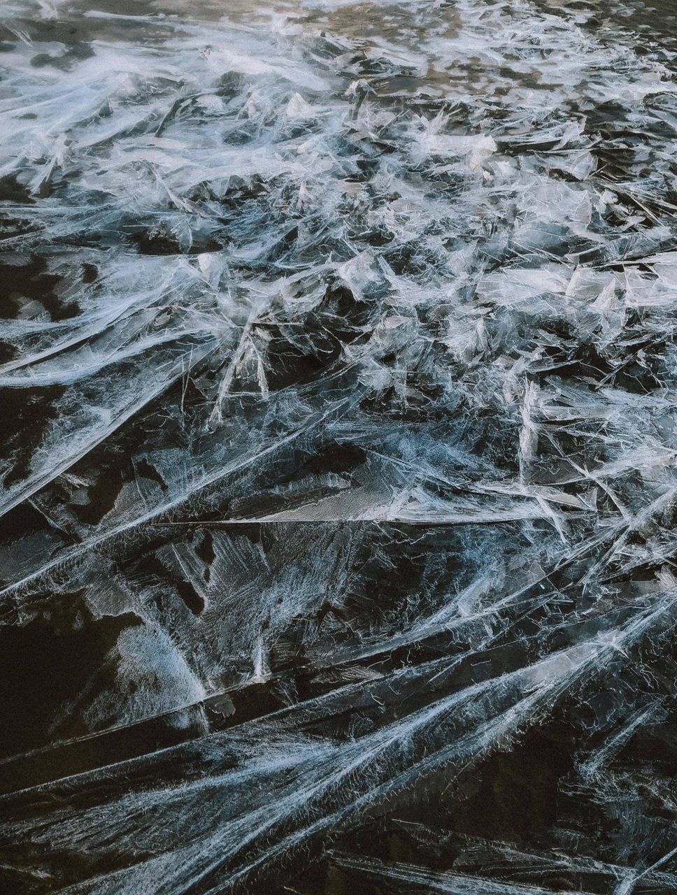

对比S+级应有的视觉呈现，该场景的冰块资产精度极低，材质反光呈现出强烈的塑料感。高质量的冰块渲染本应具备次表面散射（SSS）效果，以模拟光线穿透冰层时的漫反射，但本剧的冰块更像是裹了层透明塑料壳的劣质道具，毫无冰寒刺骨的质感。

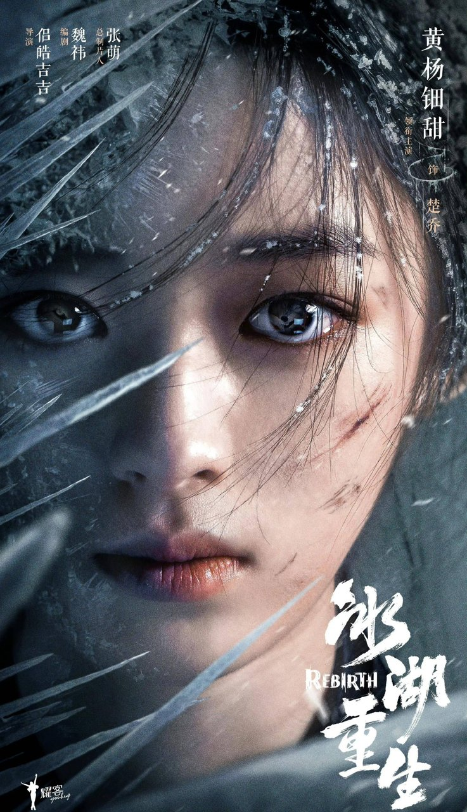

环境光与CG水体的融合也存在严重的色偏问题。实拍背景的冷色调与CG水体的高光色温极度不匹配，直接破坏了画面的空间纵深。当CG元素与实拍背景产生强烈的割裂感时，观众的眼睛会本能地排斥这种虚假画面。这种基础合成失误，在当下的影视工业流程中是不该出现的低级错误。

<!-- AD_ANCHOR:slot_2 -->

## 《冰湖重生》法术与动作戏：绿幕穿帮及光影断层

在法术交锋的戏份中，粒子特效显得极其廉价且运动轨迹死板。高质量的粒子特效应当具备体积感和层次感，以模拟能量流动的随机性，而本剧的特效却像是未经调试的预设模板。死板的直线运动轨迹和缺乏空气阻力的粒子衰减，让原本该震撼的法术对决变成了低幼动画。

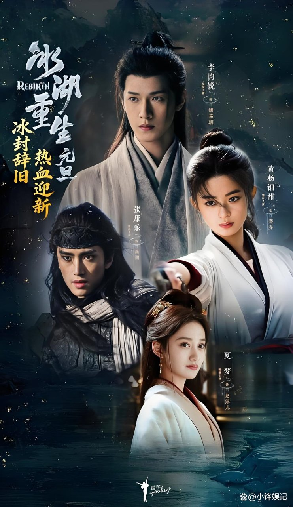

更致命的是关键场景中的绿幕穿帮问题。人物边缘溢色、抠像毛边明显，这种合成瑕疵在现代后期软件中本可通过边缘溢色抑制和精细遮罩轻松解决。背景与前景的透视关系错乱导致空间感坍塌，人物仿佛被强行贴在背景板上，毫无景深可言。

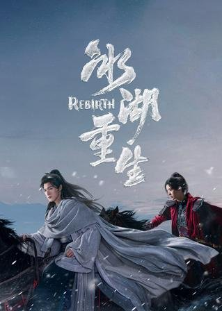

人物受光与CG光源的不一致也导致了严重的光影断层。演员在实拍时的主光源方向与后期添加的CG魔法光源完全不匹配，导致演员在特效环境中如同生硬贴图，毫无融入感。

<!-- AD_ANCHOR:slot_1 -->

**金句：视效的坍塌从来不是单纯的预算不足，而是创作态度对观众基本审美的傲慢践踏。**

光影逻辑的缺失，说明后期团队在镜头衔接时连最基本的布光分析都没做，视效成了单纯的画面叠加。

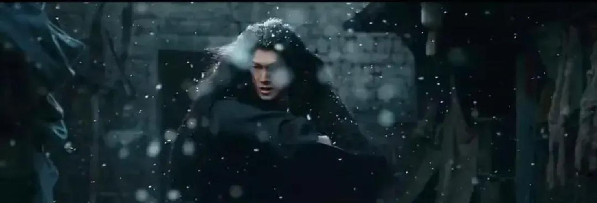

## S+视觉标准落差：《冰湖重生》背景资产粗糙与动态僵硬

对标同类S+剧集的视觉标准，本剧在场景延伸和数字绘景（DMP）上极为敷衍。背景建筑缺乏细节支撑，远景的建筑模型多边形数量严重不足，贴图分辨率极低。一旦镜头推进，画面便迅速模糊失真，暴露出明显的渲染缺陷。

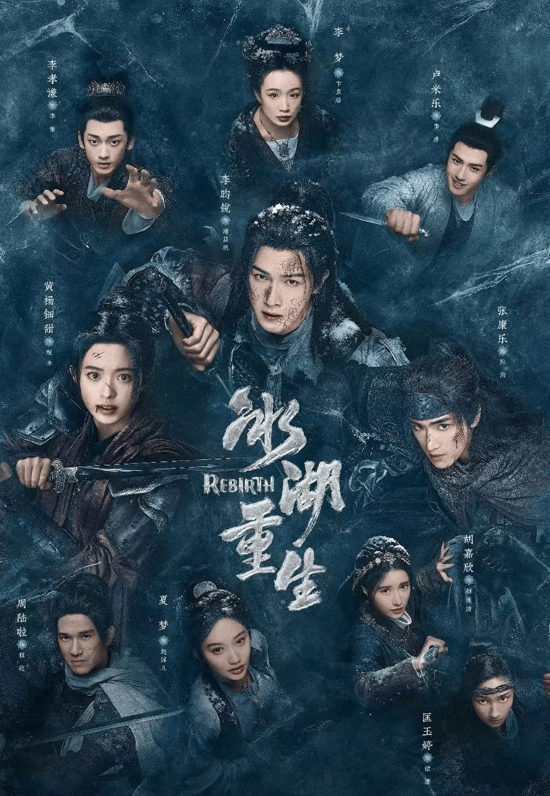

高质量的数字资产应当经得起景深推拉，但本剧的背景在轻微运镜下便暴露出清晰的像素感。这种对背景资产的敷衍，直接暴露了前期资产统筹的失控。

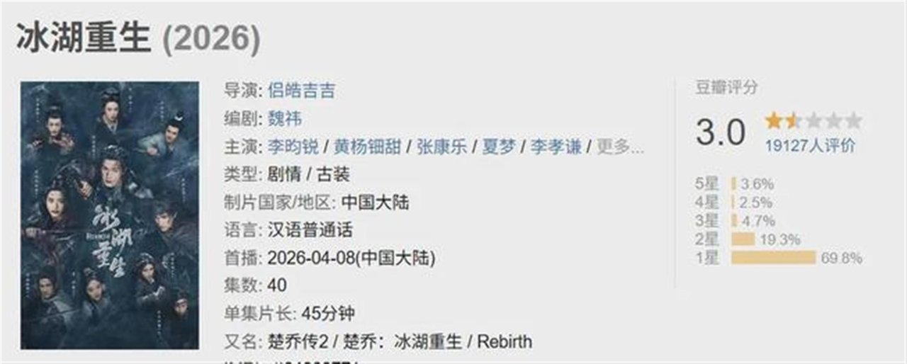

制作粗糙的具体表现还体现在群演CG的克隆痕迹上。在千军万马的远景镜头中，群演CG克隆复制严重，动态捕捉极为僵硬。数字替身的动作违反人体工学，排列整齐划一，毫无战场应有的混乱与真实感。

**当远景的模糊与近景的塑料感叠加，所谓的S+投资不过是一张无法兑现的空头支票。**

观众的审美阈值早已提高，糊弄的资产精度最终只能换来无情的吐槽。

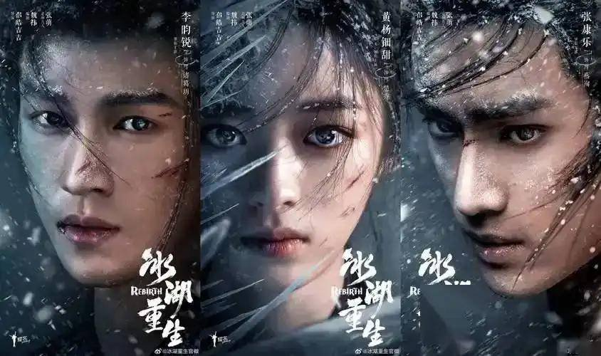

## 《冰湖重生》制作逻辑反转：局部妥协与外包失控下的视觉坍塌

深入剖析制作逻辑会发现一个诡异现象：尽管本剧部分实景搭建具备一定基础，美术置景也算用心，但一旦切入大范围CG特效，画面质量便断崖式下跌。这种局部实景与整体CG的割裂，直接暴露出后期统筹的彻底失控。

实景与特效的衔接需要严谨的灯光匹配和镜头追踪，但本剧在这些关键环节上明显存在外包衔接断层。这说明制作方在视效工业链条上存在严重的轻视心理，试图用低质外包拼接来应对S+体量的特效需求。

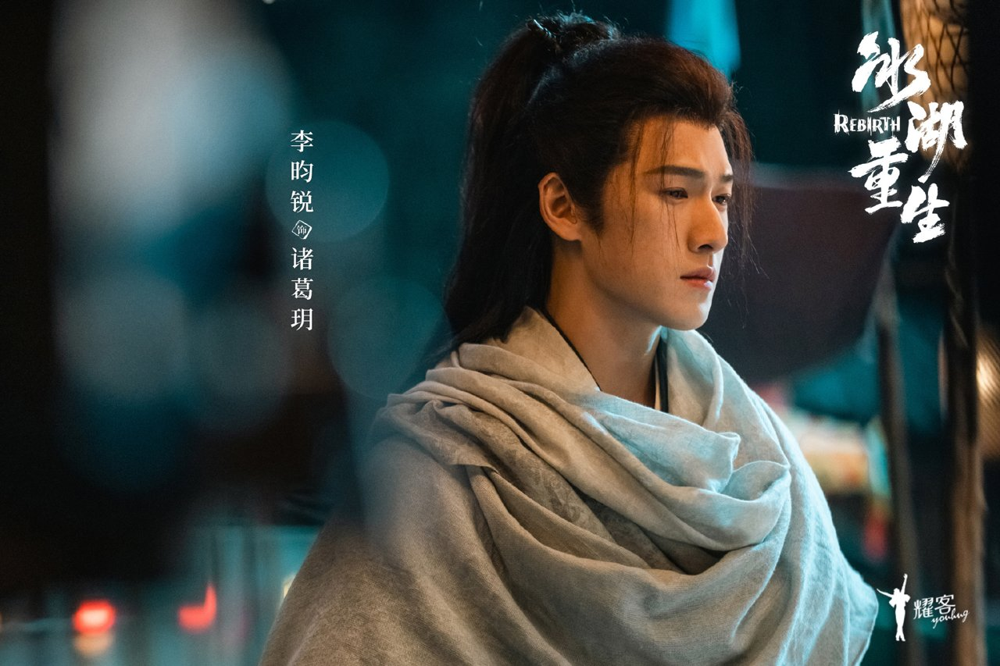

这种做法无疑是在消耗IP信任。用廉价外包糊弄核心视效镜头，不仅毁了关键剧情的张力，更让整部剧的质感大打折扣。前作《楚乔传》原版复播市占率高达41%，而《冰湖重生》续作开播次日市占率便从4.7%跌至4.4%，这种断崖式下跌不仅是选角争议的结果，更是粗劣视效劝退观众的真实写照。

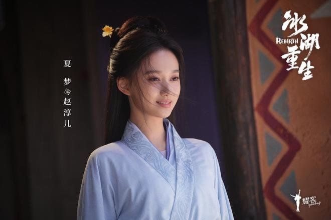

## 结论：《冰湖重生》暴露影视工业底线的倒退

《冰湖重生》的特效水准不仅未能推动影视工业化进程，反而以S+之名行糊弄之实，拉低了行业底线标准。在当前影视工业化不断升级的语境下，视效不应只是宣发噱头，而应回归制作逻辑本身，尊重观众的基本审美。

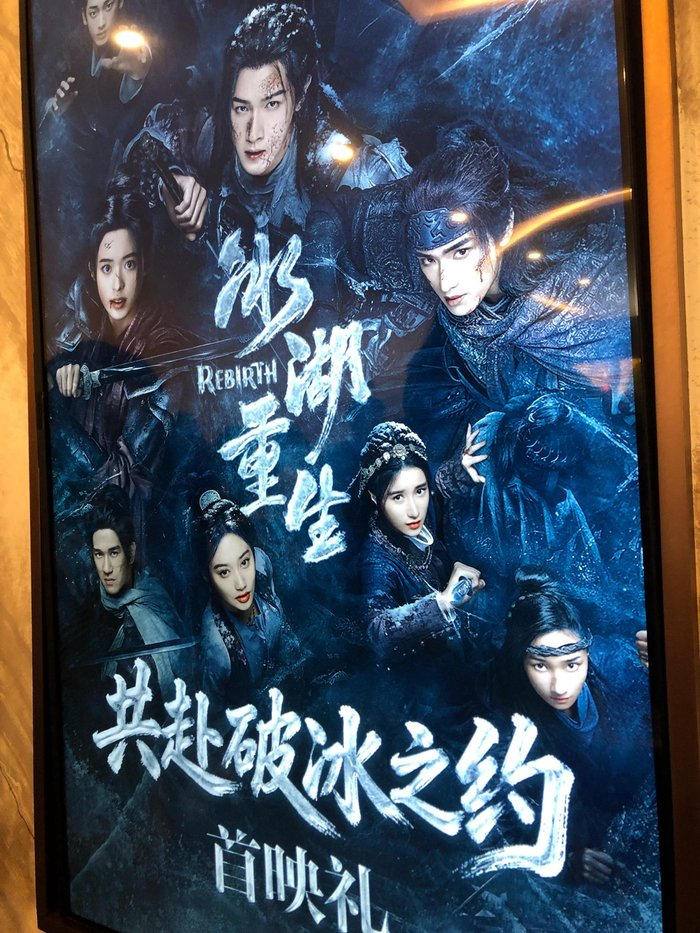

该剧特效的全面溃败，为行业敲响了警钟：没有严谨的工业流程把控，再大的投资也只能产出页游质感的残次品。当制作方用塑料感十足的特效糊弄观众时，最终被反噬的只能是IP本身和平台的公信力。

你觉得《冰湖重生》的特效，是经费燃烧还是糊弄观众？
