# 《逆行人生2》跌至6.9分，消费苦难为何失灵

前作12.92亿票房与8.1高分的巨大光环下，续集3天不足1亿的惨淡开局，揭示了市场预期的严重错位。**《逆行人生2》的滑铁卢不仅是续作创作惰性的体现，更是“消费苦难”叙事在当下市场的彻底失灵。**

观众不再为富人演穷人的套路买单。核心矛盾在于影片失去了前作扎根生活的质感，沦为悬浮的工业化流水线产品。前作之所以能引发全民共鸣，是因为镜头推近时，观众能数清主角额角暴起青筋里真实的抽搐感。那是失控感被精准解剖的生理级真实。

而续作丢掉了这股从骨子里透出来的窝囊与倔强，把生存困境简化成了按部就班的过关游戏。

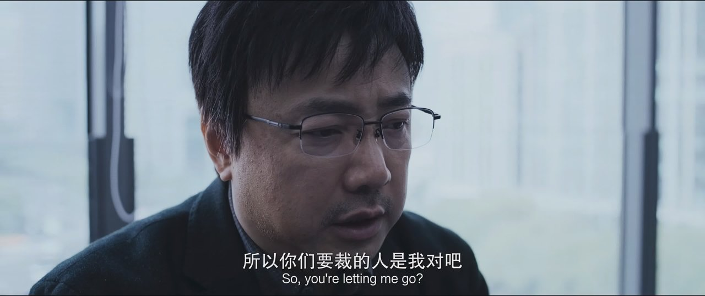

## 数据拆解：《逆行人生2》断崖式滑坡的真相

用“坠机”来形容《逆行人生2》的市场表现毫不为过，其数据滑坡的每一个维度都透着残酷。

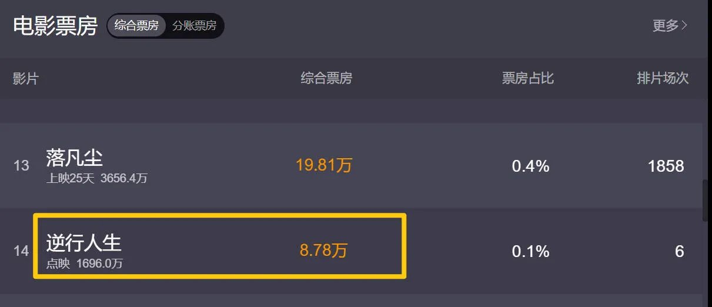

从票房走势来看，前作斩获12.92亿，而续作灯塔预测总票房仅2.29亿，连前作的零头都不到。面对网传超2亿的制作成本，30家出品公司面临回本线遥不可及的困局。投资方原本预期15至20亿的爆款愿景，在冰冷的数据面前沦为彻头彻尾的泡沫。

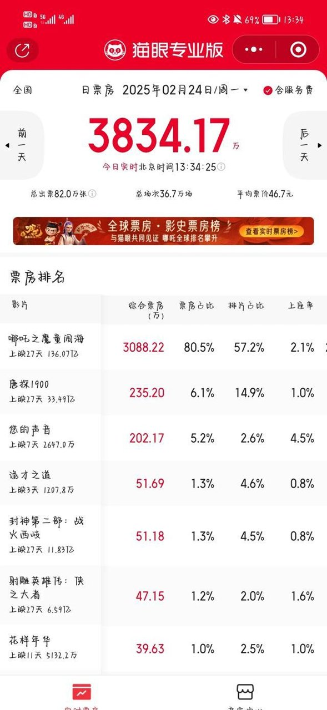

排片与占比的倒挂更是市场信心崩塌的直接信号。首日18.5%的排片量，第二天便迅速缩水至12.1%，票房占比仅维持在9.3%的低迷状态。影院经理的刀比观众的嘴还快，一旦发现上座率不及预期，果断砍场次止损。这种断腕式的操作折射出业内对影片后市的极度悲观。

口碑评分的降级则彻底封死了逆袭的可能。豆瓣开分7.0，迅速跌破6.9，与前作8.1分形成了1.2分的巨大落差。

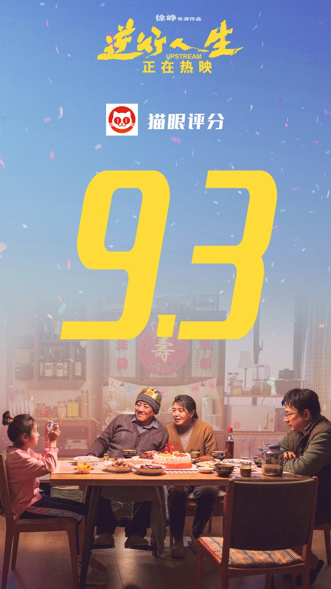

购票平台超95%的好评与社交媒体上铺天盖地的差评形成了鲜明的分层。即使有部分打工人试图在片中寻找解压爽感，大众舆论场已经对影片的叙事逻辑产生了根本性的抵触。

## 归因分析（上）：《逆行人生2》创作惰性与剧作悬浮

续作的崩塌首先源于创作层面的硬伤，强行煽情与套路化叙事严重削弱了现实的痛感。

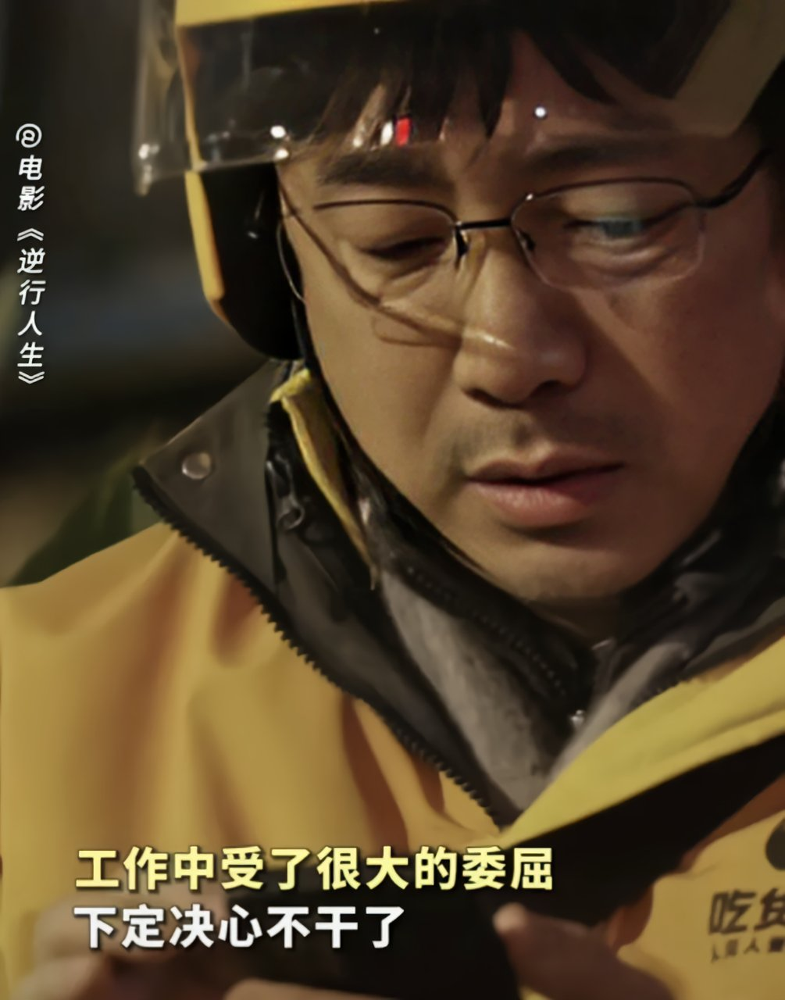

前作中那些精准的失控感解剖在续集中不见了踪影。观众再也看不到暴雨夜单膝跪地抢修故障车锁时，雨水混着汗水流进嘴角的绝望。也看不到医院缴费窗口前手指悬停在支付界面0.8秒的微颤。续集的剧作逻辑浮于表面，放弃了前45分钟不用背景音乐、只用电机声织成窒息网的克制。

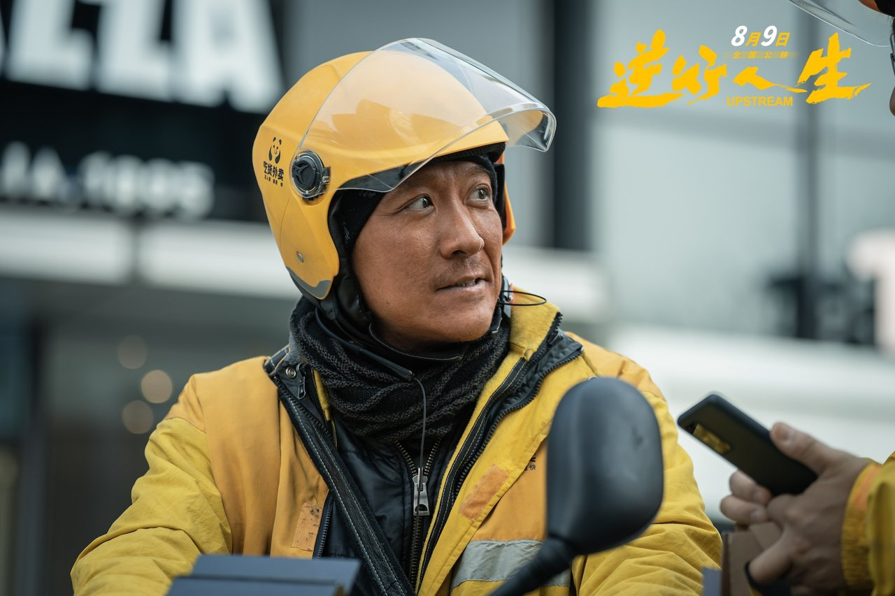

转而用强冲突来掩盖叙事的空洞。人物塑造的割裂感进一步撕裂了观众的代入感。选角更替带来的气质违和是致命的，原本那种“除了忍没有别的选项”的草根局促感被精英气质彻底取代。

新主演无法复刻前作中那种随时可能被HR约谈的窝囊感，角色沦为推动剧情的工具。而非真实存在的、在生活绞肉机里挣扎的“人”。

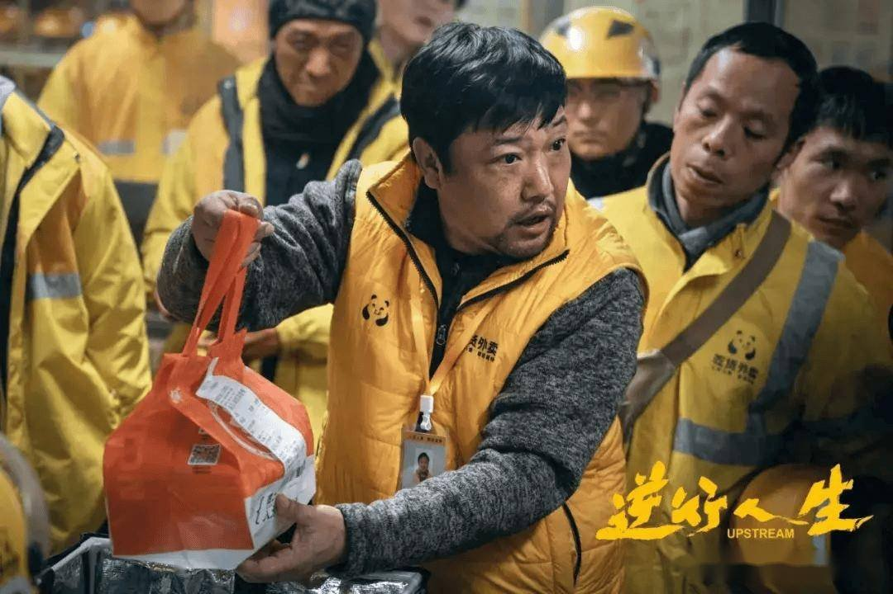

细节失真与场景堆砌则让写实感大打折扣。为了制造戏剧张力，影片强行制造各种意外冲突，却完全忽视了外卖员真实生存环境中的系统性困境。

**金句：脱离了生活绞肉机的粗粝质感，苦难便沦为了一场悬浮的橱窗展示。**

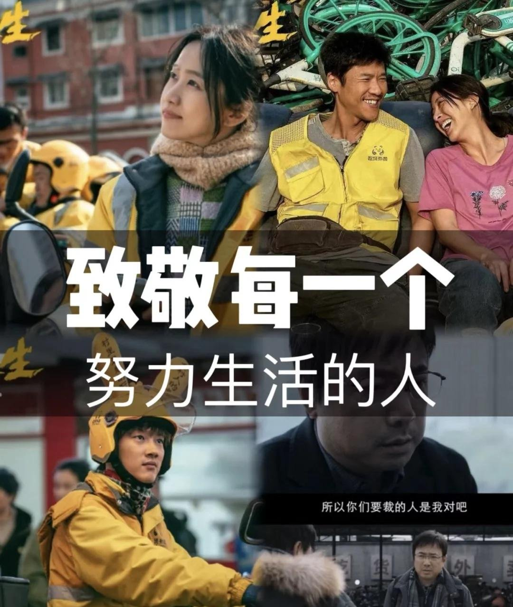

<!-- AD_ANCHOR:slot_1 -->

## 归因分析（下）：消费苦难反噬与受众情绪倒戈

如果说剧作悬浮是骨架的酥松，那么“消费苦难”的争议则是直接抽干了影片的血液。

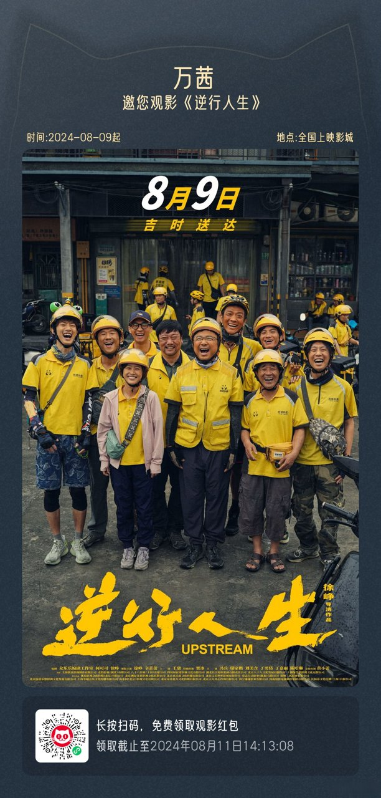

海报营销与主创背景引发了强烈的抵触情绪，成为了压垮骆驼的最后一根稻草。海报上几位主演穿着外卖服笑得灿烂，背景里真正的外卖员却面无表情。这个被截屏广传的画面成了“富人演穷人”的铁证。

一个身家丰厚的导演，带着一群高薪明星去演底层挣扎的故事。在当前的社会情绪下，不可避免地被视作居高临下的俯视与悲悯。

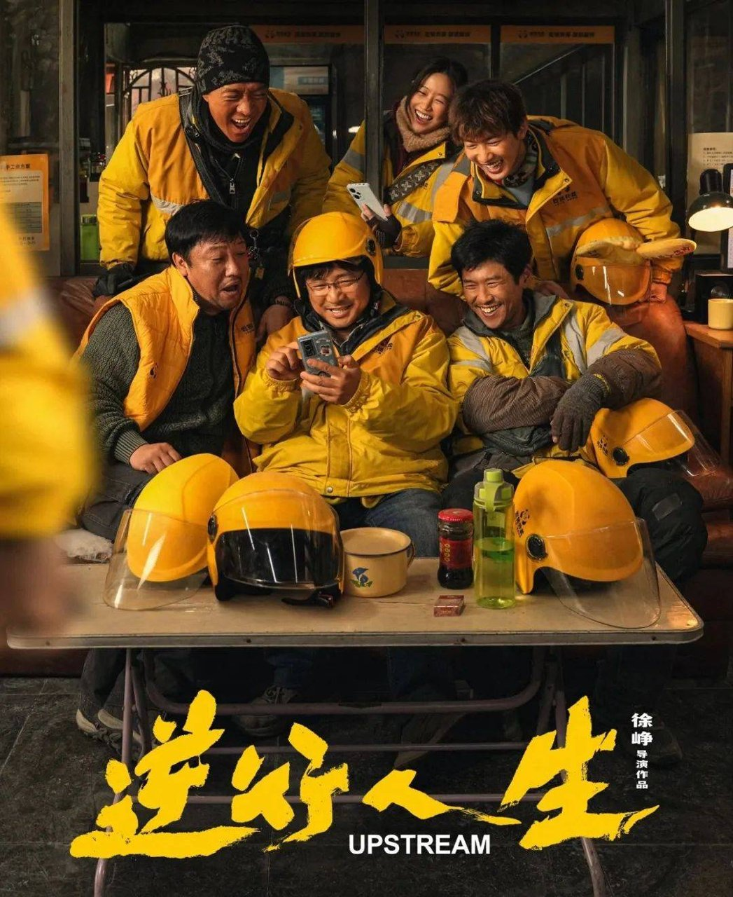

主创试图复刻前作底层的情绪共鸣，但市场反馈却呈现出截然相反的抵触态度。真实的社会议题在续作中沦为商业包装的幌子。观众敏锐地察觉到，自己身边触手可及的原型故事，正在被当作收割票房的工具。

那种“你功成名就，跑来演我的生活，还要我花钱买票”的被剥夺感，彻底摧毁了观影的信任基础。

**金句：观众对“苦难叙事”的审美阈值已急剧提高，拒绝被强行剥削眼泪，要求创作者具备真正的同理心而非居高临下的悲悯。**

受众心理的变迁宣告了套路化同情心态的终结。当观众身边都能找到失业送外卖的原型时，现实的痛感太近了，近到容不下半点虚假。市场不再接受用廉价的眼泪换取共鸣的算法，只有真正俯下身子理解泥泞的作品，才配得到观众的共情。

<!-- AD_ANCHOR:slot_2 -->

## 趋势预判：现实题材续作的末路

《逆行人生2》的遇冷不仅是一部电影的失败，更预示着现实题材续作流量红利期的彻底终结。

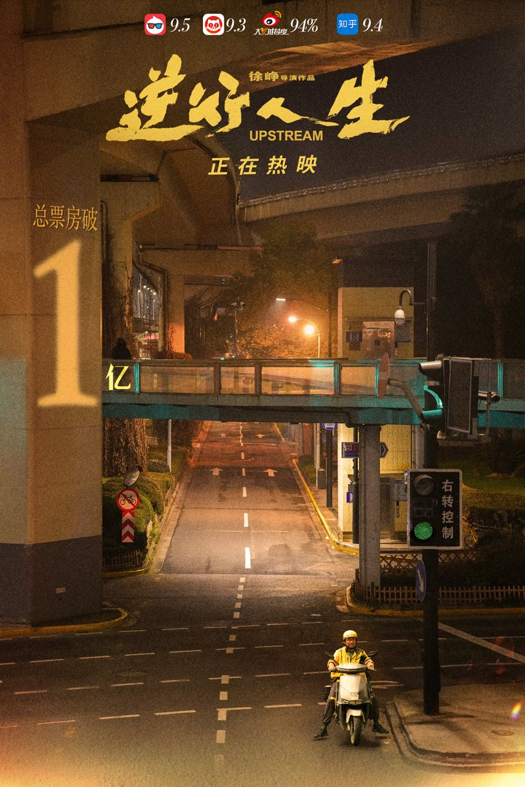

依赖前作IP兜底、试图复制成功公式的模式在当下市场已不再奏效。前作的爆款是天时地利人和的共振，是切中时代隐痛的精准一击。而续作试图用原班幕后再加一套工业糖精式的苦难模板来复制奇迹。

这种商业算计低估了观众的鉴别力，也高估了IP的剩余价值。

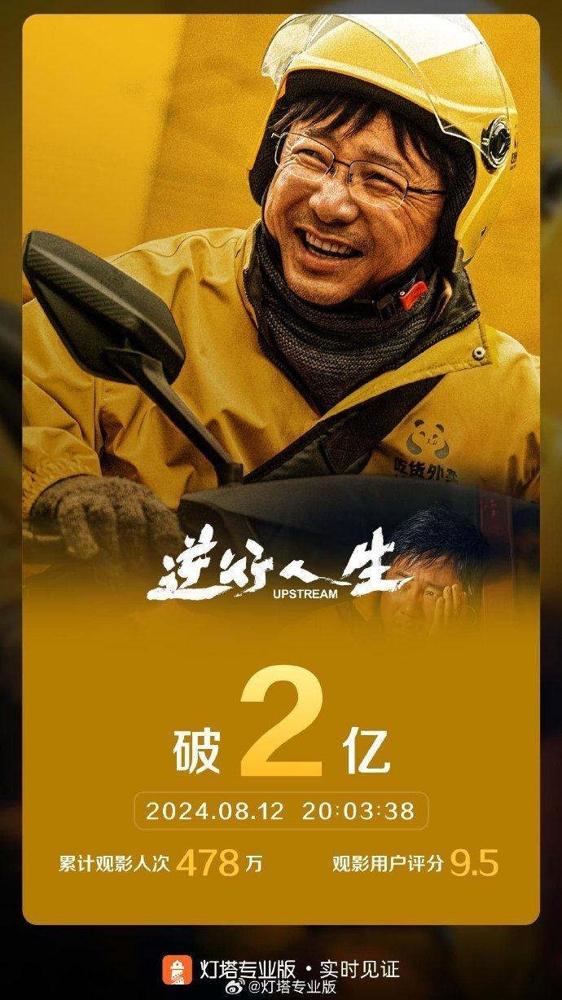

市场不再容忍悬浮的现实主义，观众要求创作者回归生活逻辑的深度打磨。现实题材的生命力在于粗粝的真实，在于那盒滚进积水洼的红烧肉和沾满泥水徒劳扒拉的手。而不是精致的服化道和强行安排的转折。只有重建生活逻辑的信任机制，现实题材才能重新赢回观众的青睐。

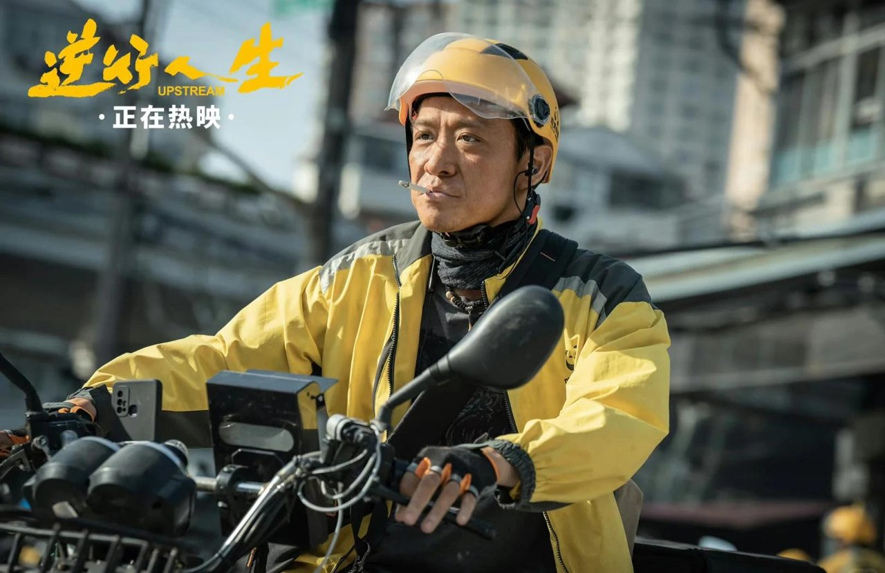

预判后续同类题材必须正视受众情绪的深刻变化，摒弃商业算计。如果创作者依然企图用浮于表面的苦难奇观来收割下沉市场，必将面临更严厉的市场用脚投票。观众需要的是镜子，而不是一面镀了金的假象。

## 互动留白

你认为《逆行人生2》的口碑滑铁卢，更多是因为前作光环带来的过高预期压力，还是本身剧作悬浮导致的致命缺陷？
