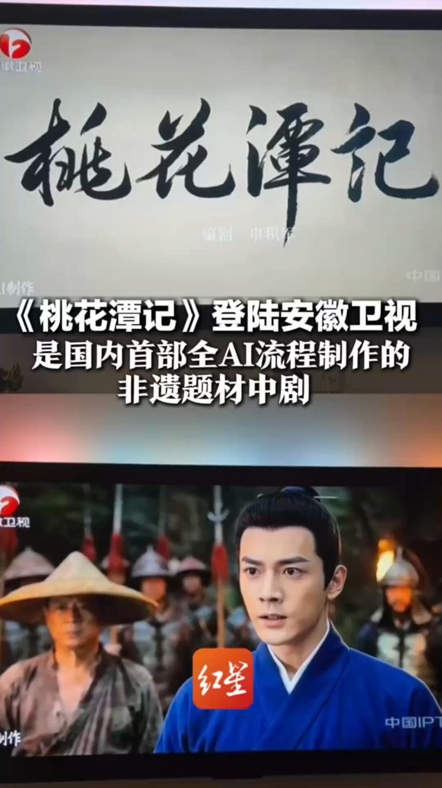
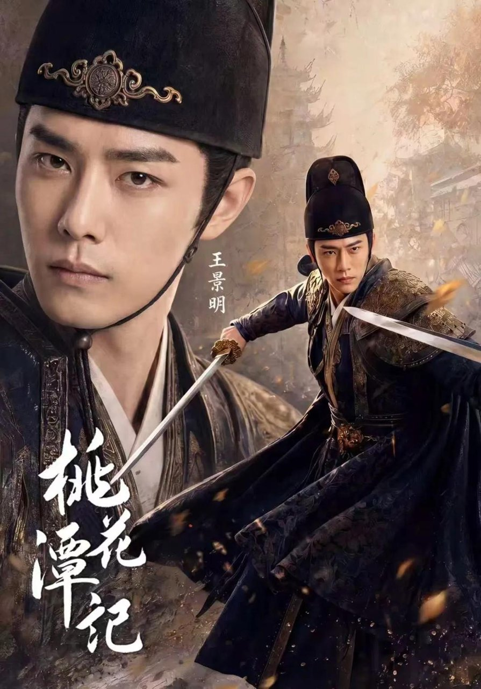

# 《桃花潭记》第17分钟，睫毛颤动停了半拍

《桃花潭记》第17分钟，睫毛颤动停了半拍——这不是报错提示，而是我们人类观演神经被轻轻叩响的第一声回音。

它不宣告AI已登台，也不宣告人类退场；它只固执地记录下那个瞬间：当AI角色转身，颧骨高光均匀得像抛过光的瓷面，瞳孔收缩慢了120毫秒，而你下意识屏住呼吸，并非因惊艳，而是本能地在确认——刚才那帧，是不是真的“活”过？  
**金句：所谓真实感，从来不在‘像不像人’的刻度上，而在‘人会不会失控’的缝隙里。**

这部国内首部上星AI剧，用20集×10分钟的体量，把“表演性真实”从美学命题拉进生理现场：它建模稳定、运镜工整、108道宣纸工序还原精准到纤维走向，可恰恰是这些无可指摘的“完成度”，反向暴露出一个更幽微的事实——  
**金句：真正的表演权，不在模型权重里，而在一次漏掉的呼吸、一帧没跟上的眨眼、一段不合节奏的颤抖之中。**

## 核心判断  
这不是一部关于“AI能不能演戏”的剧，而是一份人类观演神经被持续轻叩的实录。  

当AI角色在第17分钟转身时睫毛颤动频率突然失真，我们屏息，并非因震撼，而是因一种近乎原始的信任校验机制被悄然激活：皮下脂肪对光线的散射层次缺失、虹膜随焦距变化的形变延迟、眨眼节律严守3.8秒±0.1秒——这些并非“错误”，而是与真人演员4.2秒平均眨眼间隔形成的**节律差**。它肉眼难辨，却让大脑边缘系统微微绷紧：这具身体，是否拥有自主呼吸的权限？  

《桃花潭记》的技术完成度远超预期，非遗纹理扎实、建模稳定性强；但它最诚实的地方，恰恰是暴露了“表演性真实”无法被参数锚定的缺口：没有谎言触发的微瞳偏移，没有疲惫累积下的肩颈松弛，没有情绪翻涌时喉结的阶段性卡顿。这些非设计性痕迹，才是观众交付信任的隐秘契约。它不失败，也不惊艳；它是一面冷镜：照见我们早已习惯用“像不像人”来验收表演，却忘了“人之所以为人”，正在于那些算法刻意规避的失控与冗余。

## 第一处断裂：同框即出戏  

开篇3分钟，真人非遗传承人（实拍）与AI生成青年学徒同框对话。镜头切至AI角色侧脸时，**颧骨高光过渡过于均匀，缺乏皮下脂肪对光线的散射层次**；当真人演员自然垂眸后抬眼，AI角色同步执行“眼神聚焦”，但**瞳孔收缩延迟120ms，且无虹膜纹理随焦距变化的细微形变**。  

关键不在“假”，而在“不同频”。真人演员眨眼有随机性（平均4.2秒/次），AI角色则严格按剧本标注节奏执行（每3.8秒±0.1秒一次）。这种节律差不制造视觉破绽，却引发神经层面的信任滑坡——就像听一首走调0.5Hz的歌，耳朵抓不住，但后颈肌肉会微微发紧。  

<!-- AD_ANCHOR:slot_1 -->

观众短评高频词不是“粗糙”，而是“敬而远之”。这不是审美疲劳，而是生理阈值被反复试探后的自然回避：当两个生命体在同一影像时空中并置，却遵循完全不同的生物节律，人的共情系统会本能降级响应——你无法对一台精密钟表产生怜惜，哪怕它模仿心跳。

## 第二处褶皱：文化符号很准，情绪落点很空  

剧中108道宣纸工序以AI逐帧复现，古法晾晒的竹帘阴影密度、纸浆纤维走向均经文物级建模——**技术层面对‘物’的敬畏近乎虔诚**。  

但当AI主角跪拜祖师牌位时，**手部颤抖幅度恒定0.3cm，未随台词情绪递进；喉结上下移动轨迹为直线匀速，缺失哽咽时的阶段性卡顿**。观众留言里没有“演技差”的指责，只有“像在看一场仪式复原演示”的疏离感。  

符号越精确，情感越疏离——因为文化温度从不由复刻精度决定，而由“人”在仪式中留下的颤抖、迟疑、走神共同编织。AI可以完美复刻宣纸的纤维走向，却无法模拟匠人跪拜时膝盖压进青砖缝里的那一声闷响；它可以渲染出烛火摇曳的光影，却无法让火苗在角色瞳孔中真正跳动一次——那一次跳动，本该来自演员凝视火焰时真实的生理反馈。

## 第三处悬停：不是AI不会演，是‘演’的定义正在松动  

对比《被裁掉的女孩》虚拟主角“方桃子”：其成功不在于拟真度，而在于**主动放弃‘完美人脸’，保留建模误差（左眉略高于右眉）、设定呼吸紊乱（焦虑时胸廓起伏不对称）等‘可控瑕疵’**。  

《桃花潭记》选择极致平滑，恰暴露深层矛盾：**当AI被要求‘演得像人’，它复制的是教科书式表演范式；而真实表演，本质是抵抗范式的瞬间**。片尾字幕滚动时，AI角色静立回望镜头——这一次它没有眨眼，也没有呼吸起伏，但观众留言最多的是“她好像在等我们先移开视线”。  

这不是拟真失败，而是新媒介给出的第一份反向馈赠：它迫使我们重新定义“凝视”的权力关系。当AI不再讨好式地模仿人类反应，反而以绝对静止构成一种存在主义式的等待，我们才第一次意识到——原来“真实”，未必是动态的模仿，也可能是静态的挑衅。

## 结语：我们陪它一起学‘喘气’  

不评判《桃花潭记》是好是坏，只确认一个事实：它让237万观众在10分钟里，**反复校验自己对‘真实’的生理阈值**。  

当AI开始承担表演职能，真正被重写的不是技术标准，而是我们与影像建立信任的神经路径——  
**下次再看AI角色，你会先注意ta的睫毛，还是先等ta漏掉一次呼吸？**  

这问题没有标准答案。但提问本身，已是这场实验最珍贵的回响。

<!-- AD_ANCHOR:slot_2 -->

你觉得下一次AI演戏，最该先补上哪一种真实？  
A. 疼痛时的肌肉记忆  
B. 撒谎时的瞳孔偏移  
C. 安静时的呼吸节奏
