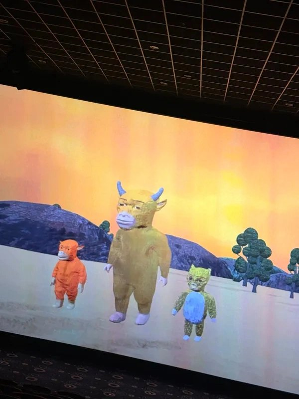
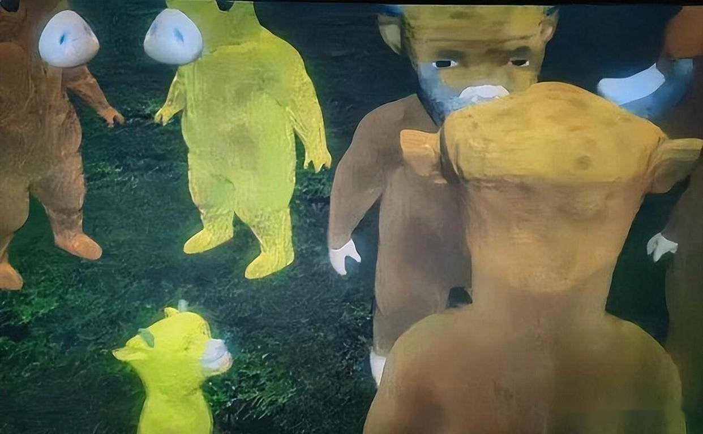
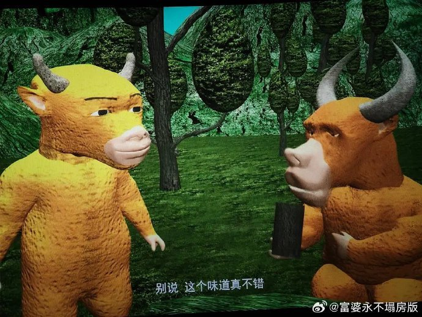
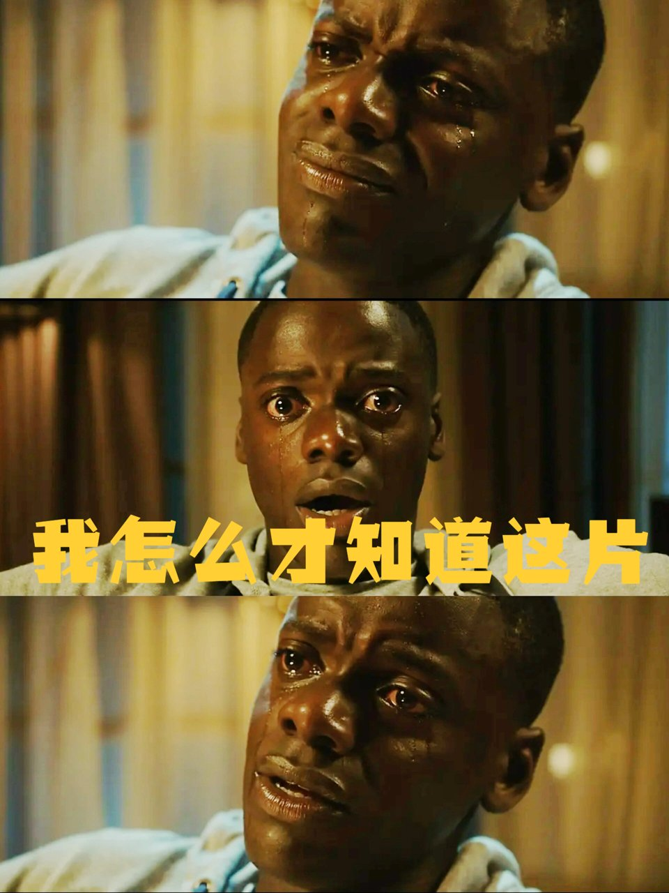
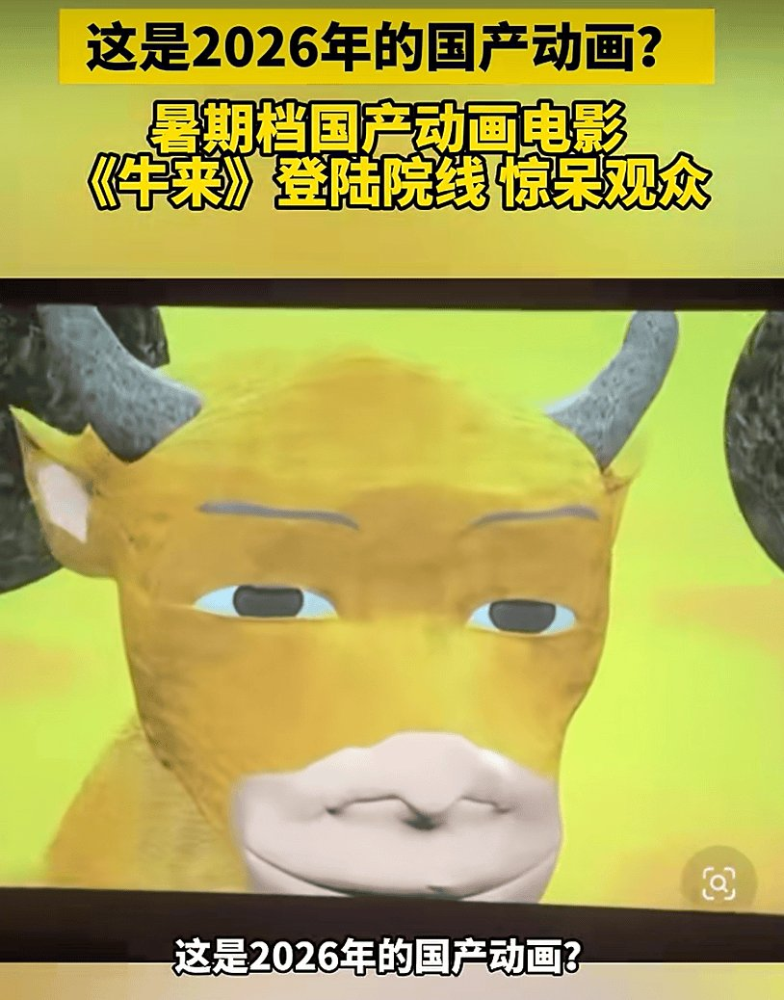
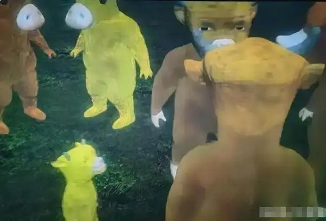

# 《牛来》的票房逆袭，只是一场审丑狂欢

**当一头建模扭曲的牛在屏幕上僵硬地吟诵生命哲学时，它解构的不是生死，而是电影工业的底线。**

动画电影《牛来》的现象级出圈，本质上是一次互联网审丑浪潮的集中爆发。当观众买票走进影院，他们消费的不是故事，而是“粗糙”本身。这种对灾难级画质的围观，将电影从一种叙事艺术降格为社交平台上的猎奇谈资。

## 《牛来》的视觉断裂：水墨海报与4399正片的诈骗式反差
官方释放的唯一物料是一张质感细腻的国风水墨海报，充满“高级感”，但实际正片却是低精度的3D动画。这种巨大的反差并非创作者的刻意留白，而是工业能力缺失导致的直接断裂。

正片中扭曲的建模、卡顿的动作和崩坏的画面，被观众戏称为“海报千里江山图，正片4399小游戏”。这种“诈骗式宣传”带来的视觉冲击，直接点燃了社交媒体上的吐槽狂欢。海报的“高级感”不仅没有为正片赋能，反而加剧了其荒诞色彩。

**金句：视觉呈现的全面失守，让所谓的治愈内核沦为一场彻头彻尾的骗局。**

这种断裂说明，团队连最基本的视听语言统一都未能掌握。用一张精美海报掩盖正片的粗制滥造，是对观众基本观影权益的漠视。

## 《牛来》的工业毛边：两人主创与装修公司转型的草台班子
《牛来》的幕后制作团队堪称“极简”。导演信雨萌一人身兼导演、编剧、配音、制片等多个工种，编剧孙丽芳也兼任了配音演员。更令人惊讶的是，出品方大连璟园文化影视传媒有限公司，其前身是一家装修公司。

这种从装修跨界到动画电影的巨大跨度，直接投射在了成片的毛边上。影片中频繁穿模的场景和干瘪的台词，实证了影片的粗糙并非某种先锋风格，而是基础制作环节的全面失守。

技术审查只管有没有坏帧，不管制作好坏，这成了《牛来》登陆院线的唯一通行证。这种“草台班子”的底细，让影片的荒诞感更上一层楼。

面对这种工业失守的画面，看片时确实需要一些解压零食来缓解视觉疲劳。嚼劲十足的开袋即食牛肉干，能让人在无语凝噎中平复心情。

<!-- AD_ANCHOR:slot_1 -->

## 《牛来》的社交狂欢：反讽五星好评与审丑货币的虚无
豆瓣评论区涌现的“国漫之光”等反讽式五星好评，是互联网时代对烂片的解构与娱乐化围观。观众抱着“烂到极致必须尝尝咸淡”的猎奇心态涌入影院，将观影变成了一场集体打卡行为。

**金句：反讽式五星好评不是对烂片的宽容，而是互联网时代用虚无消解一切严肃文本的社交狂欢。**

这种审丑狂欢消解了电影文本本身的价值，票房逆袭只是情绪消费的产物。当观众驱车30公里只为见证“历史”时，电影本身已经不重要了，它退化成了一种社交货币。

网友展开的二创与玩梗，进一步将这种荒诞推向高潮，让一部原本无人问津的作品完成了黑红出圈的魔幻闭环。

把这种荒诞的86分钟当成一场行为艺术来看，倒也符合微醺的状态。备点经典口味的啤酒，微醺之下或许更能品出这股后现代的荒诞味。

<!-- AD_ANCHOR:slot_2 -->

## 《牛来》现象的终局：审丑时代的流量密码与国漫之殇
《牛来》现象是一面镜子，映照出审丑时代的流量密码。但影片本身难掩质量之忧，绝不代表国产动画的进步。当粗糙成为卖点，当烂成为社交资本，真正用心打磨作品的创作者反而会被边缘化。

票房的暴涨无法掩盖工业能力的缺失，这种靠猎奇支撑的虚假繁荣，终究只是昙花一现。

你认为《牛来》的粗糙是跨界者的无意为之，还是对电影工业的一种后现代行为艺术解构？
