# 《花开锦绣》卫视登顶，网播为何没爆

《花开锦绣》呈现出一种典型的“叫好不叫座”错位现象：卫视收视登顶与豆瓣开分印证了其制作质感，但云合市占率未破10%暴露了全网声量的疲软。这种错位并非单纯的宣发不力，而是慢热写实宅斗与短视频时代爽剧逻辑的结构性冲突。它是一部制作精良的“慢热型”作品，而非符合当下爆款公式的流量收割机。在古装剧扎堆的暑期档，该剧凭借扎实的剧情和明制美学获得口碑，但在全网流量争夺战中却显得力不从心。这反映出当下剧集市场评价体系的割裂：电视端观众看重质感与叙事，网络端受众则更易被短视频切片的强冲突吸引。

## 证据拆解：《花开锦绣》的精品底色与市占率困境

拆解剧集的质感硬实力，《花开锦绣》确实有可圈可点之处。大量实景拍摄如敦煌、胡杨林与江南水乡，配合克制的滤镜与考究的明制风格服化道，构建了口碑的基本盘。在S+古装剧中，这种少抠图、重氛围的质感属于上游水平。

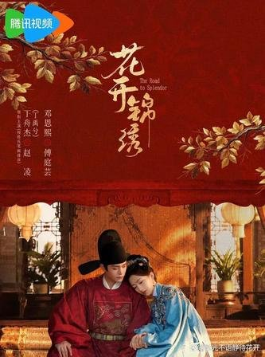

配角群像的出彩进一步稳固了口碑。温峥嵘等老戏骨加持，反派角色有动机、有挣扎，刻画了封建礼教对女性的压迫，摒弃了低级的雌竞套路。这种反套路的叙事，赢得了偏好深度内容的观众认可。

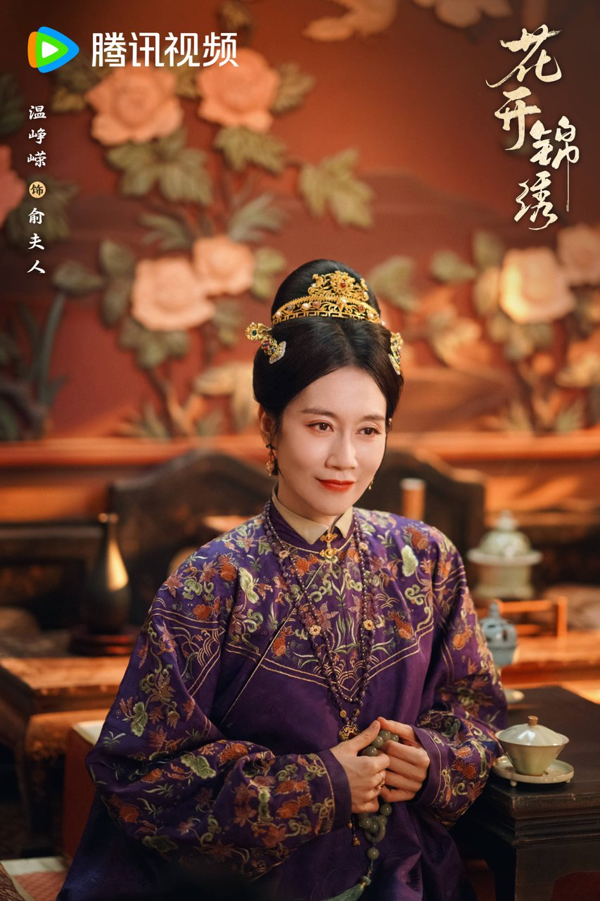

剧集融合了江南世家与西北大漠逃亡线，格局不止于闺阁争斗。这种叙事拓宽了受众面，但同时也提高了观剧门槛。然而对比数据表现，这种口碑优势并未完全转化为流量。卫视CVB收视率0.304%登顶，腾讯站内热度破25000，看似表现优异。但云合正片有效播放市占率涨幅收窄，始终未突破10%的爆款线。

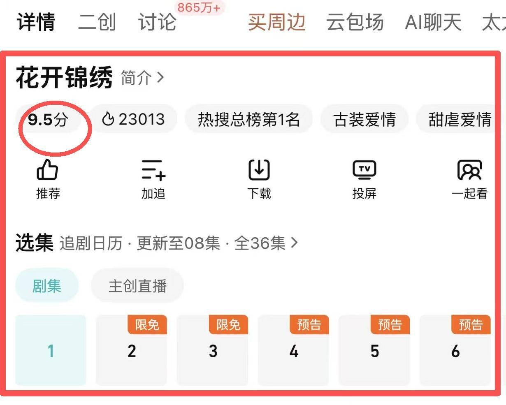

高口碑与低市占率形成明显对比，数据表现仅达到S级，未达爆款预期。卫视端的中老年观众与网络端的年轻群体存在观剧偏好差异，导致口碑底盘无法有效辐射至全网。数据表现与口碑的反差，实质上是精品质感与下沉市场之间的壁垒。

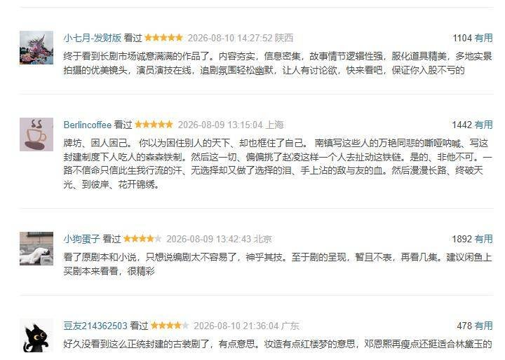

<!-- AD_ANCHOR:slot_1 -->

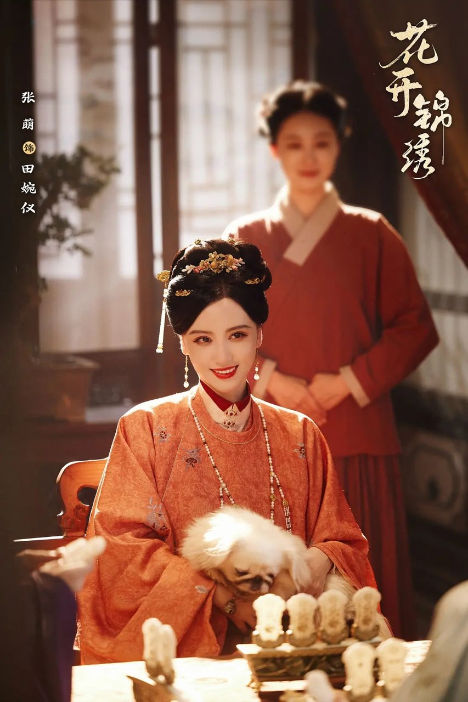

## 反转剖析：《花开锦绣》口碑分化与选角争议

表面看是质感好但数据差，实则口碑本身存在两极分化。既有赞赏反套路、不恋爱脑的观众，也有因男主演技劝退、吐槽假山假景的差评。这种分歧使得剧集难以形成统一的正向舆论场，阻碍了口碑的破圈传播。

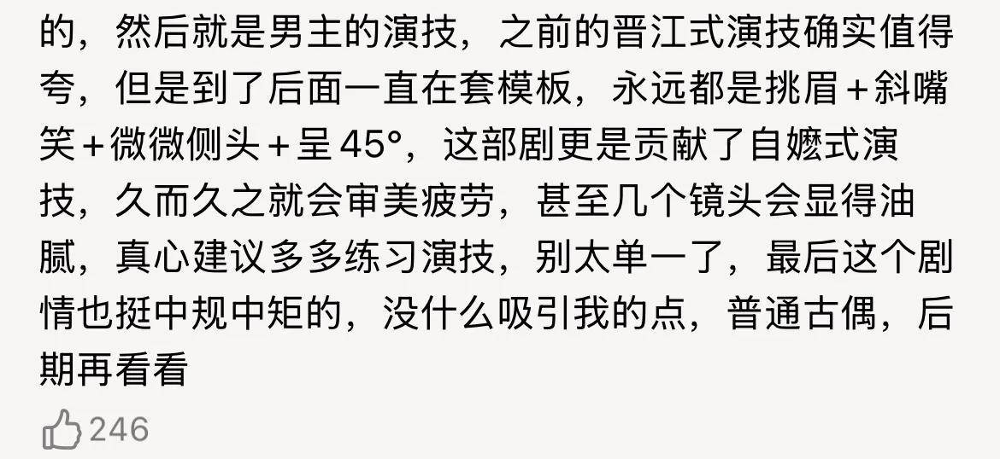

选角对热度的拖累尤为明显。作为一部大女主本位剧，女主邓恩熙缺乏足够的剧粉盘，难以撑起初始声量。男主丁禹兮的表演被部分观众指为用力过猛，神态动作容易出戏，导致部分路人被劝退。选角策略的失误在于配置错位，大女主本位剧需要演员具备足够的扛剧能力，而非单纯依赖流量。

**金句：演技好不好不是粉丝说了算，是镜头说了算，大女主剧的底盘需要能扛剧的演员来支撑。**

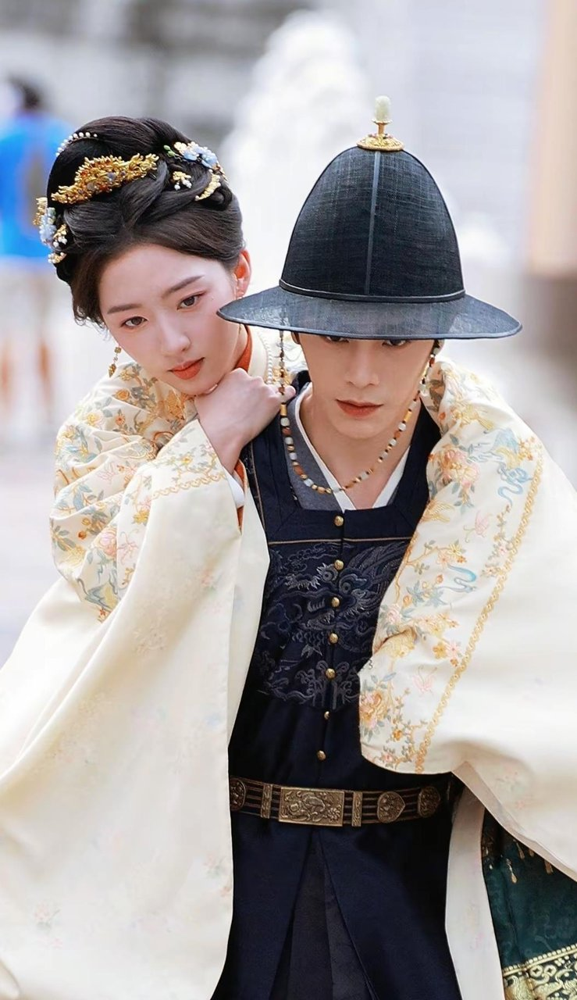

原著改编的落差感也是争议焦点。剧集将传统宅斗改为公路逃亡与盐政权谋，加快了开篇节奏，却删减了细腻的家长里短。这种改动导致原著粉流失，部分逻辑被质疑，未能稳固核心受众群。男主演技争议与女主声量不足叠加，使得剧集在开播初期就失去了吸引路人点开的初始动能。

<!-- AD_ANCHOR:slot_2 -->

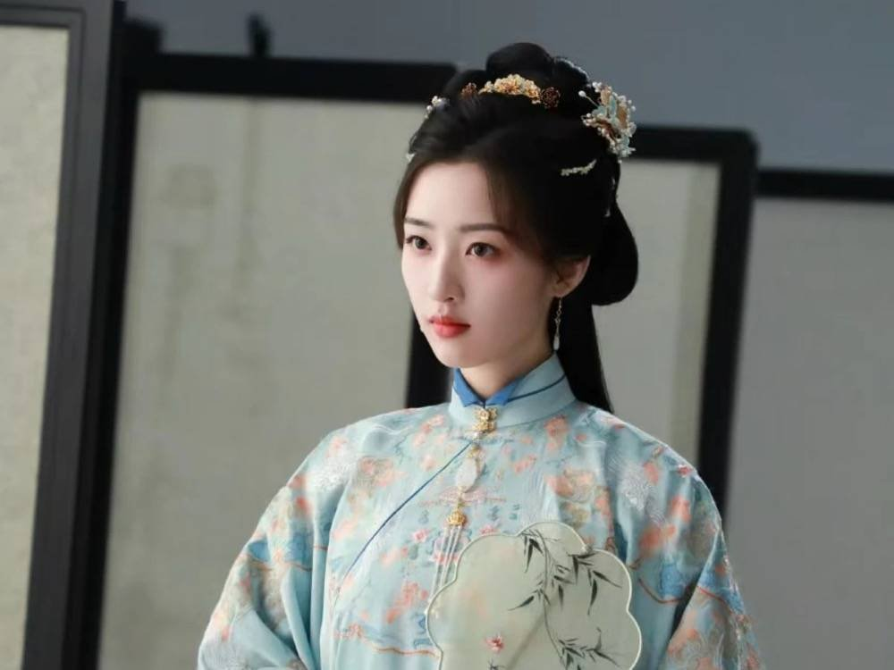

## 深层逻辑：慢热叙事与短视频时代的错位

揭示核心矛盾，写实宅斗路线前十几集铺垫人物关系，节奏偏慢。这种叙事方式难以切片化为短视频爆款片段，在流量分散的暑期档难以快速抓取眼球。短视频渠道宣发受限，使得该剧在网络讨论度上显得冷清。

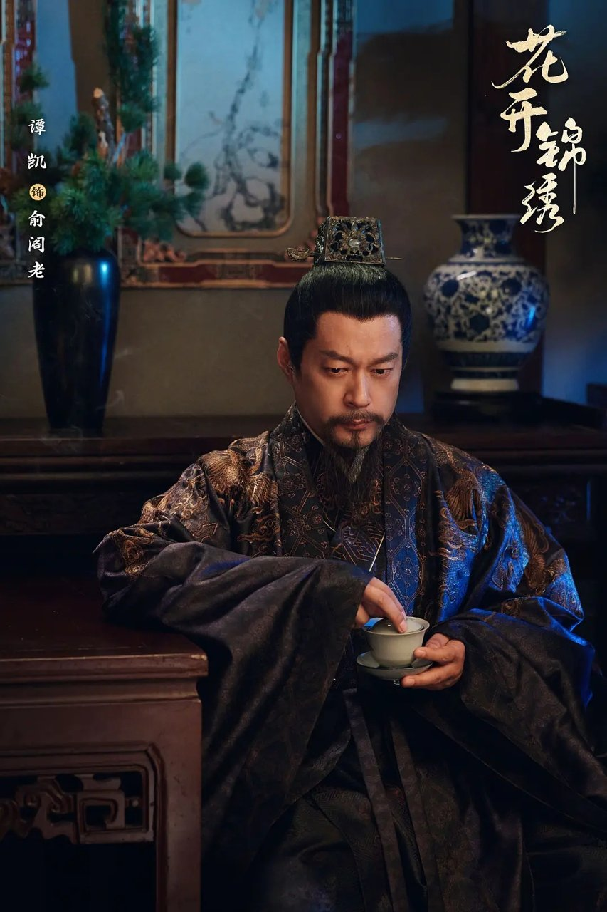

宣发策略的克制也是声量未爆的原因之一。片方未砸重金买热搜冲热度，依赖正片口碑驱动。虽然导致网络讨论度冷清，但酷云收视底盘走势平缓，无断崖下跌，说明留存率尚可。这种克制反映了片方对项目定位的清醒认知，与其砸重金买热搜换取虚假繁荣，不如依靠口碑驱动实现长尾效应。

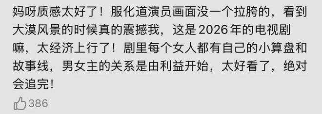

市场定位的合理性在此刻显现。核心受众为偏爱宅斗叙事的安静追剧群体，这类观众不热衷发帖刷话题。片方靠版权与会员点播收回成本，属于低风险稳收益项目。这种低风险稳收益的运营模式，或许是未来非头部IP剧集的生存之道。

未按爆款公式运营是其声量未爆的根源。在当下的市场环境中，不迎合短视频爽剧逻辑，就意味着放弃了短期的流量爆发，换取的是长尾的稳定回看。

## 结论与互动：《花开锦绣》的市场启示

《花开锦绣》的商业模型与艺术价值证明了，不迎合短视频爽剧逻辑、保持写实质感与权谋深度的古装剧依然有稳定的市场生存空间。

**金句：不应单纯以市占率论成败，市场需要允许慢热型作品的存在。**

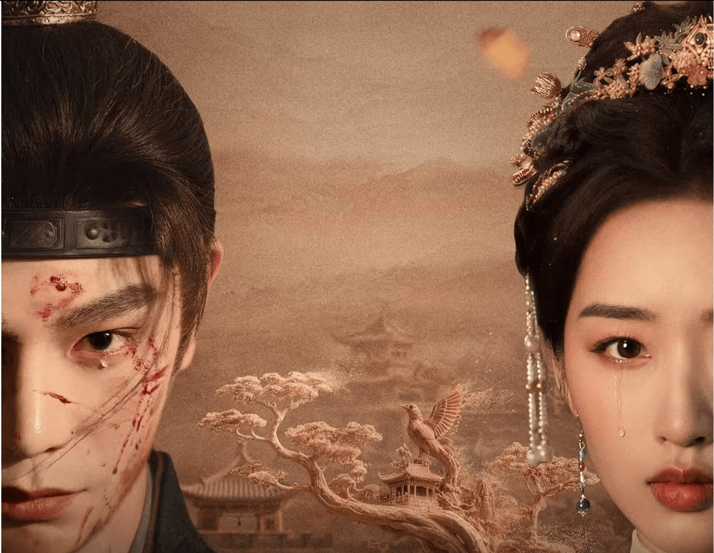

你认为《花开锦绣》没大爆，主要是因为选角声量不足，还是慢热叙事不符合当下观剧习惯？
