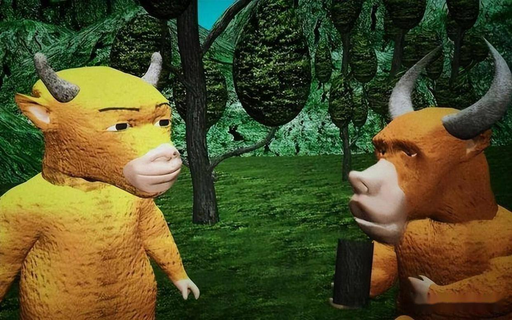
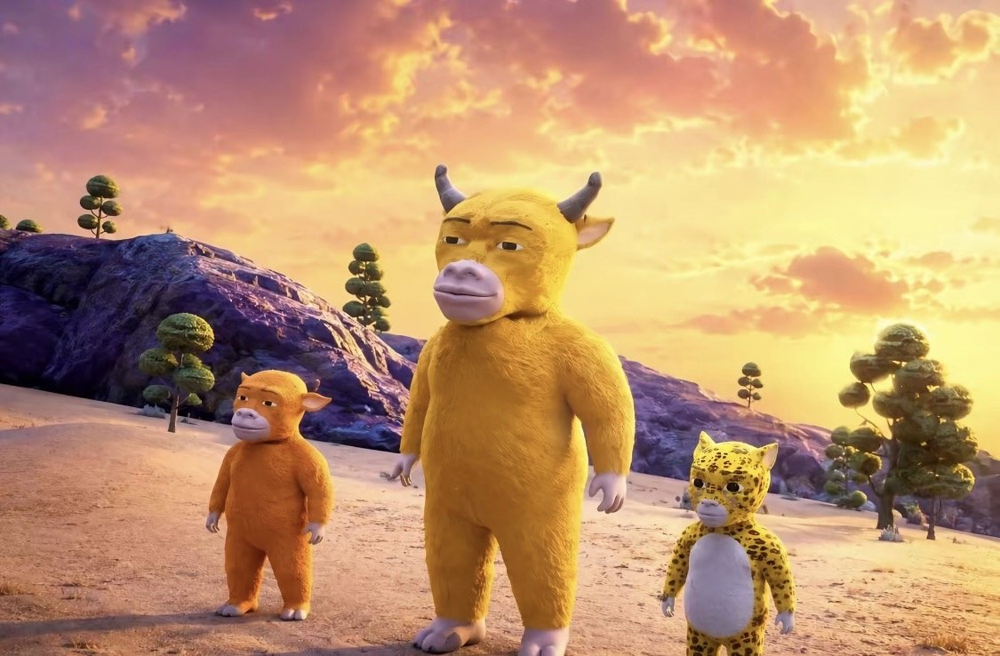
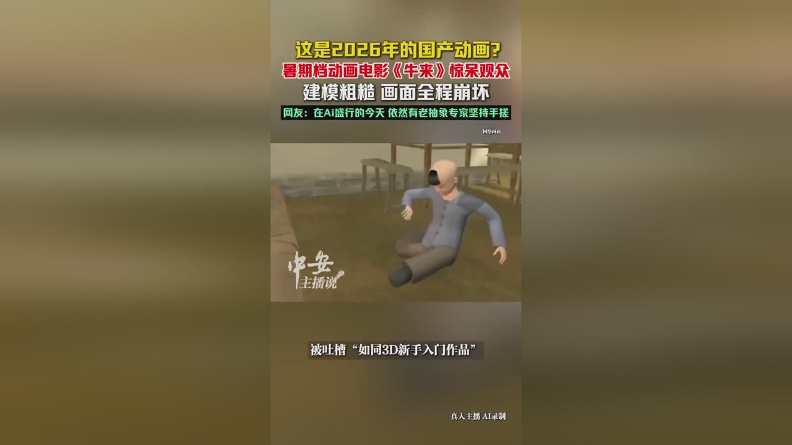

# 反讽五星救不了《牛来》，院线底线何在？

《牛来》的票房逆袭是一场互联网审丑狂欢的魔幻产物，它用荒诞的围观掩盖了其作为院线电影在视听语言和叙事逻辑上的全面溃败。作为一部登陆全国院线的商业电影，《牛来》在首映十天内仅收获七千余元票房，这本是市场对其质量的客观反馈。然而，随着“粗糙到极致”的标签在社交媒体发酵，这部影片意外迎来了单日票房暴涨的魔幻反转。这种反转并非源于影片质量的突然被认可，而是源于观众对烂片的猎奇围观。我们不能用“母子手搓五年”的苦劳或“反讽玩梗”的娱乐性，来混淆对电影质量的客观评判标准。

**金句：院线电影理应遵循基本的工业底线，任何对粗糙半成品的美化，都是对电影产业的伤害。**

院线银幕不是私人习作的展示板，当观众花钱买票走进影院，他们理应获得符合最低工业标准的产品，而不是一场被包装成“行为艺术”的灾难级视听体验。

## 视听崩坏：海报欺诈与3D建模的工业失格

映前宣传物料与正片实际画质的严重割裂，构成了对观众预期的实质性欺诈。《牛来》在上映前采取了“隐身式上映”的策略，全程零宣发，仅对外公布了一张质感细腻、韵味十足的水墨国风海报。这张海报向观众承诺了一部具有东方美学的动画电影。然而，当观众买票落座后，想象中的水墨国风荡然无存，取而代之的是灾难级水准的画质。

3D建模简陋扭曲，人物动作僵硬卡顿，整体画面廉价且刺眼，被网友精准嘲讽为“4399画质”。在AI生成技术已经普及的今天，随便一位网友用AI生成的动画，其精细度和流畅度都能轻易碾压这部耗时五年“手搓”的作品。这种视觉呈现，连最低的动画工业流水线标准都未达到。有观众甚至吐槽其画面“怕是连AI都生成不出来”，这绝非夸张的修辞，而是对影片技术层面的真实写照。

画面崩坏、频繁穿模，这些在专业动画制作中会被视为严重事故的缺陷，在《牛来》中却成了常态。将这样的半成品推向院线，是对观众视觉耐受度的一次极端测试。

## 叙事空洞：逻辑断裂下的伪成长寓言

如果说视听语言的崩坏还能被“抽象艺术”的借口勉强遮掩，那么叙事层面的空洞则是无法辩驳的硬伤。影片试图讲述一头名叫“牛来”的小牛在草原上带着云雀进入梦境，并在梦中学会成长与担当的故事。然而，整部影片的剧情推进毫无逻辑关联，立意极其模糊。梦境与现实之间的切换生硬且缺乏目的性，观众看完后只觉得大脑空白、不知所云。

86分钟的院线叙事体量，需要完整的故事起承转合和人物弧光来支撑。但《牛来》的剧情推进更像是一个个毫无关联的片段拼凑，既无戏剧张力，也无情感共鸣。台词尴尬且缺乏感染力，连最基本的字幕错别字都未进行校对。这种对文本创作的敷衍，暴露出主创在编剧能力上的严重缺失。

**金句：电影是视听语言的艺术，更是叙事的艺术，没有逻辑支撑的画面堆砌，只是一场漫长的PPT放映。**

观影体验的空洞乏味，让观众在放映厅里如坐针毡。所谓的成长寓言，在没有扎实剧本支撑的情况下，成了一具空有其表的骨架，完全无法打动人心。

## 舆情反转：反讽五星与“解压治愈”的逻辑谬误

随着《牛来》的出圈，豆瓣涌现了大量五星好评，但这绝非对作品质量的真诚认可，而是一场互联网玩梗式反讽。这些被称为“国产动画里程碑”“后现代抽象神作”的高赞评论，本质是看热闹的戏谑。真实看过影片的观众，主流评价仍是一星差评，集中吐槽其建模粗糙、剧情空洞。评论区两极分化的观感，正是“真实差评”与“反讽五星”混合后的魔幻效果。

这种审丑狂欢消解了电影评价的严肃性。更荒谬的是，有声音试图用“解压治愈”和“抽象艺术”来为影片辩护。所谓能让大人小孩开怀大笑，并非源于电影的喜剧设计，而是对粗糙制作的嘲笑。将对烂片的猎奇围观包装成“治愈”，是本末倒置的逻辑谬误。如果一部电影的价值仅仅在于提供笑料供人嘲讽，那它更应该存在于短视频平台，而非占据院线排片。

面对这种让人大脑空白的院线烂片，确实需要备点饮品才能撑过全程，囤几罐冰镇啤酒，至少能在剧情无聊时找点真实的慰藉。
<!-- AD_ANCHOR:slot_1 -->

与其在影院看粗糙建模受气，不如捏捏手里这种能带来真实触感的解压小玩具，至少不费眼睛还能缓解情绪。
<!-- AD_ANCHOR:slot_2 -->

观众花钱买票是为了获得优质的视听享受或情感共鸣，而不是为了参与一场互联网的群体性玩梗。把荒诞当艺术，把粗糙当真诚，这种辩护逻辑不仅苍白，更是对认真做电影的创作者的嘲讽。

## 结论反思：个体努力不能成为降低院线标准的借口

必须承认，导演信雨萌与60后母亲孙丽芳耗时五年、依靠两台家用电脑“手搓”完成一部动画电影，这份坚持与苦劳确实令人动容。官方在出圈后虚心纳谏的态度也显得诚恳。但私人习作与院线商品有本质区别。电影工业化不仅意味着技术的精进，更代表着对观众负责的契约精神。将一部连错别字都未校对、画质未达标的粗糙半成品推向院线，本质上是对市场资源的挤占。

院线排片是有限的公共资源，当《牛来》凭借猎奇热度占据银幕，甚至排片率超过同档期成熟商业片时，这意味着其他更用心的作品被挤出了市场。这种劣币驱逐良币的现象，不应被鼓励和美化。官方将影片定义为“粗糙、稚嫩的个体尝试”，这恰恰证明了它不具备登陆院线的资格。

**金句：个体的努力值得尊重，但绝不能成为降低院线标准的借口，否则电影市场的底线将一退再退。**

我们同情普通人的追梦艰辛，但电影市场的健康生态需要客观的评判标准来维护。如果“烂”可以成为卖点并收割票房，那才是对真正电影工业的降维打击。对于《牛来》占据院线排片，你认为这是“审丑狂欢的闹剧”还是“真诚追梦的特例”？
