# 神行者8的科技底色，不止于路虎的复活

神行者8并非对路虎品牌的简单复刻，而是一个将传统豪华越野底盘底蕴与中国顶尖新能源智能化技术深度融合的科技样本。长期以来，汽车市场存在一种惯性认知，认为“硬派越野”与“高阶智驾/智能座舱”是互斥的。越野强调机械素质与硬件可靠性，而智驾高度依赖电子电气架构与传感器。神行者8试图用**896线激光雷达**、**高通骁龙8397芯片**和**i-ATS智能全地形系统**构建全场景的硬核技术壁垒，打破这种二元对立。

这种融合路线，本质上是对车辆感知与执行系统的重新定义。它不再将公路与越野视为割裂的场景，而是试图用统一的算力与感知硬件去覆盖。从官方公布的预售信息来看，这种技术路径的落地，展现了传统豪华基因与中国硬科技结合的潜力。

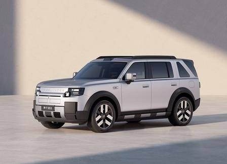

**金句：真正的科技豪华，不是配置的简单堆砌，而是底层架构的全面重构。**

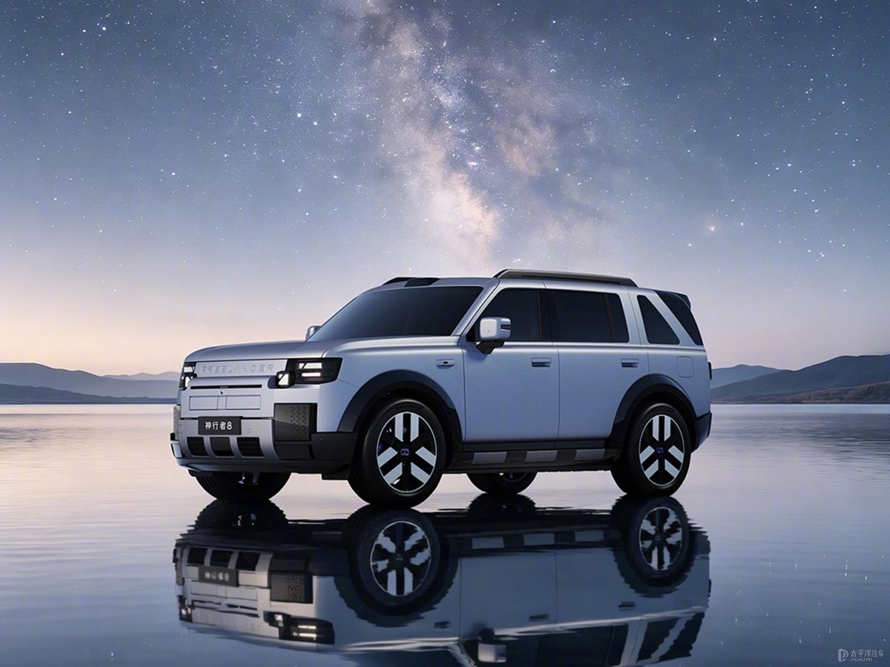

## 神行者8硬件底座：896线雷达与8397芯片的算力跃升

神行者8在硬件底座上的投入呈现出明显的代际跨越特征。据官方数据，全系标配的高通骁龙8397车规级芯片，相较上一代8295平台，CPU算力提升3倍，GPU算力提升近3倍，NPU算力更是实现12倍跃升，综合算力达到320 TOPS。这一参数跃升直接体现在座舱体验上，它支撑了46.3英寸8K Mini LED远端屏与虚幻引擎5.6的流畅渲染。

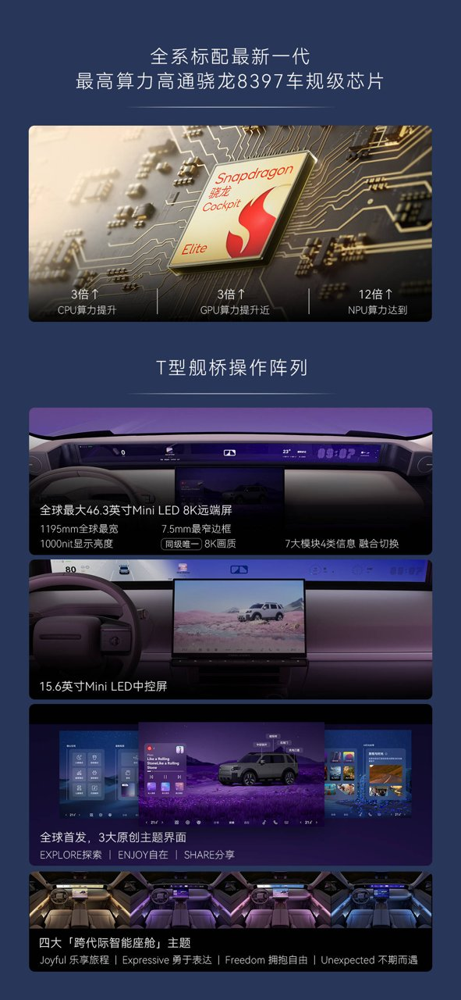

车机“越用越卡”是行业长期存在的痛点，其核心原因在于算力冗余不足。8397芯片的算力储备，本质上是为车辆在生命周期内的持续流畅提供硬件保障。在导航、影音与娱乐多任务并行的场景下，充足算力能确保系统不降级，也为后续端侧大模型运行和OTA升级预留了空间。

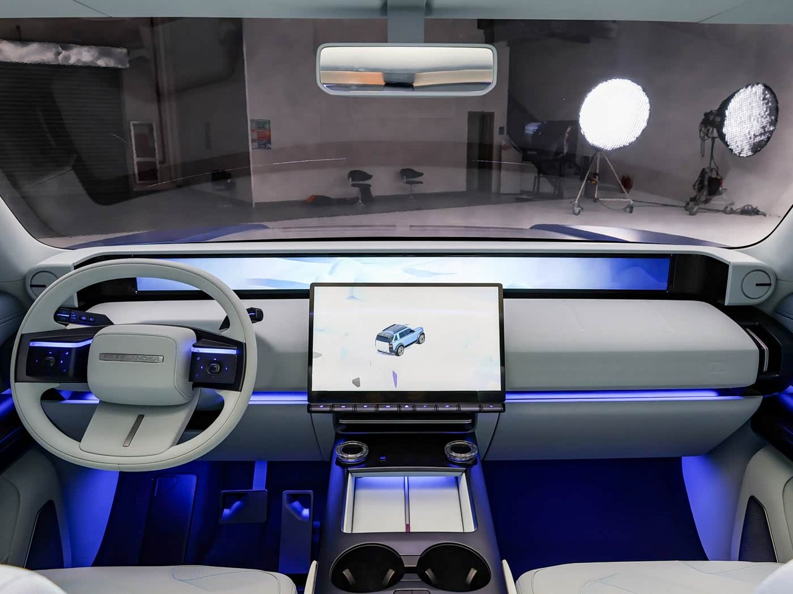

在感知硬件层面，超阶版配备的896线双光路激光雷达与dToF后固态激光雷达，构建了远超行业主流的感知精度。目前行业主流多为128线或192线，896线直接提升了数倍分辨率。最远120米识别14厘米物体，后向最小识别精度达3厘米。

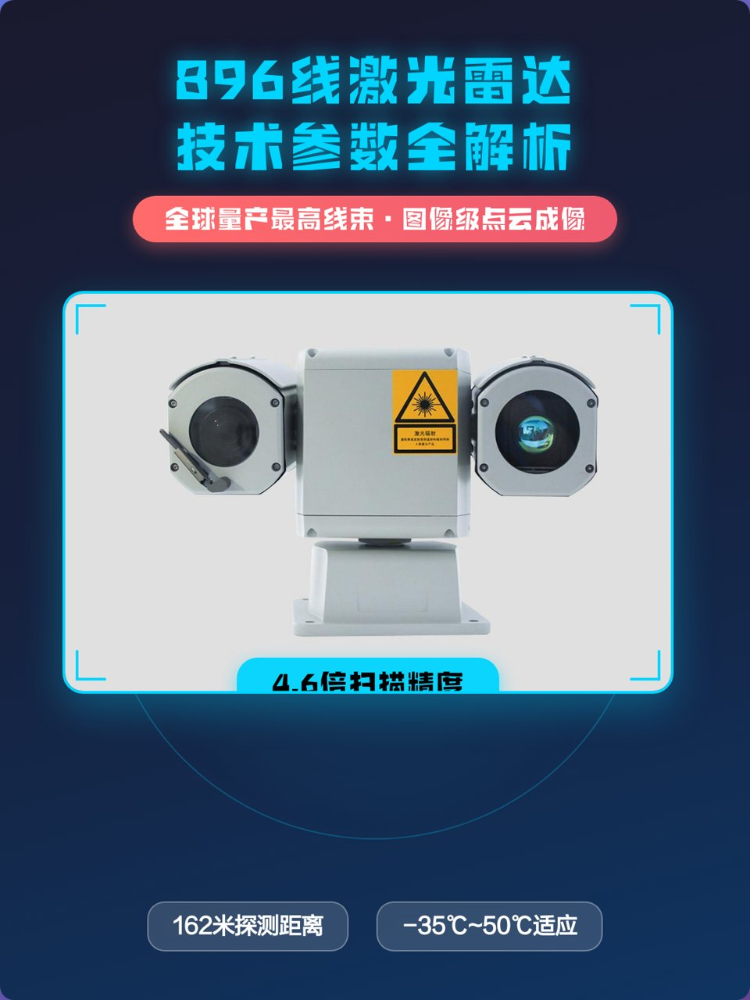

这种精度的提升并非单纯的参数游戏，而是为复杂路况下的安全冗余提供了物理基础。高线束雷达意味着更密集的点云，系统能更早地发现路面的小型障碍物或复杂地形细节。硬件的代际跨越，是智驾能力升维的前提条件。

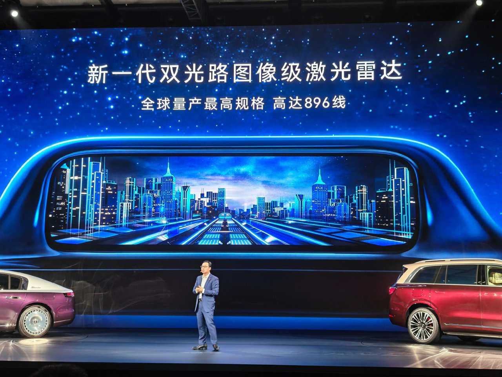

## 神行者8场景融合：华为乾崑智驾与i-ATS的协同

在软件与场景协同层面，神行者8全系标配华为乾崑智驾ADS 5，通过分层布局实现不同版本的智驾能力。增强版高速NCA平均不干预里程超1500公里，城区NCA端到端时延降低50%。智驾体验的核心在于通行效率与平顺性，时延的降低意味着系统处理复杂路况的反应更快，减少了急刹或顿挫的割裂感，展现出更接近老司机的通行逻辑。

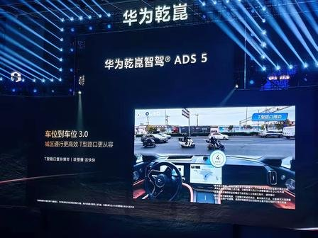

长途自驾难免遇到服务区间隔较远或餐饮不合口味的情况。在车内备上一些开袋即食的新鲜甜玉米或粗粮零食，既能垫垫肚子，又比传统膨化食品更健康。

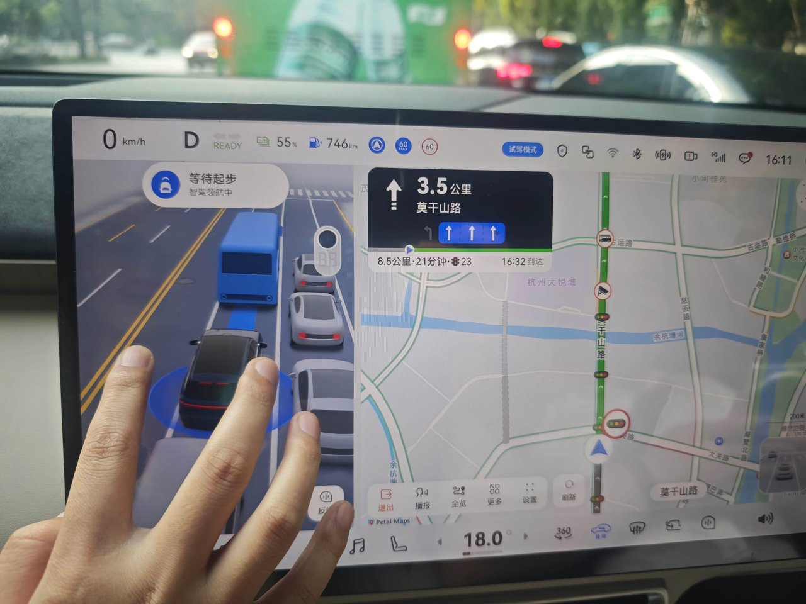

<!-- AD_ANCHOR:slot_2 -->

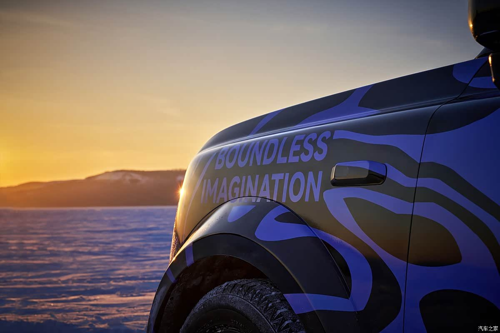

在越野场景下，i-ATS智能全地形系统利用896线激光雷达与双目摄像头，在0.2秒内完成地形识别与九种模式切换。全系标配三把锁（前机械、中数字、后e-LSD）与双腔闭式空悬，实现100%爬坡与900mm涉水深度。传统越野高度依赖驾驶者的经验判断，何时挂锁、选择哪种模式都需要人工介入。

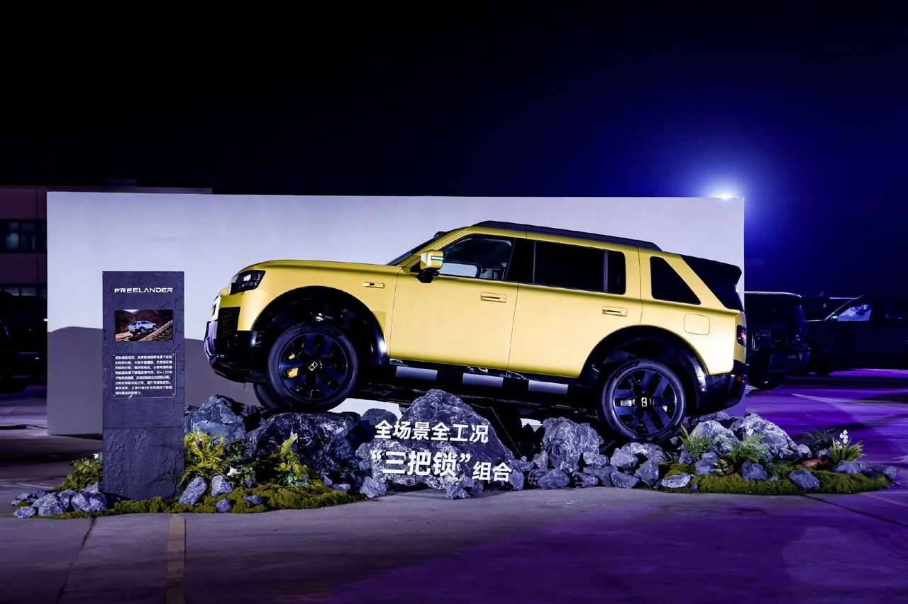

i-ATS的价值在于将这种经验转化为自动化的智能响应。底盘与感知硬件的协同，让极限脱困变得更有确定性。系统通过预瞄功能提前调节减振系统，将原本依赖驾驶者直觉的操作，转化为系统主动介入的标准化流程，降低了越野门槛。

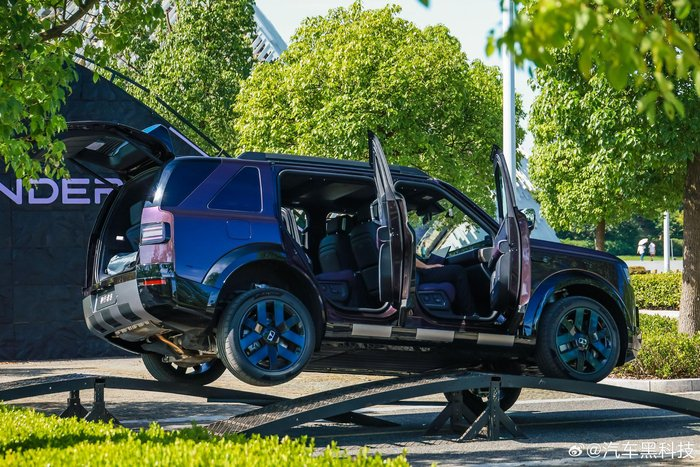

## 神行者8技术重构：打破越野与智驾互斥的惯性认知

传统越野车往往重机械轻智能，认为在非铺装路面下，高阶智驾的电子系统作用有限，甚至可能因为复杂的传感器在恶劣环境下失效而成为不可控因素。这种认知导致了越野车在智能化进程上的相对滞后。

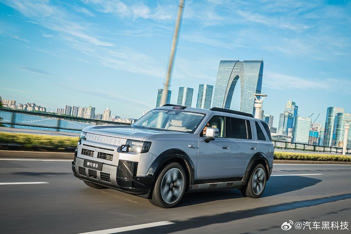

神行者8的技术反转在于，它将智驾感知硬件直接服务于越野脱困。896线雷达不仅用于城区NOA，更成为i-ATS系统的“眼睛”。感知硬件在公路上负责安全预警与领航，在越野时则负责地形建模与模式识别。

**金句：打破场景壁垒的关键，不在于叠加功能，而在于感知硬件的底层复用。**

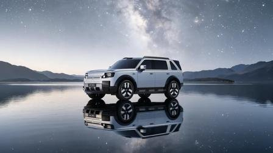

这种复用重构了硬派越野的技术路径。一套硬件兼顾两种场景，不仅提升了整车硬件的利用率，也降低了系统复杂度带来的潜在冲突。它表明，智能化并非只能服务于公路巡航，同样可以成为极限越野的辅助工具。

## 神行者8价值审视：重塑豪华SUV科技标准

神行者8全系标配156项核心配置，包含800V高压平台、双腔空悬等，预售33.99万起。将高阶科技硬件转化为标配普惠，重新定义了该级别SUV的科技门槛。这种做法降低了用户的选择成本，也体现了供应链整合能力。

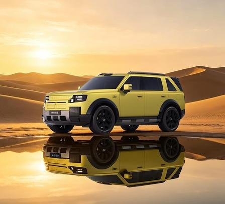

周末带全家去郊外放松，一趟舒适的家庭自驾温泉游能极大缓解一周的疲惫。选个环境好的度假村住上两晚，是提升生活幸福感的好方式。

<!-- AD_ANCHOR:slot_1 -->

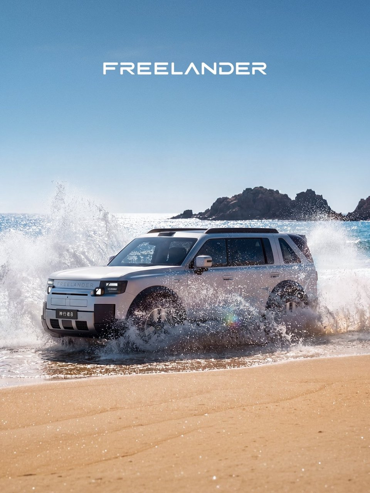

客观来看，神行者8展现的融合路线，对行业“越野与智驾互斥”痛点具有建设性启示。它证明了传统豪华基因与中国新能源硬科技结合的可行性，为豪华SUV市场提供了一个将机械底蕴与智能化对等融合的样本。

在硬派越野车上，你是更看重极致的机械越野素质，还是高阶智驾与智能座舱的融合体验？
