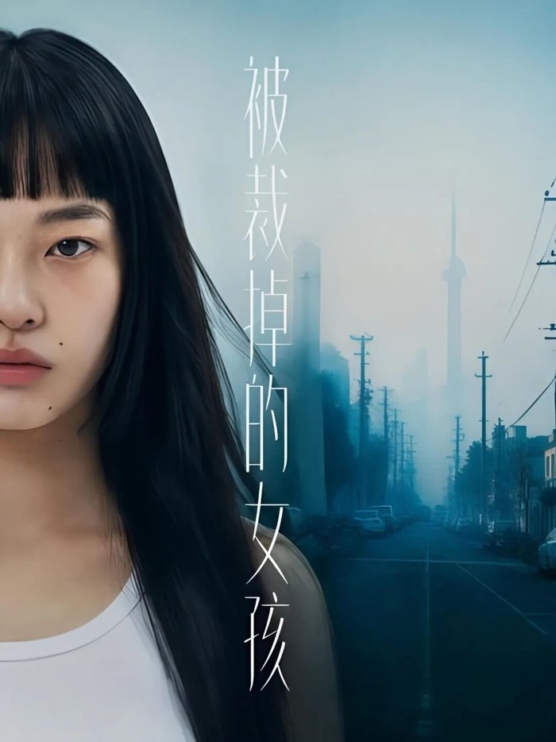
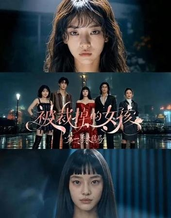
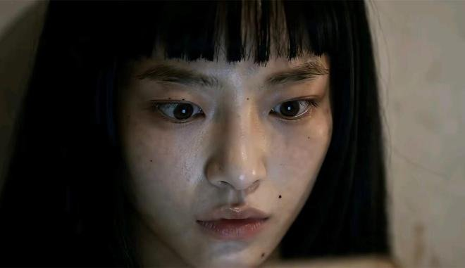
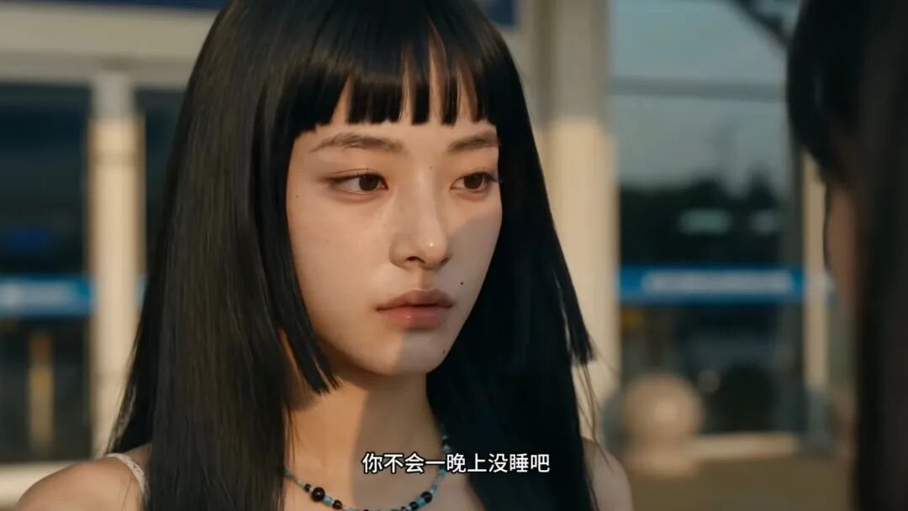
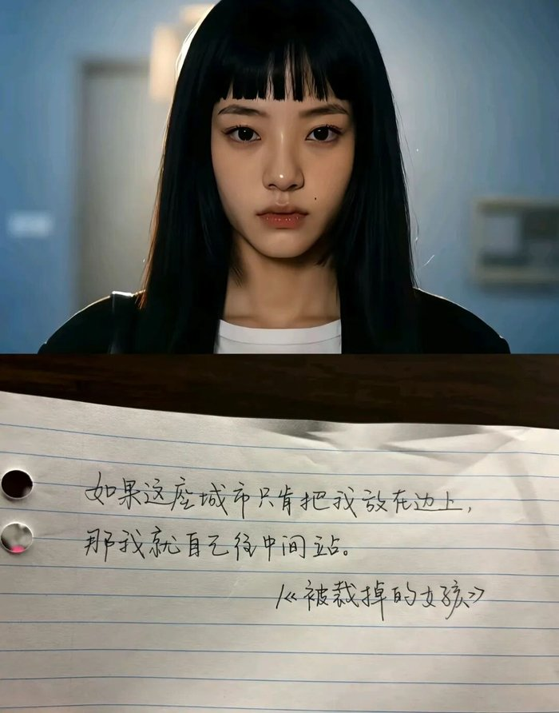
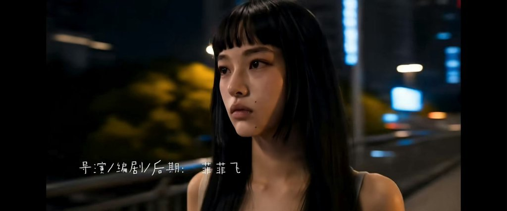
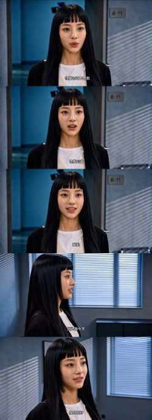
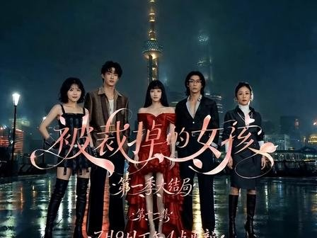
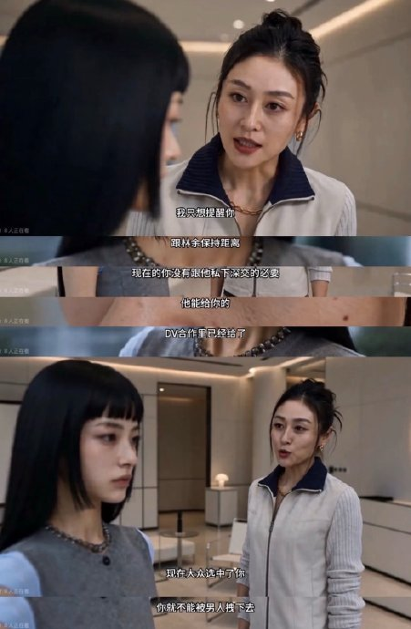
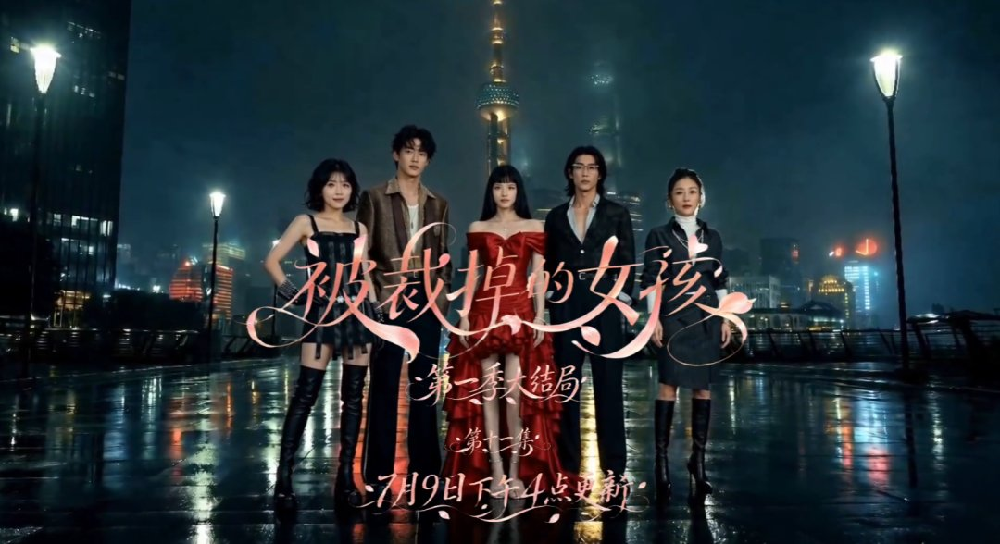

# 《被裁掉的女孩》破2亿播放，赢在写实共情

## 核心判断
《被裁掉的女孩》单平台播放量突破2亿，其破圈的核心密码绝非AI技术的猎奇噱头，而是对当代职场困境的精准捕捉与写实呈现。

在流水线霸总甜宠泛滥的短剧市场里，大量作品沉迷于制造虚幻的爽感，用金手指和天降财富麻痹观众的神经。这部剧却反其道而行之，用不悬浮的现实刻画证明，真诚的共情才是内容突围的唯一捷径。

**金句：观众买单的从来不是多高精尖的生成技术，而是屏幕里那个在酒局上赔笑、在合租屋里抹眼泪的自己。**

当方桃子的遭遇与千万打工人的真实处境重叠，播放量的攀升便成了某种必然的群体宣泄。在算法横行的时代，唯有真诚的现实刻画能刺穿信息茧房的壁垒。

## 证据一：《被裁掉的女孩》瑕疵感建模打破AI恐怖谷
传统AI角色往往追求极致的完美，无暇的肌肤、精准的五官比例，却往往陷入令人毛骨悚然的“恐怖谷效应”。这种完美剥离了生活气息，让数字人更像是橱窗里的假模特。而《被裁掉的女孩》在建模逻辑上完成了一次审美纠偏。

女主方桃子的脸上带着法令纹，甚至有细微的雀斑。这种视觉层面的“去完美化”处理，赋予了数字角色罕见的活人感与真实生命力。观众看到的不是一个冷冰冰的建模脸，而是一个会在疲惫时显出老态、会在强光下暴露皮肤瑕疵的普通女孩。瑕疵不仅没有削弱美感，反而成为角色可信度的基石。

正是这些看似不完美的细节，为观众建立了初步的信任，使后续的情感代入成为可能。当角色不再是高高在上的完美符号，观众才愿意将自己的情感投射到她身上。

<!-- AD_ANCHOR:slot_2 -->

## 证据二：不悬浮的职场镜像直击打工人痛点
这部剧最狠的一刀，是彻底摒弃了天降总裁与金手指的爽文套路。镜头老老实实地记录下小镇女孩方桃子在职场边缘化中的狼狈与坚韧：挤在逼仄的合租屋里，在酒局上被迫应付应酬，遭遇经纪人压榨克扣酬劳。

这种不加滤镜的现实刻画，精准映射了当代打工人的集体焦虑。当女主面对不公不靠走捷径换资源，而是咬着牙自学提升能力时，单部剧集的观看行为便升华为群体共鸣。剧名里的“被裁掉”，不仅指代同行修图时恶意抹掉的戏份，更暗喻了普通人在职场随时被优化淘汰的生存困境。

对比当下满屏悬浮豪门恋爱的短剧，这种将镜头对准底层打拼狼狈的叙事，瞬间拉近了和观众的距离。它没有制造虚假的胜利，而是呈现了真实的挣扎，这正是其能戳中亿万打工人泪点的核心原因。

<!-- AD_ANCHOR:slot_1 -->

## 反转：AI技术退居幕后，《被裁掉的女孩》情感共鸣前置
大众对AI影视的预期，往往停留在技术炫技层面——更逼真的物理引擎、更宏大的视觉奇观。但《被裁掉的女孩》却做出了一个极具魄力的反转：让技术隐退为放大情感张力的底层工具。

在这里，AI不再是喧宾夺主的卖点，而是化作了无形的笔触，去勾勒女主每一次微表情里的不甘与倔强。制作团队没有刻意炫耀生成能力，而是将精力投入到场景、光比与色彩搭配的精细打磨中，让画面服务于叙事。这一预期反转实现了从视觉奇观向情感共鸣的跨越。

**金句：技术永远只是表达的画笔，真正能让作品立住的，是它所描绘的人性底色。**

当观众为方桃子的遭遇落泪时，没有人会在意这是不是AI生成的画面，因为那份痛感是真实的。这证明了在影视创作中，技术应服务于内容而非喧宾夺主，一旦技术成为主角，情感的浓度就会被稀释。

## 结论：真诚是AI短剧创作的底色
《被裁掉的女孩》以2亿播放量验证了写实主义的巨大势能。它不仅仅是一部技术实验性的AI短剧，更是一面折射社会现实与女性生存状态的镜像。它撕开了职场生存的温情面纱，将普通人的困境赤裸裸地展现在观众面前。

无论生成式技术如何迭代，尊重现实逻辑、关照女性真实成长轨迹的内容，永远具有不可替代的生命力。技术的进步降低了制作的门槛，但也倒逼创作者回归内容本身。当所有人都能用AI生成精美画面时，比拼的就只剩下对现实的洞察力与共情力。

**金句：在AI能批量制造完美的未来，不完美的真实反而成了最稀缺的奢侈品。**

那么，你认为AI技术的加入，是让影视创作更真实了，还是更虚幻了？
