# 《冰湖重生》对比《楚乔传》叙事格局为何转向

《冰湖重生》与《楚乔传》在叙事内核上存在结构性差异，续作将主线从“释奴止戈”的家国大义转向了失忆、复仇与多角恋纠葛。这种从“乱世史诗”到“个人情仇”的叙事重心偏移，是续作为闭环前作剧情而做出的创作选择，客观上导致了故事格局的变化。尽管精神内核发生转向，但续作在40集体量内尝试串联完整的复仇与救赎弧光，依然保持了古偶的基本张力。
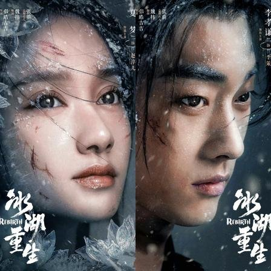

续作的叙事重心偏移，本质上是创作端在剧情闭环与独立立意之间做出的妥协。续作没有单纯复刻前作的宏大命题，而是试图在情感层面上为前作的悬念画上句号。这种转向虽然让部分观众觉得格局收窄，但也为剧集赋予了不同的叙事驱动力。在40集的篇幅里，主创团队试图用更集中的情感冲突来推动剧情，这在古偶剧的框架内是一种求稳且合理的策略。
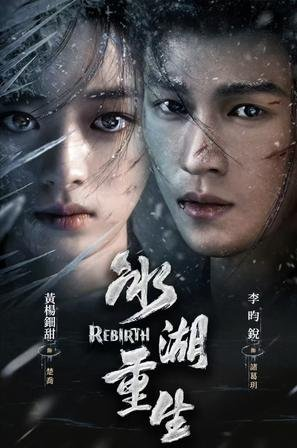

## 核心剧情差异：从“释奴止戈”到“复仇寻爱”的转向

回顾《楚乔传》的剧情根基，楚乔从奴籍少女成长为秀丽王，其信仰是反抗阶级压迫与守护苍生，具备独立大女主的叙事格局。前作中，楚乔在九幽台和红川城血战等事件中展现出的坚韧，构筑了“释奴止戈”的精神底色，角色的驱动力来源于对苍生命运的关切。

拆解《冰湖重生》主线设定，剧情以冰湖坠亡为起点，楚乔获救后误认诸葛玥已死，主线转向刺杀燕洵复仇与寻找诸葛玥。续作试图为前作冰湖一战的意难平提供解答，楚乔的行动轨迹从宏观的家国平权，收束到了具体的个人恩怨与情感寻找上。
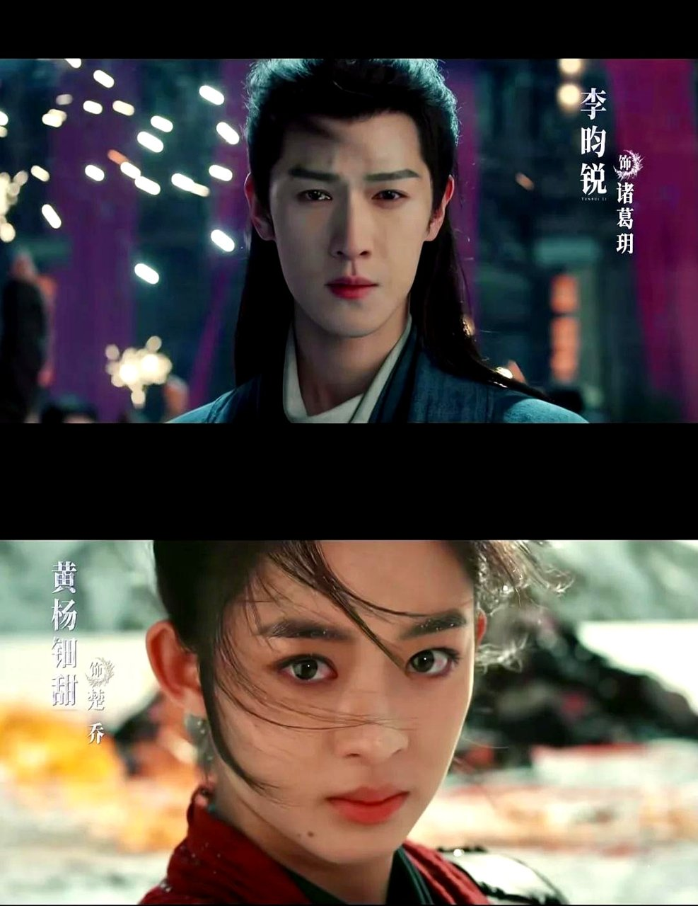

对比两者精神内核，续作为闭环前作意难平，给楚乔套上“失忆”设定，将重心放在个人情仇上，剧情重心发生根本性偏移。这种设定虽然让角色的情感纠葛更加集中，但也使得前作中那个心怀天下的女性领袖，在续作中更多展现出被个人情感驱动的状态。从“释奴止戈”到“复仇寻爱”，续作在剧情串联上完成了任务，但在精神延续上选择了不同的路径。
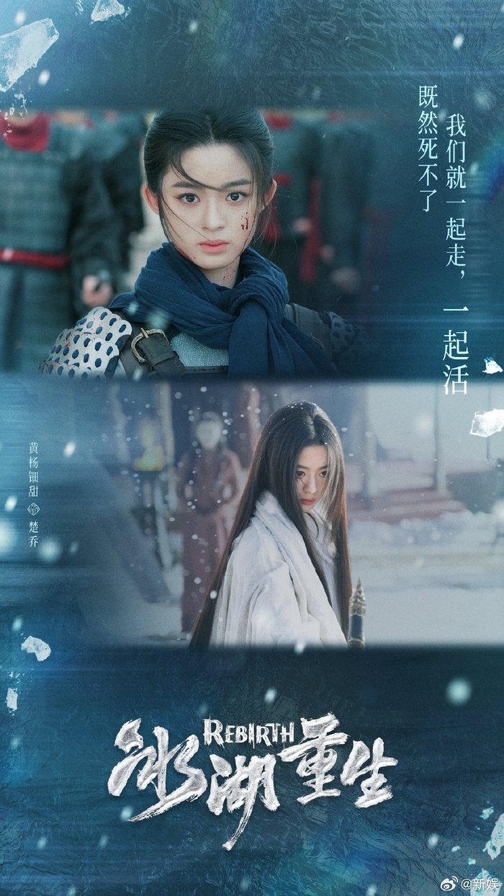

## 人物动机与行为逻辑的演变

在人物动机层面，楚乔的角色变化尤为明显。从前作“我命由我不由天”的坚韧清醒，变为续作中身份切换缺乏铺垫的复仇者，角色行为的思想支撑有所减弱。续作中楚乔的身份在太后与贵妃之间切换，由于缺乏足够的前因后果交代，使得角色的行为逻辑显得不够连贯。

燕洵的异化逻辑同样值得审视。续作中燕洵逃回燕北后一意孤行攻打大夏，权力异化线有剧情交代，但动机的铺垫相较于前作九幽台的惨烈显得较为平缓。前作中九幽台的惨剧为燕洵的黑化提供了扎实的心理基础，而续作中他急于攻打大夏的执念，更多是服务于剧情冲突的需要，角色内心的挣扎刻画相对较少。
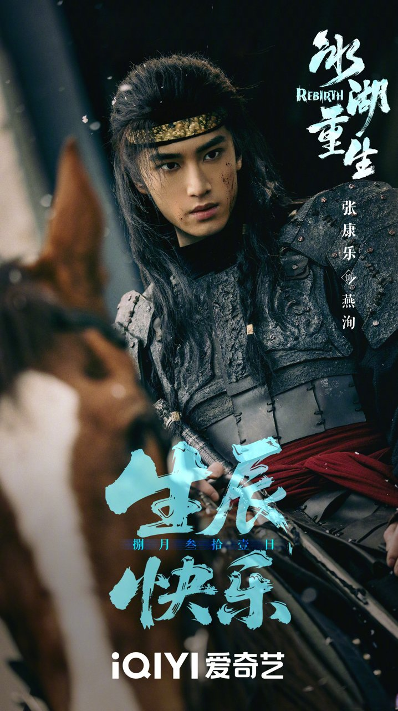

诸葛玥的蛰伏线则增加了权谋色彩。续作设定诸葛玥未死并化身神秘谋士暗中守护，这种设定为剧情增添了悬疑感。但部分角色身份转变缺乏足够的前因后果支撑，使得这条线索在逻辑闭环上仍有拓展空间。
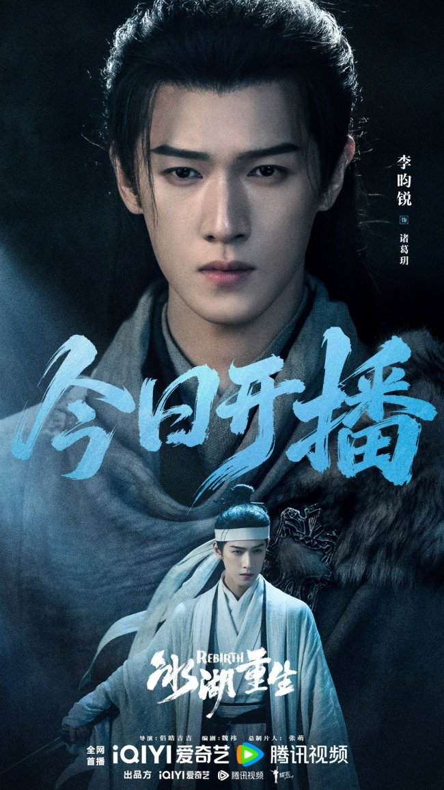

<!-- AD_ANCHOR:slot_2 -->
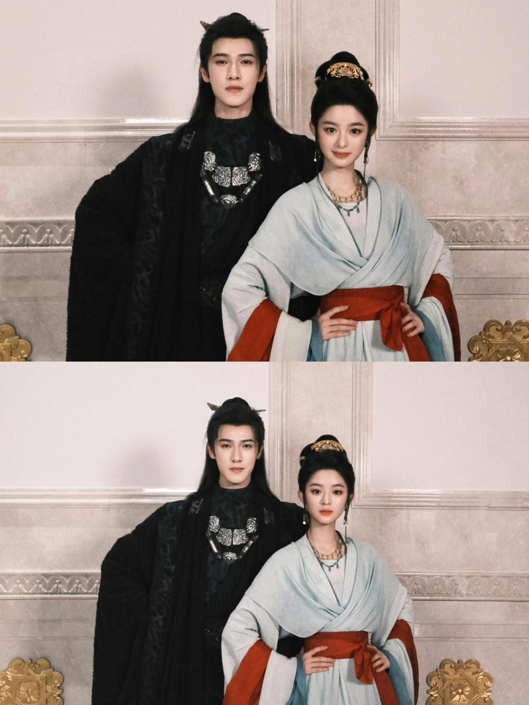

## 叙事节奏的对比分析

对比两部作品的叙事节奏，《楚乔传》以九幽台、红川城血战等密集的大事件推动剧情，权谋与成长交织，节奏紧凑且充满史诗感。前作通过不断升级的外部冲突，将楚乔推向命运的选择点，叙事张力层层递进。

《冰湖重生》在节奏把控上则呈现出不同的面貌。续作采用复仇、寻爱、救赎多线交织，部分情节如打戏慢镜头和频繁的身份切换影响了叙事流畅度。在一些关键的动作戏份中，过度的慢镜头处理削弱了打斗的紧凑感，而频繁的身份更迭也让观众的注意力被分散，难以聚焦于核心冲突。
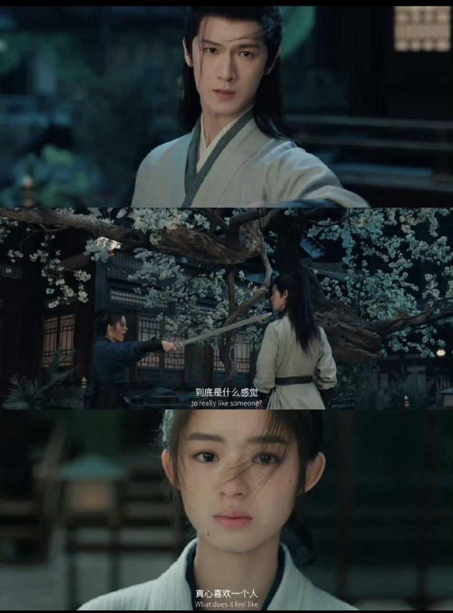

**金句：叙事节奏的失衡往往源于多线并行的贪心，试图面面俱到反而容易顾此失彼。**

客观审视续作节奏亮点，尽管重心偏移，但续作部分权谋与利益捆绑的成人叙事桥段，依然保持了古偶的基本张力。剧中对于“成年人世界最牢固的是利益捆绑”的探讨，为权谋戏份增添了一抹现实主义色彩，这种成人视角的叙事尝试，在一定程度上弥补了节奏上的瑕疵。
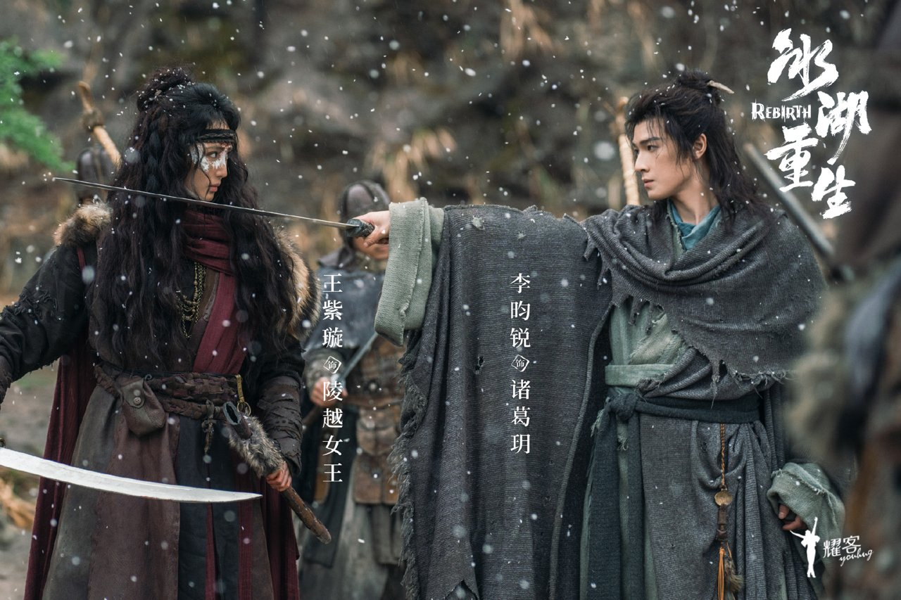

<!-- AD_ANCHOR:slot_1 -->
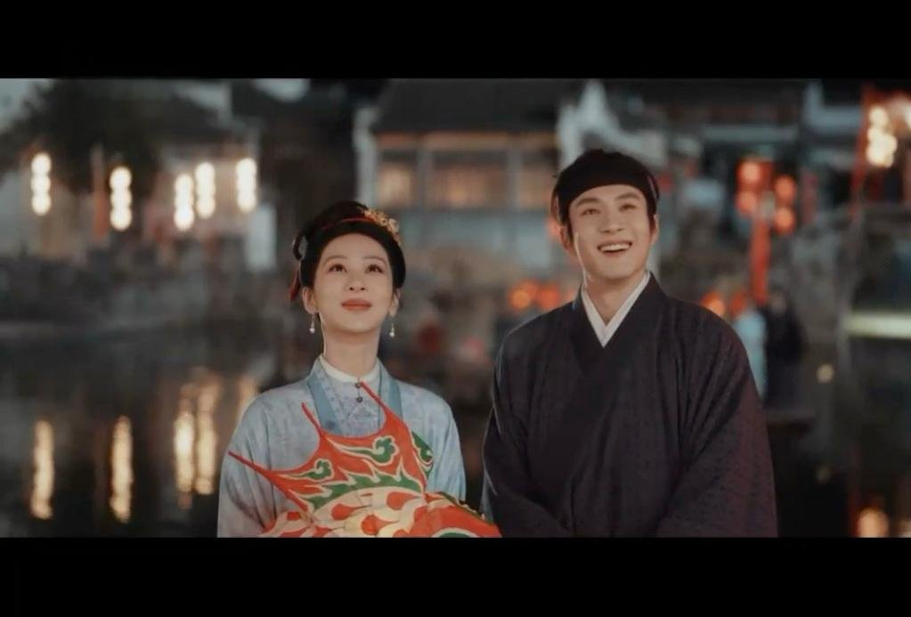

## 续作创作选择的客观评价

肯定续作在剧情闭环上的努力，尝试为观众九年的意难平画上句号，将个人情仇融入乱世权谋，完成了故事层面的续写。续作没有回避前作留下的悬念，而是正面迎接了填坑的挑战，这种创作态度值得肯定。在40集的体量内，它努力将前作遗留的线索收束，给观众一个交代。
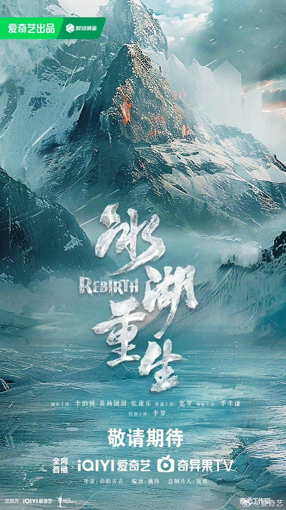

审视创作选择的取舍，为迎合情感闭环而调整前作精神内核，导致作品在思想价值的独立性上有所欠缺。续作为了完成情感闭环，在一定程度上牺牲了前作“释奴止戈”的宏大立意，使得楚乔的角色弧光更多停留在个人情感的圆满上，未能在家国大义的层面继续深化。
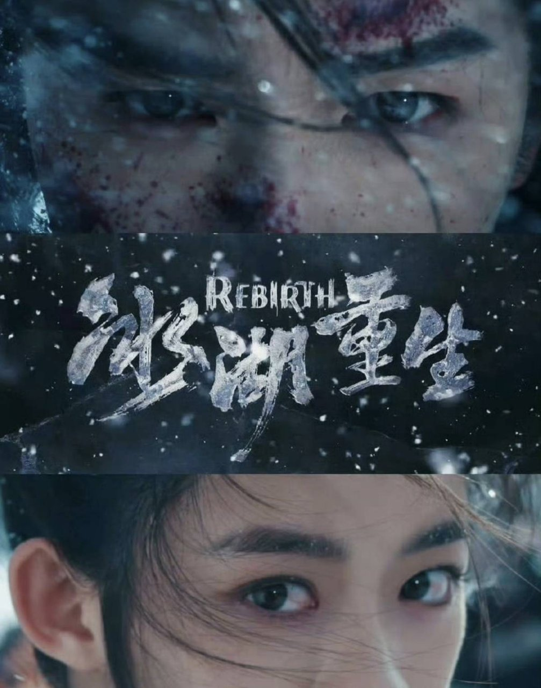

客观评价续作价值，续作在尝试串联完整复仇与救赎弧光的过程中，展现了古偶剧在情感闭环与叙事拓展上的探索。它试图在满足观众情感诉求与推进新故事之间寻找平衡，这种探索本身是有意义的。尽管结果未必完美，但它为古偶续作如何处理前作遗留问题提供了一个可供分析的样本。
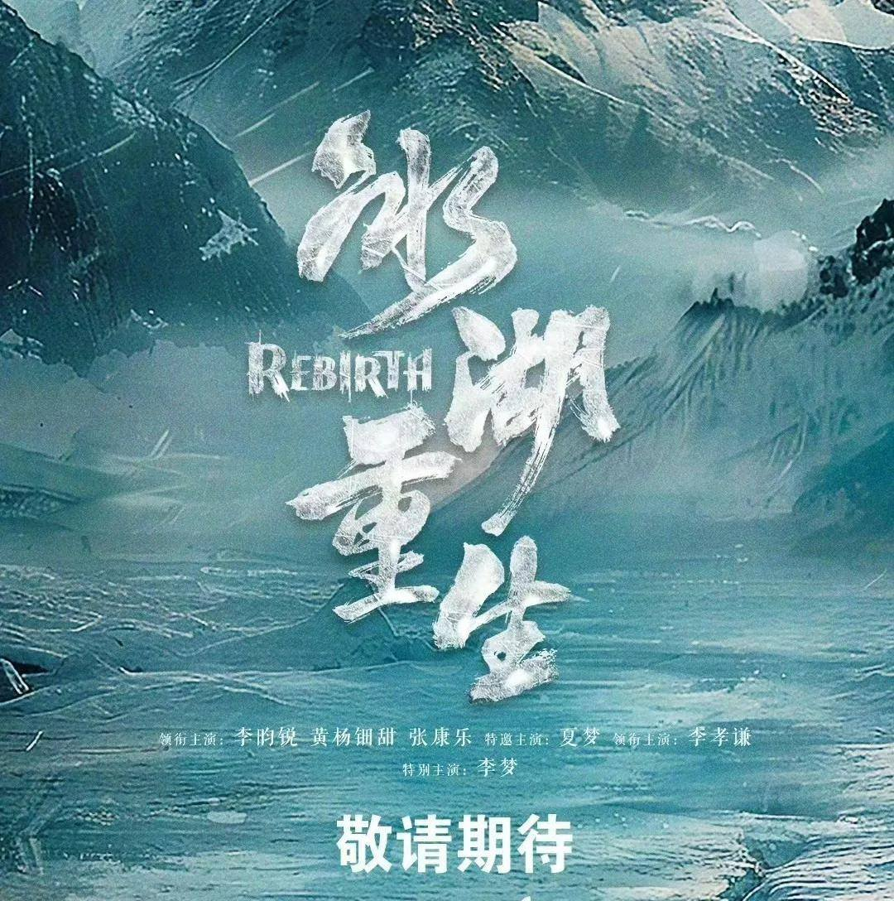

## 价值提炼：续作创作选择的建设性反思

从行业建设性思考来看，古偶续作不应仅停留在填补剧情坑洞，而应在延续角色精神内核的基础上拓展新的叙事边界。续作的开发需要超越简单的填坑逻辑，将角色的精神内核作为叙事的基石，在此基础上展开新的故事，才能让续作具备独立存在的价值。
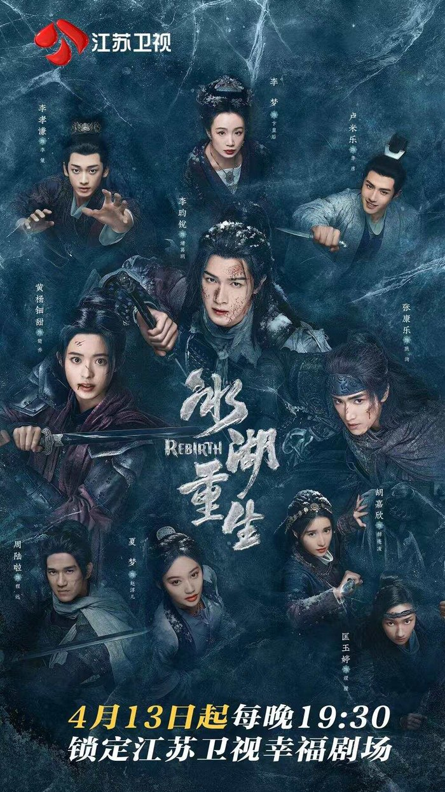

平衡情怀与创新，续作在满足观众情感诉求的同时，也需要在叙事格局上寻找新的突破点，实现真正的“重生”。情怀是续作的起点，但不应成为束缚。只有在情感闭环的基础上，开拓出新的叙事空间，续作才能摆脱前作阴影，实现艺术价值上的重生。
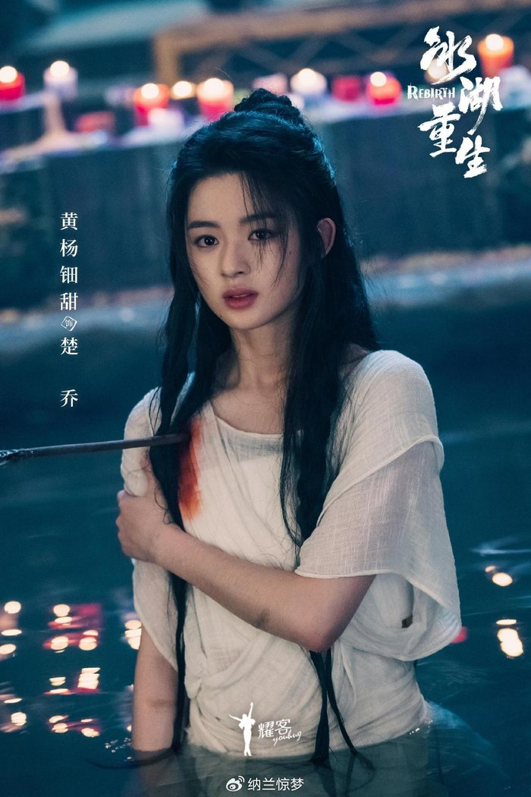

**金句：情怀是续作的起点，但不应成为束缚叙事野心的枷锁。**

落脚于客观建议，剧集创作应在角色成长与剧情闭环之间找到平衡，为续作开发提供更具建设性的创作思路。创作者需要在尊重前作精神与探索新故事之间建立有机联系，让续作既能回应观众期待，又能展现新的叙事野心，这才是古偶续作应有的发展方向。
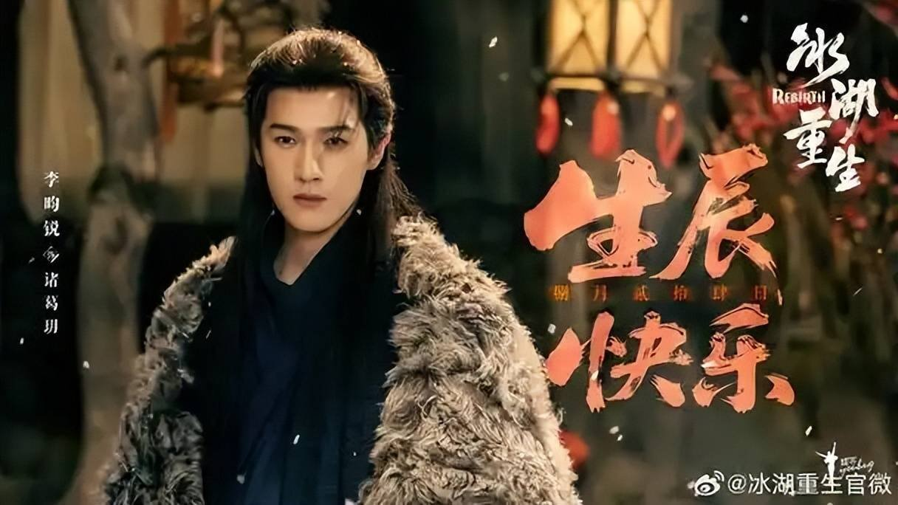

换你是楚乔，在复仇与寻找诸葛玥之间，会优先选择哪条路？
