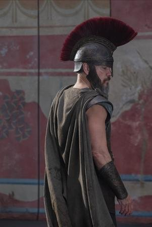
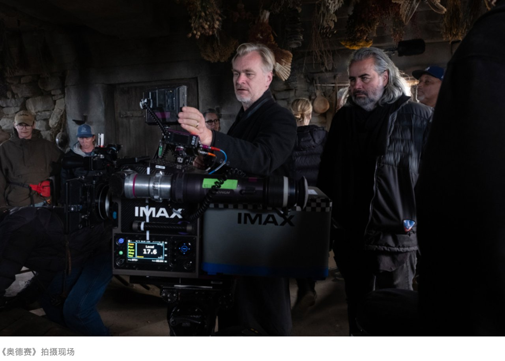
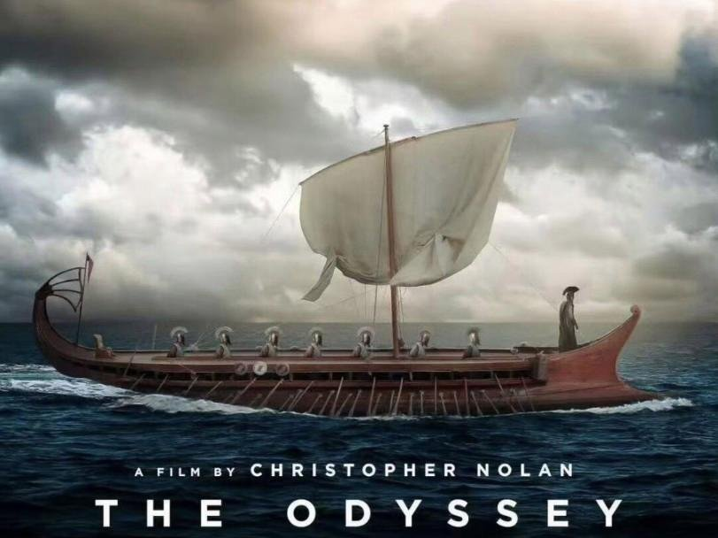
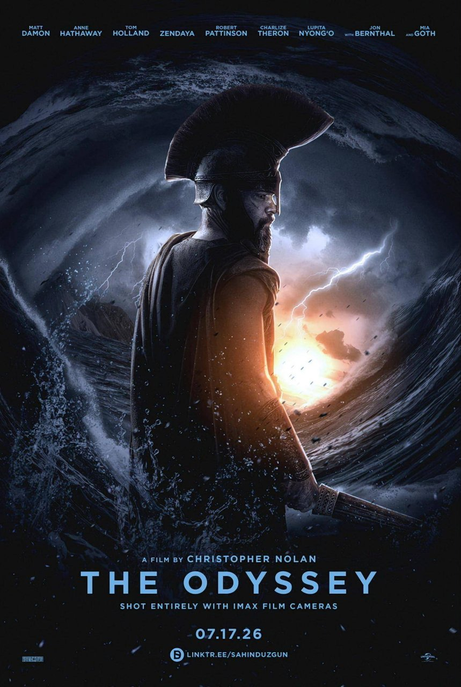
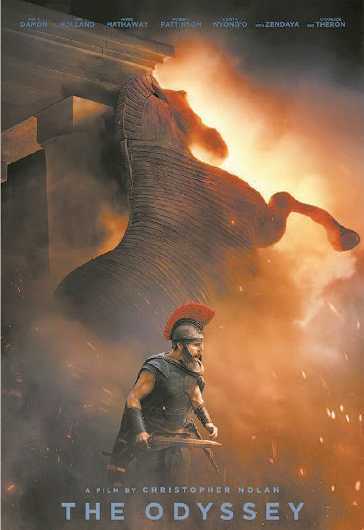
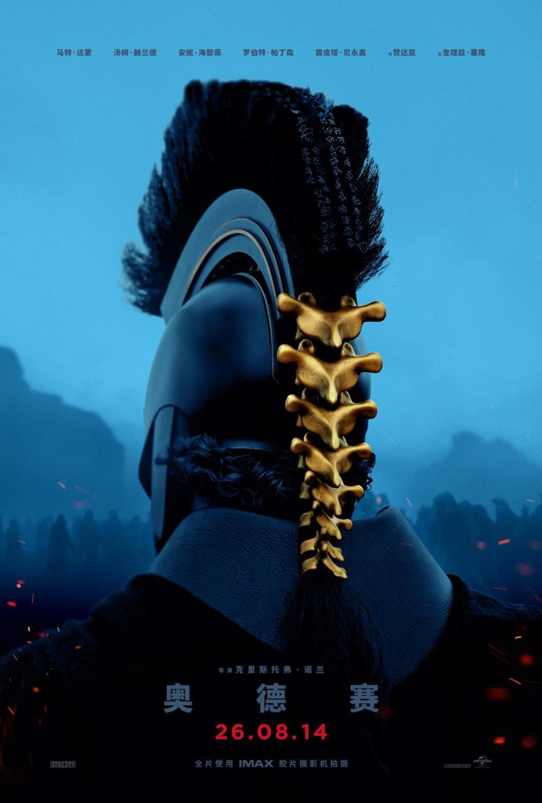
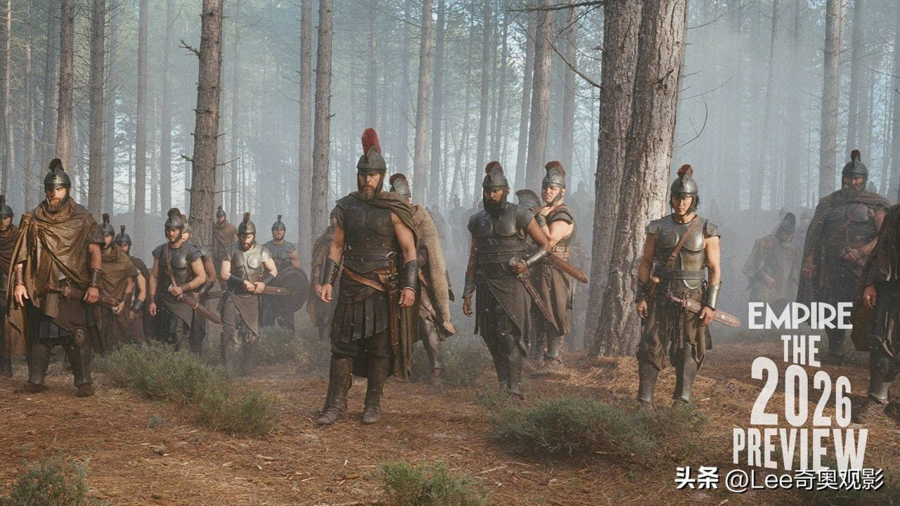
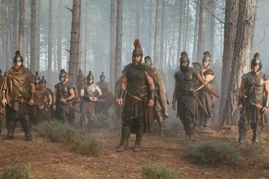
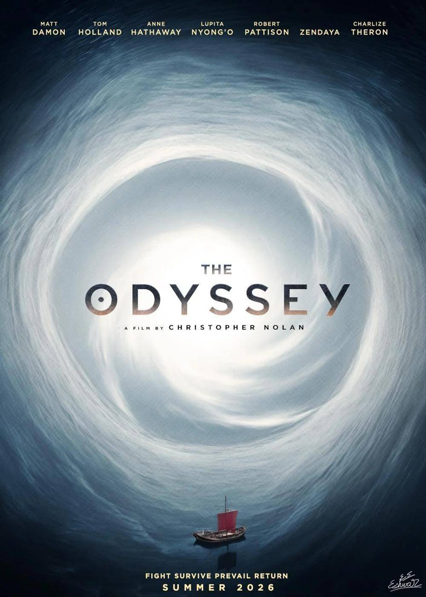
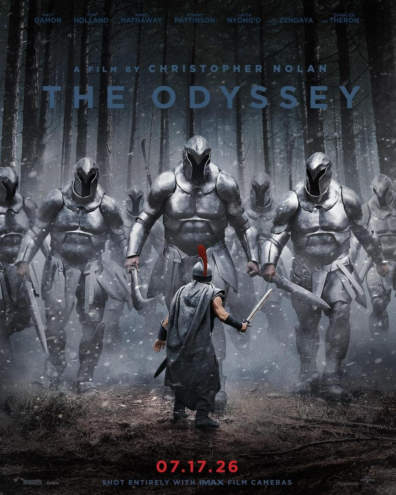

# 诺兰《奥德赛》视听顶级，为何口碑却两极分化

诺兰版《奥德赛》并非简单的神作或魔改，而是一次用现代心理主义重构古典史诗的冒险。这部顶着荷马史诗光环的作品，在豆瓣拿下8.3分的同时，也承受着口碑两极分化的巨大争议。这种撕裂，本质上源于好莱坞工业标准与古希腊神话原始想象力之间的排异反应。诺兰试图将一部公元前8世纪的口传文学，纳入现代电影工业的精密齿轮中，必然会经历阵痛。尽管在叙事节奏与选角上存在不可忽视的争议，但影片在视听技术的极致探索与反战内核的深度挖掘上，依然展现出了巨大的时代价值。

## 视听奇观与技术执念：IMAX胶片下的史诗质感

作为全球首部全程使用IMAX胶片摄影机拍摄的电影，《奥德赛》在视觉呈现上具有压倒性的优势。诺兰对实景实拍与实体特效的执念，在这部影片中达到了新的高度。剧组横跨摩洛哥、希腊、意大利、冰岛等六国取景，用真实海浪取代了数字合成，甚至在希腊的真实洞穴中搭建了高达60英尺的独眼巨人机械傀儡。演员们身着青铜盔甲泡在9℃的海水中实拍，用超大吨位推土机模拟巨浪，这种近乎偏执的物理真实感，赋予了古典史诗前所未有的厚重质感。

这种顶级的视听水准，构成了影片不可动摇的正面支点。无论是磅礴的海上风暴，还是幽暗的独眼巨人洞穴，IMAX胶片带来的沉浸式观影体验，让观众仿佛置身于三千年前的爱琴海岸。配乐与画面的高度咬合，成功构建了史诗级的宏大意象。

**金句：视听奇观从来不是炫技的堆砌，而是为了给古典神话重新赋予肉身。**

诺兰用物理特效对抗数字时代的虚无，这种创作态度本身便值得肯定。

<!-- AD_ANCHOR:slot_1 -->

## 主题重构：从英雄历险到战争创伤修复

在文本层面，诺兰对《奥德赛》进行了大刀阔斧的现代性重构。原著中“足智多谋的勇士”奥德修斯，被重塑为一个背负战争罪责的逃亡者。影片开场便定调：木马不是礼物，而是谎言的开始；胜利不是荣耀，而是罪孽的开端。奥德修斯在特洛伊屠城之夜犯下的暴行，成为他此后十年不敢回家的心魔。

通过去神化处理，诺兰将奥德修斯的旅途内化为对抗创伤后应激障碍（PTSD）的精神修行。原著中那些神明降罚与妖魔诱惑的奇幻遭遇，被转译为一位归乡战士的心理投射。这种改编大胆而锐利，它剥离了古希腊神话中的宿命论，将古典神话中的归乡之旅，成功映射为现代人寻找自我与战后回归生活的隐喻。

**金句：当胜利被定调为罪孽的开端，归乡便不再是地理的位移，而是灵魂的救赎。**

这种反战内核的注入，使得影片在主题深度上超越了普通的商业大片，具备了强烈的现实关照意义。

## 改编的排异反应：现代心理主义与神话原始想象力的冲突

然而，这种现代心理主义的重构，也引发了明显的排异反应。有观点指出，诺兰运用现代心理主义的叙事框架来塑造人物，与原著多线程的传奇色彩产生了剧烈冲突。荷马史诗原本充满走神与支线的传奇色彩，如今却被压缩进单一目标的心理叙事中，显得有些生硬。

在叙事结构上，熟悉情节下的非线性叙事遭遇了失效。过多的切割只换来破碎的故事，双线叙事未能有机融合，被部分影评人认为炫技失焦，削弱了史诗的厚重感。此外，服化道与表演也带有明显的好莱坞工业体系审美惯性，男性角色的言行举止呈现出一种现代军人的行为模式，与古希腊语境产生了疏离。

围绕选角的争议更是持续发酵。尤其是少数族裔演员出演海伦，以及变性演员饰演西农的安排，在社交媒体上引发了激烈讨论。据媒体报道，诺兰曾发声回应，指出这些选择承载着核心隐喻。但争议依然存在，这也反映出好莱坞现代价值观与古典文本在融合过程中的生硬与摩擦。

<!-- AD_ANCHOR:slot_2 -->

## 史诗转译的当代价值：争议之下的经典生命力

口碑的撕裂本身，恰恰证明了荷马史诗作为经典文本在现代语境下的生命力与讨论空间。诺兰的保守与激进并存：一方面他保守地坚持实景拍摄与物理特效，另一方面又在主题上激进地重构了原著精神。这种矛盾，创造了令人震撼的视觉奇观，但也暴露了剧作整合上的短板。

客观来看，《奥德赛》是一次不完美但极具探讨价值的史诗现代转译尝试。它用现代人的心理创伤重新丈量了古典神话的深度，虽然在叙事融合与选角适配度上存在瑕疵，但其价值依然大于缺陷。它让我们看到，古老的故事并非只能躺在博物馆里，而是可以与当代人的精神困境产生共振。

在这场用现代心理主义重构古典史诗的冒险中，诺兰交出了一份充满争议但分量十足的答卷。它或许不够完美，但足以引发我们对战争、归乡与人性的长久凝视。

换作是你，会接受诺兰这种将古典英雄重塑为PTSD患者的现代改编吗？
