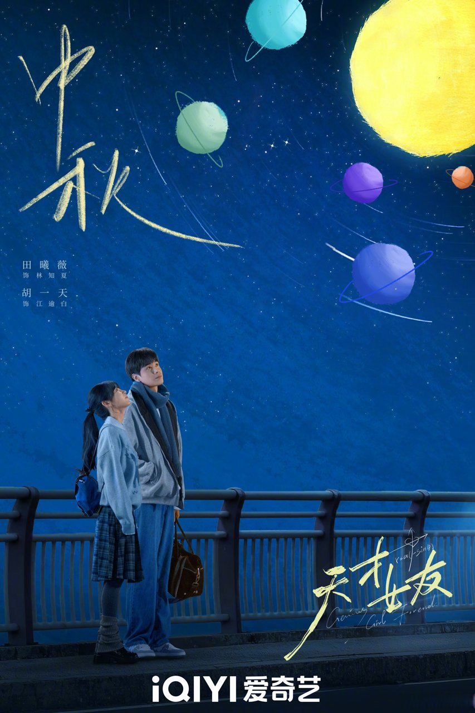
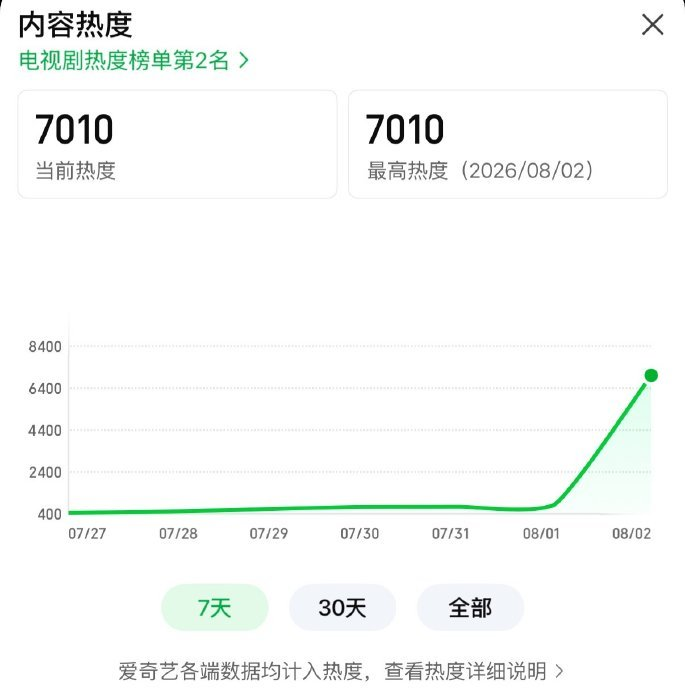

# 《天才女友》高智商设定为何难掩剧本失衡

《天才女友》剧本逻辑的核心症结，在于“概念先行与细节落地的失衡”，天才设定沦为标签而非人物行为驱动力。剧集试图在改编中用挫折成长线回应大女主期待，却因叙事节奏失衡导致人设割裂。不过，其聚焦天才成长困境的题材尝试，在国产青春剧赛道中仍具备探讨价值。

从剧本逻辑层面深挖，林知夏这一角色的塑造陷入了数据堆砌的误区。编剧试图通过旁白硬塞设定来建立人物认知，却忽略了行为逻辑的自洽性。这种创作方式，直接导致了天才光环与实际剧情表现的脱节。

**金句：当人设的建立依赖于外部的数值灌输，而非内在的行为驱动时，角色的悬浮感便不可避免。**

## 剧本改编逻辑：人设标签化与行为逻辑割裂

在《天才女友》的剧本改编中，女主林知夏的“四败爱因斯坦”设定是引发争议的焦点。剧本将其与爱因斯坦进行智商174对160-170、10岁读《时间简史》对13岁读哲学等四项硬性对比。这种设定完全依赖旁白堆砌数据，缺乏扎实的情节支撑，导致天才人设流于表面标签。

更值得探讨的是编剧对数学竞赛情节的改编。剧本将原本属于女主的竞赛高光改为输给男主，意图铺设挫折成长线。但从剧本逻辑来看，这种改编牺牲了女主事业线的合理性，引发了“伪大女主”的争议。一个设定上碾压常人的大脑，却因“团队协作不足”这种理由落败，在逻辑推演上难以自洽。

此外，剧本在科学常识上的处理也存在自相矛盾。剧中号称物理天才的女主，剧情里竟出现了“同极磁铁相吸”这种初中物理级别的知识硬伤，连同语文148分成绩单等细节，进一步削弱了剧情可信度。这些逻辑漏洞表明，编剧在追求戏剧冲突时，未能守住科学严谨的底线。

剖析这些逻辑漏洞往往需要观众投入不少精力，思考剧情合理性这事，手边备上几包咸香可口的解馋零食，确实能让人在长篇分析中保持头脑清醒。

<!-- AD_ANCHOR:slot_1 -->

## 叙事节奏：情感线与事业线的失衡

《天才女友》在十年跨度的叙事节奏处理上，暴露出情感线与事业线比例失衡的问题。在长达十年的成长轨迹中，天才光环屡次为恋爱线让路，导致事业线被边缘化。这种节奏把控的失当，使得观众难以感受到角色在专业领域的深耕与突破。

人物成长轨迹缺乏平滑过渡，是剧本逻辑的另一大短板。挫折设计过于生硬，女主在遇到困难时往往陷入内耗，且多依赖男主开导来解决问题。这种处理方式弱化了角色的独立性，使得天才人设成为了恋爱线的背景板。

**金句：当角色的每一次突围都需要依附于情感关系时，所谓的独立成长便成了一纸空谈。**

从剧本结构来看，编剧试图在事业受挫与情感治愈之间建立联系，但未能平衡两者的比重。这导致女主在面临学术困境时的反应，与其高智商设定产生割裂。叙事节奏的失衡，不仅打断了人物成长的连贯性，也削弱了观众对角色命运的共鸣。

## 创作价值：科普细节与题材探索的尝试

尽管在剧本逻辑上存在不足，但《天才女友》在科普细节与题材探索上仍有值得肯定之处。剧中数学竞赛场景参考并使用了2006年、2008年、2010年的真实联赛原题。在专业题目设计上展现出的严谨性，为剧集挽回了一定的专业质感。

剧集尝试探讨“智性恋”与天才少女的成长困境，这在国产青春剧赛道中具有一定的题材探索意义。它触及了高智商群体在成长过程中面临的社交孤立、自我认知等议题。这种对非典型成长路径的关注，拓宽了青春剧的表达边界。

深入探讨这些题材细节往往需要熬夜拉片分析，长时间盯着屏幕对眼睛负担不小，备上一副能缓解眼部疲劳的助眠眼罩，在休息间隙舒缓一下，看剧分析两不误。

<!-- AD_ANCHOR:slot_2 -->

据相关报道，该剧在首播时热度曾突破7500，这说明题材本身对观众具有吸引力。虽然后续因逻辑硬伤引发争议，但其在题材选择上的前瞻性不应被全盘否定。它为后续同类题材提供了试错样本，其探索价值客观存在。

## 结论与价值发现：国产天才叙事的破局方向

《天才女友》的剧本争议，折射出国产天才叙事面临的普遍困境。天才叙事不应止步于数值堆砌与标签化设定，而应回归对人物内在逻辑与科学精神的深耕。设定只是起点，如何让设定在情节中落地，才是剧本创作的核心。

客观指出该剧在逻辑与节奏上的不足，并非全盘否定。它在科普题目考究与题材选择上的尝试，为未来同类题材的创作提供了“概念如何落地”的建设性参考。创作者应当意识到，观众对逻辑的审视日益严格，悬浮的设定已难以支撑长篇叙事。

**金句：真正的天才叙事，不是给角色贴上不可企及的标签，而是展现其在困境中如何运用智慧破局。**

只有在逻辑自洽的基础上构建人物成长，才能让天才叙事真正落地生根。这部剧的经验与教训，都将成为国产剧在探索复杂人设时的重要坐标。

换你是编剧，会让女主在竞赛中输给男主吗？A. 会让其失败以促成长 B. 不会，天才就该赢到底
