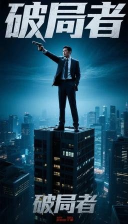
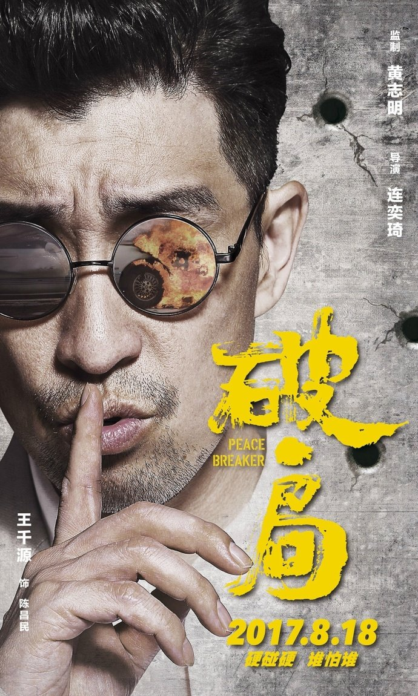
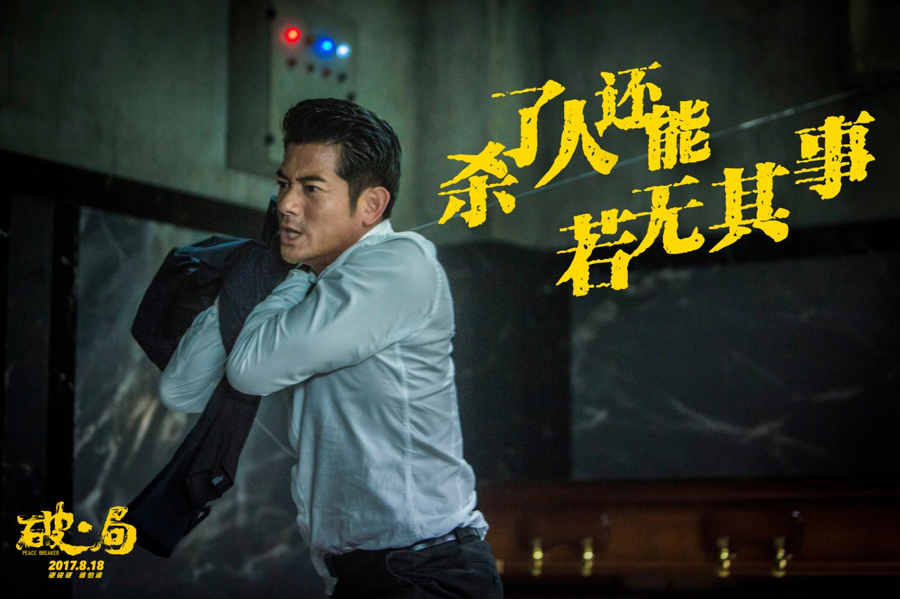
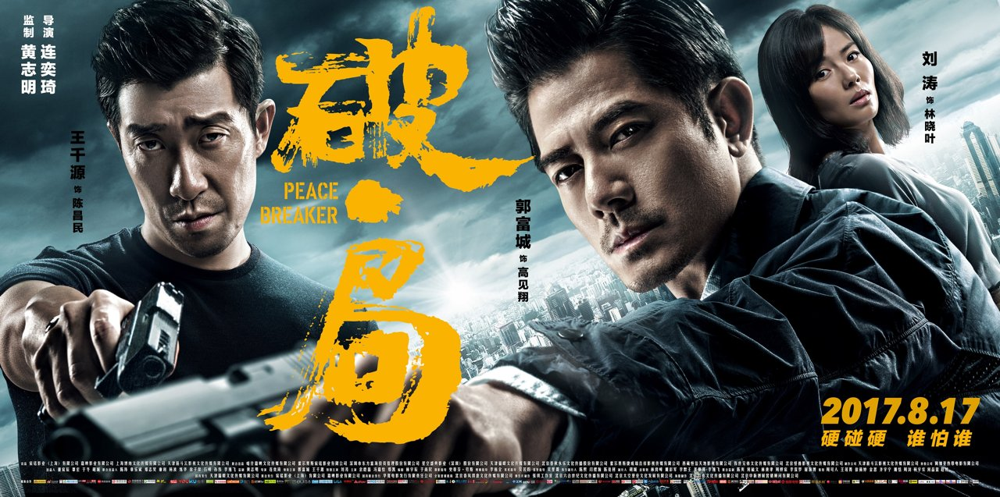
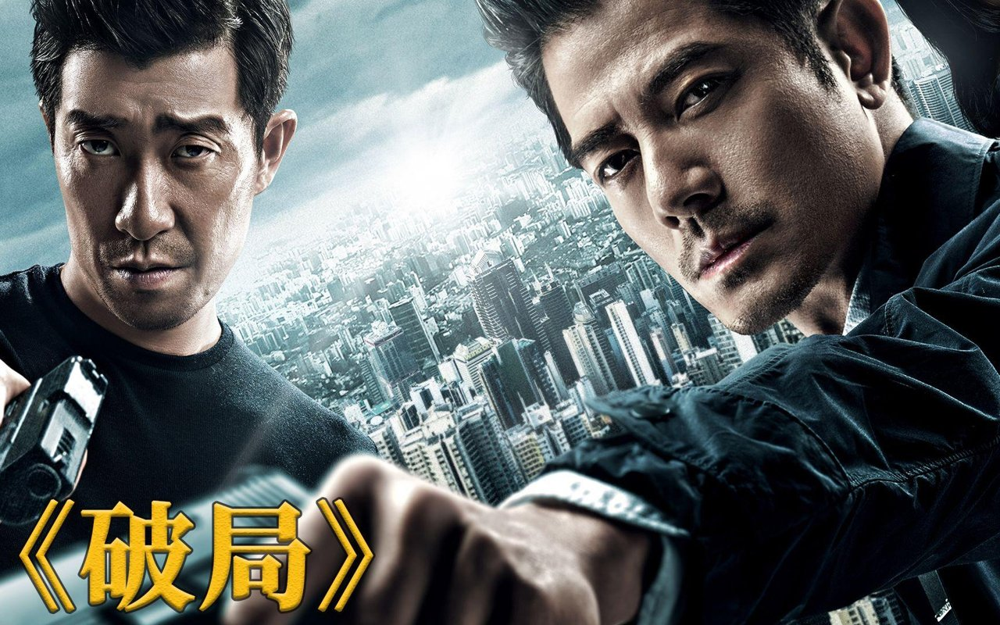
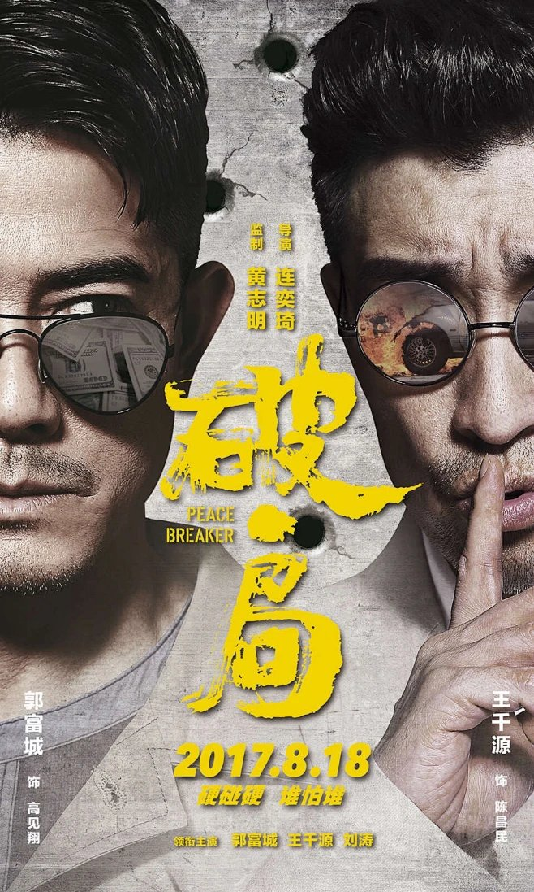

# 《破局者》力压好莱坞，赢在反套路设定

《破局者》以八千万投资撬动超八亿票房的市场爆发，绝非偶然的营销玄学，而是对类型片本体的精准回归。这部影片通过反套路的“清账人”设定与扎实的写实底色，完成了一次草根创作团队对重工业视效的突围。

在暑期档大片林立的格局中，《破局者》没有选择堆砌视觉奇观，而是将赌注押在了叙事逻辑和人物塑造的扎实度上。这种创作路径的克制与精准，恰恰击中了当下观众对硬核叙事的渴求。当重工业视效成为大片的标配，用文本厚度和叙事张力来建立护城河，反而成了最有效的破局利器。

**金句：真正的降维打击，从来不是靠资本堆砌视觉奇观，而是用文本的厚度击穿观众的预期。**

### 《破局者》的逆袭逻辑：数据反差与口碑路径

从市场数据来看，《破局者》的表现确实构成了强烈的反差感。据素材显示，该片上映仅72小时内便斩获了超过4.6亿票房，力压同期上映的好莱坞大片《星际迷航：边界》。截至7月18日，累计票房突破8.2亿元，豆瓣评分稳定在8.7分。对于一个投资仅8000万、没有流量明星坐镇的项目而言，这样的成绩单足以证明其市场爆发力。

更值得深究的是其排片曲线的逆势上扬。影片首日排片率仅为12%，随后一路飙升至34%。这种典型的“口碑逆袭”路径，在当下的电影市场中并不多见。它意味着影片没有依赖首日宣发势能强攻，而是依靠映后真实口碑的持续发酵。观众用脚投票的结果，直接印证了市场对扎实叙事的饥渴程度。

观影时的沉浸体验往往需要一些小零食来加持，点上外卖或者家里备上几袋开袋即食的水果玉米段，边啃边看，既能解馋又不脏手，确实能提升观影的幸福感。

<!-- AD_ANCHOR:slot_2 -->

在这个层面上，《破局者》的胜利不仅是票房数字的胜利，更是口碑逻辑的胜利。它证明了只要内容本体足够硬核，观众依然愿意为好故事买单，并且愿意成为口碑传播链条中的一环，主动推动排片率的攀升。

### 反套路人设：《破局者》如何重构赌场生态

《破局者》在类型片创作上最值得称道的，是对主角陈万钧的反套路设定。在传统的赌片叙事中，主角往往沉迷于赌桌上的胜负，命运随筹码起伏。但陈万钧的身份是“清账人”，一个专门替债主催收、替赌客斡旋的中间人。他的信条是“不碰筹码，不欠人情，不让任何人看到自己的底牌”。

这种设定从根本上打破了传统赌片的宿命论。主角不沾赌，意味着他跳出了“十赌九输”的悲剧循环，将视角从赌桌上的博弈转移到了赌场外围生态的运作逻辑上。陈万钧的秩序感建立在他清晰的分寸感上：每天固定时间喝同一家茶餐厅的冻柠茶，固定时间见客户，生活像钟表一样精确。这种近乎偏执的秩序感，赋予了角色罕见的沉稳气质。

在危机处理上，陈万钧的逻辑是“先列出还款方案，再亮出背后的人脉，最后才露出拳头”。这套组合拳的精妙之处在于，它将暴力作为最后的底牌，而非首选手段。这种处理方式不仅符合一个中间人的生存逻辑，也让角色的智性魅力远胜于单纯的武力展示。

深夜复盘这种硬核剧情时，手边若能备上几听冰镇啤酒，微凉的口感刚好能压一压紧张的情绪，让观影体验更加沉浸。

<!-- AD_ANCHOR:slot_1 -->

**金句：角色魅力的核心不在于他能打赢多少人，而在于他能在混乱中建立并维持怎样的秩序。**

### 叙事闭环：《破局者》的文本厚度与营销共振

影片能够留住观众，两个半小时的叙事张力是核心抓手。据观众反馈，影片剧情主线的伏笔得到了精准呼应，这种叙事闭环在当下的创作环境中显得尤为难得。许多影片为了追求反转而牺牲逻辑，但《破局者》的反转是建立在严密的文本逻辑之上的。每一个看似不经意的细节，最终都成为推动剧情的关键齿轮。

这种文本厚度，也为影片的营销提供了天然的土壤。据素材显示，该片在B站与抖音采用了“解谜式营销”，预告片中藏着的彩蛋与剧情主线完美呼应。这种营销方式之所以奏效，本质在于影片本身经得起拆解。如果影片内容空洞，再精巧的营销也只会反噬口碑。正是因为有了扎实的叙事闭环作为支撑，解谜式营销才能激发观众的“共创”热情，让影片在社交媒体上持续发酵。

从这个角度看，营销与内容并非割裂的对立面，而是相辅相成的共同体。好的内容是营销的底气，而精准的营销则是内容的放大器。《破局者》的成功，正是因为它在这两端都做到了极致。

### 类型片突围：《破局者》的行业启示录

结合影评人谭飞关于建立新评价体系的探讨，《破局者》的成功提供了一个极具价值的样本：放下居高临下的说教姿态，尊重大众叙事规律。影片没有试图用晦涩的表达来彰显艺术性，而是用扎实的类型片语法讲好一个故事。这种对观众的尊重，最终换来了观众的认可。

草根创作团队的这场胜利，为行业提供了一条清晰的启示：尊重观众的观影逻辑、深耕类型片本体，才是真正的破局之道。在资本密集涌入、重工业视效成为标配的当下，回归叙事本身，用文本厚度和人物逻辑建立护城河，依然能够撬动广阔的市场。

**金句：当行业不再迷信流量与资本的简单叠加，而是重新审视故事的基本功时，类型片才真正迎来了突围的契机。**

《破局者》的突围，不仅是一部影片的胜利，更是对类型片创作规律的一次正本清源。它用实打实的市场数据证明了，观众永远会为尊重智商的硬核叙事留出位置。

你认为《破局者》的成功，是反套路人设的胜利，还是解谜式营销的功劳？
