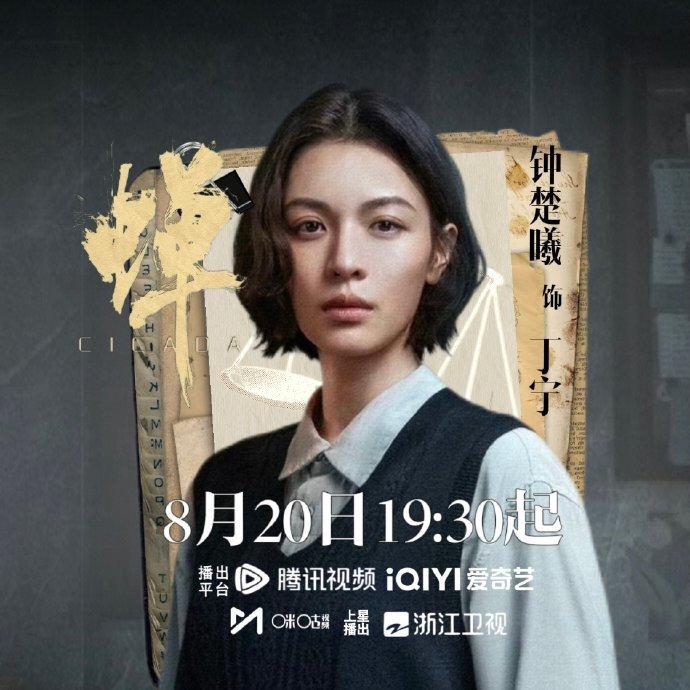
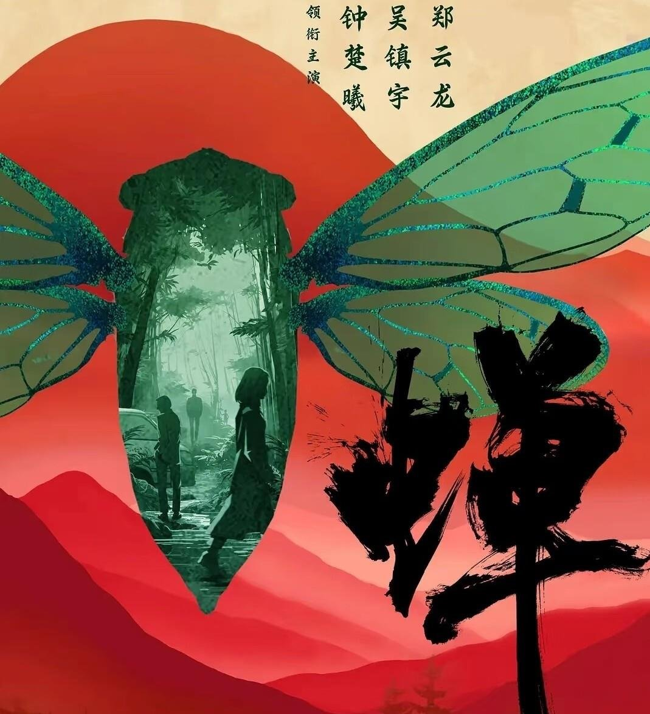
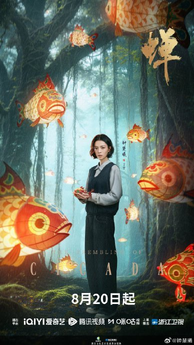

# 《蝉》直面养老院乱象，是现实突破还是尺度噱头

《蝉》以放弃传统破案爽感的姿态，将司法悬疑的锚点从“谁是凶手”移向“人心如何抉择”，这是一次冒险但极具建设性的探索。在同类题材深陷解谜套路同质化的当下，该剧试图用“莫比乌斯环”式的叙事串联起横跨十二年的旧案，其核心价值不在于案件本身的猎奇，而在于将法律条文与人性灰色地带的碰撞具象化。剧中对养老院护工侵害老人等社会阴暗面的直白呈现，固然引发了“进步与博眼球”的争议，但这正是该剧试图撕开现实遮羞布的尝试。这种不给出非黑即白答案的处理方式，要求观众必须放弃被动接受爽感的观剧习惯，转而主动介入角色的心理博弈。

**金句：悬疑剧的突围不在于制造多密集的反转，而在于敢不敢直面人性的灰度。**

## 莫比乌斯环里的困局：放弃解谜爽感，转向心理博弈

剧集构建了一个三线并行的叙事结构：丁宁追查生父绑架旧案的真相、余颂凡在丧亲之痛中寻求自我救赎、赵屹杰在暗中布局权力网。这三条线索并非平行推进，而是互为因果，形成了一个无始无终的闭环。这种结构直接改变了悬疑剧的传统叙事动力。

当叙事像莫比乌斯环一样绕回去时，“凶手是谁”不再是唯一的悬念。前期的伏笔在中后期完成闭环回收，人物的心理变化与选择成为了真正的核心看点。十二年的绑架旧案串联起连环坠楼、办公室毒杀等案件，这些案件在此刻不再是单纯的解谜工具，而是触发人物心理转变的载体。

每个人物既是因也是果，形成了“螳螂捕蝉，黄雀在后”的困局。全员“灵魂困兽”的设定，让人物厚度取代了炸裂反转。这种高信息密度的叙事，需要观众保持高度专注，去捕捉那些隐藏在细微处的伏笔。

追这种高密度悬疑剧时，手边备上几罐冰镇啤酒，微醺的状态或许刚好能跟上剧情反转的节奏。

<!-- AD_ANCHOR:slot_1 -->

## 灰色地带的凝视：养老院乱象背后的现实映射与尺度争议

剧集在视听层面最引发争议的，是对养老院护工侵害老人情节的直白呈现。这一情节没有单一的现实原型，但其生长土壤是真实的——封闭环境中的权力不对等、监管机制的漏洞，以及老年人被主流影视长期遮蔽的情感与生理需求。剧集采用近乎纪实的手法将这些乱象搬上荧幕，不将施害者脸谱化，而是通过多视角呈现复杂性。

这种处理方式不可避免地引发了观众的两极分化。一部分声音认为这是国产剧现实主义创作的进步，敢于撕开遮羞布；另一部分声音则质疑其是否在博眼球。从创作逻辑来看，剧集通过悬疑探案外壳和留白手法，在现有创作环境内实现了强冲突表达。

沉浸在三线并行的复杂叙事中，难免会消耗脑力，家里囤点开袋即食的休闲零食，能随时补充追剧能量。

<!-- AD_ANCHOR:slot_2 -->

在法庭戏的构建上，剧集将重点放在了证据链与信任的博弈。律师丁宁为争议嫌疑人辩护，其电脑中被查出的大量非法内容、同监室人员的证词等细节层层反转。这不仅是法律程序的展现，更是法律从业者在职业伦理与人性抉择间挣扎的具象化。

**金句：真正的现实主义不在于展示伤口，而在于审视伤口周围那些难以界定的灰色地带。**

## 跨界与实景：制作层面的正向支点与适配度悬念

在制作层面，《蝉》拥有硬核的幕后支撑。总制片人袁玉梅曾操盘《白夜追凶》，联合导演吕乐在广西柳州进行实景拍摄。工业老城的湿润雾气与市井烟火，赋予了剧集真实的质感，使其脱离了悬浮的棚拍感。这种对真实感的追求，是该剧在悬疑氛围营造上的正向支点。

然而，主创的跨界也带来了适配度上的悬念。袁玉梅此前多以制片人身份出圈，首次操盘深度心理悬疑剧，对三线叙事节奏的把控力仍需正片检验。悬疑剧对逻辑严密性的要求极高，稍有不慎便容易出现叙事混乱。

演员阵容方面同样存在未知数。郑云龙作为音乐剧演员，舞台表现力毋庸置疑，但影视化表演的分寸感，以及与资深戏骨对戏时的适配度，是其饰演的“邪魅律政精英”能否立住的关键。而钟楚曦的外形气质过于亮眼，部分观众担忧她会与刑辩律师的专业厚重感产生割裂。这些争议点，恰恰构成了全剧的观察看点。

## 破土与鸣叫：司法悬疑剧的价值发现与客观审视

“蛰伏十七年，只为鸣叫一夏”，《蝉》的剧名本身即是对人物命运的隐喻。剧中人物被执念困住十二年，最终寻求的是和解与重生。这种从创伤走向新生的脉络，赋予了剧集超越普通探案剧的深度。

客观来看，《蝉》在现有创作环境内，通过悬疑外壳与留白手法实现了强冲突表达，拓展了司法悬疑剧的现实主义边界。它放弃了非黑即白的简单答案，转而呈现法理之下悬而未决的人心困局。尽管在叙事节奏和演员适配度上仍面临争议，但这种试图深入探讨人性与法理边界的尝试，值得被客观审视。

国产悬疑剧的迭代，需要的正是这种不满足于提供爽感、试图触碰现实复杂性的作品。无论最终的口碑走向如何，《蝉》在题材选择和叙事结构上的突围尝试，已经为后续同类创作提供了有价值的参考。

换你是丁宁，会为生父的旧案放弃职业原则吗？
