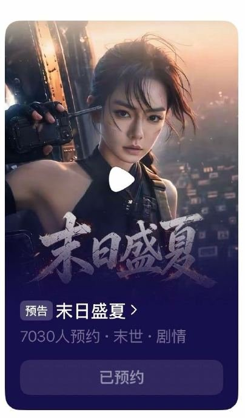
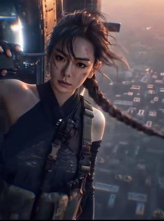
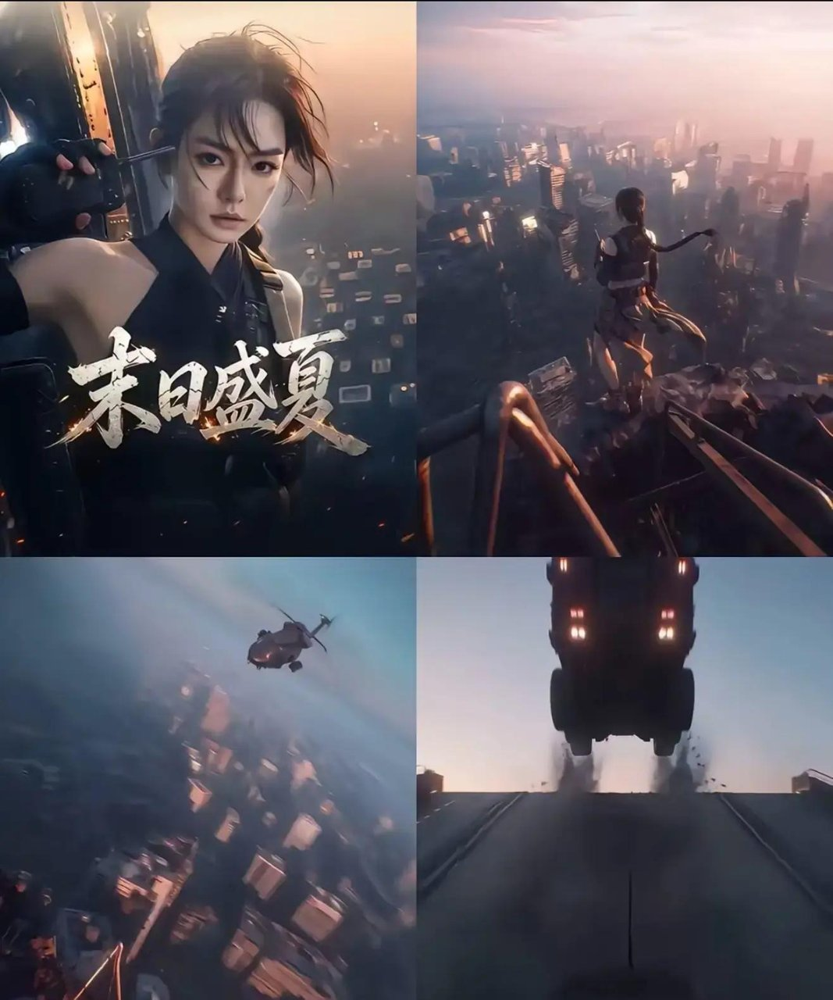
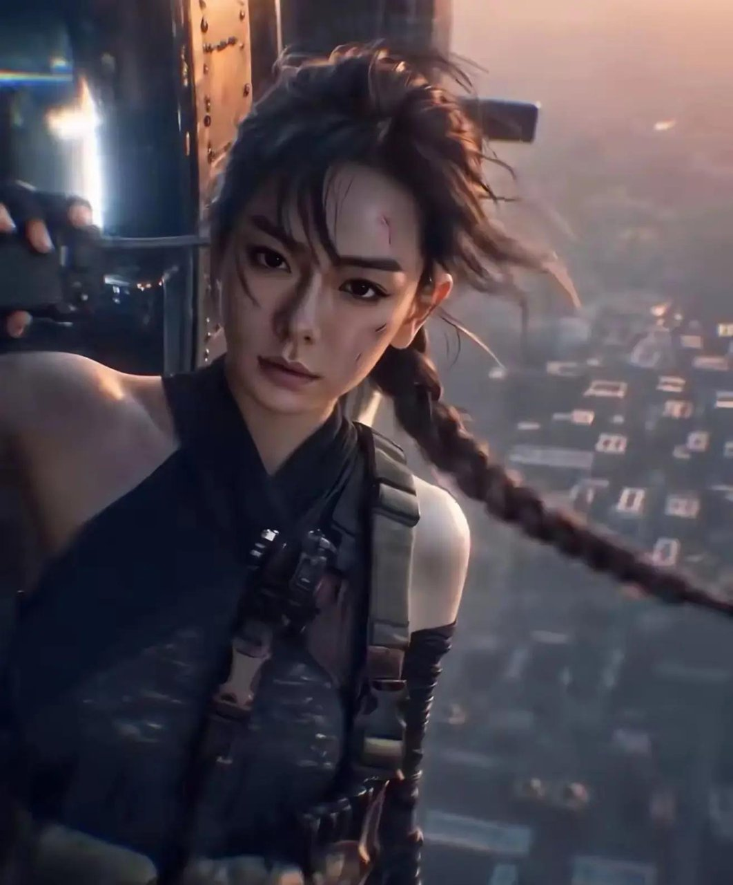
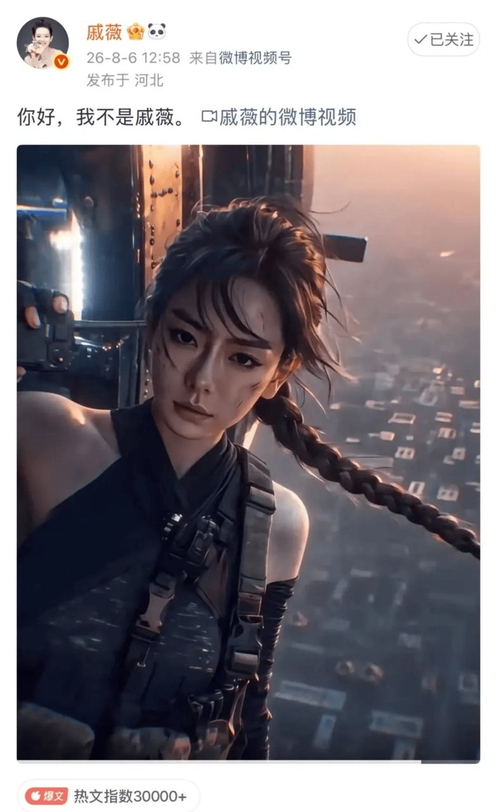
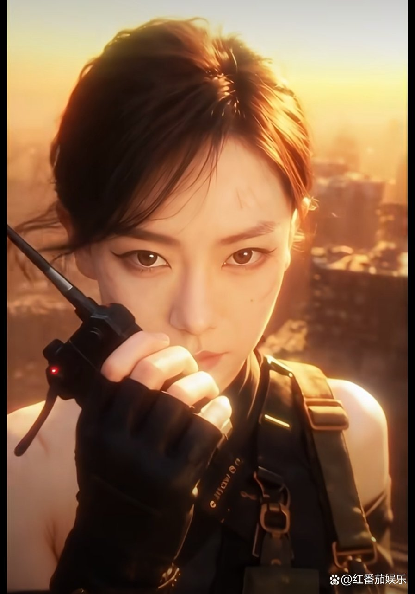

# 《末日盛夏》这哪是看剧，分明是在玩AI游戏

看完《末日盛夏》的预约页面，我第一反应就一句话：这哪还是咱们平时躺着刷的短剧，分明是个能互动的AI游戏。

我一开始以为就是戚薇演了个末世题材短剧，点进红果短剧的预约页面一看，好家伙，AI全流程生成画面，还能让观众自己做选择决定剧情走向。

有人在评论区直接问了句"这真的是时代潮流吗"，觉得"形式大于内容了"。我看完整个介绍，也有点犯嘀咕，但又确实觉得新鲜。

## 这哪还是短剧，分明是个游戏

说实话，我刷到《末日盛夏》的时候，以为就是个普通末世短剧。结果点进去才发现完全不是那回事。

平时咱们看短剧，都是躺着被动接受剧情，导演给你什么你看什么。但《末日盛夏》把选择权交到了观众手里。

女主韩清夏重生回丧尸爆发前15天，怎么囤货、怎么求生，观众能参与决策。这感觉怎么说呢，就像在玩一个文字冒险游戏，只不过画面是AI生成的，角色是戚薇的数字分身。

**这东西你说它是剧吧，它有互动选项；你说它是游戏吧，它又有完整的剧情线。**

## 这剧到底怎么个选法

先说说设定。女主韩清夏在末世里挣扎了十年，一朝重生回到丧尸病毒爆发前15天。她知道接下来会发生什么，所以提前囤货、构筑安全屋、集结幸存者。改编自番茄小说《末世重生：大佬从百万囤货开始》，标准的末世重生流。

但跟普通短剧不一样的是，它支持观众分支选项互动。剧情走到某些节点，观众可以替角色做选择。往左走还是往右走，先救人还是先囤物资，这些决策点直接影响到后续剧情走向。

戚薇这次是以AI数字分身"韩清夏"出演的，这个角色有独立的末世废土人设，不是简单复刻真人长相。而且戚薇全程参与了角色神态、动作节奏的调校，还用了原声配音。

我看到这个信息的时候还挺意外的。一个演员深度参与AI角色的制作过程，这在内娱确实是头一回。

全流程AI生成画面，配上互动分支节点，我看完预约页面那段演示，第一感觉就是：这不就是以前玩过的文字冒险游戏吗？只不过从纯文字变成了AI生成的画面，从选ABCD变成了更丰富的选项。

把原本被动接受的末世生存故事变成主动决策的体验，我觉得挺有意思的。至少在短剧赛道里，这是个新方向。

## 有人觉得新鲜，也有人犯嘀咕

新鲜归新鲜，我也看到不少人在犯嘀咕。

有人说"频繁做选择会打断看故事的沉浸感"。你正跟着女主紧张求生呢，突然弹出来一个选项让你选，那感觉跟纯看剧确实不一样。

而且AI生成画面的连贯性也是个考验。AI画面单帧看可能没问题，但连续动起来能不能保持稳定，这个得等正片出来才知道。

戚薇透露第一季预计2026年年底播出，目前还在打磨中，官方还没公布具体上线日期。

不过戚薇面对观众反馈，回应倒是挺坦诚的："同意大家的建议，虚心接受，我们得优化提示词。"

这句话我觉得挺实在的。没有硬刚，也没有装没看见，承认有不足，说要优化。

戚薇还说过一句话："我们不是被技术推着走的人，我们要做那个握着方向盘的人。"

从这句话来看，她对这个项目的定位，是想主动去把控技术方向。AI是个工具，谁来用、怎么用，决策权应该在创作者手里。

这种探索虽然有不足，但主动尝试新玩法的出发点，我觉得是有价值的。至少有人在试着往前走。

## 这到底是看剧还是玩游戏

《末日盛夏》确实模糊了影视和游戏的边界。它既有互动选项让你做决策，又有完整的末世重生故事线和角色成长，到底算哪一类，还真不好说。

虽然目前还在摸索阶段，AI画面的稳定性和互动节奏的把控都还需要打磨，但把选择权交给观众这个思路，确实给末世题材打开了新玩法。

以前看末世剧都是跟着主角走，现在你能替主角做决定，这种参与感是传统短剧给不了的。

能自己选剧情的互动体验，还是老老实实看故事的传统短剧——你是哪一边？
