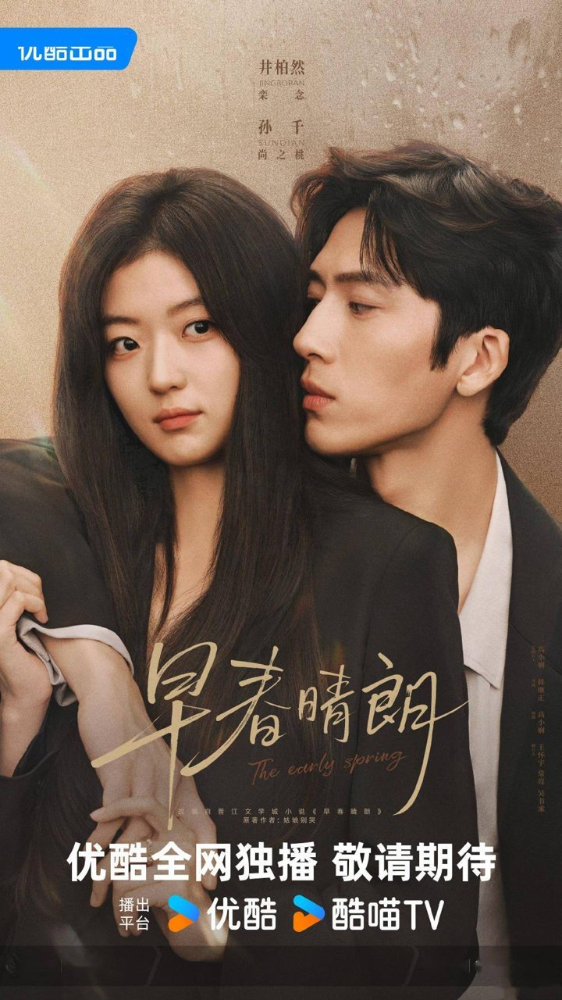
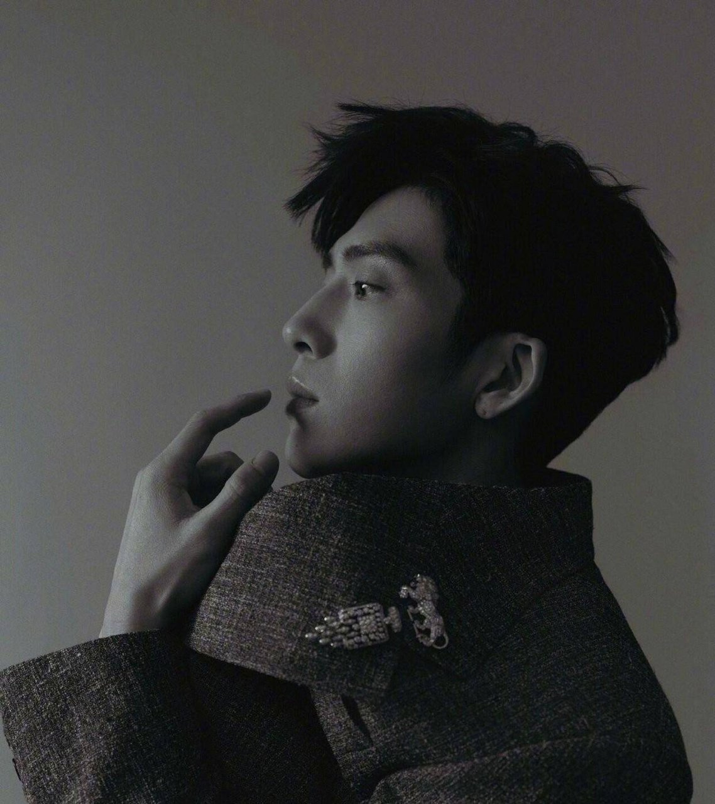
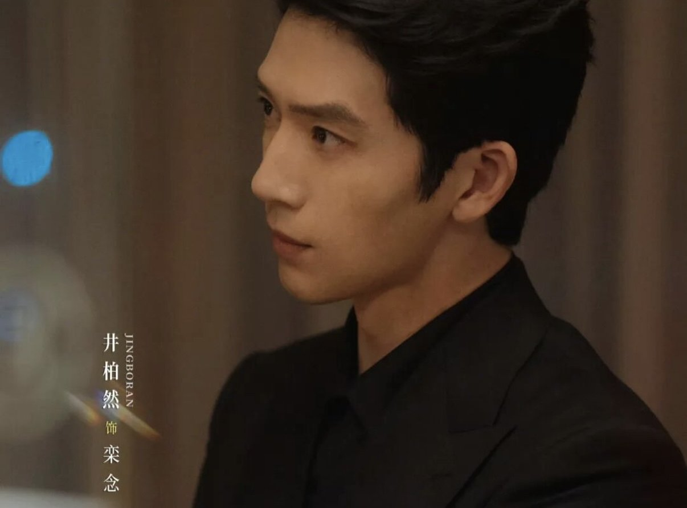
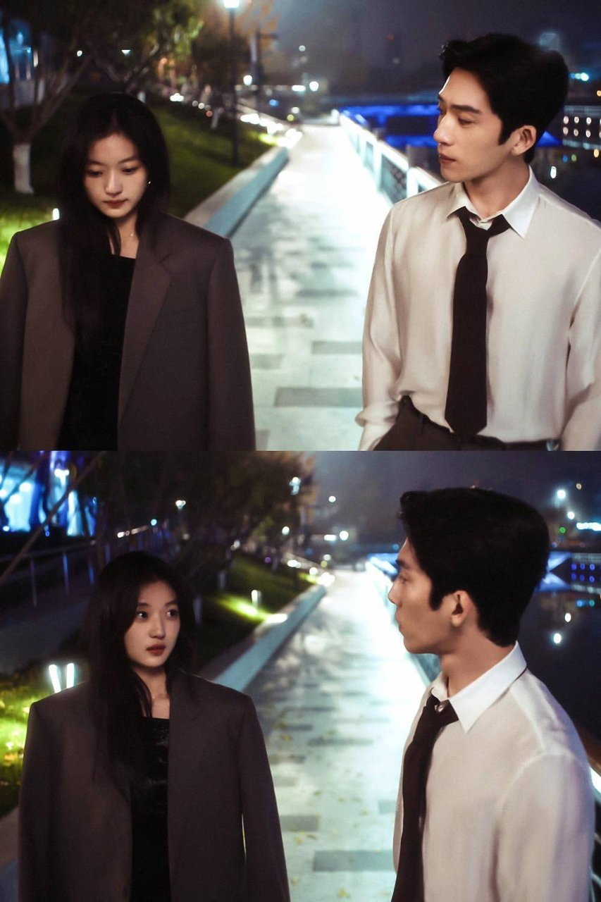
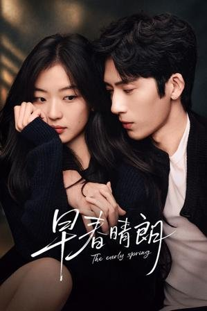
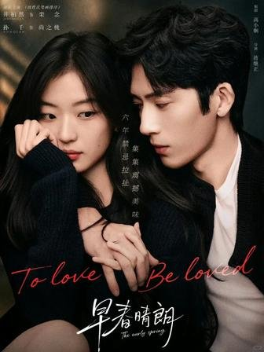
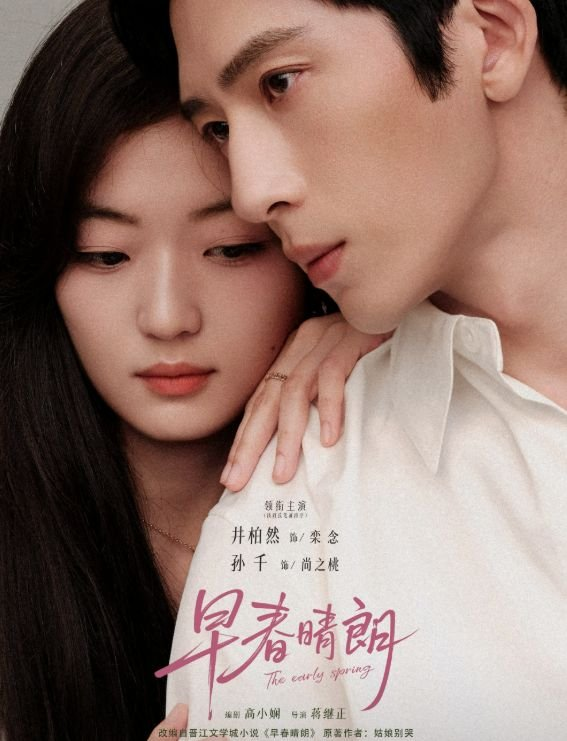

# 早春晴朗没流量阵容，质感到底靠什么撑

## 看完我第一反应就一句话

我看完第一反应就是——这剧怎么跟我平时追的那些不太一样？

说实话，《早春晴朗》刚开播那会儿我刷到预告，没太大感觉。井柏然和孙千这个搭配，不算那种一看就上头的流量组合，宣传语还被群嘲过土味。但那天晚上实在没东西看，点开第一集。

**画面一出来我就愣了一下。**

这色调，不是平时那种磨皮磨到五官模糊的滤镜感。

有个观众说得挺到位的："说到底，我们到底想要什么样的'真实'"。这句话我追到第三集的时候特别有共鸣。那个画面质感让人觉得——嗯，有人在认真拍东西。

追了几集下来，我最大的感受就是这剧的质感全靠摄影出身的导演和那套电影级的光影在兜底。

## 导演这镜头光影是真会拍

先说一个让我反复倒回去看的细节——片头。

井柏然手写的字体配剪纸动画风插画，转场丝滑得不像国产剧。我平时追剧都是直接跳片头的。

**这个片头愣是让我看了三遍。**

有观众说"第一次有不想跳过片头的冲动"，我完全理解。

然后是正片的光影。导演蒋继正是摄影出身，这个信息我后来去查了一下，难怪镜头语言这么讲究。有观众直接说分镜细致到"每个部门都可以严肃拉片学习"，这个说法不夸张。

全片没有那种过度饱和的浮夸滤镜，色调偏冷灰，看着对眼睛特别友好。平时追那些甜宠剧，画面亮得跟打了一层蜡似的，这剧的冷灰色调反而让人觉得舒服。

不过选角这块确实有人不买账。我看到有观众说"有点一般哎，感觉我还是完全不吃孙千……井老师感觉还是和男的张力更强"。这种感受能理解，选角这种事本来就是甲之蜜糖乙之砒霜。

但就算你不吃选角，这个镜头质感确实没话说。

我自己看到第五集那段的时候，画面构图和光影调度让我觉得每一帧都像是有人在后面认真调过色温的。

## 亲密戏请专业指导这事得夸

说到第五集，就得聊聊这剧的亲密戏了。

据说《早春晴朗》是国内首聘专业亲密指导的剧集。这个做法我觉得值得点赞。以前国产剧拍亲密戏，干巴巴借位的也有，硬上尺度擦边的也有，两头都不讨好。

这剧请了专业亲密指导，效果确实看得见。第五集19分32秒那段被网友称为"镜头艺术"，靠眼神和肢体传递汹涌情愫，不是靠脱衣服和暧昧台词硬凑。

我自己看的时候，感觉这种拉扯感确实是成年人才能拍出来的味道。克制着，但眼神里全是东西。

当然也有人完全不买账。有观众直接说："任何一个上过一天班的人都不可能看得下去，谁想跟pua刁难新人又装的上司谈恋爱"。这条评论点赞数不低，说明确实戳中了一部分人的雷点。

职场设定这块我不展开聊，但就亲密戏本身来说，专业指导带来的质感提升是实打实的。尺度拿捏得住，不是那种为甜而甜的流水线作业。

## 你更吃这套质感还是更在意剧情

追到这儿，我自己的判断是：《早春晴朗》的质感确实是被导演的光影审美和亲密指导制度撑起来的，跟流量阵容没太大关系。

镜头封神也好，亲密戏高级也好，这些都是制作层面实打实的加分项。剧情和职场设定那块有争议，但那不是我这篇想聊的重点。

所以想问你们——

你是更看重这种电影级质感的制作诚意，还是更在意剧情逻辑和职场设定的真实度？
