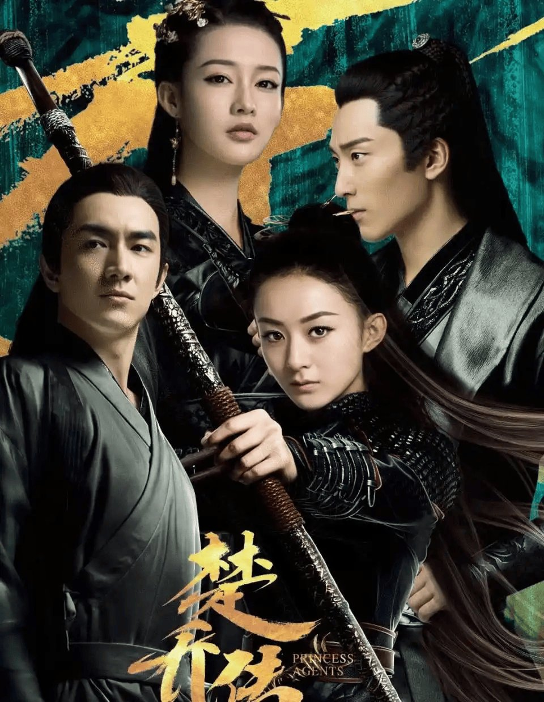

# 冰湖重生把楚乔传的生存线改成了复仇套路

## 刷完前几集我第一反应就一句话

我刷完《冰湖重生》前几集，第一反应就是——这跟《楚乔传》根本不是一个故事了。

前作讲的是怎么活下去，这部讲的是怎么杀回去。

刷的时候弹幕和评论区已经吵起来了。有人说“画面和服化道是真好看，就是剧情节奏太慢，部分情节有点空洞，看着有点费劲”，这话挺中肯的。也有人直接说“足以说明当初剧扑根本不是演员的问题，完全是剧本质量、制作把控、剧集适配度出了硬伤”。

我自己看完的感觉是，画面确实精良，服化道也用心，但故事内核变了。楚乔传里那种在乱世中求生存的紧迫感，在这部里变成了预设好的复仇剧本。

一开始我以为是自己期待太高了，毕竟前作珠玉在前。但刷了几集之后越来越确定，不是期待的问题，是故事走向确实变了。

**这剧跟楚乔传根本不是一个故事了。**

## 楚乔传那会儿讲的是怎么活下来

先说前作。《楚乔传》最抓人的是什么？就是那种生存抗争的劲儿。

楚乔从女奴到将军，每一步都是在乱世里挣扎着活下去、争取尊严。她不是一开始就握着复仇剧本等机会杀回去的，她是先要活下来，再谈别的。

那种“活下去”的紧迫感一直绷着。楚乔面对的是一个随时可能丧命的世界，她的每一个选择都关乎生死。

我记得楚乔传里有很多场景都是在讲“怎么活下去”这件事。从女奴营里挣扎出来，到一步步争取自己的位置，每一步都是被环境逼出来的选择。那些名场面——不管是跟命运较劲还是跟权贵周旋——底色都是“我要活下去”。

这个“活下去”的内核之所以打动人，是因为它接地气。观众能共情那种在绝境里求生的挣扎。

但《冰湖重生》直接跳过了生存挣扎这一层。开局就是大婚、假死、追捕，走的完全是复仇爽剧的路子。

从“活下去”变成“杀回去”，这不是细节微调，是整个故事内核的转向。

前作里楚乔的每一步都是在求生中争取自由，这部里变成了带着预设目标去清算旧账。两种故事的气质完全不同。一个是“活着就是胜利”，一个是“不报此仇誓不罢休”。

## 大婚那天假死跑路这事儿跟前作差太远了

说到具体剧情，第2集那段大婚戏挺能说明问题。

楚乔与燕洵大婚当日，迎亲队伍遭刺客袭击，楚乔中箭“身亡”。燕洵悲痛之后发现楚乔尸身不翼而飞，惊觉她假死逃离，随即下令全境封锁追捕。

这个设定本身就很有复仇剧的味道。大婚、血染嫁衣、假死逃亡——这些都是复仇套路的标准配置。

更关键的是后面那个设定：救赎竟是害死全族的真凶，忠犬面首得知真相崩溃。

这种“你以为的救赎其实是最大的背叛”的套路，在复仇剧里太常见了。但放在楚乔传的续作里，就显得很违和。

楚乔传里楚乔面对的是怎么在乱世里活下来、怎么保护身边的人。她的每一步都是被环境逼出来的选择，不是预设好的复仇计划。

冰湖重生里，故事变成了带着复仇目标去清算旧账的路线。从“被环境推着走”的生存线变成“主动去清算旧账”的复仇线，剧情走向完全不同。

大婚假死这个桥段，放在复仇剧里是标配。但放在楚乔传的续作里，就让人觉得不对味。因为前作里楚乔从来不是那种“策划好一切然后执行”的角色，她是被命运推着走、在绝境里找出路的人。

前面提到那条观众原话说得好：“画面和服化道是真好看，就是剧情节奏太慢，部分情节有点空洞，看着有点费劲。”

我同意前半句。画面和服化道确实精良，制作层面有用心之处。但剧情内核跟前作是两码事。

## 所以这剧到底值不值得追

说句实话，如果你期待的是《楚乔传》的精神延续，大概率会失望。

但如果你把它当一部独立的复仇剧看，制作层面有可取之处。画面精良，服化道用心，这些是实实在在的优点。

问题在于，它挂着楚乔传续作的名号，却讲了一个不同内核的故事。从生存抗争到复仇套路，这个转向太大了。

有观众说“足以说明当初剧扑根本不是演员的问题，完全是剧本质量、制作把控、剧集适配度出了硬伤”，我觉得这话有道理。剧本选择决定了故事走向，而故事走向决定了观众能不能接受。

你觉得《冰湖重生》是《楚乔传》的精神续作，还是借了壳的全新故事？
