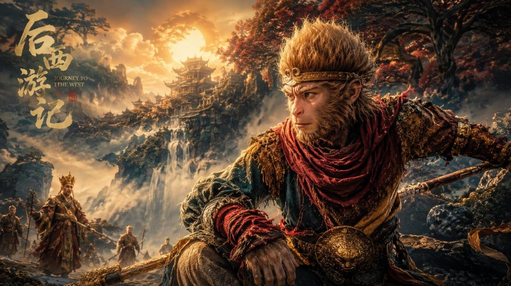
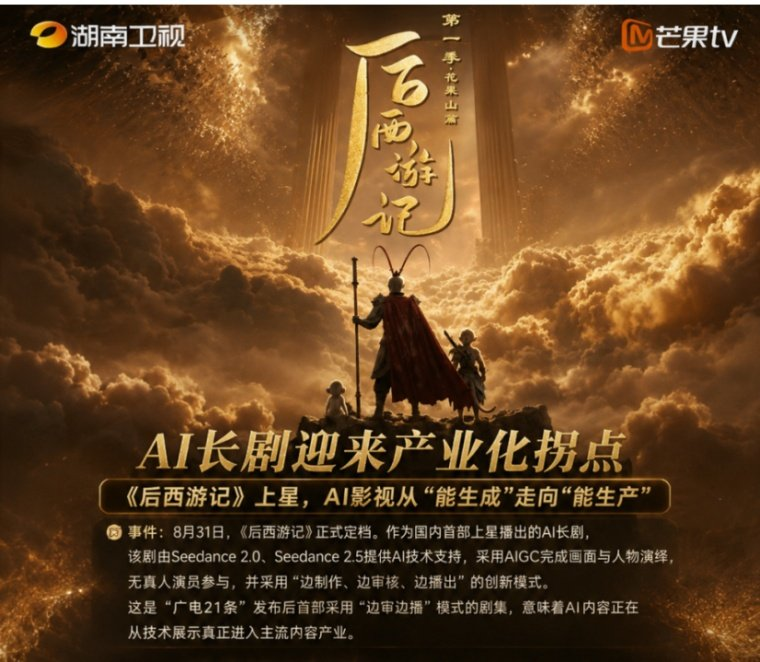
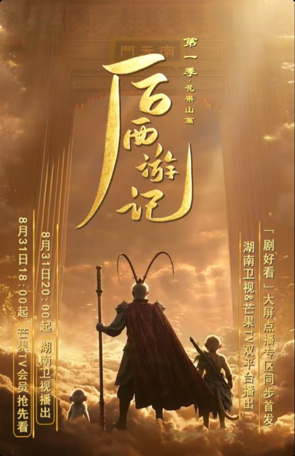
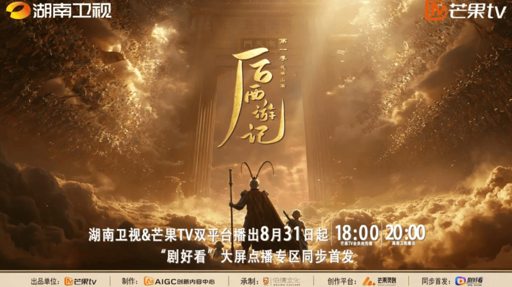

# 《后西游记》30集4个月做完，这账太吓人

## 看完我第一反应就一句话

我刷到《后西游记》那天，第一反应是——这剧全程无真人演员，30集的量，居然4个月就做完了？

说真的，8月31日这天，影视圈确实热闹了一下。湖南卫视黄金档首播，酷云同时段省级卫视收视第一，当天66个全网热搜，话题曝光量超1亿次。微博、抖音、豆瓣、B站、小红书全面开花，连财经和科技媒体都跟进出圈了。

我一开始以为又是营销噱头，点进去看了几集才发现，这剧是真的没有真人演员，全靠AIGC生成画面和角色。30集，每集40分钟，制作周期压缩到4个月，成本只有传统真人剧的十分之一。

**这账算下来我是真愣住了，AI拍长剧，真正撬动的其实是影视工业的成本底座。**

## 30集四个月做完，这账到底怎么算的

先把数据摆出来。30集，每集40分钟，制作周期4个月，成本仅为传统真人剧的十分之一。这不是网传消息，是湖南卫视官方微博发布的。

我看完第一反应是——这速度搁传统剧组想都不敢想。一部30集的真人剧，从筹备到杀青再到后期，半年起步都算快的。4个月？连选角都不一定够用。

但《后西游记》做到了。它不是靠粗制滥造压缩成本，而是把传统实拍条件下难以实现的大场面特效和复杂镜头调度，直接在AI语境下落地了。花果山的桃源之景、罗刹国的冷冽奇诡，这些放传统剧组里光搭景就得烧掉一大笔钱。

不过观众对内容本身争议挺大的。有人觉得画面精致到看不出是AI做的，质感逼真；也有人觉得角色表情僵硬、剧情推进生硬。

有观众直接说了：“大家并不是看不懂剧情，而是真的很难接受这种突然把人变木讷的操作方式。”

这话挺到位的。观众不是嫌剧情看不懂，是觉得叙事方式还差点意思。但话说回来，工业层面的成本突破是实打实的——4个月、十分之一成本、上星播出，这三个数字放一起，搁谁都得愣一下。

## 摄影机消失后，剧组变成了啥样

我看完之后最好奇的一件事就是——没有摄影机的剧组，到底长什么样？

据素材介绍，《后西游记》深度依托芒果灵创AIGC内容创作平台，组建了近百人的制作团队，搭建了全链路的AI制作体系。传统剧组里的摄影、灯光、实景搭建，被算力、模型、云端协同取代了。

这事儿我觉得得两面看。一方面，花果山和罗刹国这种神话场景，用AI生成的确比搭实景便宜太多了，而且视觉完成度还挺高，有观众说特效拉满、质感逼真，根本没看出是AI做的。

另一方面，摄影机消失这件事确实引发了AI取代人工的争议。但我看完觉得，这更像是工作流的迭代，不是彻底淘汰人。近百人的团队还在，导演、美术主创还在，只是干活的方式变了。以前扛着摄影机满山跑的人，现在可能坐在电脑前调参数了。

技术变了，但只要画面质感立住了，观众照样能看进去。有观众评价：“画面精致到根本看不出是AI做的，质感太逼真了。”

这说明AI做出来的场景，观众是认的。壳变了，只要视觉底子打牢了，这事就不算白干。

## 这账本以后怎么算，你站哪边

说到底，《后西游记》这30集4个月、成本十分之一的数据，摆出来就是里程碑式的突破。

AI长剧在情感表达和内容逻辑上还有很长的路要走，这个我得实话实说。但低成本高效率的工业化量产大门，已经打开了。以后这种模式会不会成为常态？会不会有更多剧组走这条路？我觉得大概率会。

所以问题来了——你觉得AI拍剧以后是会让好剧越来越多，还是会让流水线作品霸屏？

你是哪一边？
