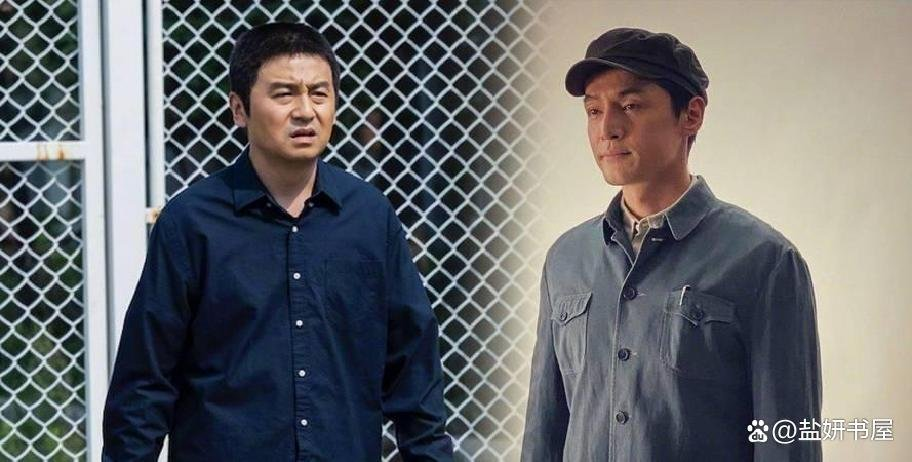
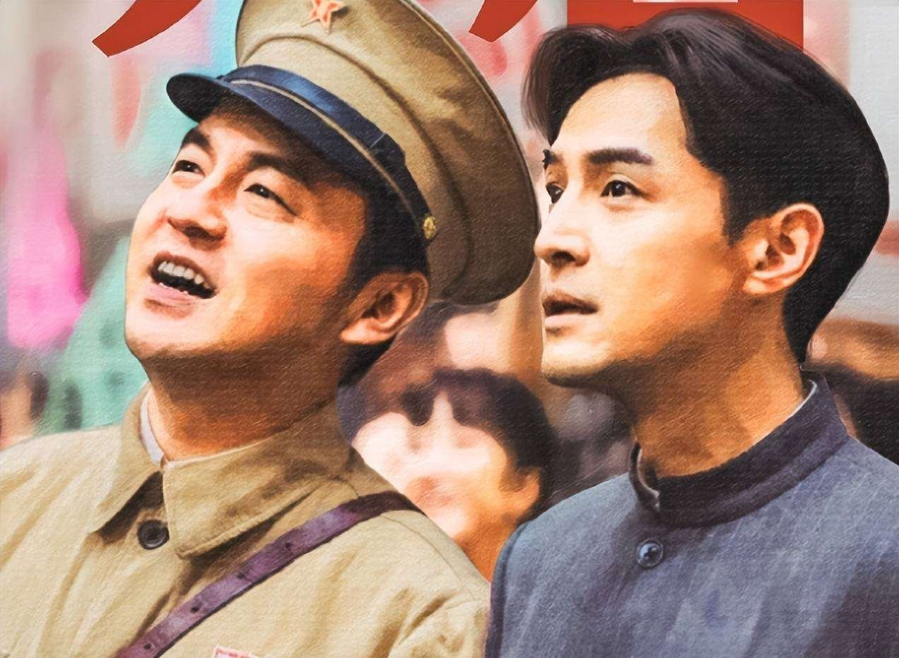
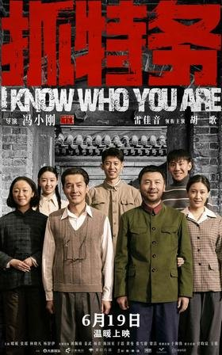
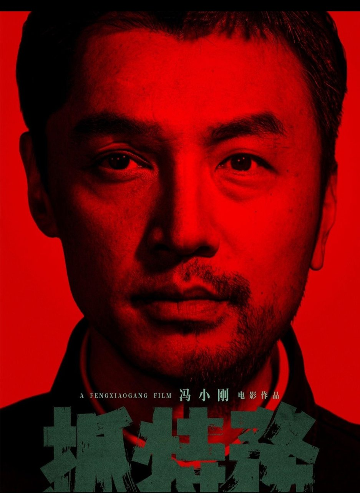
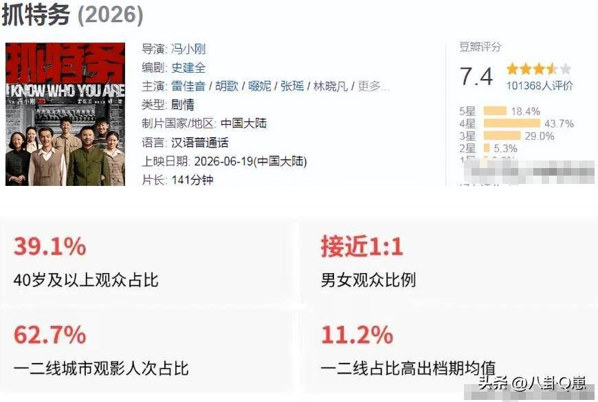
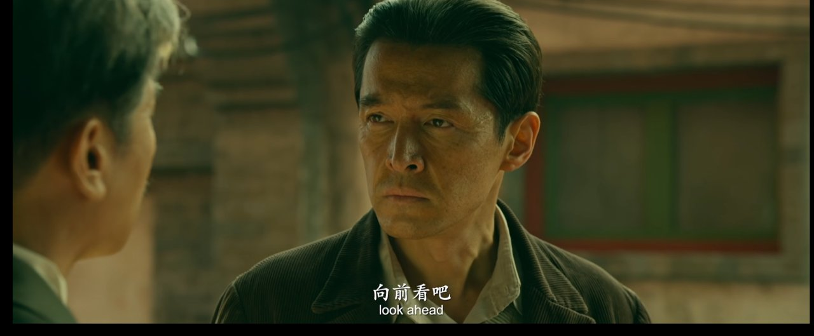

# 《抓特务》撑四十年不崩，底牌是原作者

## 看完第一反应就一句话

我刚看完《抓特务》从影院出来，脑子里就一个念头：这片子能撑住四十年跨度不散架，最该感谢编剧栏里那两个名字。

刷豆瓣的时候看到一条短评，写着"我看完后真的感谢导演，编剧和演员们"，我当时就点了赞。但说实话，我看完最想单独拎出来感谢的，是编剧。

还有人形容看片子的感受："那些像武林高手过招的惊险时刻，总是让我屏气凝神，手心捏汗"。这感觉太准了。我看的时候有好几场戏都是攥着手看完的，紧张感全来自两个男人隔着一张桌子、隔着一条胡同，眼神交汇时的暗流涌动。

雷佳音演的肖大力是个派出所所长，胡歌演的冯静波是个小学教员。一个盯了另一个四十年，从1949年盯到1988年。冯小刚导的，141分钟，两个家庭两代人。这种跨度放在国产片里，能不崩就已经赢一半了。

## 编剧栏那两个名字才是真底气

我后来去翻了翻这片子的底子，发现编剧栏写的是张策和史建全。张策是《无悔追踪》的原著作者，史建全是1995年那部豆瓣9.4分剧版的编剧。

等于三十年前把这个故事写明白的人，现在又亲自来改电影剧本了。

这个信息对我来说太关键了。你想想，四十年跨年代叙事最容易崩在哪？后半段。前半段好写，建国初期那股子紧张劲儿天然有张力，开国大典刚入城，新派出所所长发现小学教员有问题，这种开场自带悬念。但到了后面，时代变了，人物动机容易飘。

为什么飘？因为写剧本的人如果不了解人物到底怎么想的，写到后面就只能靠编。人物为什么做这个选择、为什么转变，没有内在逻辑撑着，观众看着就觉得别扭。

但原作者不一样。张策写这个故事的时候，人物从哪来、到哪去、为什么做这个选择，他心里是有底的。史建全三十年前就把这故事在剧版里捋过一遍了，哪些地方该浓墨重彩、哪些地方该留白，他清楚得很。两个人搭在一起改剧本，等于是把三十年前写明白的东西再夯实一遍。

**我看完就一个感觉：这故事没被改飞，全靠写它的人自己来改。**

冯小刚在2024年上海国际电影节上说过，自己三十多年前就跟王朔一起买了这个项目的电影改编版权。三十多年啊，他攥着这个故事不肯放手。我看到这个信息的时候挺感慨的。冯小刚继《芳华》之后隔了好几年才再拍年代片，回来就挑了这个本子。一个导演手里攥着一个故事三十多年才拍，最后拍的时候还把原作者和老编剧都请回来了，这操作在当下的IP改编里真的不多见。

故事横跨1949至1988年，两个家庭两代人的命运流转。肖大力和冯静波做了四十年的邻居，一个天天盯着你，一个天天被盯着，两个人活成了彼此生活里最紧密的存在。这种人物关系要是没有扎实的文本撑着，很容易写成流水账——今天抓一下，明天藏一下，四十年就稀里糊涂过去了。

但你看正片，每一段年代转换都不是硬来的。人物本身的性格和处境在那个时代里自然演化，不是硬靠"时代变了所以人物变了"来推。这就是原作者操刀的好处，他知道这个人物骨子里是什么人，不会为了戏剧效果硬扭。

## 有人说不如老版，但你想想这底子还在

豆瓣上有人直接写了："《抓特务》比《无悔追踪》差太多"。我第一反应是这比较挺合理的。老版是9.4分神剧，体量大，铺得开，人物弧光可以慢慢展开。电影就141分钟，要把四十年的故事塞进去，肯定得砍东西。

但豆瓣7.4分放在同类型片里，我觉得已经是文本扎实那一档了。差距更多来自时长限制，不是文本质量的问题。

你看胡歌在首映礼上说的那段话，大意是大力像静波头上一座山，永远让他喘不过气来，但他从心底佩服大力。这种人物张力不是随便找个编剧就能写出来的，它直接来自原著的底子。张策当年写的就是这种纠缠了一辈子的关系，史建全在剧版里也把这种关系打磨过了，到了电影版两个人一起再夯实一遍。

IP改编最大的风险是什么？改着改着原著的魂没了。换了编剧团队，每个人对人物的理解不一样，很容易把一个立体的人物改扁了。这片子最聪明的地方就是让写故事的人自己来改，核心人物关系没有丢。

也有观众觉得这片子被低估了。首映礼后口碑逆袭，上座率连续三天超35%。豆瓣7.4，好于84%的剧情片。说明看过的观众是认的，只是可能没赶上预期的热度。

**看完我就想说，这四十年的故事，真没白讲。**

那我就抛个问题：你觉得电影改编该让原作者全程介入把控，还是交给新编剧大胆重构？
