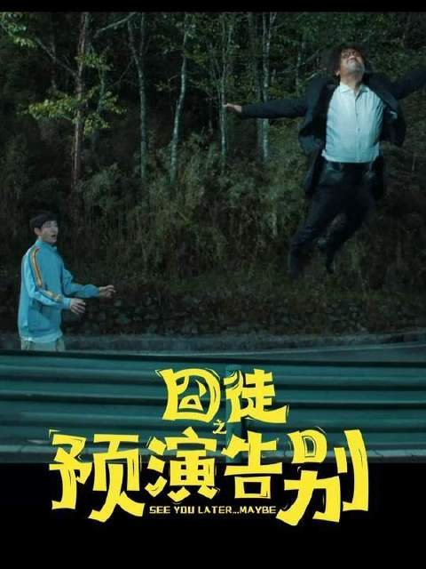

# 《囧徒之预演告别》的荒诞感全因太真实

刷完《囧徒之预演告别》，我第一反应就一句话：这剧的荒诞感根本不是演出来的，它就是把卖惨营销那套完整链条原样搬上了屏幕。

点开之前，我以为又是那种土味搞笑路子。毕竟贾冰嘛，印象里就是春晚小品那种风格。结果一口气刷完六集，我愣是没动一下手机。

去评论区一看，发现我不是一个人。有观众直接说："点开前觉得这什么土味喜剧，点开后根本停不下来。"8月31号腾讯视频独播，才更了六集，热度直接破万，稳坐喜剧榜第一，平台评分冲到9.5。说实话这数据我一点都不意外，因为它是那种真的好笑又好哭的剧。

有位观众写了句评价，我觉得说得特别到位——"这部剧不仅仅是一场喜剧，更是对当代社会、个体困境以及自我救赎的深刻探讨。"我一开始还觉得这话是不是说太大了，刷完才发现人家没夸张。

## 直播假自杀那段到底有多真

剧情核心其实一句话能说完：落魄作家方浩文策划了一场直播假自杀来炒热度，结果被铁杆粉丝别凡误以为真，拼了命跑来救他。

但让我坐不住的，是剧里呈现的那些直播行业操作——带剧本、卖惨博同情、坑位费、露出时间——每一步都是现实中正在发生的事。

你看方浩文在那算计流量、排练情绪爆发点的时候，那种熟悉感真的让人后背发凉。因为你在短视频平台上刷到过太多类似的画面了，只不过那些你以为是"真的"。

有观众直接点破了这层窗户纸："《囧徒之预演告别》：不是直播太卷，是真假难辨，失去了顾客的信任。"

还有人说得更直白："这样的情况我踩过太多回，现在真不太敢在直播间下单了。"

我看到这条的时候特别有共鸣。剧里那些卖惨话术、那些精心设计的情绪节奏，你换个平台换个主播，不就是每天都在上演的日常吗？

**荒诞感来自你发现剧里每一步都能在现实里对上号。**

## 说白了它荒诞就荒诞在太真了

这部剧官方定位叫"荒诞是壳，治愈是核"，我觉得说得挺准的。它用一层荒诞的外壳，把网红经济和流量造假那些事给撕开了，让人看着看着就破防。

别凡有句台词我印象特别深——"俺想在住院楼下卖盒饭陪妈妈"。就这么朴素的一句话，被观众评价说"不知告别为何意的人却更懂告别"。一个不懂什么叫告别的人，反而做出了最懂告别的事。这种反差就是角色本身的真实质感带来的。

而且最绝的是什么？剧里演的那些卖惨套路，戏外真在上演。你在直播间里见过的那些"家人们今天最后一天"的戏码，跟方浩文策划假自杀的逻辑一模一样。先制造一个情绪爆点，然后用这个爆点去换流量、换变现。

现实跟剧情撞在一起，才是这部剧热度破万的原因。它太真了，真到你笑着笑着突然觉得自己可能也是被收割的那个。

我自己看到第四五集那段的时候，真的有一瞬间分不清自己是在看剧还是在看某条热搜的还原现场。那种感觉挺微妙的，又好笑又有点心酸。

## 那你站哪边

《囧徒之预演告别》最厉害的地方就在这：它把现实里那些魔幻操作原封不动拍出来。你笑的是这玩意儿居然是真的。

所以最后问一句：你觉得直播卖惨，是真有苦衷还是纯套路？
