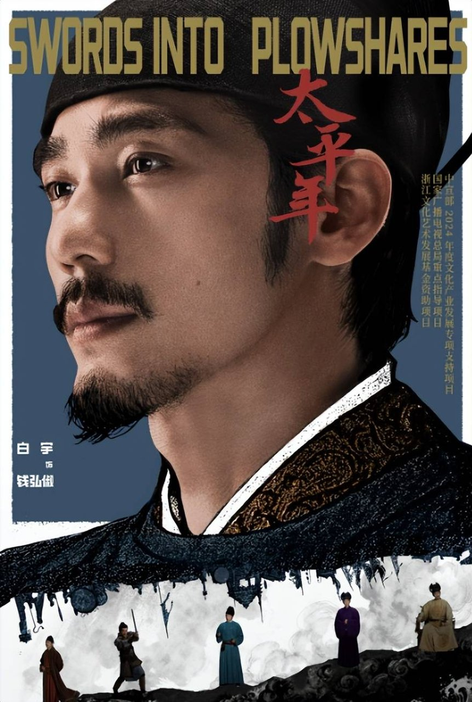
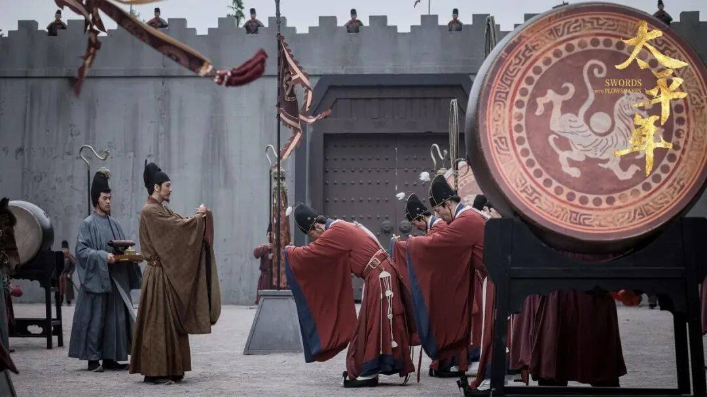
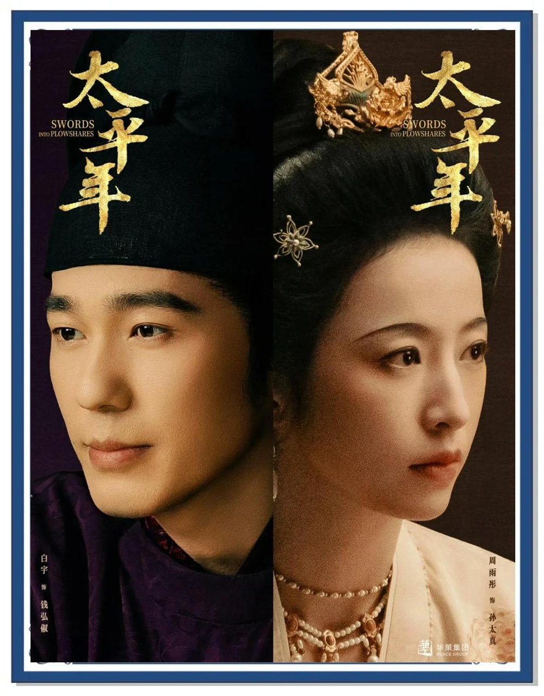
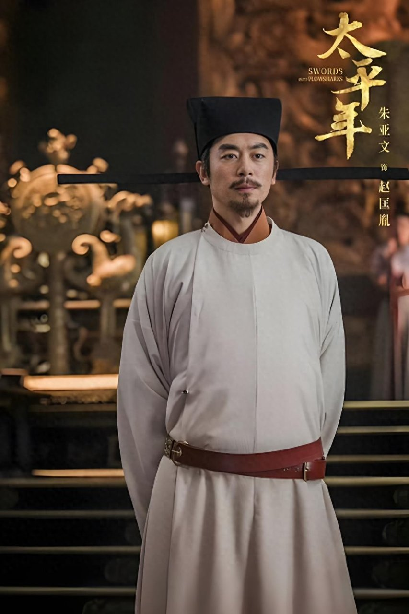
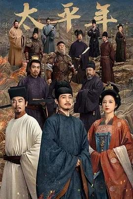

# 《太平年》里的人不是编剧凭空编的

## 看完我第一反应是赶紧去翻史书

我看完《太平年》第一反应不是去豆瓣打分，而是连夜去翻了五代十国的史料——钱弘俶这个角色写得太真了，真到我觉得编剧不可能凭空编出来。

我一开始以为钱弘俶是编剧虚构的主角，毕竟五代十国这段历史太冷门了，大多数人连那几个政权都数不清楚。但追着追着就觉得不对劲——这个角色的每个决策都太"沉"了，不像是为了戏剧效果设计出来的。

弹幕和短评里吵得挺热闹，有人说这角色写得太好了，好到不像编出来的，也有人觉得编剧是不是开了天眼。我当时追剧就有同感，钱弘俶临危受命扛起吴越国主重任那一整段，人物的每个抉择都太扎实了，扎实到让人心里发虚——

**一个虚构角色不该有这么重的分量。**

结果一翻史料，好家伙，他临危受命的经历几乎跟史书对得上。角色好看，就因为照着史书写。

## 钱弘俶临危受命这段是真的有出处

先说钱镠，吴越国的开国君主。这人出身市井，早年靠贩私盐为生，唐末天下大乱的时候投身军旅，凭实力平定了浙东之乱，一步步掌控了两浙之地。剧中钱氏家族的行事逻辑，全有史料支撑。

钱镠定下"善事中原，保境安民"的祖训，这六个字是钱家几代人的路线。

他征调民夫用竹笼装石修筑捍海石塘，挡钱塘江潮水。他拒绝填平西湖修建王宫，说百姓靠湖水生存——这些在剧中出现的情节，都能在吴越国史料里找到对应记载。

我追到修海塘那段的时候，心里就嘀咕：这不像编的。一查果然不是。钱镠这个人，历史上就是这么干的。

然后是钱弘俶。他在政权动乱时扛起吴越国主重任，剧中那条"保境安民"的路线，是钱氏几代君主一脉相承的真实选择。编剧没加戏，历史就这么写的。

还有钱弘佐，十三岁登基，面对骄横武将沉稳隐忍，减免赋税安抚民心。剧中少年君主那段戏贴合正史脉络，不是编剧拍脑袋加的爽文桥段。

一个十三岁的小孩坐在那个位子上，底下全是刀，他还能稳住——这种事编剧想编都编不出来，因为历史就是这么离谱。

## 那么多配角名字也不是随便起的

看片尾字幕和官方资料，全剧230多个有名有姓的角色，绝大多数史有其人。编剧团队核对了超300万字史料，逐个对过史书。

赵匡胤、郭荣（柴荣）这些角色的经历也贴合正史脉络。赵匡胤建立北宋，严明军纪改革弊政；郭荣未竟的事业由赵匡胤延续——剧中这条线有据可查。

有观众说了一句我特别有共鸣的话：

"我们至今还在争论——那0.5秒的停顿，是兄弟和解，还是人格裂缝"

角色这么复杂，就因为历史人物本来就有好几面。剧中江南文人、乱世权臣这些配角，也都能在五代十国历史中找到原型对应，连名字都不是随便起的。

我追剧有个习惯，遇到觉得"这人不像是编的"的角色就去查。结果查一个对一个，到后面我都麻木了——

**这剧里的人，基本上都是真的。**

## 历史本身比编剧会写多了

有人说了句话我特别认同："你看完不会立刻写影评，而是默默给老家父母打了个电话，声音比平时软三分。"

这种后劲来自角色身上真实的历史重量。钱弘俶保境安民的选择，历史上确实如此，剧中没有魔改。这种"不编"，反而是角色最好看的地方。

也有观众说"但《太平年》完美避开了所有雷点，兼具格局与细节、权谋与温情"——我觉得这话说到点子上了。角色好看就因为照着史书写，五代十国那些真实人物的抉择与命运本身够精彩。

历史本身比编剧会写多了。编剧照着写就行。

你觉得《太平年》里角色的历史还原度够不够？A.够绝，跟史书对得上 B.还差点意思
