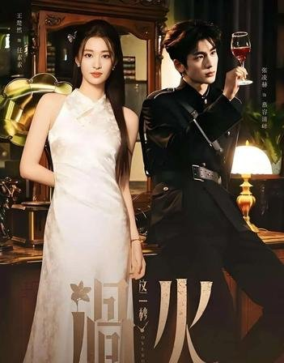
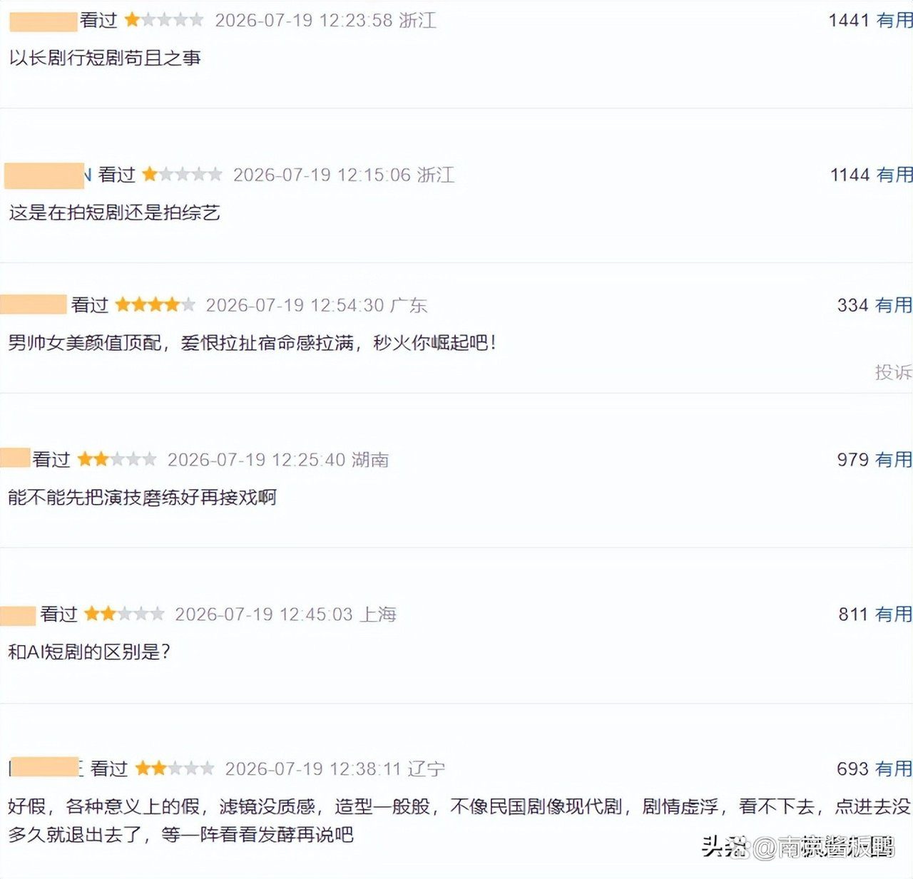
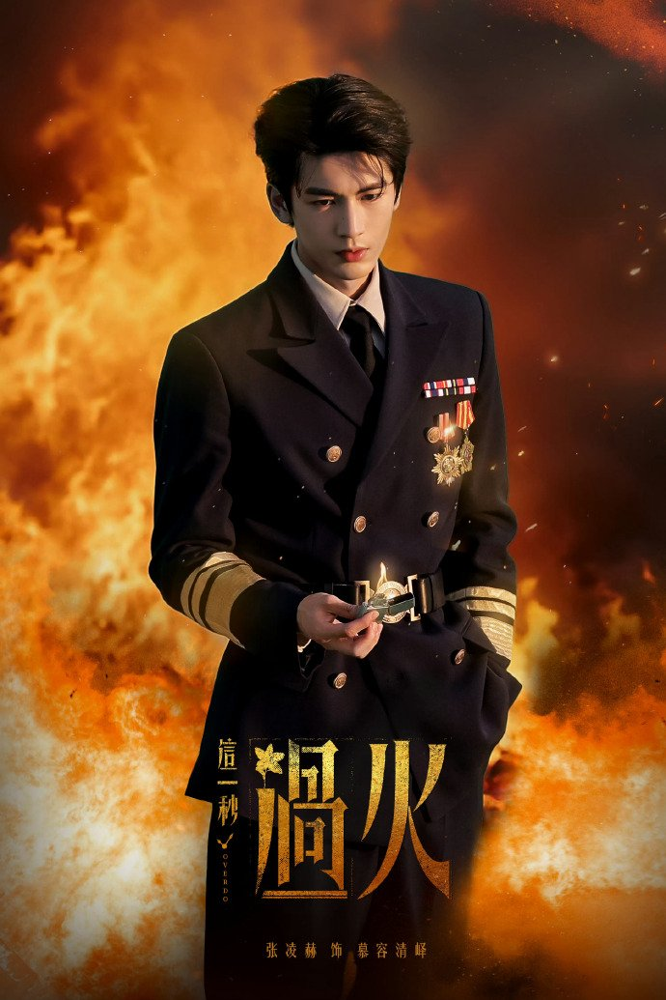
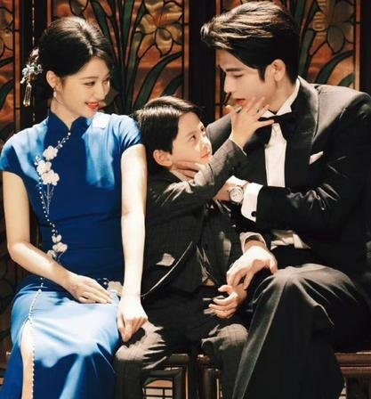

# 《这一秒过火》大结局这转折真没铺好

刷完《这一秒过火》大结局那晚，我躺在床上翻来覆去，脑子里就一个念头：这转折也太硬了吧。

不是说我没被虐到。男主慕容清峄最后跟真凶同归于尽那场戏，火海里他弥留之际幻想跟任素素重来一次，说实话我眼眶是热了一下的。但那股劲儿过去之后，越想越觉得不对劲——他为什么非得走到这一步？前面那些集里，我好像没看到足够多的铺垫让他"必须"选这条路。

## 看完大结局我第一反应就一句话

弹幕和评论区吵成一锅粥了。有人觉得这个结局悲壮、有民国虐恋那味儿，"他给了所有人结局，却没给自己结局"这句话确实戳人。但也有不少人和我一样觉得突兀，甚至有人直接弃剧了。

我翻了翻豆瓣短评，看到有观众写"弥补了我没看过短剧的遗憾，太土了"，还有人吐槽"按照短剧来说节奏太慢，屏幕太宽"。这些话虽然主要针对整体质感，但放到大结局这段也成立。节奏忽快忽慢的问题，在最后几集里集中爆发了。

33集追下来，前面拉扯了那么久，到了该收束的时候反而急刹车。男主突然就决定同归于尽了，我当时的反应是——啊？就这？前面铺了那么多爱恨纠葛，最后用这种方式收尾，感觉像考试最后五分钟才开始写作文，来不及了就草草交卷。

## 同归于尽怎么就硬凑上了

先说大结局发生了什么。33集正片收官，慕容家兄弟与李家尽数陨落，男主慕容清峄选择与真凶同归于尽，最后只剩女主任素素和儿子乐安母子幸存。官方还同步放了一条IF线番外，让两人在"如果一切重来"的世界里过上平凡日子。

问题出在哪呢？我从剧情逻辑上捋了一下。

这部剧改编自匪我思存的小说《如果这一秒，我没遇见你》，原著里的情感逻辑链条是完整的。但剧版改编的时候，为了制造爽点和戏剧冲突，对一些关键情节做了改写。有原著解析视频指出，剧版在流产提离婚、前女友扇脸这些情节上做了"爽点缝合改写"。

改写本身不是不行。但改完之后，男主走向"同归于尽"这条路的动机链条就断了。前面他经历的那些事被改得七零八落之后，观众很难建立起"他为什么会走到这一步"的情感因果。他最后选择牺牲，看起来更像是编剧需要一个悲壮结局来收尾。

有观众直接批评"台词的设计更是槽点满满，生硬的对话让人感到尴尬"，这个感受我在看最后几集的时候也强烈体会到了。同归于尽那场戏，台词写得太满了，恨不得把"我要为你牺牲"几个字贴脸上。好的悲壮感是角色什么都不说，观众自己就懂了。说太满了反而泄气。

**同归于尽变成了制造悲壮的工具，角色走到那个位置上却不是被剧情推过去的，是被编剧拎过去的。**

## 乱世宿命感这块它确实拍出来了

说了这么多不是的地方，也得讲讲它做得好的部分，不然不公平。

前面那些集里，慕容清峄和任素素在乱世中爱恨拉扯的宿命感，是真的拍出来了。两个人身份错位、灭门仇恨横在中间，想爱又不能好好爱的那种拉扯，追的时候确实上头。这也是大家一边骂一边追的原因，热度数据摆在那里，连续14天省级卫视收视第一不是白拿的。

男主最后选择同归于尽，初衷里那种想保护任素素的真诚，我是能感受到的。角色本身不是没有感情基础走到牺牲这一步。问题出在执行层面——转折太急了。前面铺垫没跟上，台词也太直白，把本来可以很动人的东西给稀释了。

火海那段，慕容清峄弥留之际幻想和任素素在火车上紧握彼此的手驶向远方，这个画面本身是好看的。但如果前面多花两三集把他的心理变化铺一铺，让"同归于尽"这个选择看起来是水到渠成而不是突然蹦出来的，效果会好太多。

所以我现在也很纠结。一边觉得结局虐得我心口疼，一边又觉得这口疼来得不够理直气壮。它明明有能力把这条线铺好，却偏偏在最后一步偷了懒。

你觉得慕容清峄最后同归于尽这段，是全剧的高光时刻，还是靠牺牲硬凑出来的悲壮？
