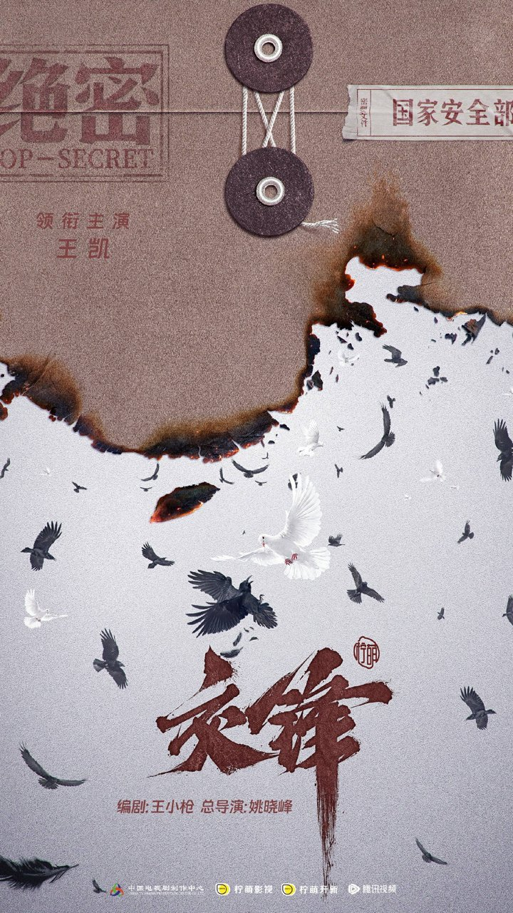
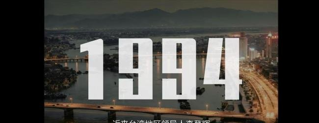

# 《交锋》这剧，赢在把真实案件拍透了

看完《交锋》前四集，我第一反应就是——这剧太实了。

你看完会觉得"原来隐蔽战线日常长这样"的那种实。刷到有观众说，"不过，至少前四集给我的感觉是，这部剧没有把观众当成傻子"，我特别认同。这剧没给你整花里胡哨的滤镜，也没上来就灌狗血，就是老老实实把真实案件掰开了给你看。

我看完一直在想，这剧最大的价值可能不在戏剧冲突有多猛，它厉害的地方是把隐蔽战线的残酷日常给还原了。

## 看完《交锋》我第一反应就一句话

先说我为什么觉得"实"。

这剧是国家安全部主导创作的，剧情取材于国内多份解密的真实案件。以一桩世纪之交的泄密大案为核心，讲的是九十年代末闽州市国安局一对师徒横跨二十年的较量。国安部主导创作意味着什么？意味着那些案件细节、侦查手段、间谍的套路，不是编剧坐在家里瞎编的，是有真东西打底的。

有报道说这剧被称为"国安题材尺度最大的国产剧"，40集一刀不剪。这个说法我目前没看到官方正式确认，但从播出来的内容看，尺度确实不小。码头抓捕那段，境外间谍巧妙脱身，一场横跨二十年的正邪较量就此拉开序幕——你看的时候会觉得，这种事情可能真的发生过。

## 这剧最戳我的就是俩字：真实

然后是那些场景细节。街道、小店、日常物件，全给你还原了九十年代的味道。有博主说《交锋》"把街道、小店、日常物件一一还原，时代质感满满"，我看的时候确实有这感觉。真在用心做年代感。

剧里有个细节我印象特别深，九十年代的传统侦查模式和新时代的现代国安技术一对比，差别就出来了。老一代靠走访盯梢、靠经验，新一代靠大数据和网络溯源。两代人查的是同一个悬案，这种新旧交替的质感特别真实，你能感受到时代在变，但守护的东西没变。

再说王凯。这次他演马憩，为角色减重15斤，搞了个泡面头糙汉造型。刚看到预告的时候我还嘀咕了一下，怕会不会太刻意。结果正片一出来，网上普遍评价是"糙而不油""没有老登味"。有网友说"野生感拿捏到位，糙而不油，眼神满是故事"，还有人说"角色的沧桑感是经历带来的，不是刻意装出来的"。

我特别认同后面这句。你看马憩那个疲惫的眼神，那个沧桑是角色本身经历给你的。一个在隐蔽战线干了几十年的老侦查员，他不可能还是白白净净的样子，那种疲惫和坚韧是刻在骨子里的。王凯这次减重，是为了贴合角色那个状态。

**我看完就觉得，这种写实感是靠扎实的案件细节和生活流质感慢慢渗出来的。**

你跟着马憩走街串巷，跟着他翻尘封的案卷，那种沉浸感是慢慢渗进来的。

## 说实话，《交锋》这地方门槛确实有点高

夸了这么多，也得说实话——这剧追剧门槛确实不低。

人物关系特别复杂，支线多，各方势力明暗拉扯，你要是边玩手机边看，大概率跟不上节奏。有人就因为这个给了差评，我刷到一条观众原话特别扎心："没想到，这么一部质量扛打的国安剧，居然会招致这么多莫名其妙的差评。"

我理解那些觉得门槛高的人。但说白了，这种门槛就是写实带来的副作用。真实案件就是复杂的，间谍不会为了让你看懂就把计划写在你脸上。真实世界里，线索是碎片化的，信息是混乱的，你不可能三分钟就搞清楚谁是谁。

这剧开篇就"明牌"了，直接亮明各方身份，不跟你玩猜身份那一套。悬念不在"他是谁"，而在"怎么博弈"。这个选择挺大胆的，但也意味着你得沉下心来看。师徒二人通过尘封案卷中的细碎线索，逐步揭开潜伏在本土的境外间谍网络——这个过程本身就是慢热的，急不得。

不过话又说回来，这种基于真实的悬念才最抓人。

**有观众说得好——"接下来的36集，我最想知道一件事，内鬼到底是谁。"**

你看，就是真的想知道真相的那种抓心挠肝。因为你前面看到的那些细节、那些铺垫，都在暗示内鬼可能就在身边，这种恐惧感比任何反转都来得实在。

## 最后抛个题，《交锋》你站哪边

看完前四集，我最大的感受就是：这剧好在它敢把隐蔽战线的残酷日常掰开揉碎了给你看。靠的就是真实。

你看那些角色，没有脸谱化的好人坏人，都是在各自立场上做选择的人。有人第一集就下线了，但那场戏的冲击力够你记好久。这种角色塑造方式也是写实的一部分——真实世界里没有人会等你准备好了才出场，该走的时候就走了。

它尊重你的智商。能有部剧愿意慢下来，把真实的东西一点一点铺给你看，我觉得挺难得的。

所以想问问大家：你更喜欢这种基于真实案件的硬核写实，还是偏好强戏剧冲突的爽剧模式？来评论区站个队。
