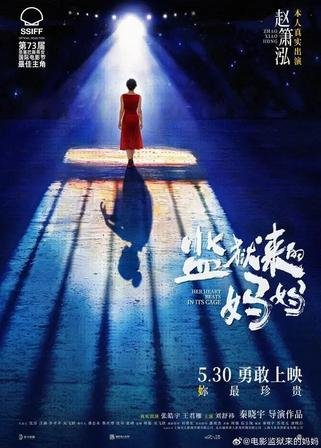
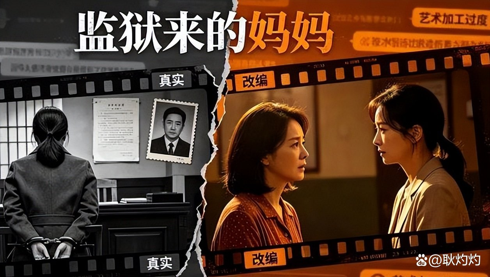
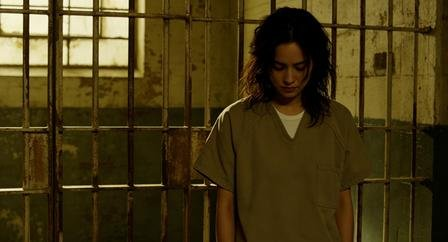
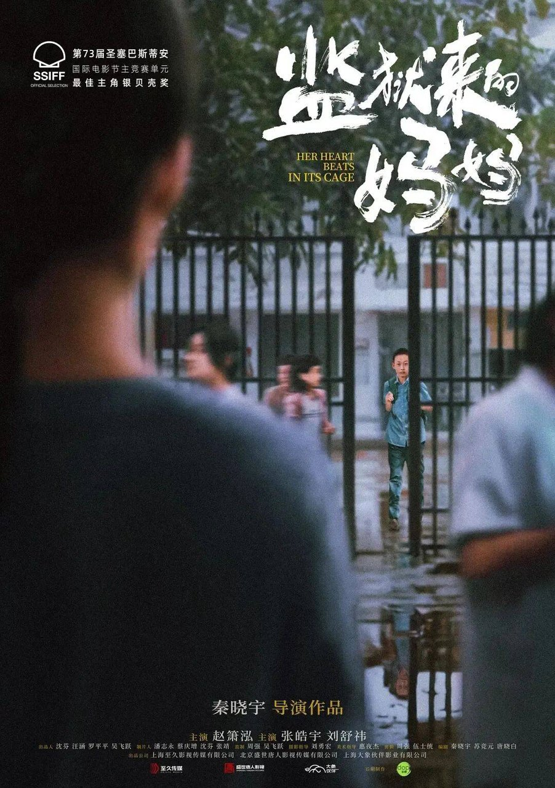
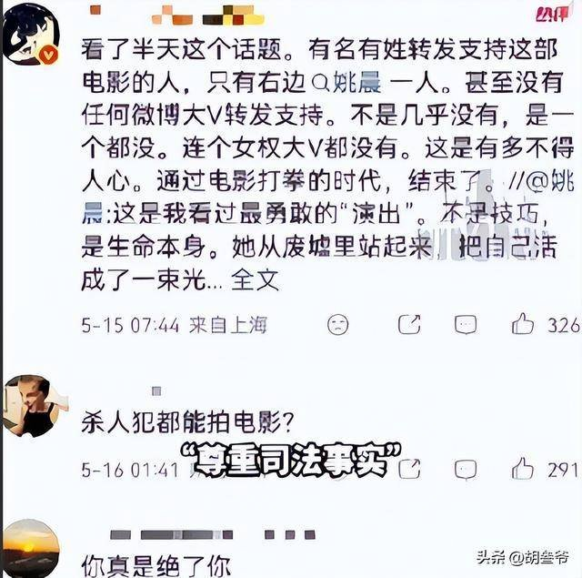
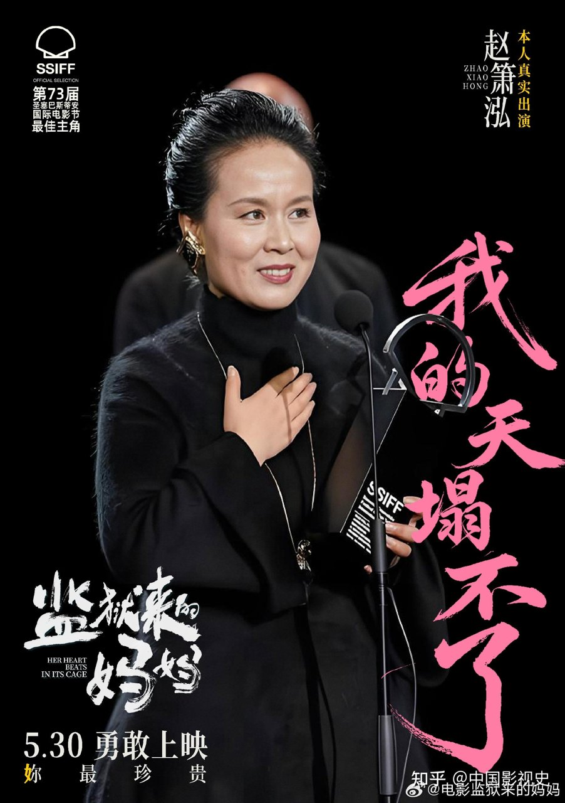

# 《监狱来的妈妈》获奖，经不起裁定书对比

我刚刷到《监狱来的妈妈》拿了国际奖的消息，第一反应是这片子终于熬出头了，以为是个讲母爱的好片。结果点进去看了一圈观众议论，发现风向完全不对。有人直接甩出一句狠话：“你们守的根本不是电影质量的门，你们守的是资本财阀的家门”。我一开始还觉得是不是大家太激动了，特意去翻了一下陕西高院的终审裁定书，对比完电影里的情节，整个人都不太好了。它对案情的改写，感觉已经超出了艺术加工的范畴，更像是对着司法文书在改写。

## 裁定书跟电影到底差在哪

这事儿得掰扯清楚。裁定书上白纸黑字写的是“因琐事持刀故意伤害致死”，可电影里演的却是“长期家暴下失手反抗”。这差别可太大了。一个是普通纠纷升级的恶性犯罪，一个是长期受虐下的被迫反击。我看的时候就在想，这俩怎么能混为一谈呢。

判决书里明确否认了家暴情节，电影却把这当成了核心冲突。更让人坐不住的是，原型赵晓红（片子里叫赵箫泓）还亲自出演了。这操作我看的时候都愣了，当事人自己演一个被改写过的自己，这感觉太怪了。看到这我都有点恍惚，就像有观众说的：“看到这篇评论，我真有一阵恍惚：今夕是何年”。

有人觉得，电影嘛，肯定要有点戏剧冲突，稍微改改也正常，不然平铺直叙谁看啊。也有人说，这改得也太多了，连案子定性都变了，这不叫改编叫编故事，对受害者太不公平。说实话，这片子在关注反家暴议题上，确实有点探讨价值，能让更多人关注到这个社会问题，出发点可能是好的。但问题是，你不能为了主题，把司法文书认定的事实给改了，这代价确实有点大。

**我看完就觉得，这已经不是加滤镜了，是把原图都给换了。**

## 这种改写怎么就拿了国际奖

那它怎么还能拿国际奖呢？我琢磨了一下，国际电影节评选可能更看重叙事张力和社会议题。他们评片子的时候，未必有条件去核查咱们国内的司法文书。这种改写能拿奖，可能就是吃了信息差和题材红利。

反家暴题材在国际上一直很受关注，评委看到这种反抗暴力的故事，容易共情，也容易被题材本身打动。就像有观众提到的：“读者面对此类作品时，不妨多问一句：这个故事是否让我更理解了某个系统性困境”。这话听着挺有道理，但放到这片子上，总觉得哪里不对劲。因为困境是真的，但故事是改的，这就让人很别扭。

就算国际评委不知情，这也掩盖不了它在国内司法语境下对事实的改写。拿奖不代表改写就是对的。从国内观众的反应来看，大家对这种改动司法事实的行为还是很抵触的。我觉得，拿奖是个光环，但不能拿光环当挡箭牌。评委给奖可能只是觉得故事感人，但他们不知道这故事背后的真实情况是啥样。

## 这事到底该怎么看

电影想表达艺术张力可以理解，但在司法事实面前越界，这就有点说不过去了。把故意伤害致死改成反家暴失手，这已经不是加滤镜了，是换了个底片。艺术加工也得有个度，不能把黑的说成白的。

这事到底该怎么看？你觉得电影改编真实案件，底线是尊重司法文书，还是追求叙事张力？
