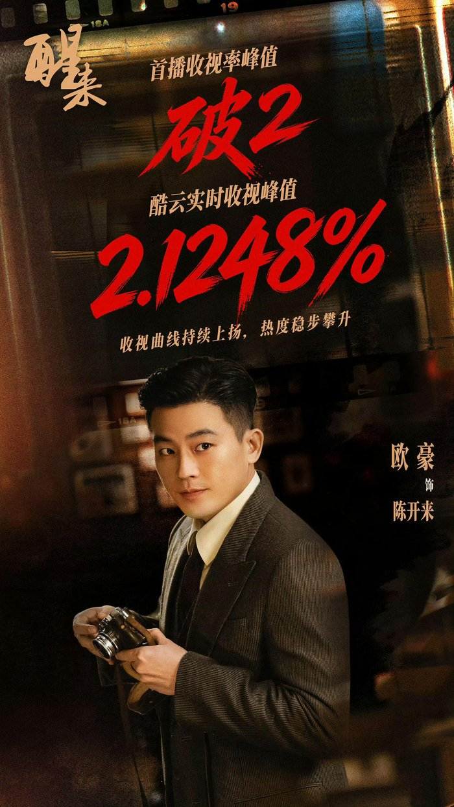
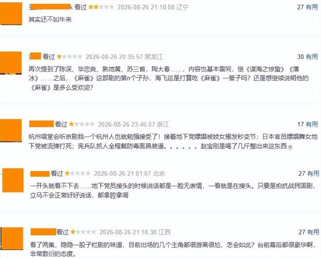
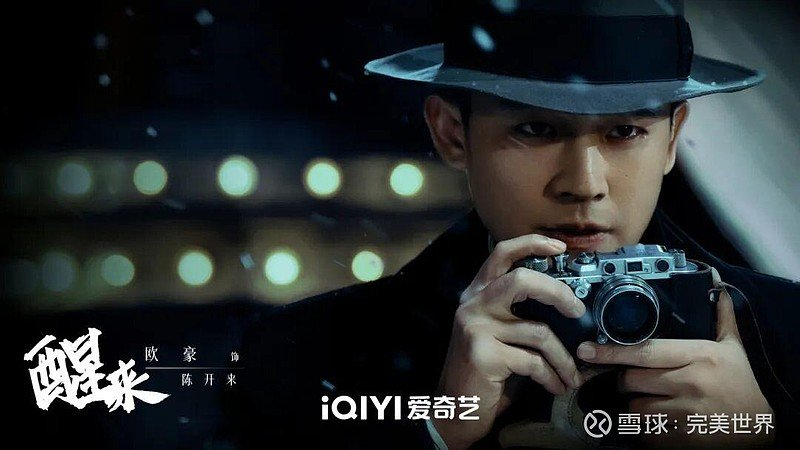
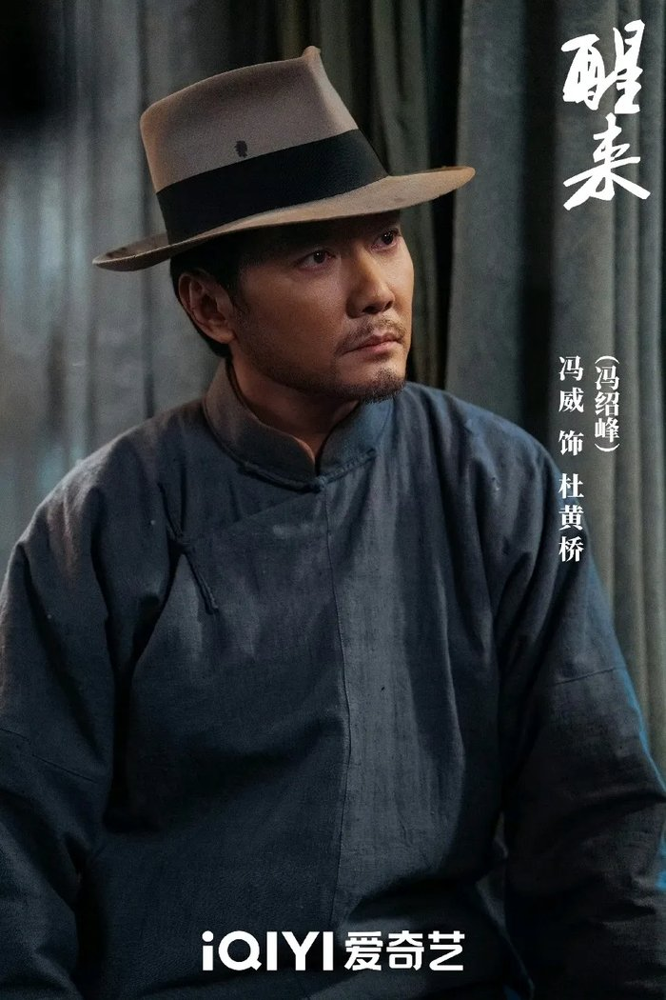
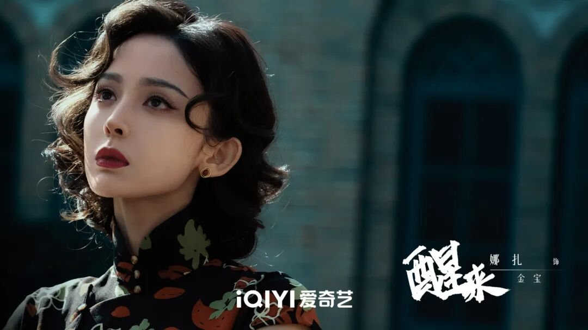

# 《醒来》赢了遥控器却输了键盘

## 看完我第一反应就一句话

我看完《醒来》第一反应就是——这剧赢在遥控器，输在键盘上了。

央八收视一路飙到破2.5%，市占率一度突破12%，电视机前的观众看得津津有味。结果一打开手机刷豆瓣，5.8分，评论区吵成一锅粥。

我追的时候其实挺上头的，每集结尾都卡在最关键的地方，拿着遥控器的观众就是想看下一集。但打开手机一看评论区，吐槽声确实不少。

**这反差也太离谱了。**

有人觉得这分数合理，也有人觉得被黑了。我当时就纳闷，同一个剧，怎么看电视的和打分的像是在看两部完全不同的东西？

后来我想明白了——电视机前的观众看的是小人物觉醒的热血和紧绷感，打分的人盯的是逻辑漏洞和演技生硬。两拨人看剧的需求压根不在一个频道上。

## 这剧到底谁在看

说实话，收视数据摆在那儿，央八破2.5%的成绩确实硬。酷云实时峰值甚至冲到2.1248%，接档的还是欧豪前作的高位底盘，收视号召力是实打实的。

但网络端的差评也确实集中。我刷了一圈豆瓣短评，吐槽的点高度一致——剧情逻辑有些跳跃，部分演技生硬，谍战拍成了民国言情。

有观众直接说：“反倒是男主欧豪，好像有点用力过猛，表情变化不多，被一众神仙配角衬得有点尴尬。”

这话挺狠的，但我追的时候确实有同感。欧豪演陈开来这个照相馆学徒，小人物被卷入乱局的那股子慌张感是有的，但一到需要情绪爆发的戏份，表情管理就有点跟不上。尤其跟冯绍峰那几场对手戏，差距一下子就出来了。

还有人吐槽：“读许知远的时评很奇妙，就是我总觉得自己是在读言情。”

这条我笑了，因为我也差点有同样的感觉。谍战主线中间夹了不少感情戏的拉扯，有时候正紧张着呢，突然来一段感情戏，节奏确实被打断了。

键盘上的吐槽确实点中了这部剧在逻辑线上的软肋。有些情节推进确实有点想当然，主角光环重了点，几方势力的博弈看着不够严谨。

## 但有些地方它确实有点东西

话又说回来，抛开逻辑瑕疵不说，这剧有些地方我是真觉得有点东西。

“相机谍战”这个设定，在国产谍战剧里确实新鲜。陈开来不是什么身手不凡的精英特工，他从头到尾就是个普通人，会害怕、会犯错、会犹豫。但他有相机，有师父留下的胶卷线索，用照片传递情报、用构图破解密码——这种“技术流”的谍战方式，看着比一味突突突有意思多了。

有观众说：“选角很好，其实我觉得欧豪就很适合这种小人物的类型，可复杂但不会很扎眼。”

我同意，欧豪身上那股子草根劲儿，演这种从底层被推上前的角色，气质是贴合的。虽然演技上确实有提升空间，但选角方向没错。

配角群像更是这部剧的亮点。冯绍峰演的杜黄桥，前七集装盲眼琴师，第九集身份揭晓是76号行动队长。

**那个反转我看的时候直接坐直了。**

黄觉、江疏影这些人也是稳得很，把谍战那种人人戴着面具的紧绷感撑了起来。

有观众评价古力娜扎的角色很鲜活，说一颦一笑都有舞女内味了。镜头质感这块，不少人说“不输电影”，我觉得不算夸张。赵宝刚在画面上确实有老牌导演的审美底子，不靠磨皮滤镜，年代感是有的。

所以这剧不是完美神作，逻辑上有硬伤，部分表演也确实有争议。但被骂到5.8分，我觉得确实有点冤。它有自己独特的鲜活底色，小人物在乱世中觉醒的那条线，是真的能打动人的。

## 你觉得它到底值几分

收视和口碑的割裂，说到底就是两拨人的看剧需求错位了。电视机前的观众要的是代入感和热血，键盘上的观众要的是逻辑严密和演技在线。两边的标准不一样，打出来的分自然天差地别。

那你觉得《醒来》到底值几分？是被键盘上的打分低估了，还是遥控器端的观众确实太宽容了？你是哪一边？
