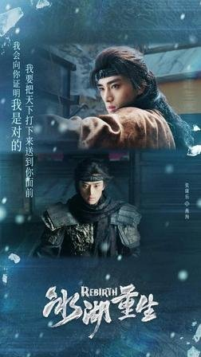
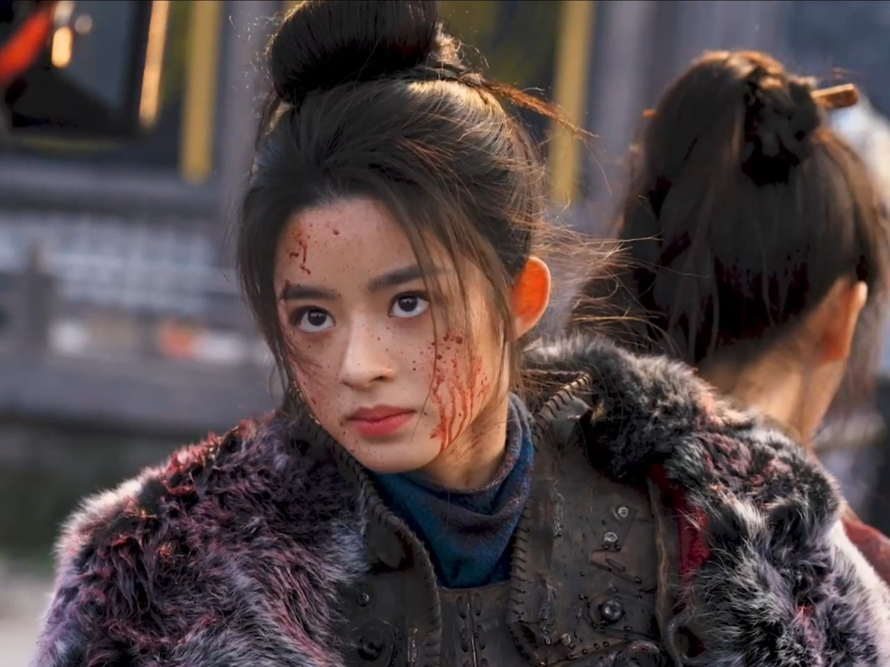

# 冰湖重生节奏慢了？楚乔传那股紧凑劲儿去哪了

我刷完《冰湖重生》前几集，第一反应就一句话：这节奏怎么跟我记忆里的《楚乔传》完全不是一个味儿了。

弹幕里有人吐槽"这慢动作也太多了"，也有人觉得"还是剪辑改得太狠"。我一边看一边翻评论，发现大家吵来吵去，焦点其实挺统一的——就是觉得节奏不对。

说真的，我一开始以为是自己的问题，毕竟隔了这么多年，记忆里的《楚乔传》可能自带滤镜。但多看几集下来，那种感觉越来越明显，不是错觉。

**一集内容硬拉成两集，看着是真着急。**

## 老版那股紧凑劲儿怎么没了

回想当年追《楚乔传》，剧情推得是真快。楚乔作为独立坚韧的领袖，那句"我要带你们回家"放在当时的节奏里，冲击力是实打实的。该打的时候打，该走的时候走，不拖泥带水。

现在看《冰湖重生》，很多地方用了慢动作，还插了不少旧镜头。我理解可能是想做个前后呼应，但实际观感就是：一个情绪点本来两秒能交代完，非得拉到五六秒，整个推进的势头就泄了。

爱奇艺上《冰湖重生》的剧情简介写的是楚乔假装失忆、刺杀燕洵为诸葛玥报仇这条线。听起来挺紧凑的对吧？但实际看下来，这条主线的推进速度，跟简介里那种干脆利落的感觉差了不少。你期待的是一场快节奏的复仇大戏，结果看到的是一段段被拉长的情绪特写。

有观众说得更直白，"我觉得故事本身挺一般的，真正撑起来的主要还是演员选择"。这话其实也侧面说明了一件事——大家讨论的都不在剧情节奏上了，因为节奏本身没什么可聊的，慢得你都没什么好说的了。

这事儿吧，我觉得不能全怪慢动作本身。慢动作用好了是加分项，问题是当它跟旧镜头穿插着用，而且用得太多的时候，观众就会有一种"这是在凑时长吧"的感觉。这种感觉一旦冒出来，追剧的沉浸感就断了。

## 节奏慢了就真没法看吗

但话说回来，我也不想把话说死。

有一说一，有些场景的慢动作确实给了人物情绪更多展现空间。比如楚乔内心挣扎的几场戏，如果按老版那种快节奏切，可能观众还没来得及感受角色的纠结，画面就翻篇了。慢下来之后，至少情绪是能沉进去的。

而且我看到也有观众在呼吁大家亲自去看看，不要只看网上的评价。说明也不是所有人都觉得节奏有问题，至少有一部分观众是能接受这种节奏的，甚至觉得这样看更舒服。

但问题是，当你顶着《楚乔传》续作的名头，观众心里的参照系就是老版。老版粉丝期待的是那种一气呵成的追剧快感，结果你给的是另一种节奏体验，这个落差就很难避免。

有人觉得续集就该保持原版节奏，也有人觉得可以接受新的叙事方式。我自己的感觉是，慢动作和旧镜头不是不能用，但用多了就会让人觉得剧情推进变慢了。尤其是当你明显感觉到"这段好像之前看过"的时候，追剧的劲头就泄了一半。

"说说看，我想听听大家到底怎么判断一部剧'失控'的"——这条弹幕其实问到了点子上。到底节奏慢到什么程度算失控？是慢动作太多，还是整体观感拖了后腿？每个人标准不一样。

**当你看剧的时候开始频繁看进度条，那节奏八成就有问题了。**

所以我想问问你们：你觉得《冰湖重生》这种节奏，是该跟老版《楚乔传》看齐保持紧凑，还是可以接受这种放慢节奏的新尝试？
