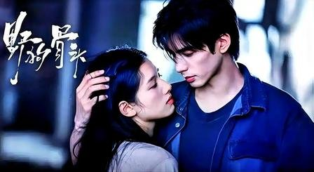
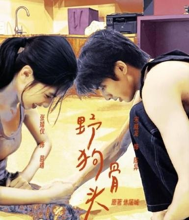

# 《野狗骨头》剧版改顺叙，悬念少了但更上头

我刷完《野狗骨头》前八集的时候，脑子里就一个念头——

**这也太好追了吧。**

说实话我一开始是带着原著滤镜点开的。休屠城那本在晋江评分9.6，双线倒叙写得特别狠，过去和现在来回穿插，你永远猜不到下一章会跳到哪个时间点。结果剧版一上来直接从90年代陈异和苗靖两个小孩相识开始顺着往下讲，我当时还愣了一下。

这悬念感不是没了吗？

但一口气追下来，根本停不下来。弹幕里有人跟我感受一模一样，直接说"一口气看了好多集，太甜太好磕了，难得"。就那种你本来打算看一集就睡，结果抬头一看已经凌晨两点了的感觉。

我一开始以为少了倒叙的拼图感会很可惜，但追着追着发现，顺着往下讲有它自己的爽感。你不用费脑子去记时间线，就跟着角色往前走，该甜的时候甜，该虐的时候虐，特别丝滑。

## 原著那个倒叙劲儿，剧版给改顺了

先说原著那个写法有多绝。

休屠城写陈异在ICU昏迷那段，苗靖在病房外守了整整十天，眼睛都不敢真正闭上，就算睡着也会因为一点动静突然惊醒。然后陈异醒了，苗靖做的第一件事不是扑上去哭，而是告诉陈异的兄弟——她准备去哥伦比亚工作。

这句话说得特别轻，轻得像是在提醒别人"我要去吃饭了"。没有解释，没有铺垫，你读到那儿的时候整个人是懵的。然后故事慢慢往前倒，你才发现这个选择一点都不突然。

原著就是靠这种时间线的信息差制造张力，你一直在拼图，拼到最后一块的时候那种震撼感特别强。

剧版呢？直接从陈异和苗靖因为父母相识开始，一路讲下去。陈父去世、苗母消失，两个孩子相依为命，到大学苗靖勇敢告白，然后陈异被卷入纵火案，为保护她逼她离开藤城。多年后重逢，陈异开台球厅，苗靖做审计回藤城。一条线走到底，清清楚楚。

有人觉得这么改少了来回穿插的悬念层次感，这个我承认，确实少了。原著那种你读到最后一页才把拼图拼完的震撼，剧版给不出来了。

但话说回来，剧版追起来是真的顺畅。你不用在时间线里来回倒腾，不用一直想着"这段是过去还是现在"，就跟着故事往前走就行。而且顺着讲有个好处，你能看到每个选择是怎么一步步发生的，比如陈异为什么逼苗靖走，前因后果摆在那儿，不用等倒叙来补。

评论区有位观众说得太到位了——"感情线好嗑到爆炸，事业线哪有事业线，别找张宾了，两个人光亲嘴给我看就行了"。虽然是在吐槽，但你能感觉到大家追得是真的开心。

## 悬念少了点，但追起来是真爽

剧版第7集结尾到第8集开篇那段，火车站苗靖撞见琳达和陈异告别，对方还邀约后续约会，苗靖当场黑脸冷战扭头就走，不肯吃宵夜。

这段如果是原著双线叙事，可能会先给你看苗靖一个人在雨里走，再倒回去交代火车站发生了什么，让你猜半天她为什么突然变脸。但剧版直接顺着来，你跟着苗靖的视角走，看她吃醋、看她冷战，那种代入感特别直接，不用等倒叙来揭晓答案。

还有第10集雨夜初吻那场戏。顺着讲让这个高光时刻顺理成章地推到你面前，你跟着角色的情绪走就行，不用在时间线里来回倒腾。

原著的留白和悬念，在剧版里变成了实打实的画面和情绪。结构是简单了点，但对追剧的人来说，这种流畅度才是最上头的。

有人说了句"ost和bgm真的很赞👍"，我特别赞同。配乐切入的时机特别准，加上顺滑的剧情推进，观感直接拉满。刘俊杰导演这个选择，我觉得挺聪明的。

## 站队时间到，原著悬念和剧版流畅你选哪个

说白了，剧版用线性叙事换掉了原著双线交织的悬念层次感，这笔买卖到底划不划算，取决于你更看重什么。

原著那种倒叙拼图式的阅读体验，确实更有层次。但剧版改成顺叙之后，追起来是真的爽，一口气八集不带停的。

我个人追剧的时候更吃流畅这一套，但如果你是原著死忠粉，可能会觉得少了点什么。

那你们呢——你觉得剧版这种改法能打几分？是更喜欢原著倒叙的悬念层次感，还是剧版顺叙的流畅追剧体验？
