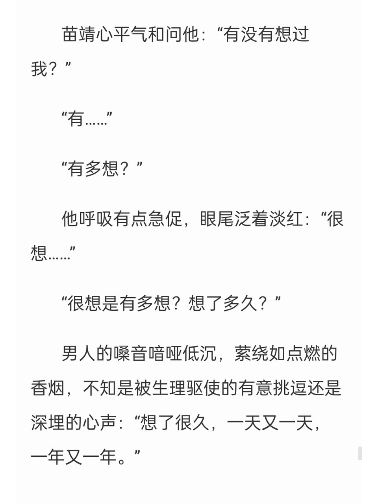
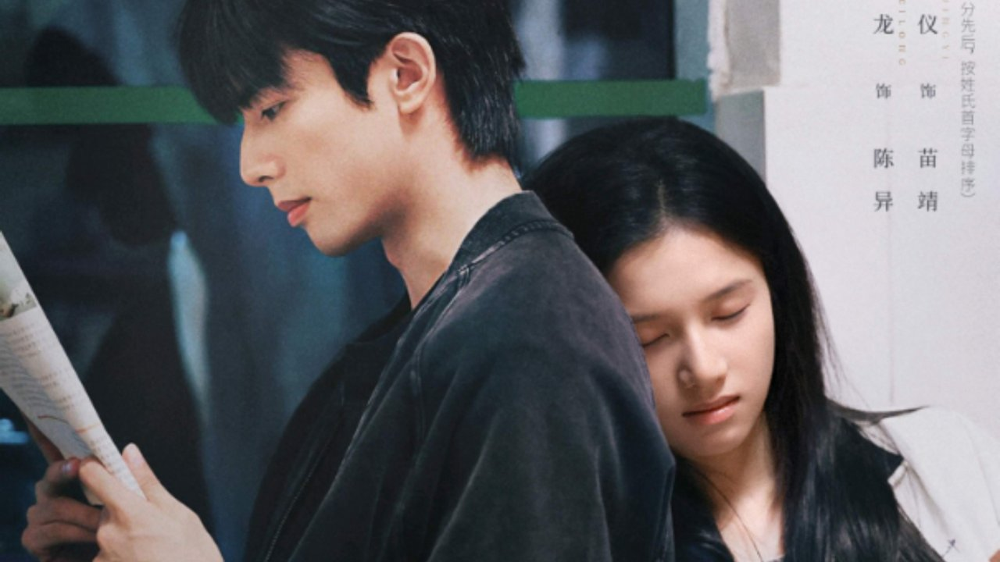

# 野狗骨头改了结局，但后劲一点没少

一口气刷完《野狗骨头》大结局，我第一反应是——改了，但改得挺聪明。

弹幕里有人说"一口气看了好多集，太甜太好磕了，难得"，我深有同感。还有人说得更直接："感情线好嗑到爆炸，事业线哪有事业线，别找张宾了，两个人光亲嘴给我看就行了"——话是夸张了点，但确实说出了我追剧时的状态。

我之前看过休屠城的原著，知道原著里最狠的几处是什么样。涂莉和苗靖的对立线，原著里写得明明白白，陈异和涂莉也是真实的男女朋友关系。到了剧版，这条线直接删了，改成侧面映照。结局更是大改——从原著那种"见死不救加卷款私奔"的残酷走向，变成了废弃工厂里的雨中婚礼HE。

刚看完觉得改动幅度确实大，但改完之后反而更适合追剧了。

**改完之后我反而追得更上头了，这把安全牌打得真不赖。**

## 原著那个结局，狠到你不敢想

说真的，你要是没看过原著，可能觉得剧版结局已经够虐了——陈异在ICU昏迷，苗靖寸步不离守着，醒来之后雨中求婚。但原著那个结局，狠太多了。

原著大结局里，陈礼彬摔死，陈异见死不救。魏明珍卷走了70万抚恤金跟人私奔。陈异在ICU昏迷了整整十天，醒来后苗靖决定去哥伦比亚工作。再往后，陈异做卧底，苗靖逼婚，生下了女儿小橙子。

你品品这个走向——没有雨中婚礼，没有废弃工厂的浪漫，就是底层人物被命运碾碎了，没有人能全身而退。

从"见死不救加卷款私奔"到"雨中婚礼"，这个改动幅度太大了。原著那种"底层人物没有好结局"的残酷感，剧版选择不拍了。

但说实话，看完剧版那个雨中婚礼，我确实被打动了。陈异断联六年是为了保护苗靖不被仇家盯上，这个动机在剧版里补得更清晰——翟丰茂拿苗靖的人身安全威胁他，他只能硬生生推开最在意的人。这段感情比原著多了一层"我推你走是因为爱你"的底色。

## 涂莉线砍了反倒更顺

涂莉这条线是我追剧时最关注的改编点。

原著里涂莉和苗靖有明确的对立情节，陈异和涂莉也是真实的男女朋友关系。剧版把这些删了，涂莉变成了侧面映照关系的角色。有人觉得少了原著那种"你争我抢"的粗粝感，但也有人说少了狗血三角恋的观感，追起来更舒服。

我属于后者。删了涂莉线之后，陈异和苗靖之间的拉扯更纯粹了，不用分精力去处理三角关系，两个人的双向救赎反而更聚焦。

不过有段情节剧版保留了，我觉得保留得特别好——陈异高考后给苗靖八万积蓄逼她离开，独自承担卧底的危险。这段在原著里就写得很狠，剧版也没磨掉。那张银行卡里塞了八万，他嘴上说"睡都睡过了，谁也不欠谁的"，实际上是在用最狠的方式逼自己放手。

看到这段的时候我确实坐不住了，这种"用冷漠伪装保护"的写法，比直接说"我爱你但不能在一起"扎心多了。

弹幕里有人刷"ost和bgm真的很赞👍"，我同意，这段的情绪铺得确实到位。

少了涂莉线确实让故事更聚焦了。原著铺得更慢更细，剧版压缩了一些情绪铺垫但主线更紧凑。两种节奏各有各的好，但追剧的话，剧版这个节奏确实更抓人。

## 这种安全牌，打得其实挺聪明

追完之后我想了想，剧版把粗粝底色磨成了安全牌，但"两个无依无靠的人互相托住彼此"的核心没丢。

原著狠就狠在：底层人物被命运碾碎，没有人能全身而退。剧版给了两个从小在泥里打滚的人一个能喘息的结局。

前面说的那些细节——翟丰茂拿苗靖威胁他，陈异被敲晕强行带到金国——让"推开你是因为爱你"这条逻辑更完整了。

原著本身在晋江就有很高人气，超20万读者收藏。剧版能让更多不看书的人走进这个故事。

追到这场雨中婚礼，我确实松了口气。

所以回到最开始的问题：你更喜欢原著那种狠到骨子里的结局，还是剧版这个能让人喘口气的HE？
