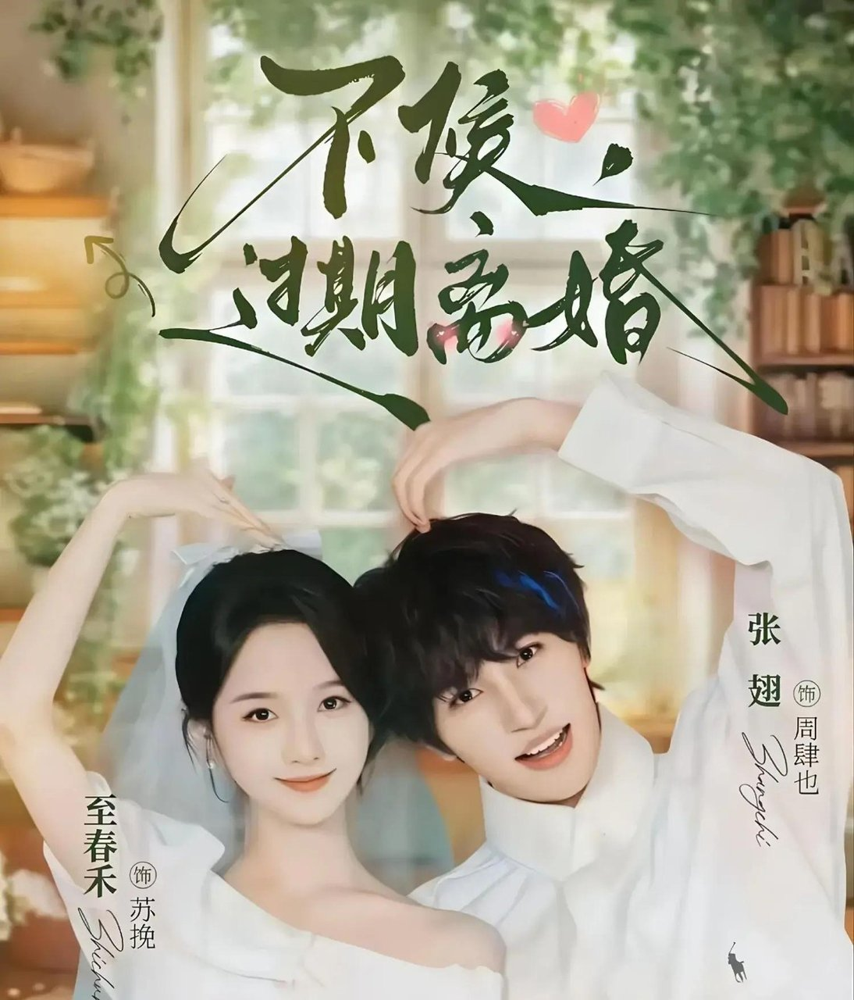
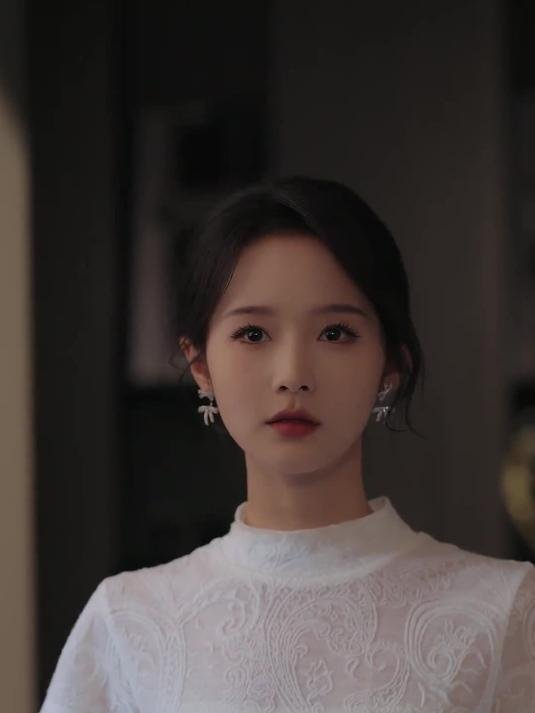
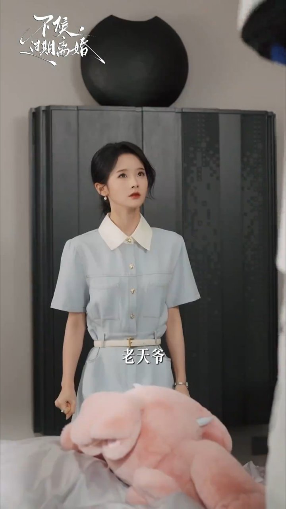
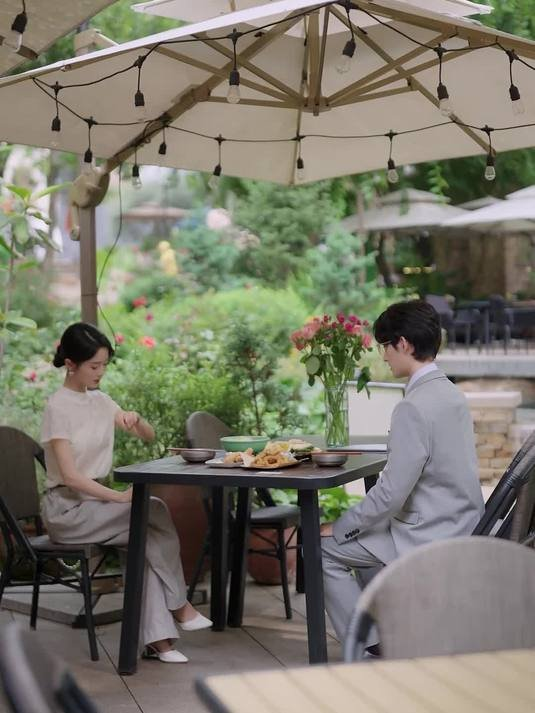
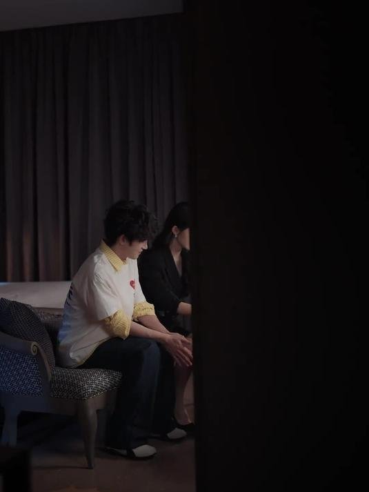

# 《不候，过期离婚》张翅这双人格切换太稳了

看完第一反应就一句话：张翅一个人演两个灵魂，这切换有点东西。

刷到《不候，过期离婚》热度6441万登顶红果榜首，我第一反应就是张翅和至春禾第五次合作了。开播前254万预约，这数据摆明了是冲着他俩去的。

有观众说"没有大吼大叫，靠克制拉扯、哭戏和细节戳心"，我看完觉得这话挺准。全剧最稳的就是张翅的双人格切换，和两个人五搭攒出来的那种不用使劲演就能接住对方的默契。

这6441万的热度，我觉得很大程度上就是冲着两位主演的默契去的。数据是CP粉和预约用户先入场带动的，但演员表现确实是全剧最大的支撑点。

## 张翅那场两个灵魂对峙的戏我反复看了好几遍

张翅在剧里演18岁和28岁两个版本的周肆也。少年版热烈真诚，黏人还护短；成年版冷漠疏离，满眼都是愧疚。

两种状态切换起来，看的时候我是真没出戏。

有观众说"张翅的眼神戏绝了，少年的赤诚，成年人的愧疚，切换自如毫无痕迹"。B站上还有片段专门剪了他在两种人格间的切换，我反复看了好几遍。

那种不靠台词，光靠眼神和肢体变化撑住的感觉，特别考验功底。18岁的周肆也替妻子撑腰那几场，发现她十年婚姻里咽下的委屈，张翅是靠眼神变化来传递信息的。

没有大段独白，就是眼神一变，你立刻就知道这是18岁那个热烈少年在看。28岁那个冷漠总裁完全不一样。有观众说质感不错，CP默契度高，反差感拿捏得准，我也这么觉得。

有观众说"奈何身怀绝技、身负过往，根本藏不住"，这话说的是角色，但我看完觉得放演员身上也成立。

**五搭积累的功底摆在那，想藏都藏不住。**

## 至春禾这次怎么就让人心疼了

至春禾演的苏挽，十年婚姻耗尽温柔的那种破碎感，她演得让人心疼。就是那种你看她站在那什么都没说，但你就是觉得这个人已经撑了很久了。

五搭的好处在这就体现出来了。她和张翅不用靠夸张台词或者过度肢体接触来推情绪。

**一个眼神、一个停顿，两个人就接上了。**

这种节奏感，单次合作真达不到。有观众说"演员在线"，这四个字确实是关键。至春禾的破碎感跟张翅的反差感一搭，一冷一热，节奏感是老搭档才有的。

"当然，我也不是无脑吹"——有观众这么说，我也想这么说。五搭CP的化学反应确实强，但能不能留住路人，光靠默契够不够，这事儿得两说。老搭档的表演习惯观众也熟了，新鲜感这块确实是个问号。

## 演员默契能兜底到什么程度

说实话，短剧节奏快，演员表现确实是全剧最大的支撑点。这6441万的热度，说白了就是大家冲着这俩人来的。

但一部剧的质感如果全靠演员默契来撑，也挺考验观众缘的。老搭档的表演节奏观众也熟悉，能不能持续带来新鲜感，这个谁也说不准。

喜欢看他们拉扯的观众可能觉得完全没问题，但不吃这套的可能就觉得不够刺激了。

不过话说回来，张翅一人分饰两角这个设定，确实给表演留出了发挥空间。18岁和28岁的对峙戏，那种自我撕裂和自我和解，光靠剧本写不出来，得靠演员演出来。

从这个角度看，演员默契和演技确实撑住了这部剧的质感底线。

那你觉得一部短剧靠演员默契和演技能撑住整体质感吗？还是必须有新鲜的设定才行？
