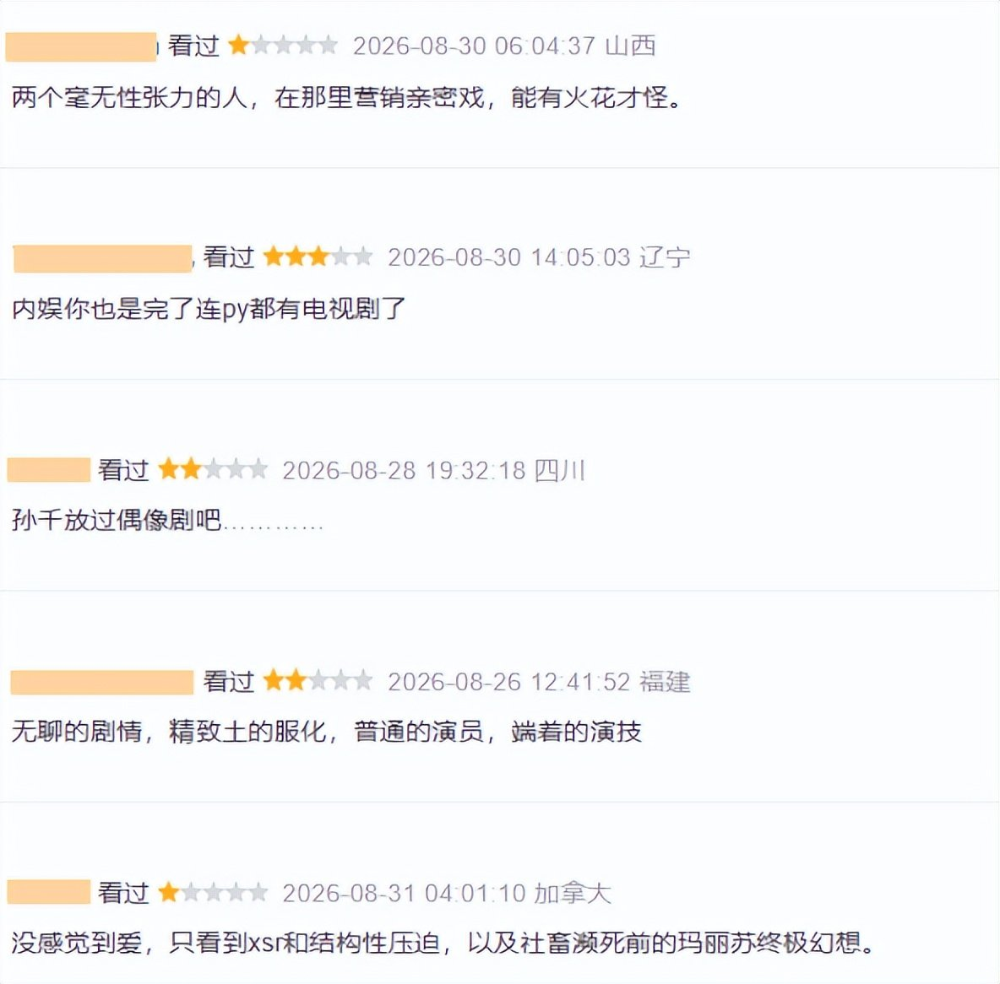
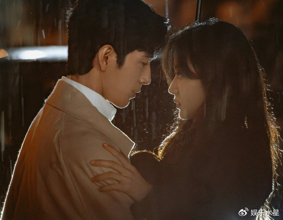
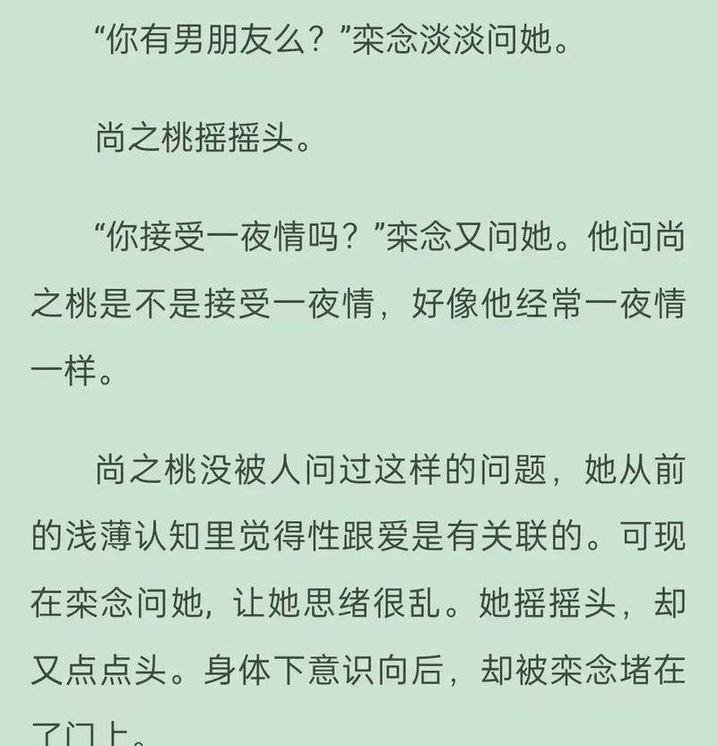
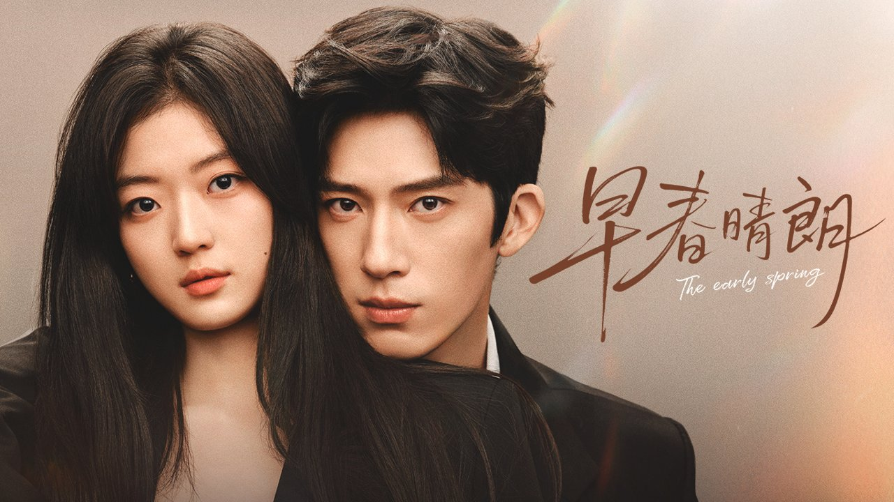

# 《早春晴朗》书粉4.4剧粉7.2，吵起来了

## 评论区真打起来了

我刷完《早春晴朗》前几集，第一反应是——这剧热度是真的高，但口碑也是真的裂。

豆瓣开分6.7，约3.96万人打分，28.3%给了三星，27.7%给了两星及以下，过半观众打分在中游偏下。但另一拨人觉得这分被压低了，质疑有集中打低分的情况。

**但评论区是真的打起来了。**

这话不是我说的，是刷豆瓣短评的时候看到的一句原话，特别精准。书粉和剧粉吵得不可开交，两边分差接近3分——原著向的观众打了4.4分，剧粉那边打了7.2分。

吵什么呢？核心就一件事：剧版把原著里男女主"炮友转正"的关系改成了"办公室地下恋"，男主栾念从原著的"精致利己"被柔化成"嘴硬心软"。没看原著的觉得改得顺，看原著的觉得丢了魂。

我自己看完的感受是——两边说的都有道理，但这分差确实挺罕见的。

## 没看过原著的人嗑成年人恋爱嗑得上头

先说没看过原著的这拨人。

"没看过原著的人，嗑成年人恋爱嗑得上头"——这是评论区高频出现的一句话，也是我自己看完的真实感受。

剧版把原著那段不对等的"炮友"关系，改成了隐秘的办公室地下恋。两人约定上班维持上下级关系，私下秘密交往。情感铺垫从"见色起意"变成了"日久生情"，逻辑上顺畅了不少。

男主栾念的改动也挺大。原著里他高傲、毒舌、精致利己，缺点比优点多。剧版给他加了童年病房闪回、酒吧乐队主唱这些背景，让他的冷漠有了来处。从"符号化的霸总"变成了一个有温度的人。

我追到第四集的时候，确实能感受到那种成年人之间克制又试探的拉扯。栾念嘴上不饶人，但行动上处处偏袒尚之桃，雨中救援、酒桌挡酒这些原创细节，让感情发展有了合理的台阶。

从没看过原著的视角来看，这种改编确实让代入嗑糖更容易。情感发展顺了，角色更立体了，不用带着"他是不是在PUA她"的疑问看剧。这大概就是剧粉打出7.2分的原因。

## 原著粉嫌丢了核心魅力这争议没毛病

但书粉那边完全是另一种声音。

"有书粉形容：原著里的栾念是一把刀，你明知道他割手，但还是忍不住去握。"

这句话我看完愣了一下，因为它确实戳中了原著最核心的东西。原著小说豆瓣7.9分，靠的就是那种酸涩压抑的拉扯感——不对等的关系里，女主卑微付出、讨好、隐忍、自我怀疑，然后在泥泞中开出花来。

剧版把这些带刺的东西全磨平了。栾念变温柔了，虐感也跟着没了。书粉觉得这等于把原著的灵魂抽掉了，只剩一个甜宠的壳子。

我能理解这种失落。原著粉追的是那种"明知道会受伤但还是忍不住"的拧巴劲儿，剧版改成"嘴硬心软"之后，这种危险又迷人的张力确实弱了。

但话说回来，原著那个"炮友转正"的设定，放在现在的影视剧里，光是过审这关就够呛。就算能过，一个上司跟下属维持六年的不对等关系，直接拍出来观众也很难代入。

所以这事儿挺难两全的。剧粉觉得改得顺，书粉觉得丢了魂，两边各有各的道理。改编本身就是在原著和观众之间做取舍，这一刀切下去，总会有人疼。

## 改编到底该顺从原著还是顺从观众

说到底，原著小说豆瓣7.9分，剧版开分6.7分，这1.2分的差距，加上书粉和剧粉之间近3分的撕裂，其实就是影视化改编必然要面对的取舍。

剔掉"炮友"设定和不健康的关系底色，确实让更多路人观众能看进去。不用带着道德负担追剧了，情感发展也顺畅了不少。代价是丢了原著粉偏爱的那种带刺的酸涩感。

"说白了，这部剧就是这样：它不是一部经得起逐帧细抠的完美之作，职场戏的毛病是真的。但它把成年人恋爱的酸涩和分寸拍出了近年少有的质感，这份好也是真的。"

这是我看到最中肯的一条评价。骂的人有道理，看的人也上头，6.7不高不低，正好卡在它的真实口碑上。

所以我想抛个问题：你是觉得保留原著那种带刺的酸涩感更好，还是觉得剧版改成顺畅的地下恋更香？
