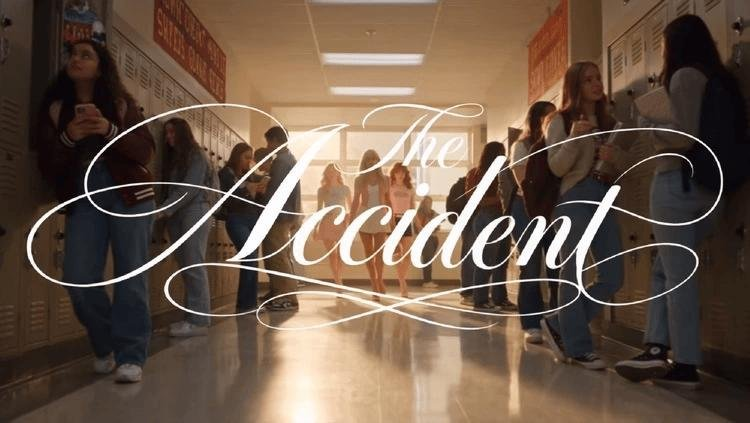
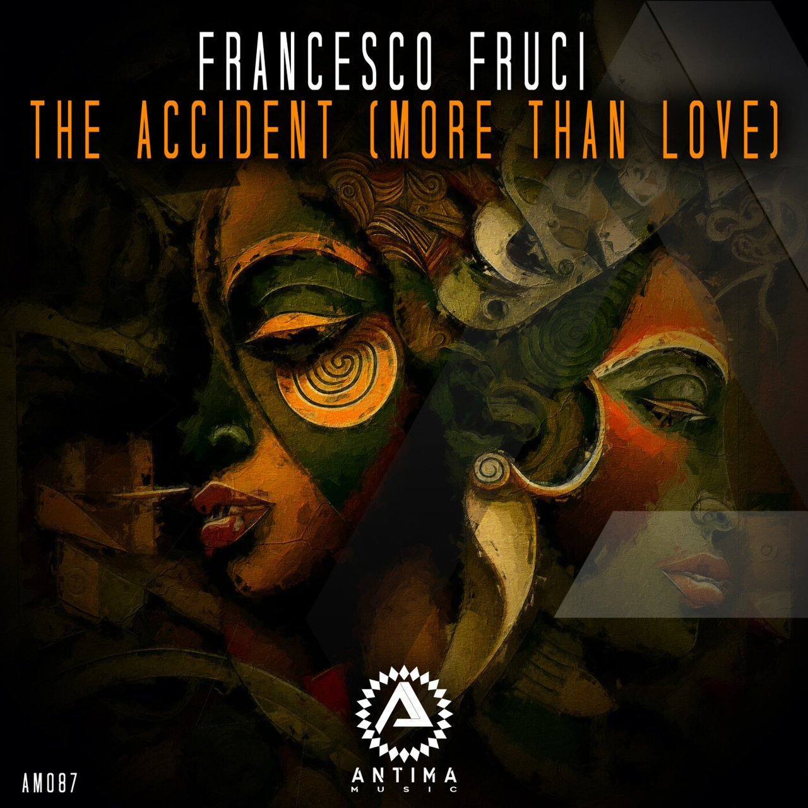
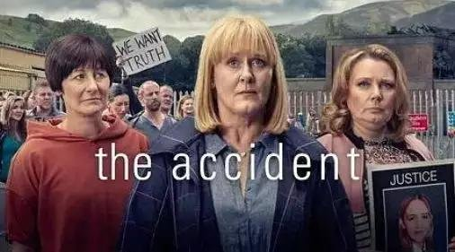

# 《The Accident》靠脑补美高味太正

我刚刷到《The Accident》的时候，第一反应就是：

**这美高味儿也太正了吧！**

点进去看，棒球队队长基顿、校报主编洛娜，还有一场派对上的意外，这设定太对味了。

评论区清一色在喊："这真的是AI生成的吗？"

我一开始还以为是什么海外新剧，毕竟这丝滑的质感，真不像是随便搞搞的。

结果深挖了一下才发现，这剧居然是两个没去过美国的中国00后学生，用AI手搓出来的。

## 没去过美国怎么拍出这么正的美高

我看的时候就在纳闷，这俩创作者到底什么来头，能把美高那种氛围感拿捏得死死的。

后来才知道，创作者枸橼酸钠和whata-ha根本没上过美高，也没留过学。

他们对美高的全部认知，全靠美剧、小妞电影和VLOG。

男生枸橼酸钠24岁，湖南师范大学戏剧影视专业在读研究生；女生whata-ha21岁，在北京某高校读广告专业大四。

这种"二手经验"，按理说很容易做成四不像，毕竟没实地体验过。

但有人觉得，这种过滤掉杂乱现实的做法，反而提炼出了观众最想看的美高精华。

有网友说："它真正卖给中国观众的，是距离我们脑子里那个'美国'足够近的东西。"

我看完这句话简直想拍大腿，太准了。

我们脑子里的美高，不就是那些经典影视作品拼贴出来的样子吗？

他们捏出来的，就是我们这帮看美剧长大的人脑子里想要的那个美高。

## 靠脑补捏出来的剧为啥这么让人上头

这俩人是纯靠AI和热爱在死磕。

为了追求"没有AI感"，他们反复调整提示词，遇到不满意的画面直接重来。

基顿的形象是whata-ha根据自己的审美捏的，她说过喜欢那种比较精壮的男性身材。

女主则是温柔的"pretty nerd"，跟传统的啦啦队队长形象完全不一样。

这种死磕细节的态度，我是真能在画面里感受到的。

**"高颜值建模、丝滑的微表情，完全上头。"**

有观众这么评价，我也是深有同感。

看着比有些真人剧还自然，这就很离谱了。

难怪上线仅4集，播放量就破了5800万，每集点赞超40万。

大家都在感叹，两个没留过学的学生，能把美高的氛围感拿捏得这么准。

我追的时候根本停不下来，就想看下一集谁和谁在一起。

## 所以这剧到底算不算真美剧

虽然只是两个学生的业余制作，但这种创作确实让我眼前一亮。

他们把美高味儿做到了极致，把那种青春悸动和意外感拍出来了。

看着这群人在布莱尔格伦小镇的故事，我有时候真忘了这是AI生成的。

现在的技术真能造梦。

最逼真的美高校园剧，偏偏是两个从未踏足美国的中国00后学生手搓出来的，这事儿本身就挺魔幻的。

那么问题来了：你觉得这种没去过美国靠AI手搓的美高剧，能算美剧吗？还是说它只是一种精准的审美投喂？
