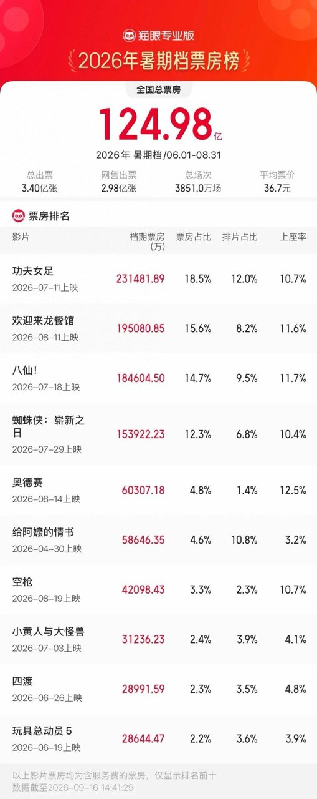
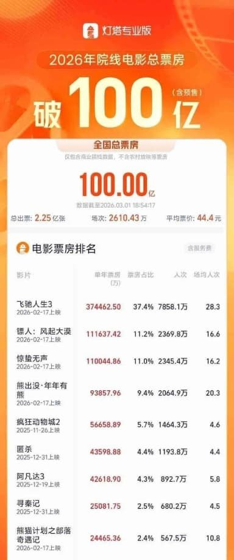
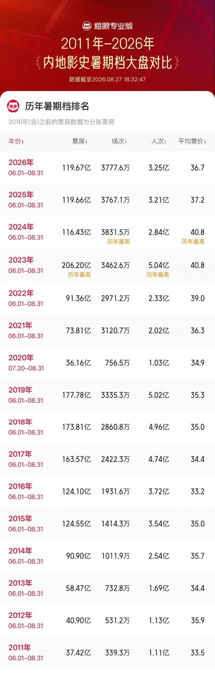
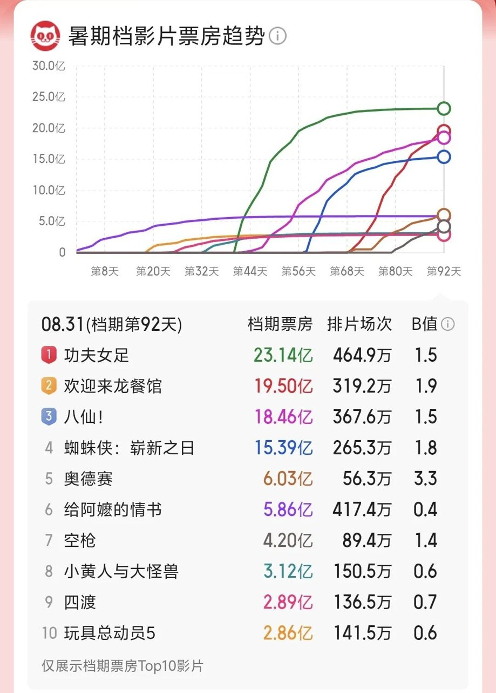

# 2026暑期档的增长，是降价买来的

## 看到票价那行数字，我先愣了一下

刷到2026暑期档收官数据那天，124.98亿那个大数我扫一眼就划过去了，让我愣住的是旁边一行小字——平均票价36.74元。

票房涨了，票价反倒降了？

**我第一反应是：这数据是不是标错了。**

后来确认没标错。国家电影局的数据摆在那儿：总票房124.98亿元，观影人次3.4亿，同比分别增长4.45%、5.86%，创近三年新高。媒体都在转发这份成绩单，可我翻了翻评论区，大家聊的是另一件事。

网上流传着一句追问：“票价降至五年最低，观众真的省钱了吗？”

有人觉得票价降了就是实打实的实惠，也有人在追问这钱到底省没省到位。还有观众晒出了自己的心态，原话是：“五一档电影类型题材各异，口碑也都不错，很难抉择，**我就干脆多看了几部**。”

低价周期里，“多看几部”成了挺普遍的选择。我盯着36.74元看了半天，就一个感受：这个暑期档的增长，是降价买来的。涨价涨不出这个数，这是把观众用更亲民的票价，一位一位请回影院换来的。

## 票价降了五毛，场子却更满了

先看最反直觉的一组对比：人次增速5.86%，票房增速4.45%——人次跑得比票房快。我一开始没反应过来这是啥意思，后来想明白了，单价没抬，增长是人堆出来的。

平均票价36.74元，2022年以来暑期档最低，比去年降了约0.5元。有报道写36.7元，口径差了那么一丢丢，方向倒是一致：降了。界面新闻还给了个更狠的参照——2024年暑期档均价40.8元。两年，降了差不多4块钱。

五毛钱多吗？说实话，一杯奶茶的零头都算不上。可这五毛背后跟着一串数字：上座率从6.94%升到7.21%，场均人次从8.5升到8.8。票价降了，人却多了，场子更满了。我看着这组数据，脑子里就一个画面：以前坐一半的厅，这回坐得七七八八了。

影院还在变多。营业影城13117家，比去年多243家。放映场次创了历史新高——封面新闻等报3851万场，经济日报等报3849万场，两种口径略有差异，反正都是新高。场次多了、影院多了、上座率还升了，这几件事凑一块儿，影院的经营效率是在实打实改善的。

灯塔专业版数据分析师陈晋的话被各家媒体反复引用，他说这轮增长“不是靠涨价涨出来的，而是靠更多人愿意走进影院撑起来的”，市场走出了一条“以价换量、量质齐升”的路径。

“以价换量”这四个字，我琢磨了一会儿。以前总觉得降价是市场不行了才出的招，这回不太一样——降价降出了增长，降出了近三年新高。这操作我是真服气。

## 这五毛钱，是谁让出来的

我好奇的是，票价又不是大风刮来的，降下来的这五毛，到底是谁让的利？

片方先动的手。据经济日报、新京报等多家报道，上映影片积极降低最低发行票价，把定价的起点往下压。影院这边也没闲着，新京报走访了一圈，各地推出午休特惠票、学生专属套餐、工作日优惠场次，变着法子让利于观众。片方压起点，影院让零头，两头一起使劲。我看到“午休特惠票”这几个字还挺感慨的，午休那俩小时也能进趟影院，这优惠是真往观众的生活缝隙里钻。

政策还在托底。据界面新闻，2026年是“电影经济促进年”，国家电影局联合多部门发放观影消费券，全年计划投放不少于12亿元。我看完这条才明白，影院敢这么降价，背后是有底气的。

其实年初就预演过一轮。据齐鲁晚报报道，2026年春节档预售时，《惊蛰无声》《镖人：风起大漠》等多部影片冒出19.9元的特惠场次，观众感慨“票价重回青春”。虽然短短几小时后价格就回调到了40-60元区间，但那股价格浮动的思路，从春节一路试到了暑期。

观众这头的变化也挺明显。据界面新闻，今年暑期档人均观影1.55次。报道里还有个画面我印象挺深：西安的大学生观众朱一鸣，是“笑着说”的。聊看电影这事儿能带着笑，我觉得这状态本身就挺值钱。把它跟“干脆多看了几部”的心态放一块儿看——票价负担轻了，“再看一部”的决策门槛，也跟着低了。

## 便宜能请人进门，留人还得靠片子

夸完得说句实话，这事儿也不是全无隐忧。

界面新闻就提示过：总票房增速4.45%，低于人次增速5.86%，一部分观众是被低票价吸引来的，票价一波动，可能又把他们送走了。我头回看到这句，心里咯噔了一下——低价请来的人，会不会涨价就走了？

历史上还真交过这笔学费。据天津日报，2000年成都搞过“5元票价”，影厅确实爆满过，可3个月后因为观影人次急剧下降，终止了；2004年“10元票价”同样没成。单靠降价，是留不住人的。

那今年为什么没重蹈覆辙？我自己的看法是，内容接住了。央视网说这个暑期档“票房和口碑双丰收”，满意度调查的冠军是《八仙！》——重构传统八仙神话，兼顾少儿趣味和成年观众的文化共鸣。金融时报的报道里还提到它青绿山水的国风意境，18.46亿的票房也摆在那儿。青绿山水配八仙神话，这个组合我光看报道里的描述就想买票。价格把门打开，内容把人留住，这条路才算没白走。

所以这份成绩单里最值钱的，可能就是“量质齐升”这四个字。观众用脚投票，投的是“合理票价+值得的内容”这套组合。增长确实是降价买来的，但买回来之后能留住，靠的是片子本身。

最后抛个二选一。如果明年票价涨回40块，你还会进影院吗？

A：片子够硬，涨回去我也认。B：票价一回调，我扭头就走。

你站哪边？顺便说说，你觉得“以价换量”该不该接着搞下去。
