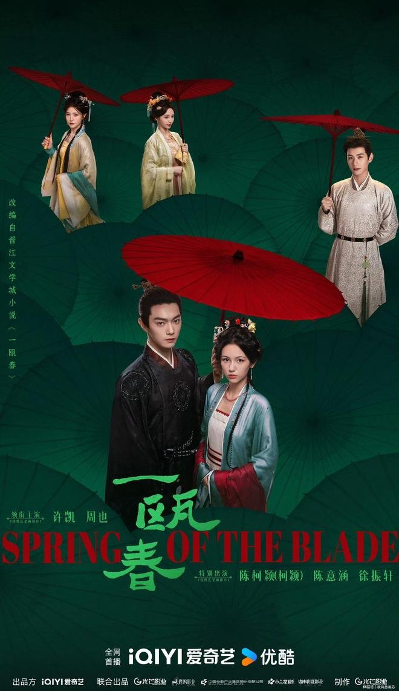

# 《一瓯春》实景拍得这么绝，剧情怎么有点眼熟

## 刚刷完《一瓯春》我第一反应就一句话

刚刷完《一瓯春》前几集，我第一反应就是——这画面也太绝了吧，但剧情怎么有点眼熟？

刷了一圈评论区，发现大家的感觉跟我差不多。有人直呼画面太绝了，也有人吐槽剧情套路化。有个高赞评论说，这剧的画面质感像古画，但故事走向闭着眼都能猜到。

我的感受就是，古装剧光把美学升级了，故事还是老套路。你看那实景拍的烟雨巷子、白墙黛瓦，每一帧都能截图当壁纸。但一回到剧情本身，那种"似曾相识"的感觉就冒出来了。精致的视觉外壳下，套路化的剧情还是被观众一眼看穿了。

## 濮院古镇这实景是真的顶

先说好的部分，因为这剧在视觉上确实下了血本。

剧组在浙江桐乡濮院时尚古镇实景拍摄，桐乡市政府官网都确认了这事。不是随便找个棚搭几面墙就完事，是真的跑到了古镇里，亭台回廊、古巷流水全是真实场景。场景筹备花了80天，搭建了110个实用场景。这个数字摆出来，在现在古装剧里算得上诚意了。

我追的时候第一眼就被画面抓住了。自然光打在白墙上，水巷里的倒影晃晃悠悠，没有那种廉价绿幕的塑料感。每一帧都像从宋代古画里抠出来的，低饱和的水墨调色，看着特别舒服。

服化道也用了心。宋代珍珠面饰、莲花发饰这些美学元素都有体现，女主谢清圆的妆造清冷里透着柔美。有观众就说："开播后，周也'小白花秒切恶女'的反差感也让观众直呼上头。"这种视觉上的讲究，确实给古装剧打了个样。

据报道，周也在濮院古镇的见面会上也提到，宋代实景还原度极高，相信画面镜头一定能给观众带来惊喜。这话说得没毛病，画面确实做到了。剧组的诚意是实打实的。

## 但这剧情怎么就这么眼熟

画面这么好，我本来以为故事也能跟上，结果越看越觉得不对劲。

有观众吐槽说"剧情有点眼熟，感觉像是把各种古偶套路拼在一起了"。我追到后面几集，确实有同感。女主回府复仇、男女主双强博弈，设定听着挺带感。但真看下来，设局、智斗、偶遇、水下救人这些桥段都比较套路，跟这几年流行的爽剧模式大差不差。

更扎心的是这条观众原话："结果，当底牌揭晓时，却只见一堆陈词滥调的装神弄鬼手段，低级得让人哭笑不得。"

**我追到女主用"诅咒血诗"圈套那段，确实有点坐不住了。**

复仇剧拍出了玄幻感，白马屁股藏火种这种设计，怎么看都不像高智商复仇。

还有观众反映剪辑有点跳，叙事碎片化，看着容易出戏。我自己也有感觉，上一秒还在谢府后院，下一秒突然切到九年前雪地里，转场生硬得像在翻页。两条线各跑各的，宅斗窝在府里打转，朝堂线走马观花，观众跟着追容易迷路。

澎湃新闻评价这部剧"属于常规的6.8分作品，挑不出大毛病但缺了超预期的惊喜"，我觉得这个评价挺中肯。还有观众吐槽："但剧情太拉胯、人物没张力导致配乐和剧情完全脱节"，配乐再好听，剧情撑不住也白搭。

## 这剧到底值不值得追

看到这儿你可能会问，那这剧到底值不值得追？

我的判断是：看你要什么。

如果你是颜控、画面党，这剧绝对值得看。濮院古镇的实景、宋代美学的服化道，每一帧都是视觉享受，截图当壁纸不亏。就冲这个画面质感，追下去不亏。

但如果你追求严密逻辑和烧脑权谋，可能会失望。剧情套路化的问题确实存在，叙事碎片化也让追剧体验打了折扣。想看硬核的权谋博弈，这剧可能喂不饱你。

不过有一点得说，它至少给古装剧的美学打了个样。不用绿幕堆砌，实景就能撑住画面。

至于叙事这块，看起来确实还差一截。画面跑在故事前面，观众一眼就能看出来。

所以最后抛个问题——

**你是更看重古装剧的画面美学，还是更在意剧情逻辑？**
