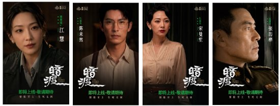
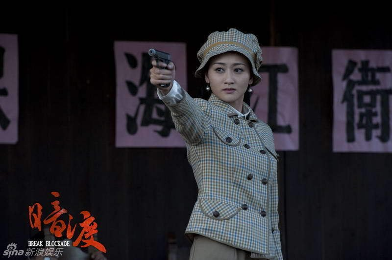
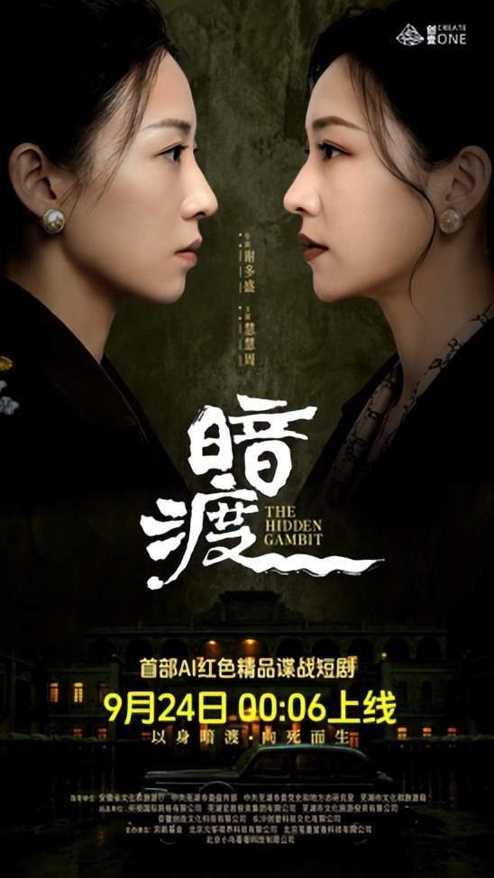
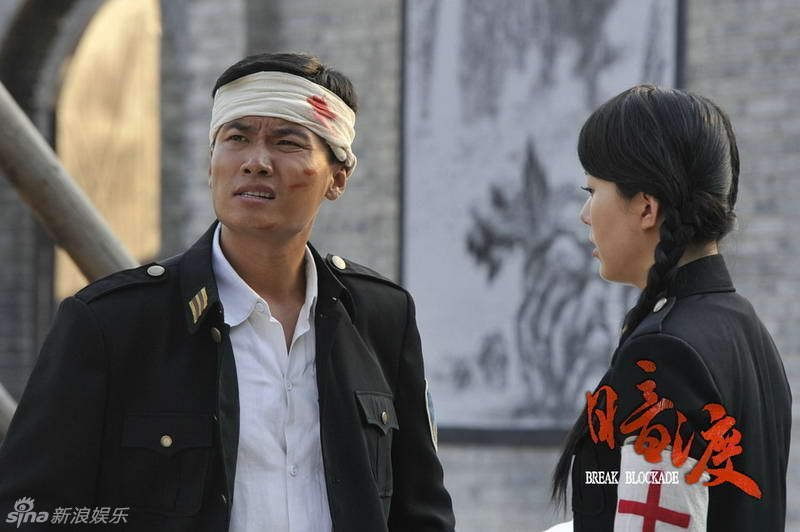
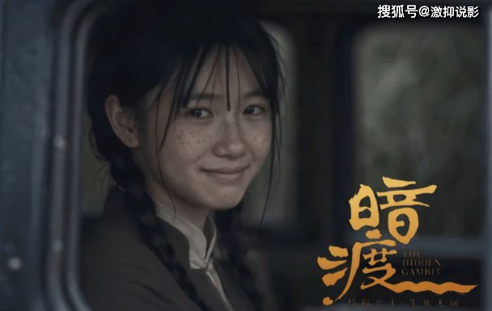
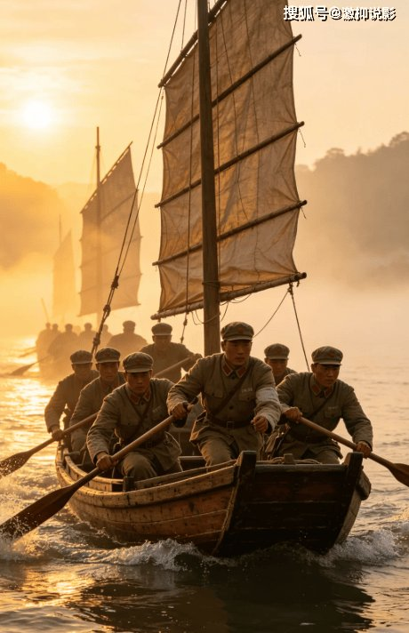

# 《暗渡》这句台词，撑起了整部剧的信仰

## 看完我第一反应就一句话

我刷完《暗渡》愣了好一会儿，脑子里就剩那句台词在转——"江慧可以死，但宋曼笙必须进去。"

说实话我没料到。一部AI短剧，120分钟，我能被一句话钉在椅背上。

有观众说的比我到位："短短十个字,写尽革命先辈舍小我为家国的悲壮赤诚,奠定整部剧集厚重的红色内核。"我看完就是这个感觉，十个字压住了整部剧的重量，比我预期中任何大场面都狠。

我一开始以为红色短剧嘛，大概是那种炮火连天、口号震天的路子。结果《暗渡》反着来——它把镜头缩到最小，就对着一张脸、一句台词。越看越觉得，这种克制反而比那些堆特效的场面更扎人。

## 这句台词出来我直接起鸡皮疙瘩

剧情核心其实一句话能说明白：1949年春天，渡江战役前夕，中共侦察兵江慧带着小队潜入芜湖。她跟国民党保密局站长宋曼笙长得有七分像，就冒名顶替深入敌营。

梅花珍珠耳钉是信物，也是悬在脖子上的刀。敌营队长郑立多疑敏锐，步步紧逼，每个眼神都是生死考验。

然后那句台词就来了。

"江慧可以死，但宋曼笙必须进去。"

没有嘶吼，没有悲壮的背景音乐铺底。就那么平平静静地说出来。我当时直接起了一身鸡皮疙瘩——明明怕，明明知道进去可能就出不来，但信仰这件事比命大。

有观众说得好："有时候,越是质朴的话语,越能在不经意间钻进我们的心底,让我们为之动容。"我太同意了。这句台词没有华丽辞藻，甚至算不上什么精巧的句子。但它放在那个情境里——一个人要亲手抹掉自己的名字，用别人的身份去死。这个重量不是堆多少特效能撑起来的。

我看过不少谍战剧，枪林弹雨、密室爆破、密码破译，场面一个比一个大。但《暗渡》选了另一条路：在密室里窃密，用灵柩送图，真假站长正面对决，全是近距离的心理博弈。没有为反转而反转，所有冲突都压在信仰这条线上。

**一句台词就把你的心攥住了。**

主题曲《雾散以后》里有句词："替我看看往后的生活。"我听到这句的时候鼻子一酸。这些无名英雄知道自己可能活不到胜利那天，他们唯一的愿望就是有人替他们看一眼太平日子。这份重量是真的。

## 说实话这剧也不是没毛病

我得实话实说。作为一部全流程使用AIGC技术创作的短剧，部分画面确实能看出来是AI生成的，有些镜头的质感还是有点生硬，人物微表情偶尔会出戏。

但奇怪的是，我没因此弃剧。

可能因为叙事太克制了，注意力全被台词和心理博弈吸走了，技术上的瑕疵反而被盖住了。极端环境下的抉择、眼神交锋里的暗流，这些比枪林弹雨更戳心。从这点来看，《暗渡》把"技术服务内容"这个思路执行得挺到位——AIGC是叙事的工具。

有观众写了一句让我印象很深："它告诉我们,哪怕身处艰难困苦之中,也不要放弃对光明的追寻。"这话说的是剧里的人，也说的是这部剧自己——《暗渡》选了一条更难但更对的路。

陈未然、林清、刚子这些角色，不是脸谱化的工具人。反派郑立也不是降智衬托主角的。正邪之间的拉扯全程紧绷又克制，没有狗血冲突，没有强行爽感。全片的张力都藏在细节里——一个眼神就够你紧张半天。

我看完最大的感受是：一句台词能撑起一部剧，前提是你得真把人当回事来写。写的是活人，观众才买账。

所以我想问——

你觉得是宏大战争场面更震撼，还是这种一句台词定乾坤的克制叙事更戳心？
