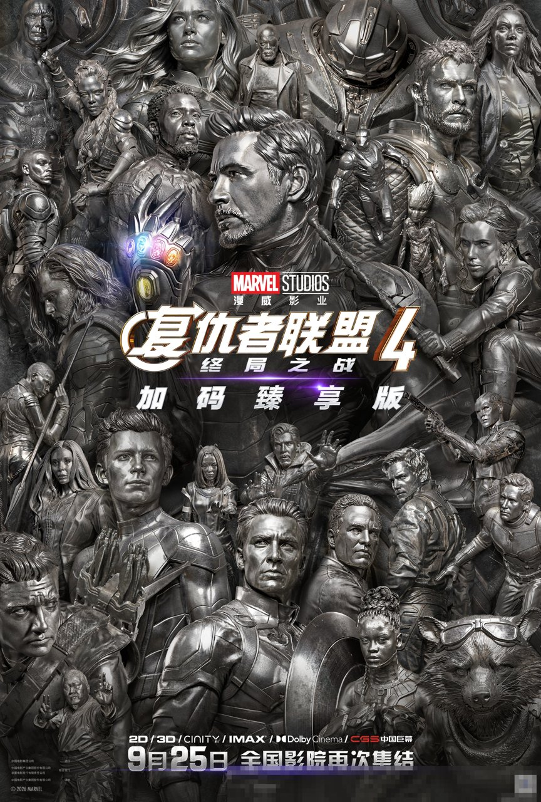
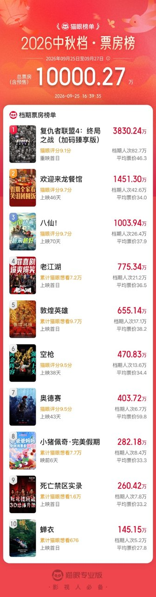
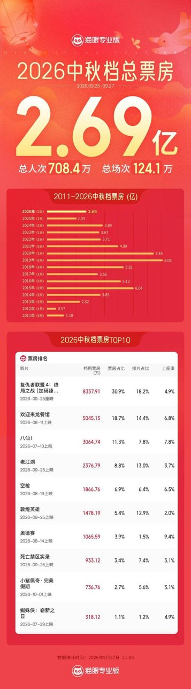

# 复联4重映只加4分钟，我还是觉得值

## 看完我第一反应是掏计算器

中秋假期我去看了《复仇者联盟4：终局之战》加码臻享版，走出影院的第一反应，是掏出手机按计算器。

我这人平时看片从不掏计算器，这回是真有一笔账想算明白。按猫眼专业版的口径，这次重映首日平均票价49.1元，而全片185分钟里，全新内容只有约4分钟。

刷评论区的时候，我还刷到一句：「看完之后，不少人的感受并不一致，有人觉得值，有人觉得自己被“坑”了」。

说实话，我第一反应挺平静的，就是觉得这笔账特别有意思。49块1，买185分钟重温，外加约4分钟新东西，怎么算都有点微妙。

先把态度亮在这儿，不卖关子。

**这笔账算到最后，我反而更想拉人再刷一遍。**

但账得先摊开，才算得明白。今天这篇就只算一件事——这张票卖的到底是那约4分钟，还是我们愿意为重温本身付多少钱。

## 先把复联4这笔账摊开算

账本第一页，数据都标清口径。据猫眼专业版，9月25日重映首日票房超2400万元，观影人次约49.1万，平均票价49.1元。

这个数字我盯着看了一会儿。一部七年前的老片重映，首日均价49块1，进场的人一点没含糊。

账本第二页，片长。加码臻享版总片长185分钟，2019年原版是181分钟，多出来的全新内容约4分钟。有材料说近5分钟，主流口径还是约4分钟，我就按这个来。

然后是我自己按计算器算的，纯属个人推算：49.1元摊到185分钟，每分钟两毛多，听着还算正常。可要是只算那约4分钟新内容，每分钟要十二块多。

按到这个数的时候我停了一下。十二块多一分钟，单看这笔账确实吓人。觉得自己亏了的人，可能就是算到这儿停住的。

但市场给了另一串数字。据猫眼专业版，预售票房突破2000万元，中秋档断层领跑；截至9月27日21点，档期票房8337.91万元，拿下2026中秋档票房冠军。

约49.1万人次用钱包投了票。这么多人进场，看起来大家算的并不是新内容单价这笔账。那大家到底在为什么付钱？这就得翻账本第三页了。

## 可说实话，没人只为那4分钟进场

那约4分钟里装了什么？此前未公开的镜头，加《复联5》独家前瞻，直接衔接12月18日上映的《复联5：毁灭之日》。据漫威影业官微，还有一段专为这次放映制作的隐藏片尾。

有观众看完直接说：「这次复联4重映真的加硬货」。

但剩下那181分钟，买的是什么？当年在影院哭过的人，这次带着已知结局坐满三个小时，买的是大银幕和音效，还有一屋子人一起看完的那股劲儿。

这种劲儿一个人在家刷是刷不出来的。电视再大，也没有一屋子人陪你一起屏住呼吸、一起松那口气。

我那场散场的时候挺安静，没人抢着走，字幕走完还有人坐在座位上没动。那一瞬间我挺确定的：这些人买的肯定不只是4分钟。我自己也是，出来之后心里那股堵着的劲儿，全是这181分钟给的。

底子也确实硬。豆瓣9.4分，超80万人评价，2019年首轮内地票房约42.5亿。一部片能让人七年后再心甘情愿坐回影院三个小时，这本身就是分量，这才是这张票的大头。

对了，给要买票的朋友提个醒：不同影厅场次的新增内容可能有差异，下单前先看清自己那场有什么，别到时候落空。

## 两边吵的，账其实都没算错

实话实说，有一种情况我得先提醒：如果你2019年已经看过，这次只想冲着新内容去，那约4分钟确实撑不起一张票。但这不算片子的问题，这张票卖的本来就不只是4分钟。

觉得亏的观众，账没算错，他们是按新内容单价付的钱。觉得值的，是按重温加前瞻付的钱。两本账都对，就看你自己拿哪本。

有条评论我印象特别深：「我们看的不是电影，是自己一整个滚烫的青春」。这话基本就是这场情怀定价实验的答案了。

**算完这笔账，我自己是想拉人再进一次影院的。**

我的想法很简单：这次重映更像一次情怀定价实验，值不值的开关在你自己手里。愿意为重温付钱的人，那约4分钟等于白赚。

所以最后把题抛给你：这张49块1的重映票，185分钟重温加约4分钟新内容，你站哪边，值，还是不值？我的账都摆给你看了，你的算法呢？
