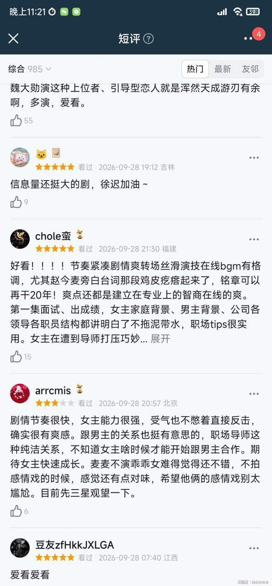

# 《无可替代》收视第一，差评却满天飞

## 看完《无可替代》前三集，我愣是没搞懂它爆没爆

说实话，看完《无可替代》前三集，我到现在都没想明白：这剧到底算爆了，还是算扑了？

9月28日开播那晚，我先刷到的不是夸，是豆瓣短评区五星一星打成一团的截图。骂的骂得凶，夸的夸得起劲，两边说的完全不像同一部剧。我就是被这架势勾起了好奇心，才点开优酷，把前三集看完了。

结果越看越懵。

再一查数据，更懵。首播收视冲破1.3%，拿下全国同时段第一，中华网、搜狐好几篇稿子都写了，微博影评博主也在传。酷云实时峰值破了1%，开播三集还冲上全网剧集热度榜第一。

数据这么猛，短评区却吵成那样，这两个画面我来回切着看了半天。

**我越看越觉得，这事儿本身比剧还有意思。**

收视第一，跟口碑赢了，可能根本是两码事。这剧的热度，可能就是吵出来的。

## 两排数据摆一起，我看愣了

热的那一排，我是真看愣了。

央八22:20的次黄金档播出，首播收视还是冲破1.3%、拿下全国同时段第一——中华网、搜狐的多篇稿子都写了，数字能对得上。酷云实时峰值破1%。开播三集，全网剧集热度榜第一。

优酷站内热度，多家媒体称破了6000，也有稿子记的是5600，我猜是截的时点不一样。据中国青年网的稿子，这剧还同步登陆了Netflix全球播出。

这排数字我反复看了两遍，确认不是哪家写错了。

冷的那一排，就明晃晃摆在旁边。

豆瓣短评区五星一星两极分化，评分从开分时的高分一路往下掉，这个好几家的说法都对得上。

影评人马庆云还专门写文章批评，说这剧跟二十年前的职场剧套路差不多——小白进职场开挂，换个华丽背景（这是他本人的观点，原文可以查到）。

### 网播端其实是另一回事

还有个细节，我得掰开说清楚。

云合的统计里，首日正片有效播放市占率只有3%，排在网剧霸屏榜第七；灯塔口径的同日播放量约797万。也就是说，“霸榜”这事儿，只在电视收视和站内热度这两个口径下成立，网播端开局其实偏弱。

同一部剧，电视端和网播端，过的压根是两种日子。

我盯着这两排数据琢磨了半天：这种冰火两重天，搞不好就是热度的燃料。

## 骂它的人，可能正在给它续热度

我一开始真是抱着看热闹的心态进去的。

**结果看着看着，我被留住了。**

短评区那几条原话，我直接贴出来，你们感受一下。

骂的一边：“不好看 男主长相劝退 演技也油 和女主没有CP感 弃了”。

夸的一边：“女主野心十足，拒绝恋爱脑，不靠男主施舍逆袭，剧情冲突密集，看得十分过瘾”。

还有卡在中间的：“要是单纯拍职场师徒、强强对决也就算了，非得硬凑感情线，看得人脚趾抠地”。

同一部剧，观众能吵出三个方向，这画面挺少见的。

### 说句公道话

这剧也有真材实料的地方。咨询行业在国产职场剧里几乎没人碰过，连写文章批评它的马庆云，原文里也认可选这个行业是个聪明的切入点（这是他的个人观点）。

20集、单集45分钟，据搜狐稿的口径，不注水不拖沓。女性群像也有想法——徐迟的向上奋斗、步天娜的接班困局、林珑的职业与家庭重建，这三条线是我在中国青年网的稿子里看到的。

我前三集看下来，节奏确实没让我想按快进。

但靠争议续命，不是长久之计。豆瓣评分一路下滑，微博有影评博主注意到，酷云后几集的数据出现了回落（这个说法我目前只看到这一个来源）。光靠吵留不住人，热度最后能不能变成口碑，得看剧本身接不接得住。

## 那它到底算不算爆

我的判断就一句话：收视第一是真的，口碑撕裂也是真的，这两件事不矛盾。

这争议，可能就是这部剧最大的自来水宣发。骂的人越多，看的人越多。

它把咨询行业搬上荧屏，踩中方案被抢、职场背锅这些大家都熟的职场痛点（据搜狐稿口径），这功劳是实打实的。但热度能不能沉淀成口碑，得看后面的剧情稳不稳。

所以你站哪边？是“数据不会撒谎，收视第一就是赢了”，还是“评分才是真话，吵出来的第一不算赢”？

我先把态度放这儿：我会继续追下去，看它能不能把这份吵来的热度接住。
