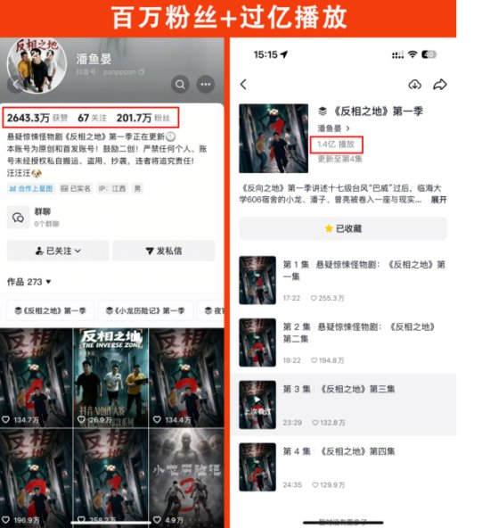

# 《反相之地》2.3亿播放，22万部里的例外

## 我刷完就想马上安利给所有人

我看完《反相之地》更新的6集，第一反应就一句话：

**这剧我想马上安利给身边所有人。**

前几天刷到它的时候，我还以为就是又一部点开就划走的AI剧。悬疑惊悚那类的，我平时不怎么看，这次是纯被片段勾进来的。结果一集没忍住，6集一口气刷完，中间连水都没起来倒。

评论区有句话我特别有共鸣，“AI短剧我一直在看，里面角色颜值很高，刷到停不下来”。我刷这部就是这个状态，一集接一集，手指头自己就往下划，刹都刹不住。刷完还意犹未尽，又去翻了翻评论区，看看有多少人跟我一样上头。

安利的话说完，我顺手查了组数据，查完有点发懵。

## 台风夜那段走廊戏，真把我钉住了

先说我为什么上头。

据界面新闻的描述，台风夜的大学宿舍走廊，头顶生着灯笼的怪物，缓步逼近。就这么一场戏，把我钉在屏幕前，动不了。

那股压迫感是一点一点压过来的，节奏一点不拖。我本来打算睡前刷一集就睡，抬头一看，十二点半了。

我甚至把那场走廊戏单独又看了一遍，第二遍照样起鸡皮疙瘩。

### 但有一说一，这里确实一般

AI剧的通病它也有。有观众的原话是，“人物动作有点僵硬，表情切换不太自然，但剧情又莫名上头”。

僵硬和表情硬，这两点我刷的时候也感觉到了，不藏着。有几个动作确实出戏，我倒回去看了两遍，确认不是我自己眼神的问题。

**可它就是能让你不在乎这些毛病，一路刷下去。**

这个本事，放到整个AI短剧行业里，非常少见。据界面新闻、36氪等报道，它全季11集，更新到6集，播放量已经突破2.3亿。

我一开始还觉得这数有点夸张，自己刷完之后，信了。后面还有5集没更，我等着。

## 22.19万部AI短剧里，破亿的才1055部

然后说回那组让我发懵的数据。

DataEye显示，2026年1到6月，抖音端新增AI短剧总计22.19万部，新增播放量5157.38亿次。这数不是我瞎编的，中国证券报、界面新闻、36氪、钛媒体、闪电新闻，好几家独立媒体都报过，数字对得上。

22.19万部里，播放量破亿的只有1055部，破亿率约0.47%，个别来源写0.48%，差别不大，反正都低。破千万的也只有5.8%。

据界面新闻报道，超90%的AI短剧难以出圈，多数作品和创作者沦为行业“炮灰”。这词看得我有点难受。

### 换算成人话

差不多每200部里，不到1部破亿。

《反相之地》的2.3亿，就是那1055部里的一个。

产能有多猛，再给你一组对比。中国网络视听协会的数据：2025年全年上线微短剧3.3万部；2026年一季度全行业上线约12.8万部，其中AI微短剧约12.2万部，占比超95%。

一个季度的量，接近去年全年的4倍。量翻着番地上，破亿率还停在0.47%，我看懂这组对比的时候，心里挺不是滋味。

还有个回本的数，得先说清楚口径。业内有个“5000万播放量为盈亏平衡线”的测算，新浪财经、闪电新闻、36氪等多家援引的都是同一套测算，不是平台官方披露的结果。

测算下来，只有约1.3%的作品达标。差不多每77部新剧，才有1部回本。

这数字我看完，愣了好一会儿。

## 它是幸存者，不是入场券

观众这边，声音是两边的。

有人跟我一样追得停不下来，天天蹲更新。也有人被AI短剧整体劝退——观众李女士说，“有时候刷剧最劝退她的不是剧情，而是主角们复制粘贴般的脸”。

这话我特别懂。AI剧刷多了是真会脸盲，几张脸来回换，看到最后记不住谁是谁。

所以我的想法挺明确：《反相之地》是真好看，值得安利。它也证明AI剧这个形式能出好东西，这一点我不想含糊。

但好看归好看，它是0.47%里的幸存者。22.19万部，1055个位置。一部剧的火，我没法把它当成“普通人做AI短剧就能成”的证据。

我也没觉得AI短剧不行。能活下来的那些，可能靠的还是内容本身能不能把人抓住——《反相之地》就是靠那场走廊戏把我按住的。只是这个概率，就摆在那。

最后站个队：看完《反相之地》，你还会去追别的AI短剧吗？

——会，接着试。

——不会，就到这部为止。
