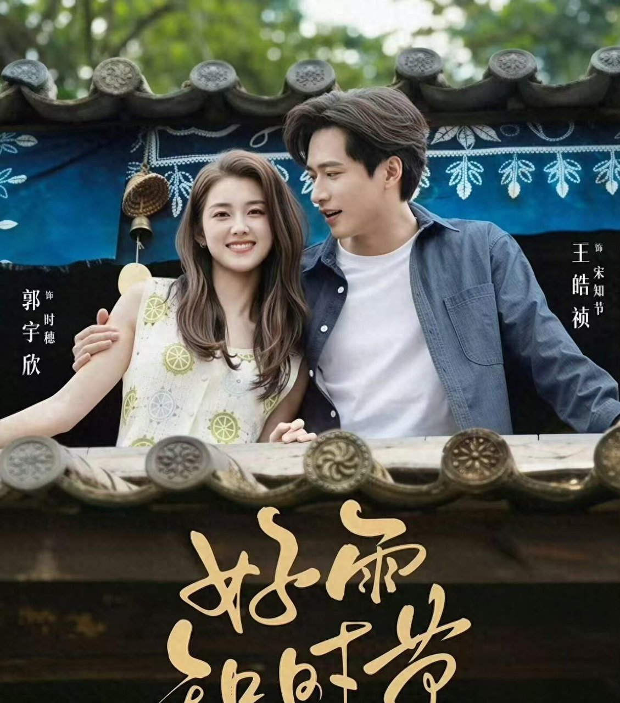

# 好雨知时节16年间被拍三次，短剧版破30亿

## 我看完第一件事，是去搜这个片名

**本来只想睡前点开看两集《好雨知时节》，结果一口气刷到了凌晨。**

时穗和宋知节这对双向救赎的成年人CP，后劲是真的大。两个都被背叛过的人，在洱海边慢慢接住彼此，好几场戏我看得心里发软，看完还有点舍不得。

我入坑的理由，估计跟不少人一样。有人一句话就说中了我：“没有一哭二闹，她先把证据收好，去找第三者的丈夫。”就冲这个清醒的开场，我当场决定追下去。

刷完缓过神来，我才开始琢磨片名。好雨知时节——越念越耳熟，这不就是杜甫那句诗吗？顺手一搜，我愣住了。

这句诗，16年里至少三次被搬上荧屏。2010年一回，2021年一回，2026年又一回。

同一个诗名，三种完全不同的命。

**这个发现比剧情本身还让我上头。**

今天就把这三次“投胎”，一次一次扒给你看。

## 这句诗16年，被拍了三回

先说最早那回。许秦豪执导的电影版，高圆圆和郑雨盛主演，原本是成都城市宣传项目《成都，我爱你》的上集，2010年3月5日在内地公映。

严格讲，公映片名是《好雨时节》，比诗少一个“知”字——这个一字之差，我考古的时候越看越觉得有意思。

我翻旧帖的时候，还刷到有影迷记了一笔：“而《成都，我爱你》的下集则是由陈果与崔健分别拍摄了自己的一段。”一个城市宣传项目攒了三位导演，最后在内地公映的只有许秦豪这一集，想想挺唏嘘的。

这版的票房，我得先把来源说清楚：据抖音百科，截至2010年3月7日，内地票房10万。

这个数我只见到这一个来源，当年的票房榜帖子里也没看到这部片，猫眼、艺恩的核实数据我没查到，不敢说死。但10万这个量级，还是看得我发愣。

### 后两回，一个静悄悄一个30亿

时间拨到2021年。5月26日起，每晚7:30，山东卫视黄金档，36集脱贫攻坚题材电视剧。

以栖霞真人真事为原型，改编自拿了泰山文艺奖的本土电影《苹果村的苹果事儿》，2020年3月还入选过国家广电总局脱贫攻坚题材重点剧目，全国一共22部。这配置，怎么看都不算糊弄吧？

可我前几天去豆瓣搜，这部剧到现在暂无评分。收视数据我也没扒到，只能说从这些迹象看，它当年的声量可能确实有限。我盯着那行字看了半天，挺不是滋味的。

然后是2026年这回，也就是我刷的这版。8月14日上线红果，郭宇欣、王皓祯主演，16个小时付费端播放量破亿。9月12日，红果官方微博宣布观看量破30亿，大象新闻这些媒体也跟进报道了。

三回摆在一起，命运差得不是一星半点。

## 命差这么多，主要真不是内容的事

先把立场说清楚，我不是来踩前两版的。2010版，许秦豪执导，高圆圆、郑雨盛主演；2021版，总局推荐剧目，真人真事改编。单看配置，两版的内容底子都不算差。

那差在哪？我琢磨了好几天，越想越觉得，变的主要是载体——说白了，就是观众在哪儿看。

电影版，得观众买票，腾出整两个小时，专程走进影院；卫视剧版，得观众每晚7:30准点守在电视机前。

短剧版呢？直接躺在手机里，通勤路上点开就看，睡前躺床上也能看。我这回就是睡前刷的，一刷就停不下来。

同一场雨，落在了三种完全不同的土壤上。门槛越低，能接住这场雨的人就越多。

有观众早就把这话说透了：“原来那些被我们忽视的小屏幕上，正在快速进行着内容的提质转型。”

所以我的看法是：前两回的雨未必不好，只是没落到能接住它们的地方。2026年这一回，正好落在了几十亿次观看举着的手机屏幕上。

## 好雨知时节，这回真赶上了时节

当然，载体是东风，这版内容自己也接得住。16小时付费端就破亿、观看量冲到30亿，这就是观众用脚投出来的票。

双向救赎写得细水长流，两个被背叛过的成年人慢慢接住彼此；大理实景的质感，也是它实打实的亮点。大象新闻的报道里还说，它霸榜25天还在涨。

实话说在前面，也是我会提前提醒朋友的地方：89集的体量，没刷过短剧的人入坑需要点耐心——估计有人看到这个集数就头大，也有人就吃这种慢慢来的节奏。

还有，如果你是冲着2010年那版文艺爱情片的调性来的，得先调整预期，短剧的节奏完全是另一回事。

最后说个我自己的发现。杜甫这句诗的下半句，是“当春乃发生”。好东西，也得赶上属于它的时节。这个名字三次上荧屏，像是花了16年，把这一句诗验证了一遍。

评论区见，你站哪边——“主要是载体和时机赶对了”，还是“主要是这一版内容自己最能打”？
