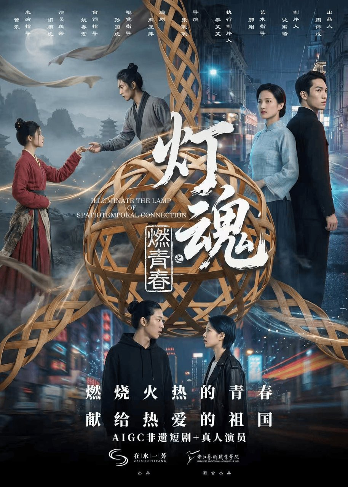
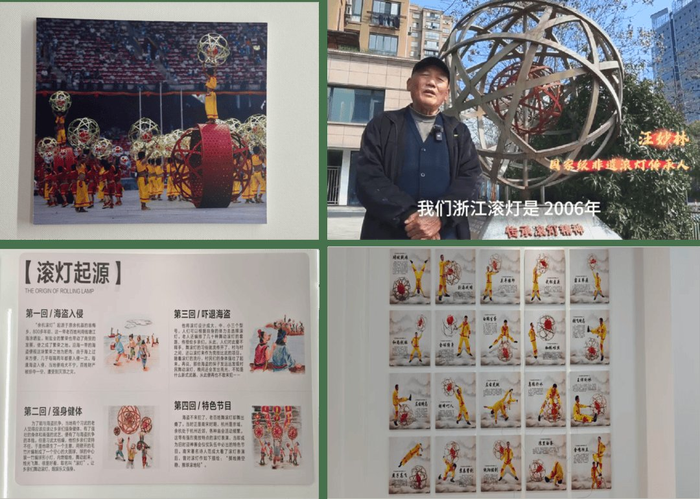
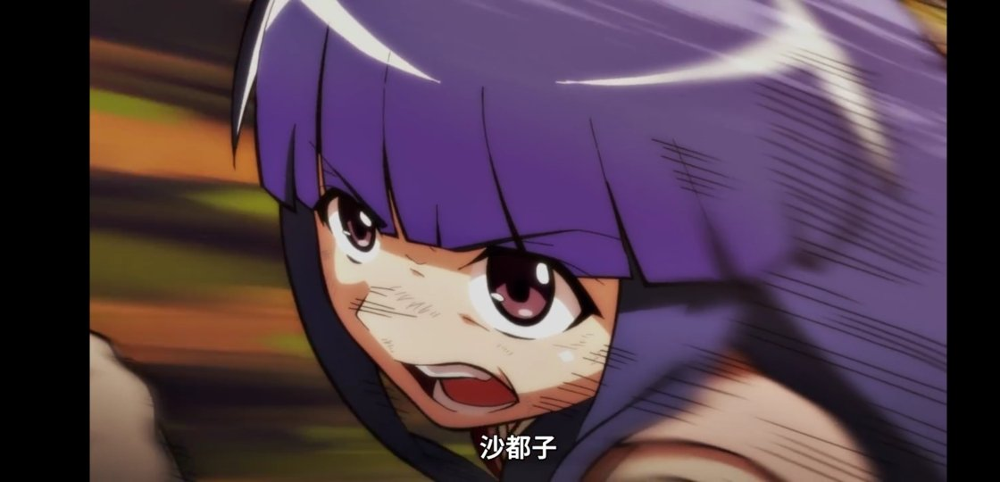
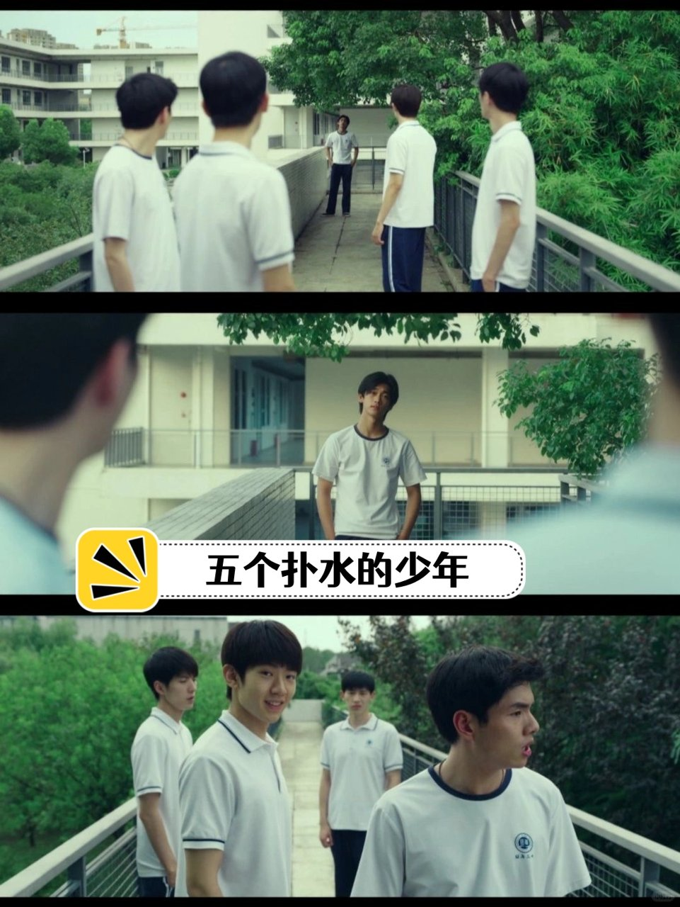
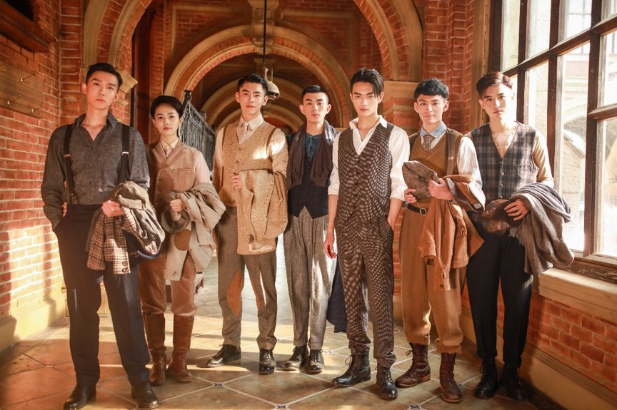

# 《灯魂之燃青春》之外，还有个想蹦迪的癫痫少女

## 看完《灯魂之燃青春》，我愣了一下

说实话，一口气刷完《灯魂之燃青春》，我满脑子想的却是另一个女孩。

先把基本盘交代一下。据钱江晚报上线首日的开播资讯，这部微短剧讲的是非遗滚灯，用三世故事把老手艺和年轻人接上，制作上还用了AIGC。

开播资讯里没提评分，也没提口碑，我就不瞎编数据了。

我本来以为这就是个普通的暑期上新。据杭州宣传网的报道，这个七月大家观剧，都在喊想看“走心、精良、有温度”的内容。

“燃青春”这个片名，本身就带着一股冲劲。燃，多好的一个字。

可我愣的那一下，就停在这个“燃”字上。影视里能这样燃的青春，好像默认都长在一副没问题的身体上。想跳舞的、想组乐队的，一抓一大把，没谁的身体会先跳出来反对。

带着身体限制依然想燃的故事，我想了半天，愣是没想出几部。

那个女孩跟滚灯没关系，跟这部剧也没关系。可她在我脑子里挥之不去，我干脆把她写出来。

## 有个女孩碰不得频闪灯，却最想蹦迪

她来自英国高校的一个短片项目Daytimers。据UWE Bristol官方页面的设定，女孩叫Rupa，18岁，患有癫痫。

她18岁生日那天，本来被爸妈安排在家安安静静地过。刚坐下翻生日礼物，翻出来一本《Epilepsy and Me》，都出到第八版了。

生日礼物是一本讲自己病症的书，这个细节我看到的时候，心里一紧。

她那个满脑子新发明的姑姑，直接抱着最新发明上门了：一顶防频闪保护头盔。

Rupa的梦想，是在南亚锐舞派对的灯光下跳舞。可频闪灯光，正是诱发她癫痫发作的生理禁区。

头盔把机会送到她面前，她得回答一个问题：我准备好了吗，我敢去吗。

姑姑这一手我越想越戳。她没说“别去”，也没说“在家待着挺好”，她是直接把一扇门搬到了侄女面前。门开不开，交给Rupa自己决定。

有人提醒说，“看电视或使用电脑时保持室内照明充足、屏幕亮度适中，可佩戴偏振光太阳镜减少眩光刺激”。

我倒觉得，连看个电视都要做这么多功课，这就是她跟那片灯光隔着的距离。

还有人叮嘱，“癫痫患者如果真的要体验游戏的乐趣，应注意以下几个方面”。

你看，连玩个游戏都得先背注意事项。她想去的地方，却是整片整片的频闪灯海。

**打动我的不是头盔多神奇，是她想燃、身体偏不让燃的那一下。**

## 数来数去，几十年怎么就这几部？

从Rupa我又往下想了想，越想越觉得这事不小。

我掰着指头数了一遍：以脑瘫患者为主角的电影，据光明网的报道口径，屈指可数，《我的左脚》（1989）、《绿洲》（2002）、《小小的我》（2024）。

几十年，就这几部。

《小小的我》的豆瓣评价里，观众肯定了它“平视脑瘫患者”的拍法。

据三联生活周刊的报道，这片子没有把展示生存困难放在首位，更多是在讲他们追求幸福生活的平等权利。

刘春和的那句台词我一直记得：“很少会有一种眼神，是敢于直视我，拿我当自己人的。”

这句我看完沉默了挺久。

扎心的是后面这个。据Geena Davis Institute、Women's eNews等报道，残疾青少年在流行文化里，缺能让自己认同的角色代表。

The Irish Times还发问过：你能数出几个身体有残障的影视角色？我试着数了数，真没数出几个。

这里得把话说准：说“几乎空白”就过了，更准确的说法是“极为稀缺”。

据Young Epilepsy的文章，影视连把癫痫发作拍准确都还常出错。准确都难，更别说让这样的主角去燃了。

## 这剧没做错什么，我只是馋下一个故事

说回《灯魂之燃青春》。

据钱江晚报的开播资讯，它把非遗滚灯交给年轻人，用三世故事把老手艺和青春接上，制作上还试了AIGC。这条“燃”的路，我是真心觉得值得走。

老实讲，至少在我的印象里，它拍的还是健全孩子的燃。这不算它的错，它本来也没义务什么都拍。

只是我每次看到“燃青春”仨字，最惋惜的就是这儿。

估计有人要说我矫情：看剧嘛，看得燃就行了。道理我懂，可我就是放不下那个碰不得频闪灯的女孩。

**我不是说它不好，我只是馋下一个这样的故事。**

我甚至已经开始想象了：下一部“燃青春”的主角想上台，却碰不得频闪灯，他会不会也等来一顶属于自己的头盔。

一个短片项目在拍这样的故事，一部电影也立住了。稀缺，可能不是没人想看，更像是愿意拍的人还太少。

所以我想问问你：

如果下一部“燃青春”把主角换成身体不允许燃的年轻人，比如想上台却碰不得频闪灯的少年，你站哪边？

A. 想看，这种燃更稀缺

B. 先别急，怕拍不好变味
