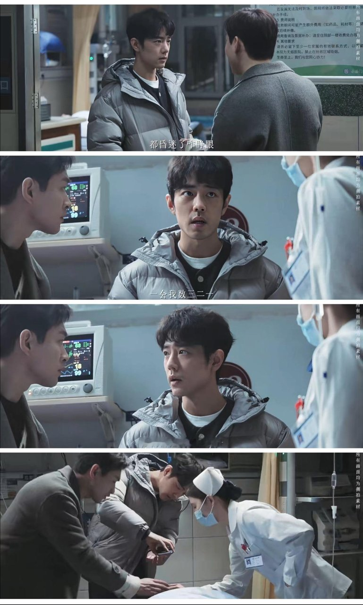

# 《小城良方》烤红薯保温疫苗？现实比剧更扎心

## 我一开始真当它是个段子

我点开《小城良方》，本来只想下饭。刷到“用烤红薯给疫苗保温、借殡仪车转运危重病人”的片段时，我第一反应是：这也太扯了吧，纯当荒诞段子看。

东北小城，一间破旧卫生院。有人蹲在炉子边给红薯翻面，红薯旁边搁着要保温的疫苗；危重病人要转院，车不够用，借的是殡仪车。这画面，第一眼谁看了都容易笑。

结果有条观众评论把我按住了：“这些土办法看着荒诞，却来自真实的生活取材，笑过之后是扎心的真实。”

我本来准备笑完就划走。

**顺手查了查这些桥段的现实底子，我愣住了。**

查之前我默认这就是剧组整活，猎奇桥段嘛，博个眼球。查完发现，事情没那么简单。

所以这篇就聊一件事：这些土办法，到底是剧组猎奇，还是真有现实底子？

## 烤红薯保温疫苗，剧里真这么拍

先交代剧情底盘。据澎湃新闻、中华网、今日头条等多家媒体报道的剧情介绍：刘铮亮原本是北京三甲医院的神经外科大夫，一场事故后跌回东北老家的乡镇卫生院，当临时工。

剧里这家卫生院什么条件？没有CT机常备，设备动不动出故障，护士一个人身兼数职。

然后就是那些出圈的土办法，剧里是真这么拍的。疫苗需要保温，人蹲在炉子边拿烤红薯捂着。危重病人要转运，没专用车，借的是殡仪车。定位手术切口靠艾灸的烟，无影灯不够使，KTV彩灯顶上。

看到这儿我是真笑出了声，笑点确实密。可笑着笑着有点不对劲，每个笑点底下都垫着一个“缺”字。

没设备、没车、没电，人才被逼出这些野路子。至少我看下来，它没把基层当奇观展览，反倒把“缺”拍成了往前推剧情的那股劲儿。

觉得新鲜的观众不少：“《小城良方》最让我眼前一亮的地方，是它避开了常见的开颅手术和高科技医疗的描绘。”还有人说没想到是这种搞笑风格，看着看着就笑出了声。

那现实里，基层到底“缺”到什么程度？我去翻了翻通报和官方文件。

## 翻完通报我笑不出来了

先把边界划清楚，防杠也防误读：剧里“烤红薯保温疫苗”“借殡仪车转运”这两个具体操作，我没查到现实里真发生过的报道，它们是剧情设计。但撑起这些桥段的底层状况，件件有官方来源。

先说疫苗。芜湖市政府网站上挂着南陵县市场监管局的通报：许镇镇中心卫生院太丰分院没配备应急电源，保障不了停电时疫苗的质量安全，被建议暂停接种。

武昌区人大代表建议里也提到，基层医疗机构没救护车，病人转诊不畅，疫苗冷链储运不便。

我盯着“停电”两个字看了半天。剧里拿烤红薯保温，通报里是停电直接存不了。

转运那头更扎心。中新网报道过，修文县扎佐镇卫生院的救护车转运一位重病老人，途中氧气耗尽。医务人员找不到扳手，打不开第二瓶氧气，老人不治。

麻栗坡县政府信箱里有件公开投诉：八布乡卫生院转运危重病人，只备了3袋氧气袋。家属当场说不够，医生说够用，结果路上耗尽。

土法应急也有官方记录。贵州省卫健委发布过：凝冻天气道路结冰，救护车开不了，计划乡卫生院的医护拿稻草缠鞋防滑，徒步去救危重孕妇。

新华社还报道过内蒙古接种医生韩四虎，40多年守着48个村，挨家挨户上门接种，基层防疫“力量单薄”。

我翻到这儿是真坐不住了。

**剧里的烤红薯是喜剧，通报里的停电和氧气耗尽，是事故和眼泪。**

这剧的荒诞感，全是从现实的缺口里长出来的。

## 你站扎心还是好笑

实话说，这剧也有让人犹豫的地方。它把沉重事包进喜剧壳，有观众看完就只记住了搞笑，说对着门发狂那段实在太好笑。

也有观众直接说：“这根本算不上什么戏，缺少了那种戏剧性的冲突。”喜剧壳是让人点进来的钥匙，也可能让人笑完就划走，这两头我都认。

那为什么还是想安利？据中华网、360娱乐等报道，这剧爱奇艺预约突破75万，豆瓣超15万人标记“想看”，央视在杀青前就提前预购，还入选了总台2026年片单。热度是热度，口碑后面怎么走另说。

我最在意的是另一件事：它至少把“停电存不了疫苗、转运没氧气”这些长期只出现在通报和投诉信里的日常，第一次推到了大众眼前。

能让人笑着点进去、翻着通报走出来，我觉得这一晚就不亏。

抛个二选一的题：你觉得《小城良方》这种土办法桥段，是喜剧壳刚好让更多人看见了基层，还是消解了现实该有的沉重？你站“好笑”还是“扎心”？评论区聊聊。
